**首先感谢选择keyes产品，我们将继续为你提供好的产品和服务!**

---

**关于keyes**

Keyes是KEYES Corporation旗下最畅销的品牌，我们的产品包括Arduino开发板、扩展板、传感器模块；树莓派、micro：bit扩展板和智能小车；以及为各阶段客户设计的完整入门套件。这些入门套件旨在为任何水平的客户学习Arduino、树莓派、micro：bit相关知识。

我们所有产品，均符合国际质量标准，在世界各地不同市场中，得到了极大的赞赏。 

欢迎从我们的官方网站查看更多内容：[http://www.keyes-robot.com](http://www.keyes-robot.com)

---

**售后服务**

1\. 如果发现某些东西丢失或损坏，或者学习套件时遇到一些困难。keyes会提供免费和快速的支持，如果您有任何疑问，请联系我们专业的销售人员。

2\. 欢迎提出建议和反馈，我们会根据您的反馈不断更新套件和教程，以使其更好。谢谢！

---

**产品安全**                              

1\. 本产品内含细小的零件（螺丝等），请放在儿童接触不到的地方，防止划伤或误食。8岁及以下儿童使用，请在大人监督下使用。

2\. 本产品包含导电部件(控制板和电子模块），请按照本教程的要求进行操作，不当的操作可能导致过热并且损害零件，请勿触摸并立即断开电路电源（请按照正确的方式安装电池）。

---

**版权**

keyes商标和徽标是KEYES DIY ROBOT co.,LTD的版权,任何人和公司在没有授权的情况下，不得复制，售卖，转卖，keyes品牌的产品。如果您有兴趣在当地售卖我们的产品，请联系我们专业的批发销售人员。

---

# Keyes Arduino UNO R4 37款传感器学习套装

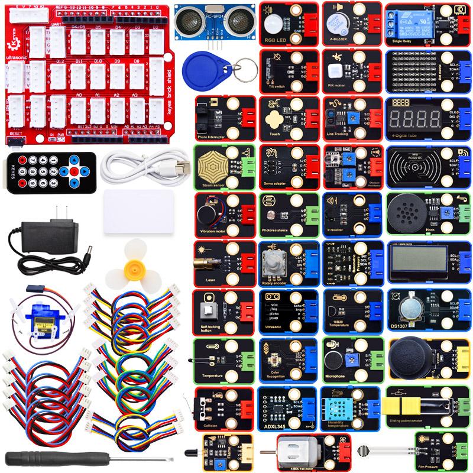

---

## 产品介绍

您想学习编程吗？目前，编程已发展到较低年龄组，每个人都能编程将会是一种趋势。使用此产品和教程，您可以轻松了解并学习基于UNO R4开发环境下37款传感器/模块原理及使用方法，以及掌握如何通过编写程序使用它们。

Keyes Arduino UNO R4 37款传感器学习套装主要包含了我们常用的37款传感器/模块，还有多种规格可选的主控板、传感器扩展板和XH-2.54mm高温硅胶连接线。37款传感器/模块和我们提供的传感器扩展板接口完全匹配，使用时，我们只需要用连接线将传感器/模块连接在传感器扩展板接口上，简单方便。

为了让你对这37款传感器/模块有更深入的了解，课程中我们提供了对应的原理图、接线方法、Arduino C 语言代码、实验结果和简单的代码说明等信息。通过这些课程，可以让我们对编程方法、逻辑、电子电路有了更深刻的理解。       

此外，如果您对本教程和工具包有任何困难或问题，您可以随时向我们咨询。

---

## 清单

| 序号 | 图片 | 图片| 规格 | 倍用量 |
| ---- | ------------------------ | ------------------------- | ------------------------------ | ------ |
| 1 | 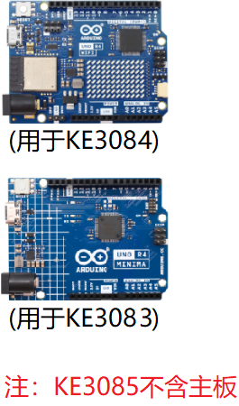 |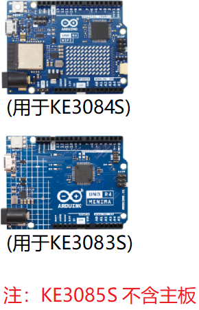 |UNO R4 WiFi/Minima主板| 1 |
| 2 |  |  | 传感器扩展板 | 1 |
| 3 | 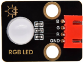 |  | RGB模块 | 1 |
| 4 | 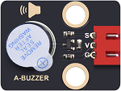 |  | 有源蜂鸣器模块 | 1 |
| 5 | 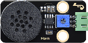 | 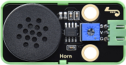 | 8002b功放 喇叭模块| 1 |
| 6 | 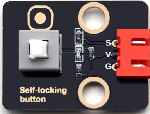 | 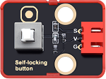 | 自锁按键模块  | 1 |
| 7 |  |  | 倾斜传感器 | 1  |
| 8 |  |  | 人体红外热释传感器 | 1 |
| 9 |  |  | 避障传感器 | 1  |
| 10 | 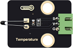 | 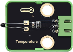 | NTC-MF52AT模拟温度传感器 | 1 |
| 11|  |  | 光敏传感器  | 1 |
| 12 |  |  | 声音传感器  | 1 |
| 13 |  | 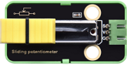 | 滑动电位器模块  | 1 |
| 14 | 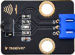 | 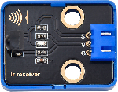 | 红外接收模块  | 1  |
| 15 | 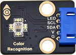 | 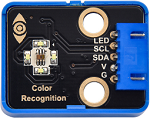 | TCS34725 颜色传感器 | 1 |
| 16|  | 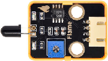 | 火焰传感器  | 1 | 
| 17 |  |  | 旋转编码器模块  | 1  |
| 18 | 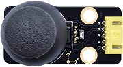 |  | 摇杆模块  | 1  |
| 19 |  |  | HT16K33_8X8点阵模块  | 1  |
| 20 |  |  | TM1650四位数码管模块 | 1 |
| 21 |  |  | 薄膜压力传感器 | 1 |
| 22 | 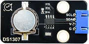 |  | DS1307时钟传感器模块  | 1 |
| 23 |     |   | HC-SR04超声波传感器  | 1 |
| 24 | 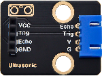 |  | 超声波转接模块 | 1  |
| 25 | 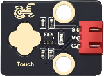 | 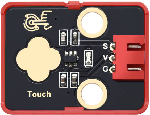 | 电容触摸模块  | 1 |
| 26 | 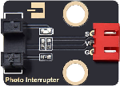 |  | 光折断模块| 1 |
| 27 |  | 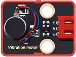 |震动马达模块 | 1 |
| 28 | 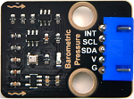 |  | BMP388气压传感器 | 1 |
| 29 |   | 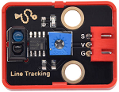 | 单路循线传感器 | 1  |
| 30 |  |  | XHT11温湿度传感器（兼容DHT11）| 1 |
| 31 | 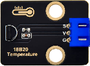 | 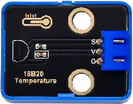 | DS18B20温度传感器 | 1  |
| 32 |  | 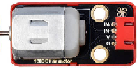 | 130电机模块  | 1 |
| 33 | 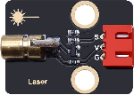 |  | 激光模块  | 1 |
| 34 |  | 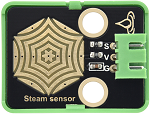 | 水滴传感器  | 1  |
| 35|   | 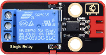 | 单路5V继电器模块| 1  |
| 36 | 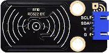 | 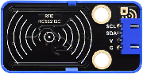 | RFID刷卡模块  | 1  |
| 37| 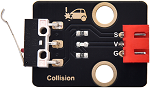 |  | 碰撞传感器  | 1 |
| 38 |  |   | LCD_128X32_DOT模块 | 1 |
| 39 | 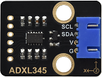 |  | ADXL345加速度传感器模块  | 1|
| 40 |   |   | 舵机驱动模块  | 1  |
| 41 | 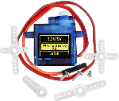  |    | 舵机 配十字臂  | 1 |
| 42 | 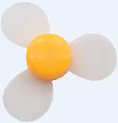 ||风扇叶|1|
| 43 |  |  | 遥控器  | 1 |
| 44 |   |    | 白磁卡  | 1      |
| 45 |   |    | 钥匙扣  | 1      |
| 46 |     |      | 电源适配器  | 1      |
| 47 |   |    | USB线   | 1  |
| 48 |   |    | 3P线 (反向)| 5     |
| 49 |   |    | 4P线 (反向)  | 4 |
| 50 |   |    | 5P线 (反向) | 3|
| 51 |  |  | 4P转5P线 (反向) | 3 |
| 52 |   |    | 一字螺丝刀 | 1  |

---

