---

# 1. UNO R4 主板介绍

参考链接：[https://temp.keyesrobot.cn/projects/UNO-R4/en/latest/](https://temp.keyesrobot.cn/projects/UNO-R4/en/latest/)

---

# 2. UNO R4 Arduino IDE 的下载、安装和使用方法

参考链接：[https://temp.keyesrobot.cn/projects/UNO-R4-Arduino-IDE/en/latest/](https://temp.keyesrobot.cn/projects/UNO-R4-Arduino-IDE/en/latest/)

<span style="color: rgb(255, 76, 65);">注意：</span><span style="background:#ff0;color:#000">本教程使用的是Arduino IDE版本：2.1.1 。</span>

<br>
<br>

**<span style="color: rgb(255, 169, 0);">特别注明：</span> 做以下项目课程时，必须先搭建IDE环境及下载项目课程的库文件及课程代码。**

* [库文件](库文件.zip)

* [项目代码](项目代码.zip)

---

# 3. 添加项目课程库文件

打开Arduino IDE，点击“**<u>项目</u>**”，选择“**<u>导入库</u>**”，最后选择“**<u>添加.ZIP库...</u>**”。

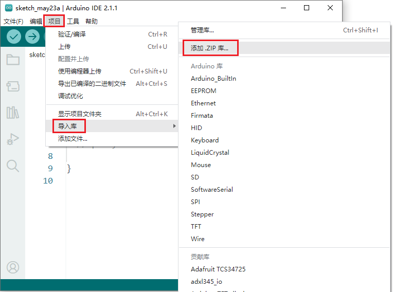

根据库文件的路径打开本项目教程所用的库文件夹，选中库文件夹中 .zip格式的库文件压缩包（以“**Adafruit_TCS34725**”库文件压缩包为例），然后单击“**打开**”，这样Adafruit_TCS34725库文件成功加入。

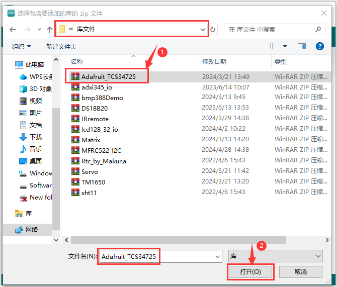


然后参照上述方法依次将剩余的库文件（红色框中的）全部添加完。

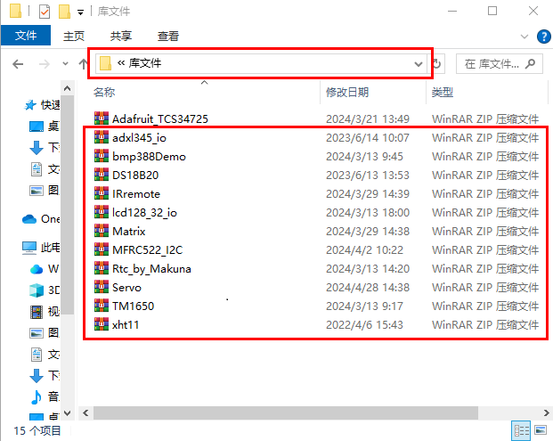

---

# 4. 单个传感器/模块项目课程

拿到套件后，我们可以看到套件中有37款传感器/模块，有对应的传感器扩展板和连接线等。这里，我们将37款传感器/模块利用自带连接线，单独连接在UNO R4 主板和传感器扩展板。然后上传对应的实验代码，单独测试各个传感器/模块的功能。我们下面的课程是先从简单到复杂学习单个模块/传感器的原理，后面再学习一些模块/传感器的扩展应用以巩固加深我们对该套件的理解。

**<span style="color: rgb(255, 76, 65);">特别注意：</span>** 实验时，模块/传感器连接线材时，必须按照教程里的接线方法及位置，电源与信号脚不能错接，否则会损坏模块/传感器。

---

## 第01课 Hello World

### 1. 项目介绍

对于Arduino的初学者，先从一些简单的开始学习吧！在这个项目中，你只需要一个UNO R4 主板，USB线和计算机就可以完成“Hello World!”项目。它不仅是UNO R4 主板和计算机的通信测试，也是Arduino的初级项目。这也是一个入门实验，让你进入计算机的编程世界。

---

### 2. 实验组件

| 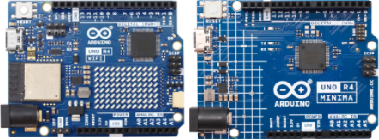 |  |
| :----------------------: | :-------------------: |
|UNO R4 WiFi/Minima主板(二选一)|       USB线 x1        |

---

### 3. 模块接线图

<span style="color: rgb(255, 76, 65);">**注意：**</span>

如果是选择UNO R4 WiFi主板，则接线图如下：

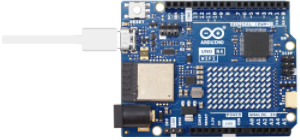

如果是选择UNO R4 Minima主板，则接线图如下：

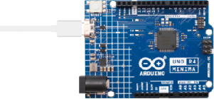

---

### 4. 实验代码

本项目中使用的代码保存在文件夹“<u>**项目代码**</u>”中，我们可以在此路径下打开代码文件''<u>**HelloWorld.ino**</u>"。

```c++
/*
 * 名称   : Hello World
 * 功能   : 输入字母“R”，串口显示“Hello World”。
 * 作者   : http://www.keyes-robot.com/ 
*/
char val;   // 定义变量val 

void setup(){
Serial.begin(9600);   // 设置波特率为9600
}

void loop(){
  if (Serial.available() > 0) {
    val=Serial.read();   // 读取指令或字符从PC到Arduino，并赋值给"val"的值
    if(val=='R') {   // 检查输入的字母是否为“R”,如果是
       Serial.println("Hello World!");  //显示“Hello World !”
    }
  }
}
```

如果你是选择UNO R4 WiFi主板，将UNO R4 WiFi主板通过USB线连接到计算机后，开始上传代码。为了避免将代码上传至UNO R4 WiFi主板时出现错误，必须选择与计算机连接正确的板型Arduino UNO R4 WiFi和串口端口。

先点击“**<u>工具</u>**”→“**<u>开发板</u>**”，可以查看到Arduino UNO R4 Boards 板型。如果你是选择UNO R4 WiFi主板，则选择对应的主控板型号Arduino UNO R4 WiFi。

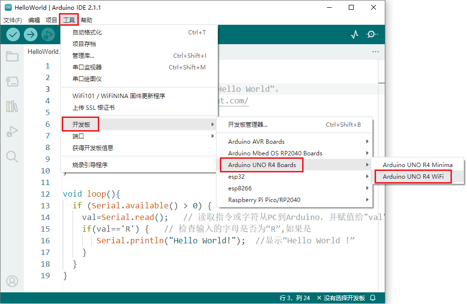

再点击“<u>**工具**</u>”→“**<u>端口</u>**”，选择对应的串口端口。

**<span style="background:#ff0;color:#000">
注意：将主板通过USB线连接到计算机后才能看到对应的串口端口。 </span>**

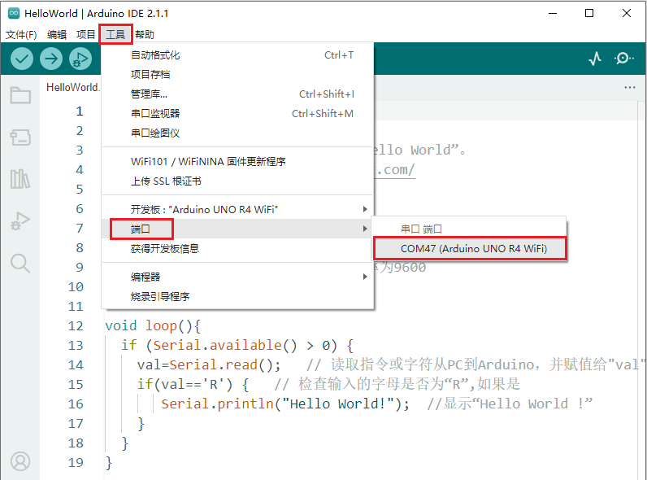

单击将代码上传到你所选定的UNO R4 WiFi主板上。

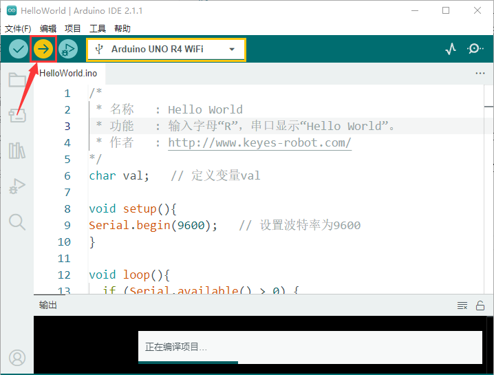

代码上传成功。

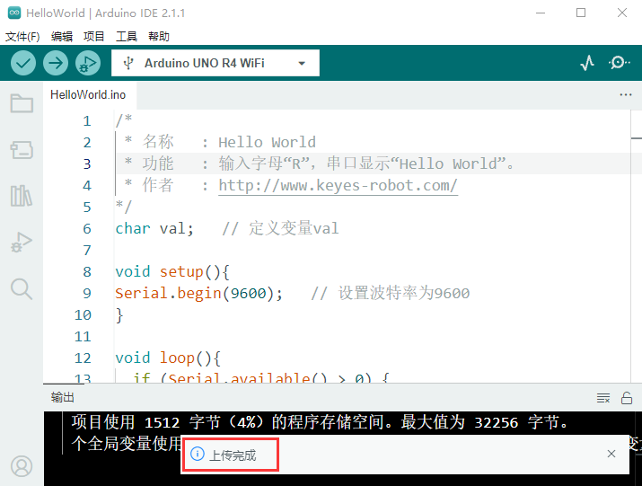


如果你是选择UNO R4 Minima主板，将UNO R4 Minima主板通过USB线连接到计算机后，开始上传代码。为了避免将代码上传至UNO R4 Minima主板时出现错误，必须选择与计算机连接正确的板型Arduino UNO R4 Minima和串口端口。

先点击“**<u>工具</u>**”→“**<u>开发板</u>**”，可以查看到Arduino UNO R4 Boards开发板。如果你是选择UNO R4 Minima主板，则选择对应的主控板型号Arduino UNO R4 Minima。

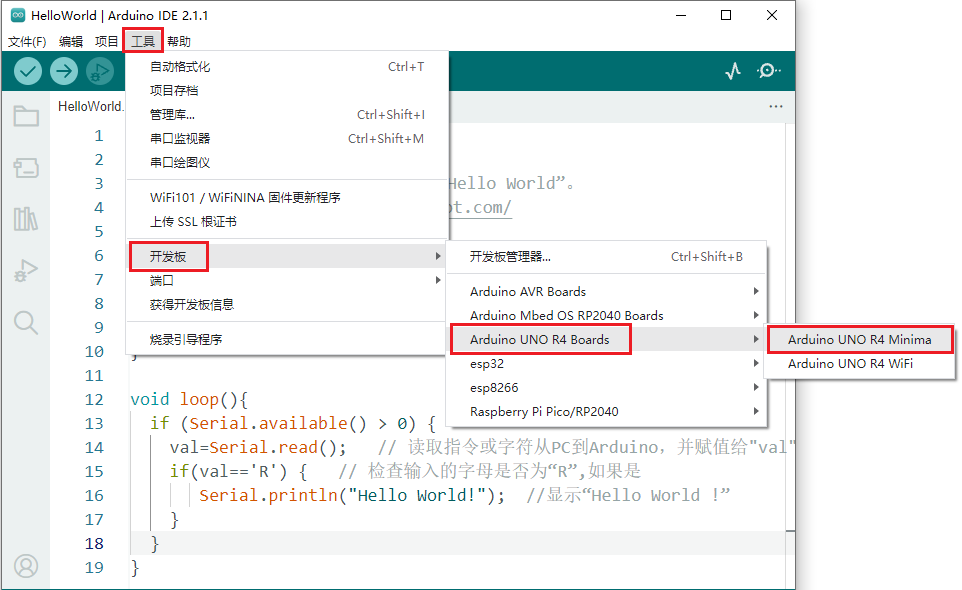

再点击“<u>**工具**</u>”→“**<u>端口</u>**”，选择对应的串口端口。

**<span style="background:#ff0;color:#000">
注意：将主板通过USB线连接到计算机后才能看到对应的串口端口。 </span>**

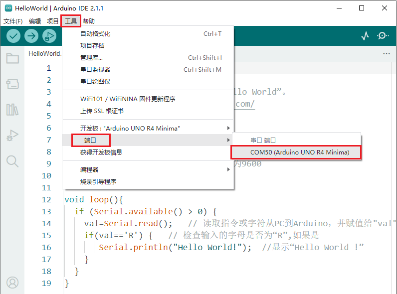

单击将代码上传到你所选定的UNO R4 Minima主板上。

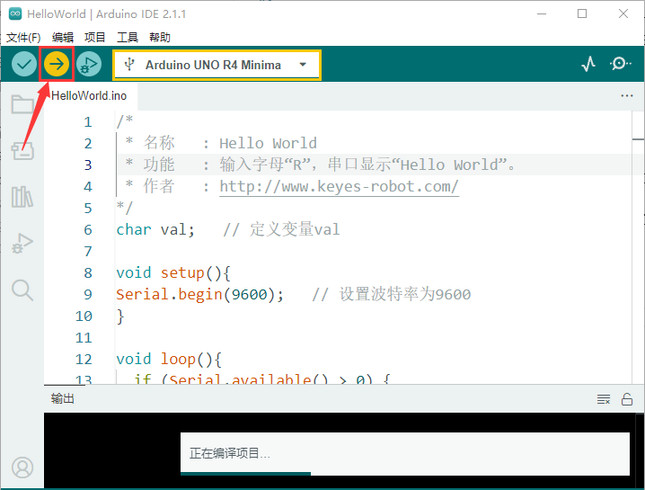

代码上传成功。

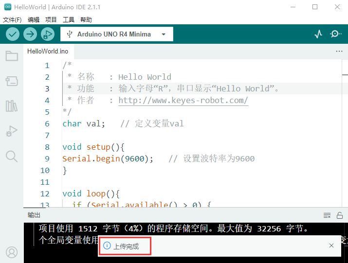

---

### 5. 实验结果

代码上传成功后，单击串口监视器图标进入串口监视器，设置波特率为**<u>9600</u>**，接着在文本框输入字母“**<u>R</u>**”，按下回车键(Enter 键)，能看到串口监视器打印“**<u>Hello World!</u>**”。

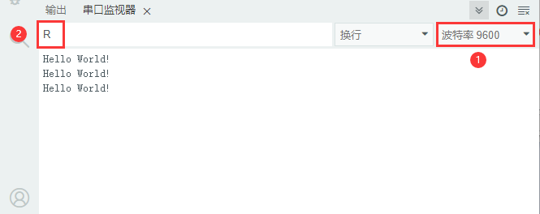

---

### 6. 代码说明

| 代码                | 说明                                                         |
| ------------------- | ------------------------------------------------------------ |
| char val            | 定义一个变量val                                              |
| Serial.begin(9600)  | 设置波特率为9600                                             |
| Serial.available( ) | 获取串口上可读取的数据的字节数，该数据已经到达并存储在接收缓存（共有64字节）中。Serial.available() > 0表示串口接收到了数据，可以读取。 |
| Serial.read( )      | 读取写入的串行数据。                                         |
| if( ){ }            | 如果“（ ）”里的条件满足，则执行“{ }”里的程序。               |
| Serial.println( )   | 换行输出数据。从串行端口输出数据，跟随一个回车和一个换行符。 |

--- 

## 第02课 RGB模块调节LED颜色

### 1. 项目介绍

RGB模块上的RGB LED由三种颜色(红、绿、蓝)组成，通过混合这三种基本颜色可以发出不同的颜色。在这个项目中，我们将向你介绍RGB  LED，并向你展示如何使用控制板控制RGB LED随机发出不同颜色光。

---

### 2. 模块参数

工作电压：DC 3.3~5V

工作温度：-10°C ~ +50°C

输入信号：PWM信号

工作温度：-10°C ~ +50°C

尺寸：32mm x 23.8mm x 16.9mm

接口：2.54mm间距，4pin防反接口

---

### 3. 模块原理图

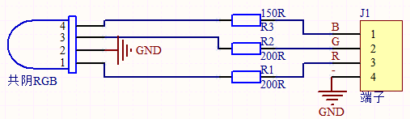

在这个套件中，有一个Keyes 共阴RGB模块，它采用F10-全彩RGB雾状共阴LED元件。控制时，我们需要将模块的R、G、B脚连接至单片机的PWM口。由于我们这个RGB模块是共阴的，公共管脚就接GND（共阳RGB公共管脚接VCC)。   

那么什么是PWM呢？PWM简称脉宽调制，是利用微处理器的数字输出来对模拟电路进行控制的一种非常有效的技术。

PWM的频率是指在1秒钟内，信号从高电平到低电平再回到高电平的次数，也就是说一秒钟PWM有多少个周期，单位Hz。

PWM的周期，T=1/f，T是周期，f是频率。如果频率为50Hz ，也就是说一个周期是20ms，那么一秒钟就有 50次PWM周期。

占空比，是一个脉冲周期内，高电平的时间与整个周期时间的比例，单位是% (0%-100%)  一个周期的长度。如下图所示。

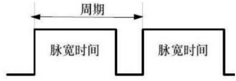

RGB三色也就是三基色，红色、绿色、蓝色。人眼对RGB三色最为敏感，大多数的颜色可以通过RGB三色按照不同的比例合成产生。同样绝大多数单色光也可以分解成RGB三种色光。这是色度学的最基本原理，即三基色原理。RGB三基色按照不同的比例相加合成混色称为相加混色，除了相加混色法之外还有相减混色法。可根据需要相加相减调配颜色。

接下来，我们基于刚刚学习的三基色原理，通过PWM端口控制R、G、B各色的占空比，使R、G、B三色按照不同的比例合成产生多重颜色显示在LED上。

---

### 4. 实验组件

|  |  |  |
| ------------------------ | ------------------------ | ---------------------------- | 
| UNO R4 WiFi/Minima主板(二选一)        |  Keyes 传感器扩展板 x1      |Keyes RGB模块 x1      |
        |  |   | 
| 4P线(反向) x1 | USB线 x1             |    |

---

### 5. 模块接线图

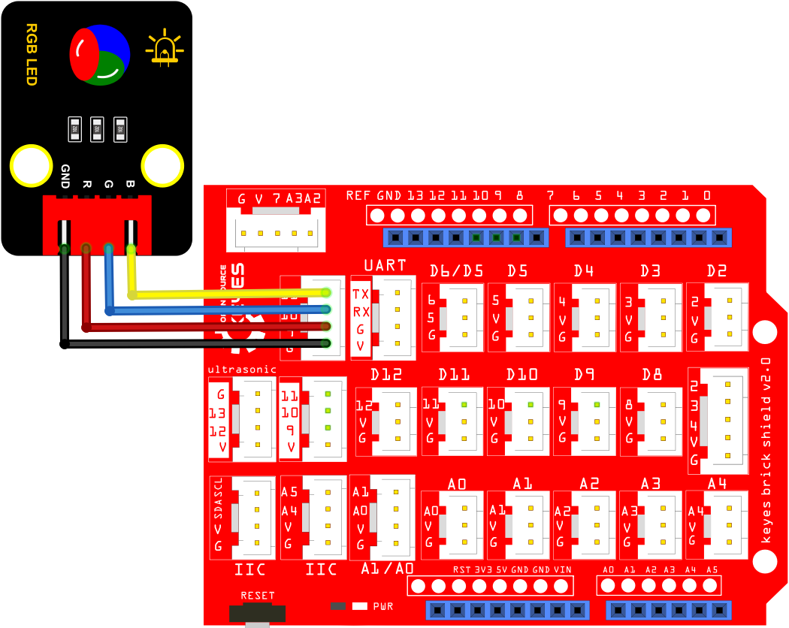

---

### 6. 实验代码

本项目中使用的代码保存在文件夹“<u>**项目代码**</u>”中，我们可以在此路径下打开代码文件''**RGB_LED.ino**"。

**注意：为了避免上传代码不成功，请上传代码前不要连接模块。代码上传成功后，拔下USB线断电，按照接线图正确接好模块后再用USB线连接到计算机上电，观察实验结果。**

```c++
/*
 * 名称   : RGB LED
 * 功能   : RGB 点亮
 * 作者   : http://www.keyes-robot.com/ 
*/
int redpin = 9;    // 定义红色LED引脚D9
int greenpin = 10; // 定义绿色LED引脚D10
int bluepin = 11;  // 定义蓝色LED引脚D11
int val;

void setup() {
  pinMode(redpin, OUTPUT);   //设置红色LED引脚为输出模式
  pinMode(greenpin, OUTPUT); //设置绿色LED引脚为输出模式
  pinMode(bluepin, OUTPUT);  //设置蓝色LED引脚为输出模式 
}

void loop() {
  for(val = 0; val < 255; val++){  //val的值不断由0增加到255
    analogWrite(bluepin, val);  //给PWM口(D11)写入一个0 ~ 255的模拟值
    analogWrite(greenpin, 255-val);
    analogWrite(redpin, 128-val);
    delay(3); 
    }
  for(val = 255; val > 0; val--){  //val的值不断由255减少到0
    analogWrite(bluepin, val);
    analogWrite(greenpin, 255-val);
    analogWrite(redpin, 128-val);
    delay(3); 
    }
}
```

如果你是选择UNO R4 WiFi主板，将UNO R4 WiFi主板通过USB线连接到计算机后，开始上传代码。为了避免将代码上传至UNO R4 WiFi主板时出现错误，必须选择与计算机连接正确的板型Arduino UNO R4 WiFi和串口端口。

先点击“**<u>工具</u>**”→“**<u>开发板</u>**”，可以查看到Arduino UNO R4 Boards 板型。如果你是选择UNO R4 WiFi主板，则选择对应的主控板型号Arduino UNO R4 WiFi。

再点击“<u>**工具**</u>”→“**<u>端口</u>**”，选择对应的串口端口。

**<span style="background:#ff0;color:#000">
注意：将主板通过USB线连接到计算机后才能看到对应的串口端口。 </span>**

单击将代码上传到UNO R4 WiFi主板，等待代码上传成功后查看实验结果。

<br>
<br>

如果你是选择UNO R4 Minima主板，将UNO R4 Minima主板通过USB线连接到计算机后，开始上传代码。为了避免将代码上传至UNO R4 Minima主板时出现错误，必须选择与计算机连接正确的板型Arduino UNO R4 Minima和串口端口。

先点击“**<u>工具</u>**”→“**<u>开发板</u>**”，可以查看到Arduino UNO R4 Boards 板型。如果你是选择UNO R4 Minima主板，则选择对应的主控板型号Arduino UNO R4 Minima。

再点击“<u>**工具**</u>”→“**<u>端口</u>**”，选择对应的串口端口。

**<span style="background:#ff0;color:#000">
注意：将主板通过USB线连接到计算机后才能看到对应的串口端口。 </span>**

单击将代码上传到UNO R4 Minima主板，等待代码上传成功后查看实验结果。

---

### 7. 实验结果

代码上传成功后，拔下USB线断电，按照接线图正确接好模块后再用USB线连接到计算机上电，你会看到RGB模块上RGB LED随机发出不同颜色光。

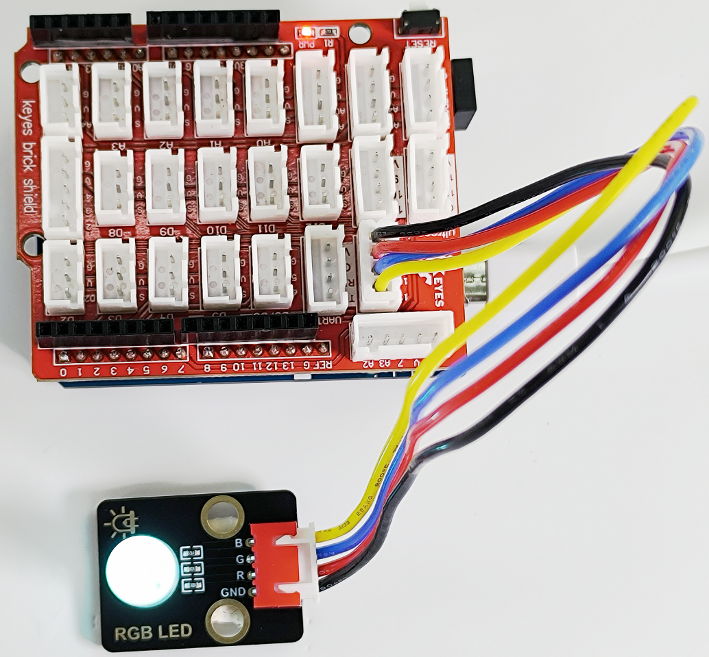

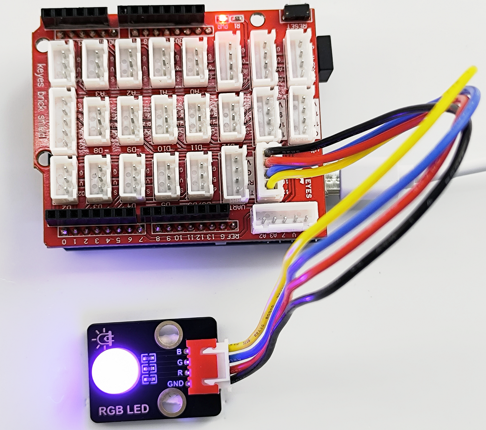

---

### 8. 代码说明

当我们需要重复执行某句话时，我们可以使用for语句。

for语句格式如下：


for循环顺序如下：

第一轮：1 → 2 → 3 → 4

第二轮：2 → 3 → 4

…

直到2不成立，for循环结束。

知道了这么个顺序之后，回到代码中：

for (int val = 0; val < 255; val++){

        ...}

for (int val = 255; val > 0; val--){

       ...}

这两个for语句实现了val的值不断由0增加到255，随之在从255减到0，再增加到255……，无限循环下去。
再看下for里面，涉及一个新函数analogWrite()。

我们知道数字口只有0和1两个状态，那如何发送一个模拟值到一个数字引脚呢？就要用到该函数。观察一下控制主板，查看数字引脚，你会发现其中6个引脚旁标有“~”，这些引脚不同于其他引脚，它们可以输出PWM信号。

**函数格式如下：**

analogWrite(pin,val)

analogWrite()函数用于给PWM口写入一个0 ~ 255的模拟值。所以，val是在0 ~ 255之间的值。特别注意的是，analogWrite()函数只能写入具有PWM功能的数字引脚，也就是D3，D5，D6，D9，D10，D11引脚。

---

## 第03课 激光模块发出激光

### 1. 项目介绍

在这个套件中，有一个Keyes 激光头模块，激光与常见的光不同。一方面，激光的单色性好。另一方面，激光发射器内部特定的结构，使得激光能够被聚集成单束光，朝着同一方向射出，亮度高，方向性好。

正是由于这些特性，激光被广泛用于对特定材料进行切割、焊接、表面处理等等。激光的能量非常高，玩具激光笔照射人眼可能导致眩光，长时间可能导致视网膜损害，我国也禁止用激光照射航行的飞机。因此，**请注意不要用激光发射器对准人眼。**

---

### 2. 模块参数

工作电压：DC 3.3V~5V

工作电流：21mA

最大功率：0.105W

控制信号：数字信号

工作温度：-10°C ~ +50°C

尺寸：32mm x 23.8mm x 10mm

接口：间距为2.54 mm 3pin防反接口

---

### 3. 模块原理图


激光头传感器主要由激光头组成，激光头由发光管芯、聚光透镜、铜可调套筒三部分组成。

从激光模块的电路原理图我们可以知道，它是用三极管驱动的。激光头的 1 脚始终上拉到VCC，在信号端 S 处输入一个高电平数字信号，NPN三极管Q1导通，激光头的 2 脚被下拉到GND，此时传感器开始工作。在信号端 S 处输入低电平时NPN三极管Q1不导通，传感器停止工作。

---

### 4. 实验组件

|  |  | | 
| ------------------------ | ------------------------ | ---------------------------- | 
|UNO R4 WiFi/Minima主板(二选一)| Keyes 传感器扩展板 x1        |Keyes 激光模块 x1    |
|       |  |   |
| 3P线(反向) x1 | USB线 x1             |  |

---

### 5. 模块接线图

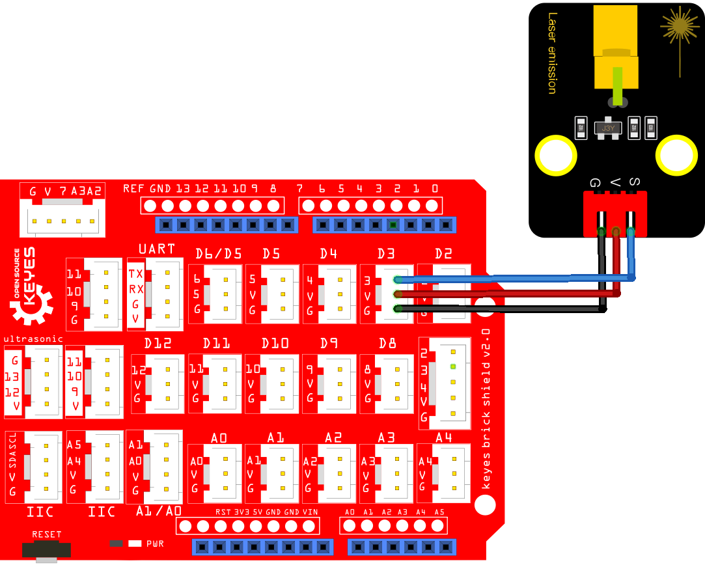

---

### 6. 实验代码

本项目中使用的代码保存在文件夹“<u>**项目代码**</u>”中，我们可以在此路径下打开代码文件''**Laser.ino**"。

**注意：为了避免上传代码不成功，请不要在上传代码前连接模块。代码上传成功后，拔下USB线断电，按照接线图正确接好模块后再用USB线连接到计算机上电，观察实验结果。**

```c++
/*
 * 名称   : Laser sensor
 * 功能   : 激光灯闪光
 * 作者   : http://www.keyes-robot.com/ 
*/
int laserPin = 3;                //定义激光引脚为D3
void setup() {
  pinMode(laserPin, OUTPUT);     //将激光引脚定义为输出模式
}

void loop() {
  digitalWrite(laserPin, HIGH);     //打开激光
  delay(2000);                      //延迟2秒
  digitalWrite(laserPin, LOW);      //关闭激光
  delay(2000);                      //延迟2秒
}
```

参照第01课或第02课的示例，根据不同的 UNO R4 主板选择不同的主板板型和串口端口。

---

### 7. 实验结果

代码上传成功后，拔下USB线断电，按照接线图正确接好模块后再用USB线连接到计算机上电，能看到模块上激光管发射红色激光信号2秒，然后关闭发射2秒，循环交替。

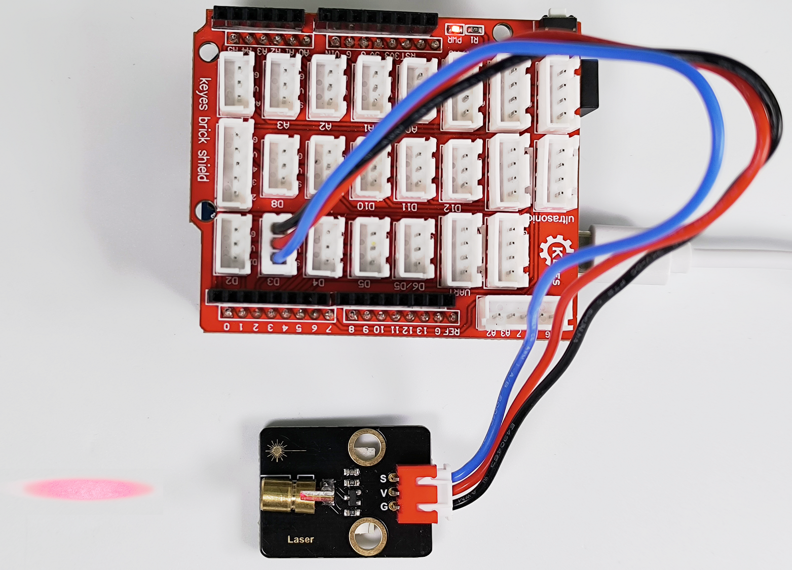

---

### 8. 代码说明

可以参照第02课的代码说明，这里就不多做介绍了。

---

## 第04课 震动马达

### 1. 项目介绍

在生活中，我们经常可以在一些电子元件中看到振动提示，如手机、闹钟。为此，我们特别设置了这个震动马达模块，它可以控制一个电子元件振动起来，实验时，模块供电5V后，信号端为高电平时，模块振动起来，信号端为低电平时，模块停止振动。

---

### 2. 模块参数

工作电压：DC 3.3V~5V

工作电流：35mA

最大功率：0.175W

控制信号：数字信号

工作温度：-10°C ~ +50°C

尺寸：32mm x 23.8mm x 10mm

接口：间距为2.54 mm 3pin防反接口

---

### 3. 模块原理图

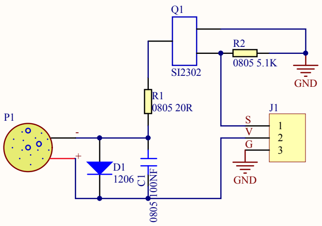


模块上有个微型振动马达，此振动马达是属于直流有刷电机，马达轴上面有一个偏心轮，当马达转动的时候，偏心轮的圆心质点不在电机的转心上，使得马达处于不断的失去平衡状态，由于惯性作用引起震动。

实验时，模块供电5V后，信号端为高电平时，模块振动起来，信号端为低电平时，模块停止振动。为方便控制振动强度，我们可以将模块信号端（S）接到单片机的PWM口，通过设置PWM值控制振动强度。

---

### 4. 实验组件

|  |  | 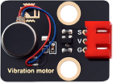 | 
| ------------------------ | ------------------------ | ---------------------------- | 
|UNO R4 WiFi/Minima主板(二选一)| Keyes 传感器扩展板 x1        |Keyes 震动马达模块 x1   |
|       |  |  |
| 3P线(反向) x1 | USB线 x1             |   |

---

### 5. 模块接线图

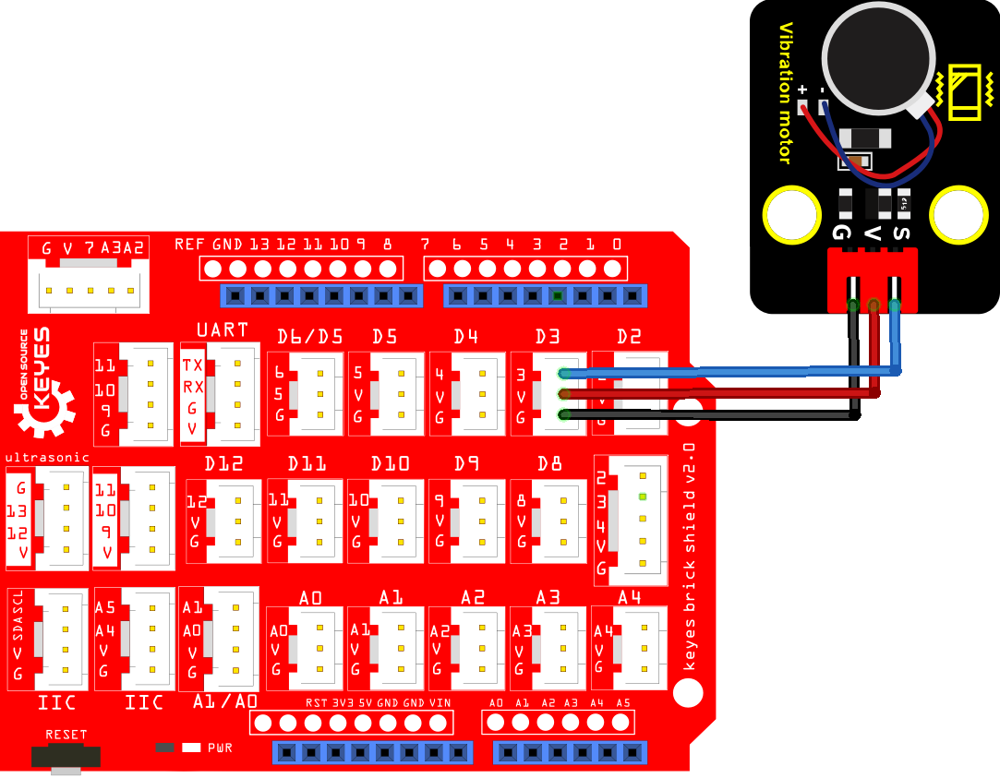

---

### 6. 实验代码

本项目中使用的代码保存在文件夹“<u>**项目代码**</u>”中，我们可以在此路径下打开代码文件''**Vibration_motor.ino**"。

**注意：为了避免上传代码不成功，请不要在上传代码前连接模块。代码上传成功后，拔下USB线断电，按照接线图正确接好模块后再用USB线连接到计算机上电，观察实验结果。**

```c++
/*
 * 名称   : Vibration motor
 * 功能   : 震动马达
 * 作者   : http://www.keyes-robot.com/ 
*/
int Vibration_motor = 3;                //定义震动马达的引脚为D3
void setup() {
  pinMode(Vibration_motor, OUTPUT);     //将震动马达的引脚定义为输出模式
}

void loop() {
  digitalWrite(Vibration_motor, HIGH);     //震动马达
  delay(2000);                      //延迟2秒
  digitalWrite(Vibration_motor, LOW);      //不震动马达
  delay(2000);                      //延迟2秒
}
```

参照第01课或第02课的示例，根据不同的 UNO R4 主板选择不同的主板板型和串口端口。

---

### 7. 实验结果

代码上传成功后，拔下USB线断电，按照接线图正确接好模块后再用USB线连接到计算机上电，能看到模块上在不停地振动。。

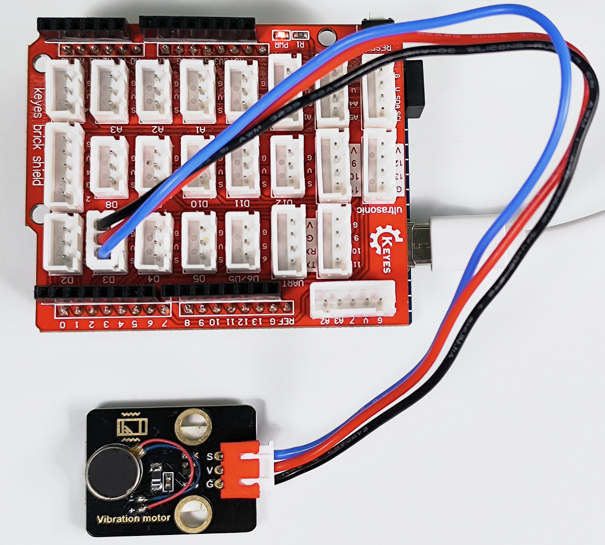

---

### 8. 代码说明

可以参照第02课的代码说明，这里就不多做介绍了。

---


## 第05课 继电器模块

### 1. 项目介绍

在日常生活中，一般使用交流电来驱动电气设备，有时我们会用开关来控制电器。如果将开关直接连接到交流电路上，一旦发生漏电，人就有危险。从安全的角度考虑，我们特别设计了这款具有NO（常开）端和NC（常闭）端的继电器模块。

---

### 2. 模块参数

工作电压: DC 5V 

工作电流: 50 mA

最大功率: 0.25 W

控制信号: 数字信号

触电电流: 小于3A

工作温度：-10°C ~ +50°C

尺寸：47.6mm x 23.8mm x 19mm

接口：2.54mm间距，3pin防反接口

---

### 3. 模块原理图

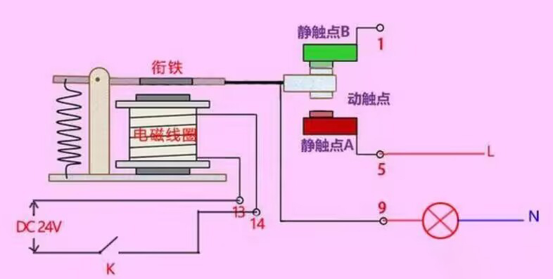

一个继电器拥有一个动触点以及两个静触点A和B。

当开关K断开时，继电器线路无电流通过，此时动触点与静触点B相接触，上半部分的电路导通。静触点B被称为常闭触点（NC）。常闭——NC（normal close）通常情况下是关合状态，即线圈未得电的情况下闭合的。

当开关K闭合时，继电器电路通过电流产生磁力，此时动触点与静触点A相接触，下半部分电路导通。静触点A被称为常开触点（NO）。常开——NO（normal open）通常情况下是断开状态，即线圈未得电的情况下断开的。

而动触点也被称为公共触点（COM）。

继电器简单来说就是一个开关，VCC表示电源正极、GND表示电源负极、IN表示信号输入脚，COM表示公共端，NC（normal close）表示常闭端，NO(normal open)表示常开端。


继电器能兼容多种单片机控制板，是用小电流去控制大电流运作的一种“自动开关”。它可以让单片机控制板驱动3A以下负载，如LED灯带、直流马达、微型水泵、电磁阀可插拔式接口设计，方便使用。

---

### 4. 实验组件

|  |  | 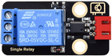  | 
| ------------------------ | ------------------------- | ---------------------------- | 
| UNO R4 WiFi/Minima主板(二选一)| Keyes 传感器扩展板 x1 |Keyes 单路5V继电器模块 x1 |
|       |  |   |
| 3P线(反向) x1 | USB线 x1  |   |

---

### 5. 模块接线图

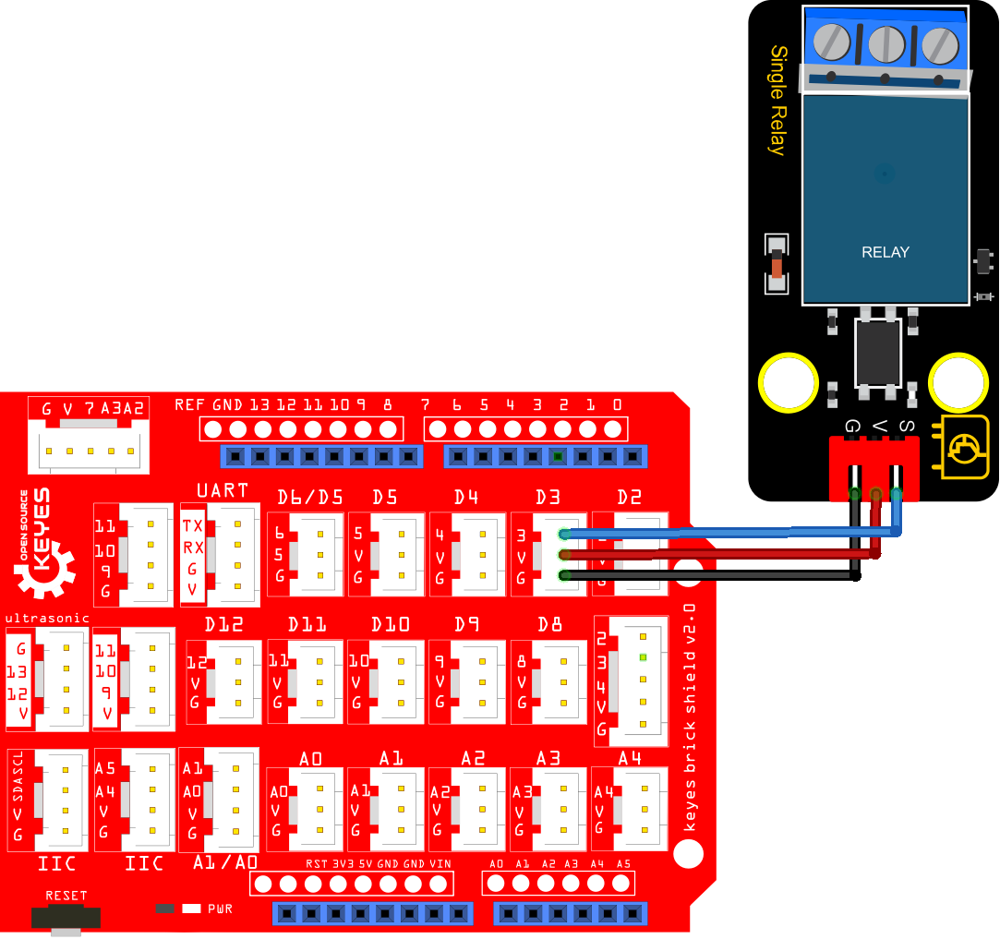

---

### 6. 实验代码

本项目中使用的代码保存在文件夹“<u>**项目代码**</u>”中，我们可以在此路径下打开代码文件''**Relay.ino**"。

**注意：为了避免上传代码不成功，请上传代码前不要连接模块。代码上传成功后，拔下USB线断电，按照接线图正确接好模块后再用USB线连接到计算机上电，观察实验结果。**

```c++
/*
 * 名称   : Relay
 * 功能   : 继电器开、关
 * 作者   : http://www.keyes-robot.com/ 
*/
#define Relay 3 //定义继电器的引脚为D3

void setup(){
  pinMode(Relay, OUTPUT); //设置“继电器”为“输出”
}

void loop(){
  digitalWrite(Relay, HIGH); //打开继电器
  delay(1000); //延迟1秒
  digitalWrite(Relay, LOW);  //关闭继电器
  delay(1000); //延迟1秒
}
```

参照第01课或第02课的示例，根据不同的 UNO R4 主板选择不同的主板板型和串口端口。

---

### 7. 实验结果

代码上传成功后，拔下USB线断电，按照接线图正确接好模块后再用USB线连接到计算机上电。

继电器将循环开与关，开启1秒，关闭1秒。同时可以听到继电器开与关的声音，还可以看到继电器上的指示灯指示状态的变化。

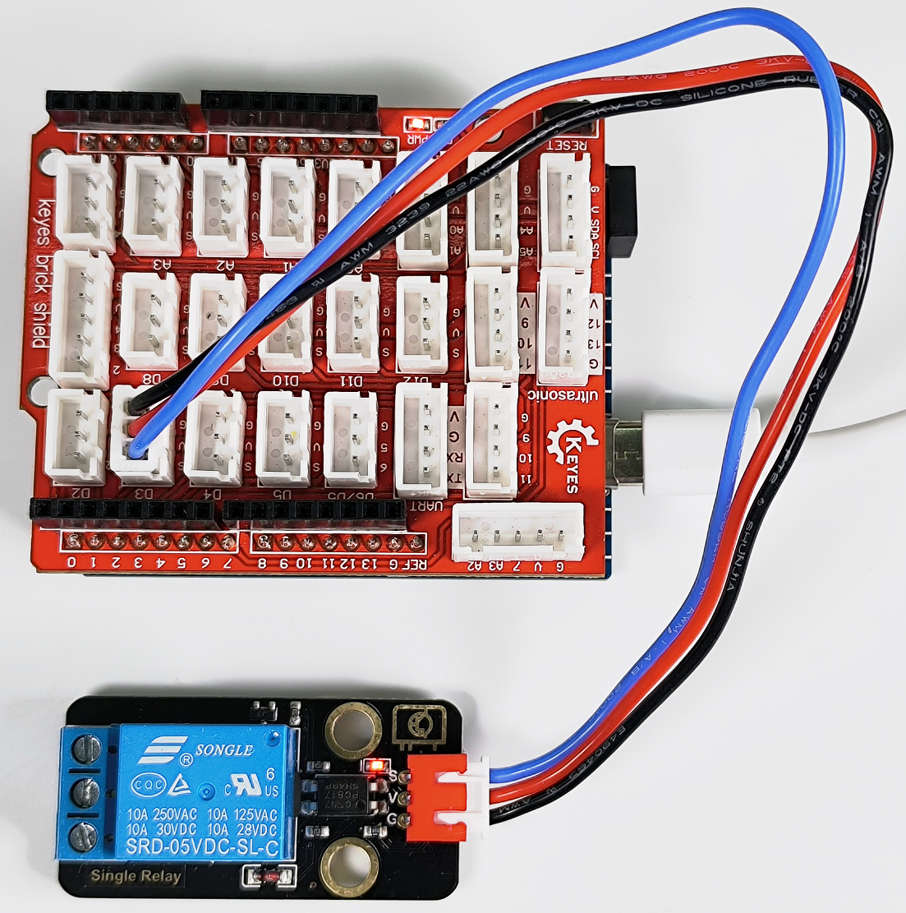

---

### 8. 代码说明

可以参照第02课的代码说明，这里就不多做介绍了。

---

## 第06课 自锁按键模块检测实验

### 1. 项目介绍

在这个套件中，有一个Keyes自锁按键模块，主要由一个自锁按键组成，上电后，按下白色按键，模块信号端输出低电平，将白色按键按起，模块信号端输出高电平。第02课我们学习了怎么让单片机的引脚输出一个高电平或者低电平，这节课程我们就来学习怎么读取引脚的电平。

自锁按键模块的白色按键按下，单片机读取到低电平，将白色按键按起读取到高电平。通过读取传感器上S端的高低电平，判断自锁按键是按下还是按起，并且在串口监视器上显示测试结果。

---

### 2. 模块参数

工作电压：DC 3.3V~5V 

工作温度：-10°C ~ +50°C

控制信号：数字信号

尺寸：32mm x 23.8mm x 15.6mm

接口：2.54mm间距，3pin防反接口

---

### 3. 模块原理图


按键有四个引脚，其中1和3是相连的，2和4是相连的，在我们未按下按键时，1、3与2、4是断开的，信号端S读取的是被1KΩ的上拉电阻R1所拉高的高电平，而当我们按下按键时，1、3和2、4连通。信号端S连接到了GND，此时读取到的电平为低电平，即按下按键，传感器信号端为低电平，模块上的LED灯亮起；按键按起时，信号端为高电平，模块上的LED灯灭。

---

### 4. 实验组件

|  |  |  |
| ------------------------ | ------------------------ | ---------------------------- |
| UNO R4 WiFi/Minima主板(二选一)| Keyes 传感器扩展板 x1    |Keyes 自锁按键模块 x1  |
|       |  |  |
| 3P线(反向) x1 | USB线 x1             |   |

---

### 5. 模块接线图

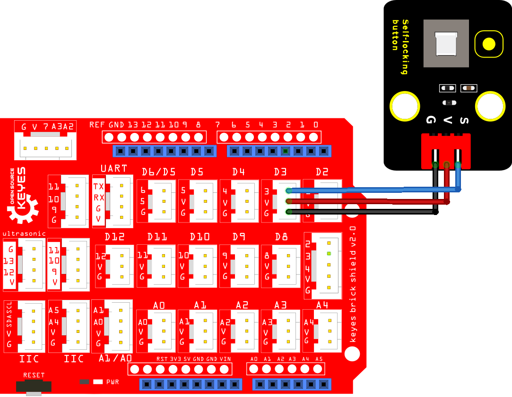

---

### 6. 实验代码

本项目中使用的代码保存在文件夹“<u>**项目代码**</u>”中，我们可以在此路径下打开代码文件''**Self-locking_button.ino**"。

**注意：为了避免上传代码不成功，请上传代码前不要连接模块。代码上传成功后，拔下USB线断电，按照接线图正确接好模块后再用USB线连接到计算机上电，观察实验结果。**

```c++
/*
 * 名称   : Self-locking button
 * 功能   : 读自锁按键的值
 * 作者   : http://www.keyes-robot.com/ 
*/
int val = 0;            //用于存储自锁按键的键值
int button = 3;         //将自锁按键的引脚连接到D3
void setup() {
  Serial.begin(9600);      //启动串口监视器，设置波特率为9600
  pinMode(button, INPUT);  //设置自锁按键的引脚为输入模式
}

void loop() {
  val = digitalRead(button);  //读取自锁按键的值并将其赋值给变量val
  Serial.print(val);          //打印变量vald的值
  if (val == 0) {             //按下自锁按键时读取到低电平，并打印出相关的信息
    Serial.print("        ");  
    Serial.println("Press the botton"); //打印自锁按键的释放信息
    delay(100);
  }

  else {               //按起自锁按键
    Serial.print("        ");
    Serial.println("Press the botton again");
    delay(100);
  }
}
```

参照第01课或第02课的示例，根据不同的 UNO R4 主板选择不同的主板板型和串口端口。

---

### 7. 实验结果

代码上传成功后，拔下USB线断电，按照接线图正确接好模块后再用USB线连接到计算机上电，打开串口监视器，设置波特率为 **<u>9600</u>**。

当按下模块上的白色按键时，按键值value为0，串口监视器打印出“**0     Press the button**”；再次按下白色按键（即白色按键被按起）时，按键值value为1，串口监视器打印出“**1   Press the botton again**”字符。


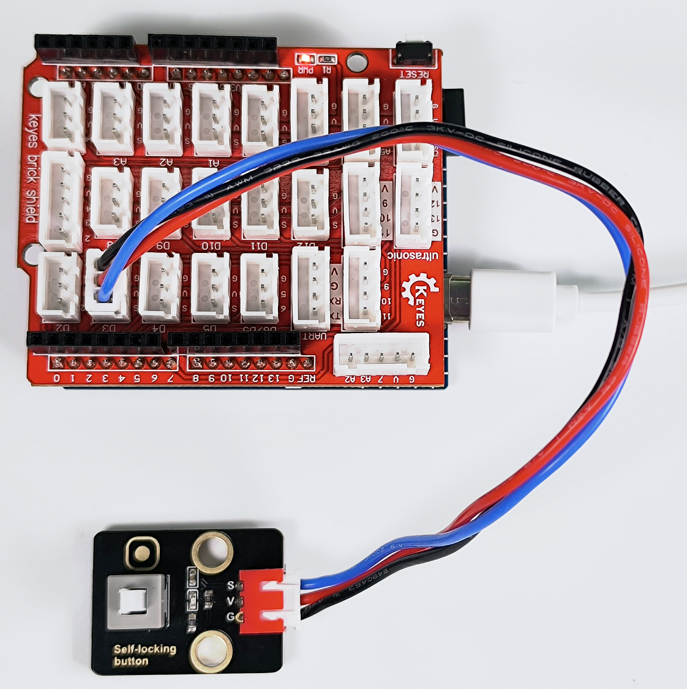


---

### 8. 代码说明

| 代码                   | 说明                                                         |
| ---------------------- | ------------------------------------------------------------ |
| pinMode(button, INPUT) | 由“ int button = 3; ”知道，定义按键管脚为D3。“INPUT”设置为输入模式。通过pinMode()配置为INPUT必须使用上拉或下拉电阻（我们的模块已经使用上拉电阻R1）。该电阻的目的是在开关断开时将引脚拉至已知状态。通常选择一个4.7K/10K欧姆的电阻，因为它的阻值足够低，可以可靠地防止输入悬空。同时，该阻值也要足够高，以使开关闭合时不会消耗太多电流。如果使用下拉电阻，则当开关断开时，输入引脚将为低电平；当开关闭合时，输入引脚将为高电平。如果使用上拉电阻，则当开关断开时，输入引脚将为高电平；当开关闭合时，输入引脚将为低电平。 |
| if( ){ } else{ }       | 如果（ ）里的表达式为真，则执行 if { }块内的代码。如果（ ）里表达式为假 ，则执行 else { }块内的代码。 |
| digitalRead(button)    | 读取按键的数字电平，高HIGH或者低LOW。如果该引脚未连接任何东西，则digitalRead( )可以返回HIGH或LOW（并且可以随机更改）。UNO R4 主板上的输入引脚A0、A1、A2、A3、A4、A5可以用作数字引脚，分别对应数字引脚D14、D15、D16、D17、D18、D19。|
| Serial.begin(9600)     | 初始化串口通信，并设置波特率为9600。                         |

---

## 第07课 电容触摸传感器检测实验

### 1. 项目介绍

在这个套件中，有一个Keyes 电容触摸模块，它主要由1个触摸检测芯片 TTP223-BA6 构成。模块上提供一个触摸按键，功能是用可变面积的按键取代传统按键。当我们上电之后，传感器需要约0.5秒的稳定时间，此时间段内不要触摸按键，此时所有功能都被禁止，始终进行自校准，校准周期约为4秒。

---

### 2. 模块参数

工作电压：DC 3.3V~5V

工作电流：3mA

最大功率：0.015W

输出信号：数字信号

工作温度：-10°C ~ +50°C

尺寸：32mm x 23.8mm x 9mm

接口：2.54mm间距，3pin防反接口

---

### 3. 模块原理图


TTP223N-BA6 的输出通过 AHLB（4）引脚选择高电平或低电平有效。通过 TOG（6）引脚选择直接模式或触发模式。

| TOG  | AHLB | 引脚Q的功能           |
| ---- | ---- | --------------------- |
| 0    | 0    | 直接模式，高电平有效  |
| 0    | 1    | 直接模式，低电平有效  |
| 1    | 0    | 触发模式，上电状态为0 |
| 1    | 1    | 触发模式，上电状态为1 |

从原理图我们可以知道 TOG 脚和 AHLB 脚是悬空的，此时输出为直接模式，高电平有效。

当我们用手指触摸模块上的感应区时，信号端 S 输出高电平（上一课学习的自锁按键模块与之相反，当自锁按键感应到按下输出低电平），板载红色LED点亮，我们通过读取模块上 S 端的高低电平，判断电容触摸模块上的感应区是否感应到触摸。

<span style="color: rgb(255, 76, 65);">注意：</span>我们上电之后，传感器需要约0.5sec的稳定时间，此时间段内不要对键进行触摸，此时所有功能都被禁止，始终进行自校准，当键没被触摸时，重校准周期约为4.0sec。

---

### 4. 实验组件

|  |  |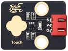 |
| ------------------------ | ------------------------ | ---------------------------- |
|UNO R4 WiFi/Minima主板(二选一)| Keyes 传感器扩展板 x1    | Keyes 电容触摸传感器 x1 |
|       |  |  |
| 3P线(反向) x1 | USB线 x1   |          |

---

### 5. 模块接线图

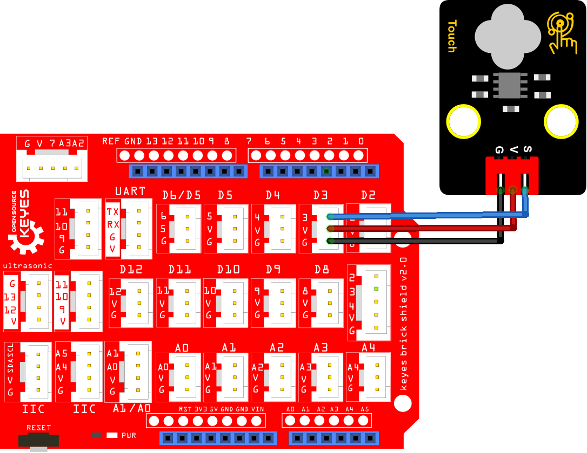

---

### 6. 实验代码

本项目中使用的代码保存在文件夹“<u>**项目代码**</u>”中，我们可以在此路径下打开代码文件''**Touch_sensor.ino**"。

**注意：为了避免上传代码不成功，请不要在上传代码前连接模块。代码上传成功后，拔下USB线断电，按照接线图正确接好模块后再用USB线连接到计算机上电，观察实验结果。**

```c++
/*
 * 名称   : Touch sensor
 * 功能   : 读取电容触摸传感器的值
 * 作者   : http://www.keyes-robot.com/ 
*/
int val = 0;
int touch = 3;            //定义触摸引脚D3 
void setup() {
  Serial.begin(9600);     //波特率为9600
  pinMode(touch, INPUT);  //设置触摸引脚为输入模式
}

void loop() {
  val = digitalRead(touch); //读取触摸引脚的值
  Serial.print(val);        //打印触摸引脚的值
  if (val == 1) {  //按下为高电平
    Serial.print("        ");
    Serial.println("Touch the button");
    delay(100);
  }
  else {          //释放为低电平
    Serial.print("        ");
    Serial.println("Loosen the button");
    delay(100);
  }
}
```

参照第01课或第02课的示例，根据不同的 UNO R4 主板选择不同的主板板型和串口端口。

---

### 7. 实验结果

代码上传成功后，拔下USB线断电，按照接线图正确接好模块后再用USB线连接到计算机上电，打开串口监视器，设置波特率为 **<u>9600</u>**。


当电容触摸传感器模块上的感应区感应到触摸时，板载红色LED点亮，value 值为 1，串口监视器打印出“**1  Touch the button**”；当没有感应到触摸时，板载红色LED熄灭，value 值为 0，串口监视器打印出“**0 Loosen the button**”。


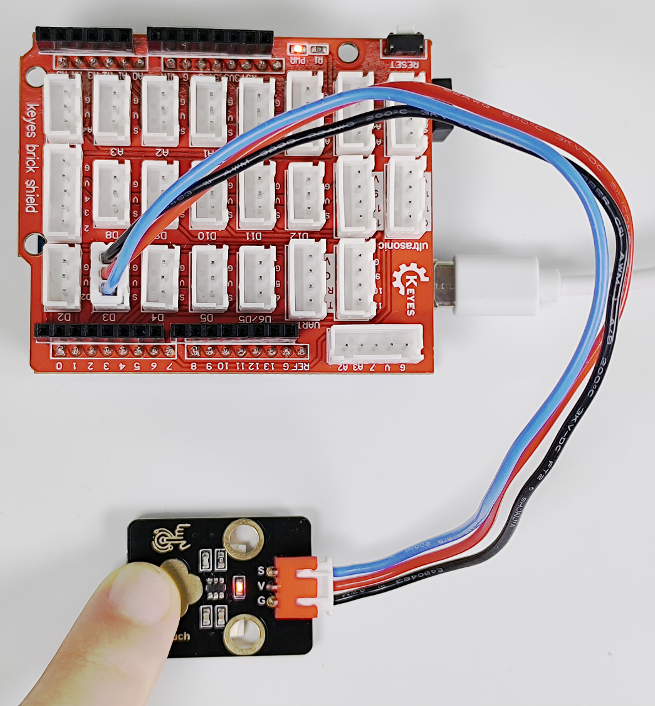


---

### 8. 代码说明

可以参照第06课的代码说明，这里就不多做介绍了。

---

## 第08课 避障传感器检测障碍物

### 1. 项目介绍

在这个套件中，有一个Keyes 避障传感器，它主要由一对红外线发射与接收管元件组成。实验中，我们通过读取传感器上S端高低电平，判断是否存在障碍物。

---

### 2. 模块参数

工作电压: DC 3.3V~5V 

工作电流 : 6.8mA

最大功率: 0.034W

输出信号 : 数字信号

最大感应距离: 17.3cm

工作温度 ：-10°C ~ +50°C

尺寸 ：32mm x 23.8mm x 11mm

接口 ：2.54mm间距，3pin防反接口

---

### 3. 模块原理图


NE555时基电路提供给发射管TX发射出一定频率的红外信号，红外信号会随着传送距离的加大逐渐衰减，如果遇到障碍物，就会形成红外反射。当检测方向RX遇到反射回来的信号比较弱时，接收检测引脚输出高电平，说明障碍物比较远；当反射回来的信号比较强，接收检测引脚输出低电平，说明障碍物比较近，此时指示灯亮起。传感器上有两个电位器，一个用于调节发送功率，一个用于调节接收频率，通过调节两个电位器，我们可以调节它的有效距离。

---

### 4. 实验组件

|  |  | |
| ------------------------ | ------------------------ | ---------------------------- | 
|UNO R4 WiFi/Minima主板(二选一)|  Keyes 传感器扩展板 x1    | Keyes 避障传感器 x1        |
|        |  | |
| 3P线(反向) x1 | USB线 x1             | 一字螺丝刀 x1             |

---

### 5. 模块接线图

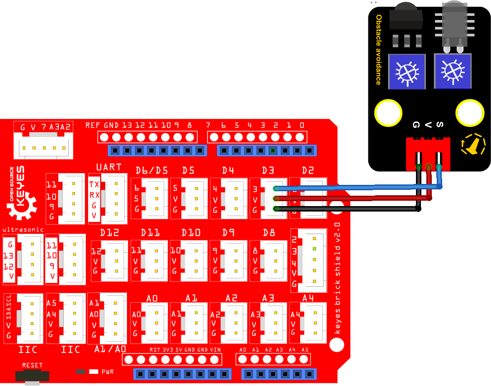

---

### 6. 实验代码

本项目中使用的代码保存在文件夹“<u>**项目代码**</u>”中，我们可以在此路径下打开代码文件''**obstacle_avoidance_sensor.ino**"。

**注意：为了避免上传代码不成功，请上传代码前不要连接模块。代码上传成功后，拔下USB线断电，按照接线图正确接好模块后再用USB线连接到计算机上电，观察实验结果。**

```c++
/*
 * 名称   : Obstacle avoidance sensor
 * 功能   : 读取避障传感器的值
 * 作者   : http://www.keyes-robot.com/ 
*/
int val = 0;
void setup() {
  Serial.begin(9600);   //设置波特率为9600
  pinMode(3, INPUT);    //设置引脚D3为输入模式
}

void loop() {
  val = digitalRead(3);  //读取数字电平
  Serial.print(val);     //打印读取的电平信号
  if (val == 0) {  //障碍物检测
    Serial.print("        ");
    Serial.println("There are obstacles");
    delay(100);
  }
  else {  //未发现障碍物
    Serial.print("        ");
    Serial.println("All going well");
    delay(100);
  }
}
```

参照第01课或第02课的示例，根据不同的 UNO R4 主板选择不同的主板板型和串口端口。

---

### 7. 实验结果

代码上传成功后，拔下USB线断电，按照接线图正确接好模块后再用USB线连接到计算机上电，接着开始调节传感器模块上的两个电位器感应距离。避障传感器上有两个电位器，分别是接收频率调节电位器和发射功率调节电位器，如下图所示。


先调节发射功率调节电位器，先用一字螺丝刀将电位器顺时针拧到尽头，然后逆时针慢慢往回调，当调节到SLED灯亮起时，微调使传感器上SLED灯介于亮与不亮之间的**不亮**状态。

接着设置接收频率调节电位器，同样用一字螺丝刀将电位器顺时针拧到尽头，然后逆时针慢慢往回调，当SLED灯亮起时，微调使传感器上SLED灯介于亮与不亮之间的**不亮**状态，此时能检测障碍物的距离最长。

打开串口监视器，设置波特率为 **<u>9600</u>**。当传感器检测到障碍物时，value 值为 **0**，SLED 灯亮，串口监视器打印出 “**0   There are obstacles**” ；没有检测到障碍物时，value 值为 **1**，SLED 灯灭，串口监视器打印出 “**1   All going well**” 。


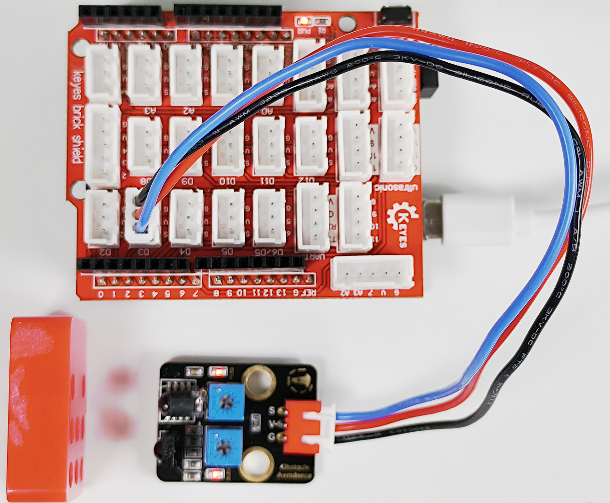

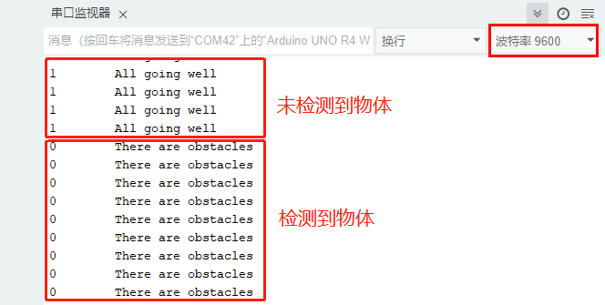

---

### 8. 代码说明

可以参照第06课的代码说明，这里就不多做介绍了。

---

## 第09课 循迹传感器检测黑白线

### 1. 项目介绍

在这个套件中，有一个Keyes 单路循线传感器，它主要由1个TCRT5000 反射型黑白线识别传感器元件组成。

---

### 2. 模块参数

工作电压：DC 3.3V~5V

工作电流：31mA

最大功率：0.155W

输出信号：数字信号

检测距离：0~80mm

工作温度：-10°C ~ +50°C

尺寸：32mm x 23.8mm x 9.4mm

接口：2.54mm间距，3pin防反接口

---

### 3. 模块原理图

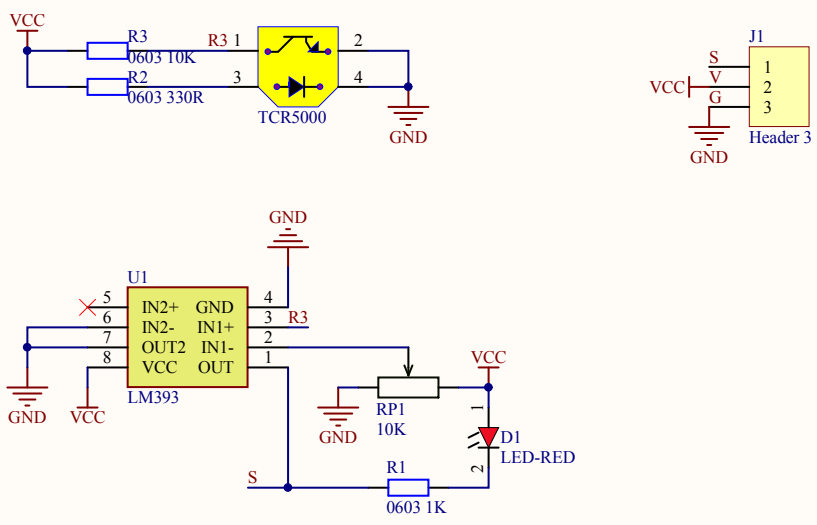

上一课我们学习了避障传感器的原理，而循线传感器的原理也是相类似的。TCRT5000 反射型传感器包含了一个红外发射器和光电探测器，彼此相邻。巡线传感器的红外发射器持续发出红外线，红外线经过反射后被接收。接收后会产生电流，这个电流随着红外线光增强而变大。接收后利用电压比较器 LM393 ，将接收到红外线后 LM393 的 3 脚的电压值与可调电位器给 LM393 的 2 脚设置的阈值电压进行比较。

当发射出的红外线没有被反射回来或被反射回来但强度不够大时，红外接收管一直处于关闭状态，此时 R3 处的电压接近VCC，即 LM393 的 3 脚电压接近 VCC。而LM393 的 2 脚电压小于 VCC，通过 LM393 比较器后比较 1 脚输出高电平，LED不导通。随着反射回来的红外线光增强，电流也随之变大。此时 3 脚的电压值等于 VCC - I*R3，随着电流的增大，3 脚的电压就会越来越小。当电压小到比 2 脚的电压还小的时候，接收检测引脚 1 脚输出低电平，LED导通，被点亮。

当红外信号发送到黑色轨道时，由于黑色吸光能力比较强，红外信号发送出去后就会被吸收掉，反射部分很微弱。而白色反射率高，所以白色轨道就会把大部分红外信号反射回来。即检测到黑色或没检测到物体时，信号端为高电平；检测到白色物体时，信号端为低电平。它的检测高度为 0—3cm。我们可以通过旋转传感器上电位器，调节灵敏度，即调节检测高度。当旋转电位器，使传感器上红色 LED介于不亮与亮之间的临界点时，灵敏度最好。

---

### 4. 实验组件

|  |  | | 
| ------------------------ | ------------------------ | ---------------------------- | 
|UNO R4 WiFi/Minima主板(二选一)| Keyes 传感器扩展板 x1   |Keyes 单路循线传感器 x1   |
|       |  || 
|3P线(反向) x1 | USB线 x1             |一字螺丝刀 x1             |

---

### 5. 模块接线图

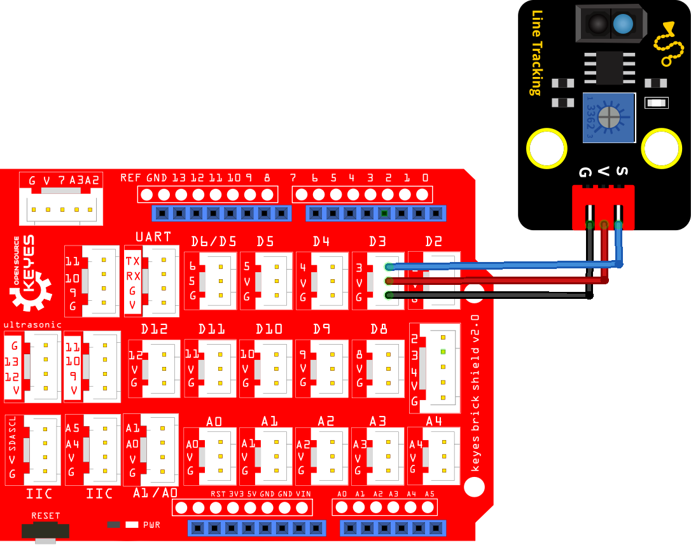

---

### 6. 实验代码

本项目中使用的代码保存在文件夹“<u>**项目代码**</u>”中，我们可以在此路径下打开代码文件''**Line_tracking.ino**"。

**注意：为了避免上传代码不成功，请不要在上传代码前连接模块。代码上传成功后，拔下USB线断电，按照接线图正确接好模块后再用USB线连接到计算机上电，观察实验结果。**

```c++
/*
 * 名称   : line tracking
 * 功能   : 读取循迹传感器值
 * 作者   : http://www.keyes-robot.com/ 
*/
int val = 0;
void setup() {
  Serial.begin(9600); //设置波特率为9600
  pinMode(3, INPUT);  //将传感器引脚D3设置为输入模式
}

void loop() {
  val = digitalRead(3);   //读取循迹传感器的数字电平输出
  Serial.print(val);      //打印循迹传感器的读取到的数字电平的值
  if (val == 0) {  //检测到白色物体的值为0
    Serial.print("        ");
    Serial.println("White");
    delay(100);
  }
  else {  //检测到黑色物体的值为1
    Serial.print("        ");
    Serial.println("Black");
    delay(100);
  }
}
```

参照第01课或第02课的示例，根据不同的 UNO R4 主板选择不同的主板板型和串口端口。

---

### 7. 实验结果

代码上传成功后，拔下USB线断电，按照接线图正确接好模块后再用USB线连接到计算机上电，打开串口监视器，设置波特率为 **<u>9600</u>**。

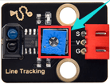

可以使用一字螺丝刀通过旋转传感器上电位器，调节灵敏度，即调节检测高度。当旋转电位器，使传感器上的红色LED介于不亮与亮之间的临界点时，灵敏度最好。

串口监视器打印出对应的数据和字符。当传感器检测到黑色物体货检测距离太远时，value值为 1 ，LED不亮，串口监视器打印出“**1 Black**”；检测到白色物体（能够反光）时，value值为 0 ，LED亮，串口监视器打印出“**0 White**”。

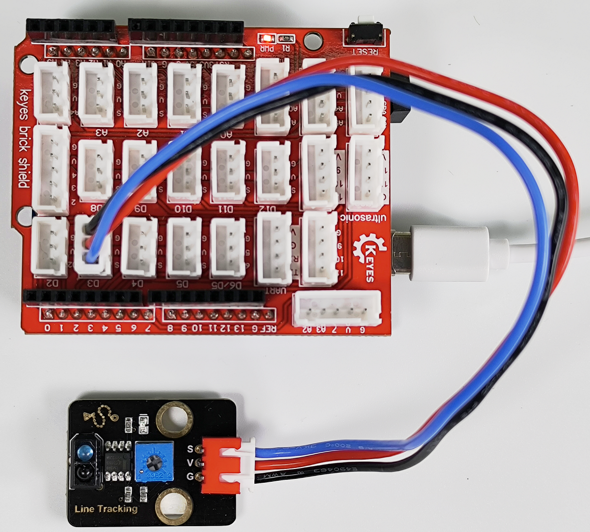

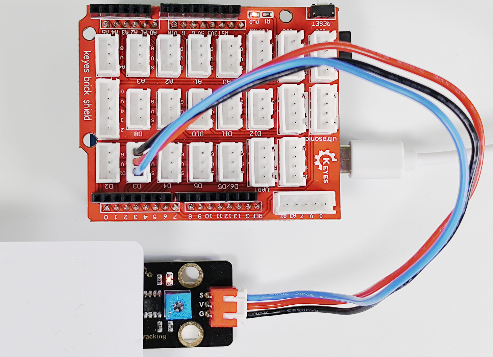

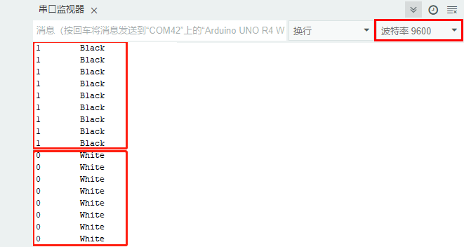

---

### 8. 代码说明

可以参照第06课的代码说明，这里就不多做介绍了。

---

## 第10课 倾斜模块的原理

### 1. 项目介绍

在这个套件中，有一个Keyes 倾斜传感器，主要由一个倾斜开关组成，其内部带有一颗滚珠，用来监测倾斜情况。倾斜开关可以依据模块是否倾斜而输出不同的电平信号。当开关高于水平位置倾斜时开关导通，低于水平位置时开关断开。倾斜模块可用于倾斜检测、报警器制作或者其他检测。

---

### 2. 模块参数

工作电压: DC 3.3V~5V 

工作电流: 4.2mA

最大功率: 0.03WW

输出信号: 数字信号

工作温度：-10°C ~ +50°C

尺寸：32mm x 23.8mm x 8mm

接口：2.54mm间距，3pin防反接口

---

### 3. 模块原理图

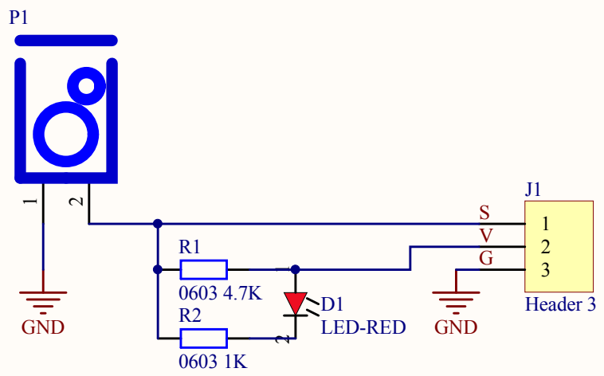

Keyes 倾斜传感器的原理非常简单，主要是利用滚珠在开关内随不同倾斜角度的变化使滚珠开关P1的引脚1和2导通或者不导通，当滚珠开关P1的引脚1和2导通时，由于1脚接GND，所以信号端S被拉低为低电平，此时红色LED和R2组成的电路形成回路，电流经过红色LED，点亮红色LED；当滚珠开关P1的引脚1和2不导通时，滚珠开关P1的引脚2被4.7K的上拉电阻R1拉高使得信号端S为高电平，电流不经过红色LED，红色LED熄灭。


---

### 4. 实验组件

|  |  |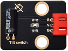 |  
| ------------------------ | ------------------------ | ---------------------------- | 
|UNO R4 WiFi/Minima主板(二选一)| Keyes 传感器扩展板 x1      |Keyes 倾斜传感器 x1  |
|       |  |     |
| 3P线(反向) x1 | USB线 x1 |            |

---

### 5. 模块接线图


---

### 6. 实验代码

本项目中使用的代码保存在文件夹“<u>**项目代码**</u>”中，我们可以在此路径下打开代码文件''**Tilt_switch.ino**"。

**注意：为了避免上传代码不成功，请上传代码前不要连接模块。代码上传成功后，拔下USB线断电，按照接线图正确接好模块后再用USB线连接到计算机上电，观察实验结果。**

```c++
/*
 * 名称   : Tilt switch
 * 功能   : 读取倾斜传感器的值
 * 作者   : http://www.keyes-robot.com/ 
*/
int val; //定义一个变量val用来存储倾斜传感器输出的电平值

void setup() {
  Serial.begin(9600);
  pinMode(3, INPUT);  //将倾斜传感器的引脚连接到D3，设置为输入模式
}

void loop() {
  val = digitalRead(3); //读取模块电平信号
  Serial.println(val);  //打印倾斜传感器输出的电平值
  delay(100);   //延迟100毫秒
}
```

参照第01课或第02课的示例，根据不同的 UNO R4 主板选择不同的主板板型和串口端口。

---

### 7. 实验结果

代码上传成功后，拔下USB线断电，按照接线图正确接好模块后再用USB线连接到计算机上电，打开串口监视器，设置波特率为 **<u>9600</u>**。

将倾斜模块往某一边倾斜，若模块上的红色LED**不亮**，串口监视器打印数字电平信号“**1**”；若模块上的红色LED点**亮**，串口监视器打印数字电平信号“**0**”。

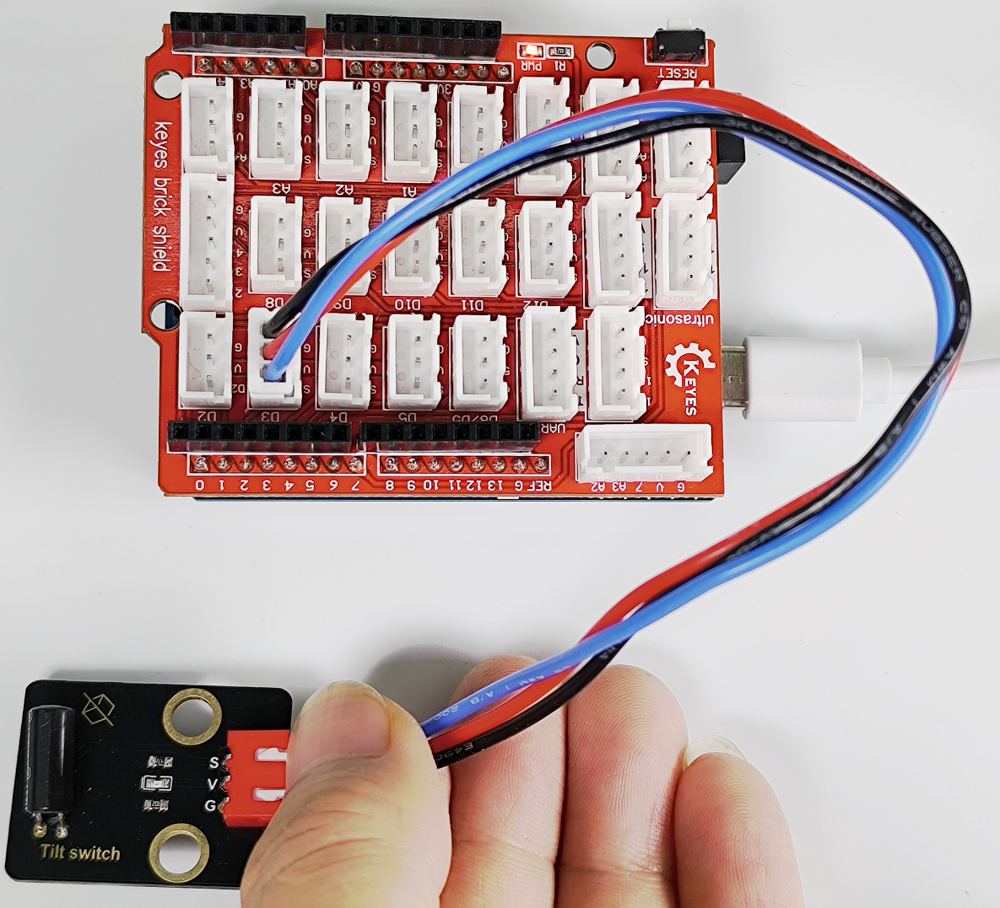

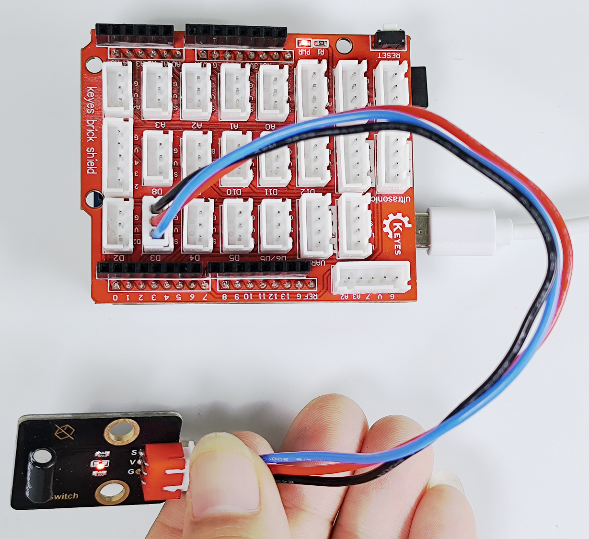


---

### 8. 代码说明

可以参照第06课的代码说明，这里就不多做介绍了。


---

## 第11课 光折断计数

### 1. 项目介绍

在这个套件中，有一个Keyes 光折断模块，它主要由 1 个 ITR-9608 光电开关组成，它属于对射光电开关传感器。

这一课，我们通过设置代码，模拟出流水线上利用类似传感器实现对产品进行计数的功能。

---

### 2. 模块参数

工作电压：DC 3.3V~5V

工作电流：24mA

最大功率：0.12W

输出信号：数字信号

工作温度：-10°C ~ +50°C

尺寸：32mm x 23.8mm x 13mm

接口：2.54 mm间距，3pin防反接口

---

### 3. 模块原理图

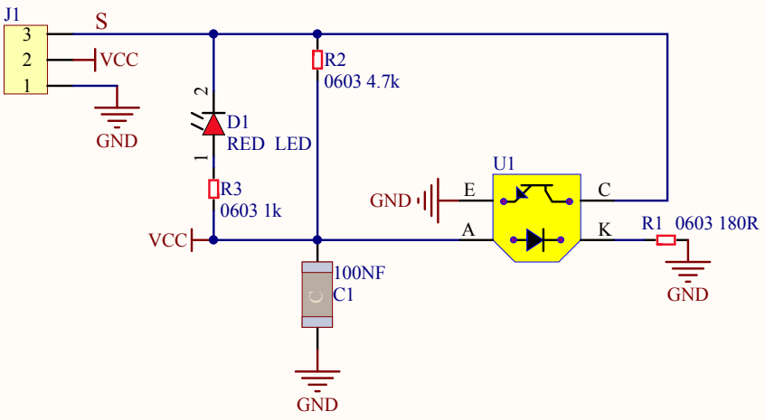

光电开关是是利用被检测物体对光束的遮挡或反射，由同步回路选通电路，从而检测遮挡物体的有无。所有能反射光线的物体都可以被检测。光电开关将输入的电流在发射器上转换为光信号并射出，然后接收器根据接收到的光线强弱或有无，对目标物体进行检测。

当用不透明物体放置在传感器凹槽时，C 脚与 VCC 连通，传感器信号端 S 为高电平，自带红色 LED熄灭；传感器凹槽没有任何东西时，传感器信号端被 R2 拉低为低电平，自带红色LED亮起。

---

### 4. 实验组件

|  |  | |  
| --------------------- | ------------------------ | ---------------------------- |
|UNO R4 WiFi/Minima主板(二选一)     | Keyes 传感器扩展板 x1      |Keyes 光折断模块 x1 |     
|       |  |   |
| 3P线(反向) x1 | USB线 x1  |           |

---

### 5. 模块接线图


---

### 6. 实验代码

本项目中使用的代码保存在文件夹“<u>**项目代码**</u>”中，我们可以在此路径下打开代码文件''**Photo_Interrupt.ino**"。

**注意：为了避免上传代码不成功，请不要在上传代码前连接模块。代码上传成功后，拔下USB线断电，按照接线图正确接好模块后再用USB线连接到计算机上电，观察实验结果。**

```c++
/*
 * 名称   : Photo_Interrupt
 * 功能   : 光折断传感器计数
 * 作者   : http://www.keyes-robot.com/ 
*/
int PushCounter = 0;  //count变量的初始值为0
int State = 0;        //存储传感器当前的输出状态
int lastState = 0;    //存储传感器最后的输出状态
void setup() {
  Serial.begin(9600); //设置波特率为9600
  pinMode(3, INPUT);  //将光折断传感器引脚D3设置为输入模式
}

void loop() {
  State = digitalRead(3);   //读取当前状态
  if (State != lastState) { //如果状态与上次读取的不同
    if (State == 1) {       //遮挡光线时
      PushCounter = PushCounter + 1; //计数 + 1
      Serial.println(PushCounter);   //打印计数 
    }
  }
  lastState = State;  //更新状态
}
```

参照第01课或第02课的示例，根据不同的 UNO R4 主板选择不同的主板板型和串口端口。

---

### 7. 实验结果

代码上传成功后，拔下USB线断电，按照接线图正确接好模块后再用USB线连接到计算机上电，打开串口监视器，设置波特率为**<u>9600</u>**。

串口监视器打印出 PushCounter 的数据，物体每穿过传感器凹槽一次，PushCounter 数据加 1。

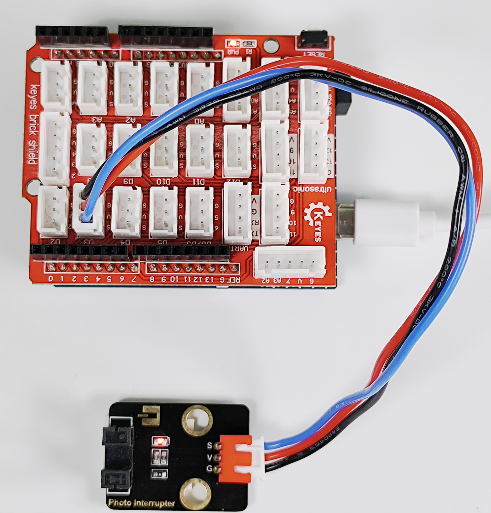

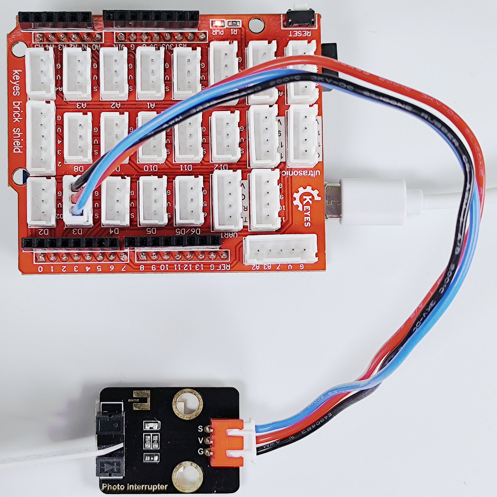

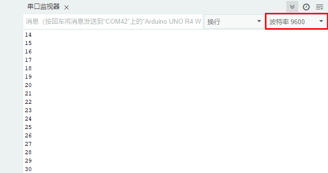

---

### 8. 代码说明

通过以下表格，我们可以了解此课程代码的逻辑设置，这个编程技巧我们在后面还会用到。

| 初始状态                              |         |
| :------------------------------------ | :------ |
| State（传感信号端数值）               | 设置为0 |
| lastState（传感器信号端上一循环数值） | 设置为0 |
| PushCounter（累计通过物体数目）       | 设置为0 |

| 状态                       |                                                              |                                                  |
| -------------------------- | ------------------------------------------------------------ | ------------------------------------------------ |
| 当物体开始穿过传感器凹槽时 | lastState为0，State检测到变为1，两个数据不相等，lastState变为1。 | PushCounter设置为PushCounter加1打印PushCounter值 |
| 当物体离开传感器凹槽时     | lastState为1，State检测到变为0，两个数据不相等，lastState变为0。 | PushCounter不变不打印PushCounter值               |
| 当物体再次穿过传感器凹槽时 | lastState为0，State检测到变为1，两个数据不相等，lastState变为1。 | PushCounter设置为PushCounter加1打印PushCounter值 |
| 当物体再次离开传感器凹槽时 | lastState为1，State检测到变为0，两个数据不相等，lastState变为0。 | PushCounter不变不打印PushCounter值               |


---

## 第12课 碰撞传感器的原理

### 1. 项目介绍

在这个套件中，有一个Keyes 碰撞传感器。上一课我们学习的倾斜模块用的是滚珠开关，这一课我们学习的碰撞传感器用的是轻触开关。碰撞传感器常用于3D打印机内做限位开关。

---

### 2. 模块参数

工作电压：DC 3.3V~5V

工作电流：20mA

最大功率：0.1W

输出信号：数字信号

尺寸：39.5mm x 23.5mm x 9.2mm

接口：2.54mm间距，3pin防反接口

---

### 3. 模块原理图


碰撞传感器主要由 1 个轻触开关组成。当物体碰到轻触开关弹片，下压时，2 脚和 3 脚导通，传感器信号端 S 被下拉为低电平，模块上自带的红色 LED 点亮；当没有物体碰撞轻触开关时，2 脚和 3 脚不导通，3 脚被 4.7 K的电阻 R1 上拉为高电平，即传感器信号端S为高电平，此时自带红色 LED 熄灭。碰撞传感器的原理与倾斜模块的电路原理几乎一样，不同之处在于导通方式。

---

### 4. 实验组件

|  |   |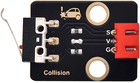 |    
| --------------------- | --------------------- | ---------------------------- |
|UNO R4 WiFi/Minima主板(二选一)| Keyes 传感器扩展板 x1   |Keyes 碰撞传感器 x1|   
|       |  |     |
| 3P线(反向) x1 | USB线 x1  |            |

---

### 5. 模块接线图

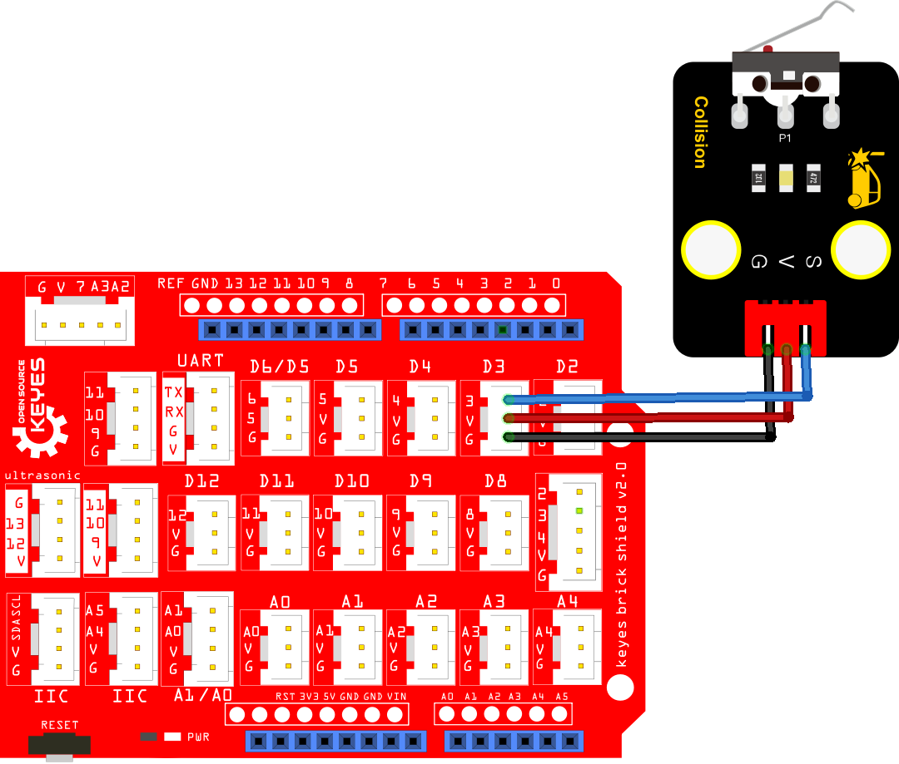

---

### 6. 实验代码

本项目中使用的代码保存在文件夹“<u>**项目代码**</u>”中，我们可以在此路径下打开代码文件''**collision_sensor.ino**"。

**<span style="background:#ff0;color:#000">
注意：为了避免上传代码不成功，请上传代码前不要连接模块。代码上传成功后，拔下USB线断电，按照接线图正确接好模块后再用USB线连接到计算机上电，观察实验结果。 </span>**

```c++
/*
 * 名称   : collision sensor
 * 功能   : 读取碰撞传感器的值
 * 作者   : http://www.keyes-robot.com/ 
*/
int val = 0;
void setup() {
  Serial.begin(9600);  //波特率设置为9600
  pinMode(3, INPUT);   //设置碰撞传感器的引脚D3为输入模式
}

void loop() {
  val = digitalRead(3);  //读取碰撞传感器的值
  Serial.print(val);      //打印碰撞传感器的值
  if (val == 0) {   //碰撞时的值为0
    Serial.print("        ");
    Serial.println("The end of this!");
    delay(100);
  }
  else {    //无碰撞时的值为1
    Serial.print("        ");
    Serial.println("All going well");
    delay(100);
  }
}
```

参照第01课或第02课的示例，根据不同的 UNO R4 主板选择不同的主板板型和串口端口。

---

### 7. 实验结果

代码上传成功后，拔下USB线断电，按照接线图正确接好模块后再用USB线连接到计算机上电，打开串口监视器，设置波特率为 **<u>9600</u>**。

将传感器的上弹片下压时，value值为0，模块上LED点亮，串口监视器打印出“**0  The end of this!**” ；当松开弹片时，value值为1，模块上LED熄灭，串口监视器打印出“**1  All going well!**”。

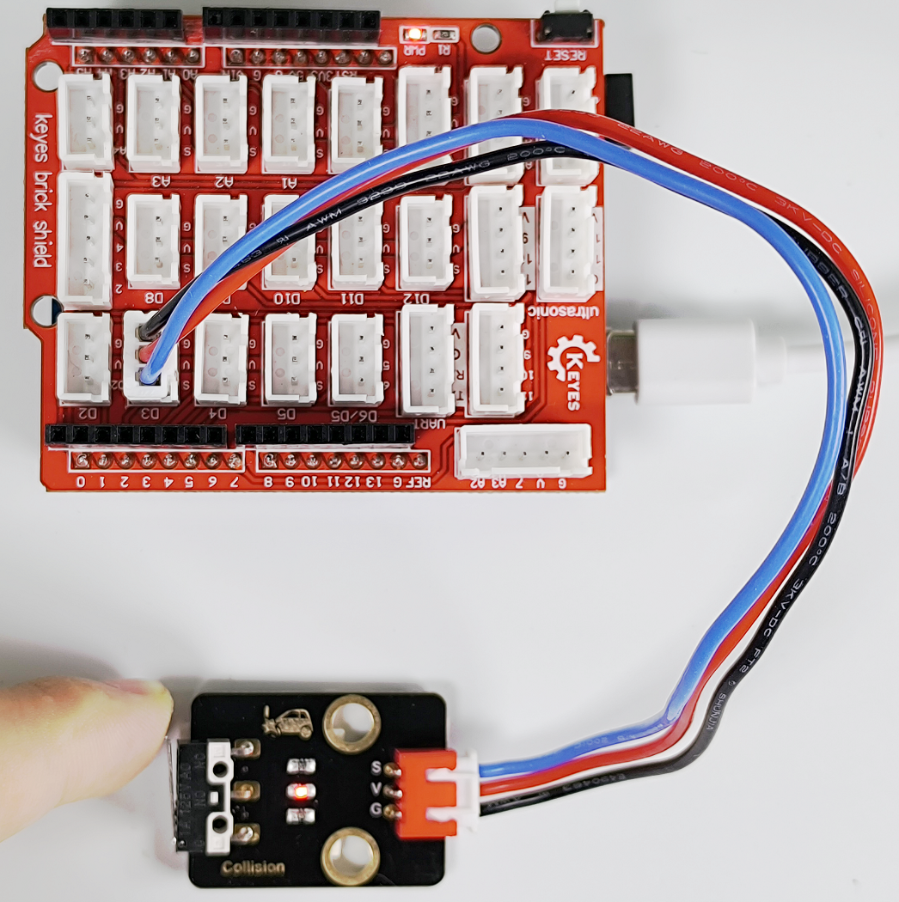

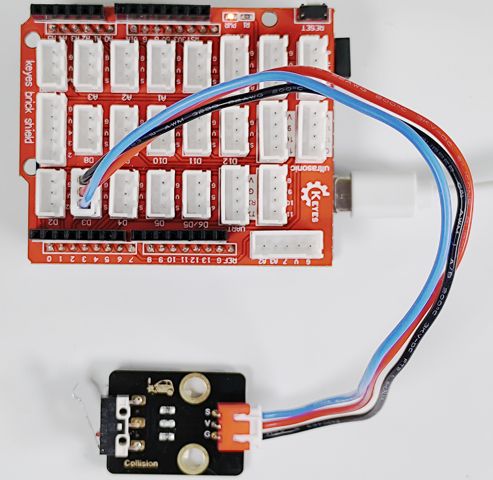

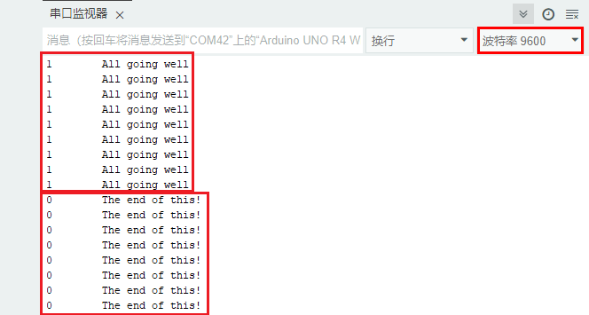

---

### 8. 代码说明

可以参照第06课的代码说明，这里就不多做介绍了。

---

## 第13课 附近有人吗

### 1. 项目介绍

在这个套件中，有一个Keyes 人体红外热释传感器，它主要由一个RE200B-P传感器元件组成。它是一款基于热释电效应的人体热释运动传感器，能检测到人体或动物身上发出的红外线，配合菲涅尔透镜能使传感器探测范围更远更广。

实验中，通过读取模块上S端高低电平，判断附近是否有人在运动；并且在串口监视器上显示测试结果。

---

### 2. 模块参数

工作电压: DC 3.3V~5V 

工作电流: 3.6mA

最大功率: 0.018W

静态电流: <50 uA

输出信号: 数字信号

触发方式: L不可重复触发/H重复触发

视野角度：Y = 90°，X = 110°（视野角度为理论数值）

最大检测距离: ≤5米

工作温度：-10°C ~ +50°C

尺寸：32mm x 23.8mm x 7.4mm

接口：2.54mm间距为，3pin防反接口

---

### 3. 模块原理图


这个模块的原理图可能较前面的模块稍复杂，我们一部分一部分来看。先看电压转换部分，作用是将5V输入电压转换为3.3V输入电压。因为我们模块上用到的热释电红外传感器的工作电压是3.3V，不能直接用5V电压供电使用。有了这个电压转换部分，3.3V输入电压和5V输入电压都适用于此热释电红外传感器。

当红外热释传感器没有检测到红外信号时，红外热释传感器的1脚输出低电平，此时模块上的LED两端有电压差，有电流流过，LED被点亮，MOS管Q1导通（Q1是NPN MOS管，型号为2N7002。由于红外热释传感器的1脚输出低电平，所以Q1的源极Vs=0，而Q1的栅极Vg=3.3V，于是Q1的栅极G和Q1的源极S之间的电压 Vgs = 3.3V 大于Q1的阈值电压 2.5V，Q1导通。），信号端S检测到低电平。

当红外热释传感器检测到红外信号时，红外热释传感器的1脚输出高电平，此时模块上的LED熄灭，MOS管Q1不导通，则信号端S检测到被10K上拉电阻R5拉高的高电平。

---

### 4. 实验组件

|  |     |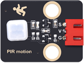|    
| ------------------------ | --------------------------- | ---------------------------- |
|UNO R4 WiFi/Minima主板(二选一)| Keyes 传感器扩展板 x1 |Keyes 人体红外热释传感器 x1 |    
|        |  |     |
| 3P线(反向) x1 | USB线 x1   |          |

---

### 5. 模块接线图


---

### 6. 实验代码

本项目中使用的代码保存在文件夹“<u>**项目代码**</u>”中，我们可以在此路径下打开代码文件''**PIR_motion.ino**"。

**注意：为了避免上传代码不成功，请上传代码前不要连接模块。代码上传成功后，拔下USB线断电，按照接线图正确接好模块后再用USB线连接到计算机上电，观察实验结果。**

```c++
/*
 * 名称   : PIR motion
 * 功能   : 读取人体红外传感器的数值
 * 作者   : http://www.keyes-robot.com/ 
*/
int val = 0;
int pirPin = 3;   //PIR运动传感器的引脚定义为D3
void setup() {
  Serial.begin(9600);   //波特率设置为9600
  pinMode(pirPin, INPUT);    //将传感器设置为输入模式
}

void loop() {
  val = digitalRead(pirPin);    //读取传感器值
  Serial.print(val);    //打印传感器值
  if (val == 1) {    //附近有人移动，输出高电平
    Serial.print("        ");
    Serial.println("Some body is in this area!");
    delay(100);
  }
  else {    //如果附近没有人移动，输出低电平
    Serial.print("        ");
    Serial.println("No one!");
    delay(100);
  }
}
```

参照第01课或第02课的示例，根据不同的 UNO R4 主板选择不同的主板板型和串口端口。

---

### 7. 实验结果

代码上传成功后，拔下USB线断电，按照接线图正确接好模块后再用USB线连接到计算机上电，打开串口监视器，设置波特率为 **<u>9600</u>**。

当传感器检测到附近有人在运动时，value值为1，模块上LED熄灭，串口监视器显示“**1   Somebody is in this area!**”；没有检测到附近有人在运动时，value值为0，模块上LED点亮，串口监视器显示“**0   No one!**”。

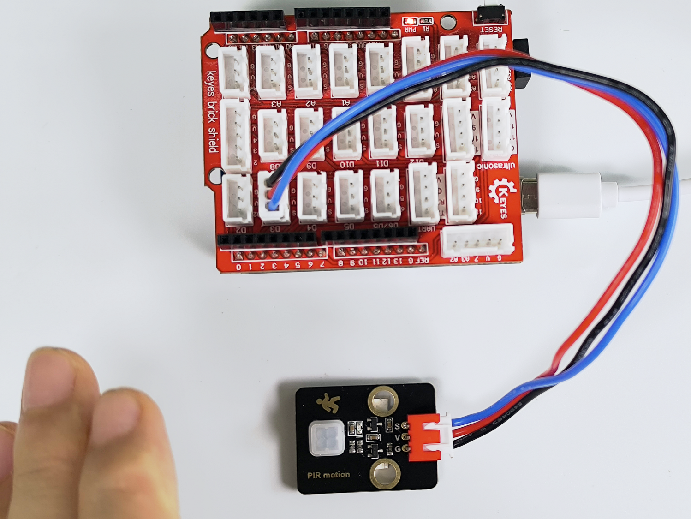


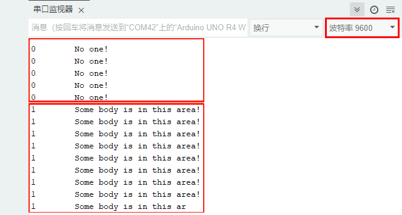

---

### 8. 代码说明

可以参照第06课的代码说明，这里就不多做介绍了。

---

## 第14课 蜂鸣器播放声音

### 1. 项目介绍

在这个套件中，有一个有源蜂鸣器模块，还有一个功放模块（原理相当于无源蜂鸣器）。在这个实验中，我们来学习尝试控制有源蜂鸣器发出声音。有源蜂鸣器元件内部自带震荡电路，使用时，我们只需要给蜂鸣器元件足够的电压，蜂鸣器就会自动响起。

---

### 2. 模块参数

工作电压：DC 3.3~5V 

工作电流：22.5mA

最大功率：0.12W

频率：2300HZ

控制信号：数字信号

工作温度：-10°C ~ +50°C

尺寸：32mm x 23.8mm x 12.3mm

接口：2.54mm间距，3pin防反接口

---

### 3. 模块原理图


从原理图我们可以得知，蜂鸣器的1脚通过串联一个电阻R2连接到电压正极；蜂鸣器的2脚连接到NPN三极管Q1的C极，集电极；Q1的B极，也就是基极通过串联一个电阻R1连接到S信号端；发射集接到GND。

当三极管Q1导通时，蜂鸣器的2脚连通GND，有源蜂鸣器便会工作。那么如何让三极管Q1导通呢？**NPN三极管的导通条件是基极（B）电压比发射极（E）电压高 0.3V 以上，**只需要基极（B）被上拉至高电平即可。虽然三极管Q1的基极（B）有一个下拉电阻R3导致其不导通，但是R3电阻的阻值大，使其为弱下拉电阻。三极管Q1的基极（B）还连接了一个阻值小的强上拉电阻R1，只要我们用单片机IO口给S信号端输入高电平，强上拉电阻R1会将三极管Q1的基极（B）强上拉为高电平，三极管Q1就会导通，有源蜂鸣器就会工作。

---

### 4. 实验组件

|  |  | |    
| ------------------------ | ------------------------ | ---------------------------- | 
| UNO R4 WiFi/Minima主板(二选一)| Keyes 传感器扩展板 x1  |Keyes 有源蜂鸣器模块 x1  |      
|       |  |     |
|3P线(反向) x1 | USB线 x1  |           |

---

### 5. 模块接线图

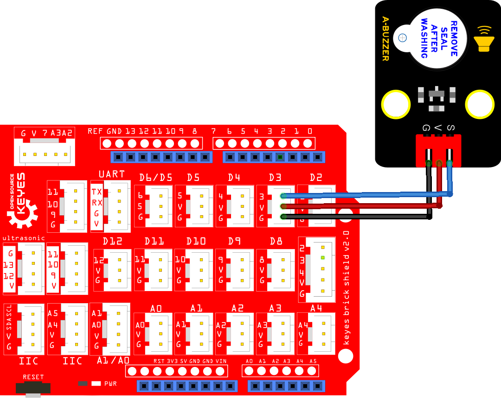

---

### 6. 实验代码

本项目中使用的代码保存在文件夹“<u>**项目代码**</u>”中，我们可以在此路径下打开代码文件''**Active_buzzer.ino**"。

**注意：为了避免上传代码不成功，请上传代码前不要连接模块。代码上传成功后，拔下USB线断电，按照接线图正确接好模块后再用USB线连接到计算机上电，观察实验结果。**

```c++
/*
 * 名称   : Active buzzer
 * 功能   : 有源蜂鸣器产生声音
 * 作者   : http://www.keyes-robot.com/ 
*/
int buzzer = 3;   //定义蜂鸣器接收器引脚为D3
void setup() {
  pinMode(buzzer, OUTPUT);    //设置输出模式
}

void loop() {
  digitalWrite(buzzer, HIGH); //发声
  delay(1000);
  digitalWrite(buzzer, LOW);  //停止发声
  delay(1000);
}
```

参照第01课或第02课的示例，根据不同的 UNO R4 主板选择不同的主板板型和串口端口。

---

### 7. 实验结果

代码上传成功后，拔下USB线断电，按照接线图正确接好模块后再用USB线连接到计算机上电，模块上有源蜂鸣器响起1秒，停1秒，循环交替。


---

### 8. 代码说明

| 代码                       | 说明              |
| -------------------------- | ----------------- |
| digitalWrite(buzzer, HIGH) | D3口输出高电平 |
| digitalWrite(buzzer, LOW)  | D3口输出低电平 |


---

## 第15课 8002b功放 喇叭模块

### 1. 项目介绍

在这个套件中，有一个Keyes 8002b功放 喇叭模块，这个模块主要由一个可调电位器、一个喇叭和一个音频放大芯片组成。上一课我们学习了有源蜂鸣器模块的使用方法，这一课我们来学习套件中的8002b功放 喇叭模块的使用方法。这个模块主要功能是：可以对输出的小音频信号进行放大，大概放大倍数为8.5倍，并且可以通过自带的小功率喇叭播放出来，也可以用来播放音乐，作为一些音乐播放设备的外接扩音设备。

---

### 2. 模块参数

工作电压: DC 3.3V~5V 

工作电流: ≤350mA

最大功率: 1.75W

放大芯片: SC8002B

工作温度：-10°C ~ +50°C

尺寸：47.6mm x 23.8mm x 10mm

接口：2.54mm间距，3pin防反接口

---

### 3. 模块原理图


其实这个喇叭就类似于于一个无源蜂鸣器，上一课我们介绍过，有源蜂鸣器自带振荡源，只要我们给它足够的电压就能响起来，而8002b功放-喇叭元件内部不带震荡电路，需要在元件正极（也就是1脚）输入不同频率的方波，负极（也就是2脚）接地，从而控制蜂鸣器响起不同频率的声音。

8002B是一款AB类单声道带关断模式，桥式音频功率放大器。在输入1KHz，5V工作电压时，最大驱动功率为：3W，(4Ω负载THD<10%)；2W，(4Ω负载，THD<1%)；音频范围内总谐波失真噪音小于 1%（20Hz~20KHz）；8002B应用电路简单，只需要极少数外围器件，就能提供高品质的输出功率。8002B输出不需要外接耦合电容或上举电容、缓冲网络、反馈电阻。

---

### 4. 实验组件

|  |     |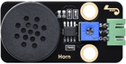    |
| ------------------------ | --------------------------- | ---------------------------- | 
|UNO R4 WiFi/Minima主板(二选一)| Keyes 传感器扩展板 x1 |Keyes 8002b功放 喇叭模块 x1 |
|        |  ||
|3P线(反向) x1 | USB线 x1             |一字螺丝刀 x1 |

---

### 5. 模块接线图

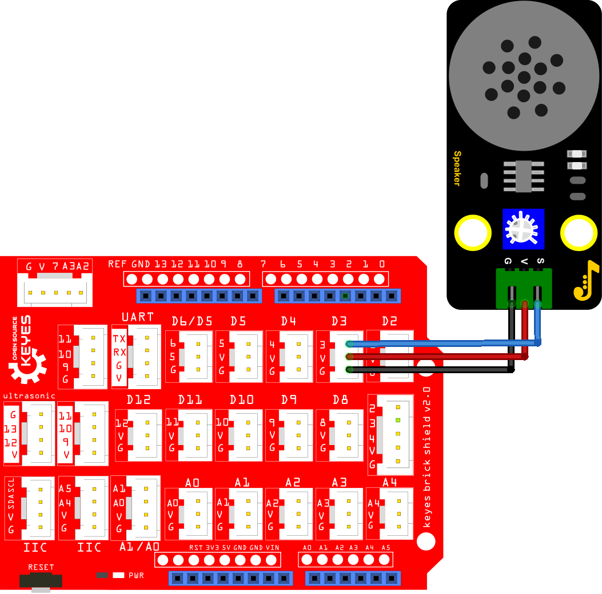

---

### 6. 实验代码

本项目中使用的代码保存在文件夹“<u>**项目代码**</u>”中，我们可以在此路径下打开代码文件''**Passive_buzzer.ino**"。

**注意：为了避免上传代码不成功，请上传代码前不要连接模块。代码上传成功后，拔下USB线断电，按照接线图正确接好模块后再用USB线连接到计算机上电，观察实验结果。**

```c++
/*
 * 名称   : Passive Buzzer
 * 功能   : 喇叭播放音乐
 * 作者   : http://www.keyes-robot.com/ 
*/
#define NOTE_B0  31
#define NOTE_C1  33
#define NOTE_CS1 35
#define NOTE_D1  37
#define NOTE_DS1 39
#define NOTE_E1  41
#define NOTE_F1  44
#define NOTE_FS1 46
#define NOTE_G1  49
#define NOTE_GS1 52
#define NOTE_A1  55
#define NOTE_AS1 58
#define NOTE_B1  62
#define NOTE_C2  65
#define NOTE_CS2 69
#define NOTE_D2  73
#define NOTE_DS2 78
#define NOTE_E2  82
#define NOTE_F2  87
#define NOTE_FS2 93
#define NOTE_G2  98
#define NOTE_GS2 104
#define NOTE_A2  110
#define NOTE_AS2 117
#define NOTE_B2  123
#define NOTE_C3  131
#define NOTE_CS3 139
#define NOTE_D3  147
#define NOTE_DS3 156
#define NOTE_E3  165
#define NOTE_F3  175
#define NOTE_FS3 185
#define NOTE_G3  196
#define NOTE_GS3 208
#define NOTE_A3  220
#define NOTE_AS3 233
#define NOTE_B3  247
#define NOTE_C4  262
#define NOTE_CS4 277
#define NOTE_D4  294
#define NOTE_DS4 311
#define NOTE_E4  330
#define NOTE_F4  349
#define NOTE_FS4 370
#define NOTE_G4  392
#define NOTE_GS4 415
#define NOTE_A4  440
#define NOTE_AS4 466
#define NOTE_B4  494
#define NOTE_C5  523
#define NOTE_CS5 554
#define NOTE_D5  587
#define NOTE_DS5 622
#define NOTE_E5  659
#define NOTE_F5  698
#define NOTE_FS5 740
#define NOTE_G5  784
#define NOTE_GS5 831
#define NOTE_A5  880
#define NOTE_AS5 932
#define NOTE_B5  988
#define NOTE_C6  1047
#define NOTE_CS6 1109
#define NOTE_D6  1175
#define NOTE_DS6 1245
#define NOTE_E6  1319
#define NOTE_F6  1397
#define NOTE_FS6 1480
#define NOTE_G6  1568
#define NOTE_GS6 1661
#define NOTE_A6  1760
#define NOTE_AS6 1865
#define NOTE_B6  1976
#define NOTE_C7  2093
#define NOTE_CS7 2217
#define NOTE_D7  2349
#define NOTE_DS7 2489
#define NOTE_E7  2637
#define NOTE_F7  2794
#define NOTE_FS7 2960
#define NOTE_G7  3136
#define NOTE_GS7 3322
#define NOTE_A7  3520
#define NOTE_AS7 3729
#define NOTE_B7  3951
#define NOTE_C8  4186
#define NOTE_CS8 4435
#define NOTE_D8  4699
#define NOTE_DS8 4978
#define REST 0
int tempo=114;   // 改变这个可使歌曲变慢或变快
int buzzer = 3;  // 将此更改为你想使用的任何一个引脚
// 乐曲的音符后面跟着持续时间.
// A 4表示四分音符，8表示十八分音符，16表示十六分音符，以此类推
// !!负数用来表示带点的注释
// 所以-4意味着一个带点的四分音符，也就是说，四分之一加上十八分之一
int melody[] = {
  NOTE_E4,4,  NOTE_E4,4,  NOTE_F4,4,  NOTE_G4,4,//1
  NOTE_G4,4,  NOTE_F4,4,  NOTE_E4,4,  NOTE_D4,4,
  NOTE_C4,4,  NOTE_C4,4,  NOTE_D4,4,  NOTE_E4,4,
  NOTE_E4,-4, NOTE_D4,8,  NOTE_D4,2,
  NOTE_E4,4,  NOTE_E4,4,  NOTE_F4,4,  NOTE_G4,4,//4
  NOTE_G4,4,  NOTE_F4,4,  NOTE_E4,4,  NOTE_D4,4,
  NOTE_C4,4,  NOTE_C4,4,  NOTE_D4,4,  NOTE_E4,4,
  NOTE_D4,-4,  NOTE_C4,8,  NOTE_C4,2,
  NOTE_D4,4,  NOTE_D4,4,  NOTE_E4,4,  NOTE_C4,4,//8
  NOTE_D4,4,  NOTE_E4,8,  NOTE_F4,8,  NOTE_E4,4, NOTE_C4,4,
  NOTE_D4,4,  NOTE_E4,8,  NOTE_F4,8,  NOTE_E4,4, NOTE_D4,4,
  NOTE_C4,4,  NOTE_D4,4,  NOTE_G3,2,
  NOTE_E4,4,  NOTE_E4,4,  NOTE_F4,4,  NOTE_G4,4,//12
  NOTE_G4,4,  NOTE_F4,4,  NOTE_E4,4,  NOTE_D4,4,
  NOTE_C4,4,  NOTE_C4,4,  NOTE_D4,4,  NOTE_E4,4,
  NOTE_D4,-4,  NOTE_C4,8,  NOTE_C4,2
};
// 给出字节数的类型，每个int值由两个字节(16位)组成
// 每个音符有两个值(音高和持续时间)，所以每个音符有四个字节
int notes=sizeof(melody)/sizeof(melody[0])/2; 
// 这计算了整个音符的持续时间，单位是ms (60s/节拍)*4拍
int wholenote = (60000 * 4) / tempo;
int divider = 0, noteDuration = 0;
void setup() {
  // 重复旋律的音符
  // 记住，数组是音符数的两倍(音符+持续时间)
  for (int thisNote = 0; thisNote < notes * 2; thisNote = thisNote + 2) {
    // 计算每个音的持续时间
    divider = melody[thisNote + 1];
    if (divider > 0) {
    noteDuration = (wholenote) / divider; // 常规提示，继续
    } else if (divider < 0) {
      // 虚线注释的持续时间为负
      noteDuration = (wholenote) / abs(divider);
      noteDuration *= 5.; // 给打点音符增加一半的持续时间
    }
    // 只在90%的时间里演奏这个音符，留下10%作为暂停
    tone(buzzer, melody[thisNote], noteDuration*0.9);
  // 等待特定的时间后再演奏下一个音符.
    delay(noteDuration);
    noTone(buzzer);  // 下一个音节前停止波形产生前的下一个说明.
  }
}
void loop() {
//如果你想永远重复这首歌，在这里复制粘贴setup()中的代码.
}
```

参照第01课或第02课的示例，根据不同的 UNO R4 主板选择不同的主板板型和串口端口。

---

### 7. 实验结果

代码上传成功后，拔下USB线断电，按照接线图正确接好模块后再用USB线连接到计算机上电，功放喇叭模块播放一首音乐。如果觉得喇叭声音太大或太小，可以使用一字螺丝刀调节模块上的电位器以调整音量大小。


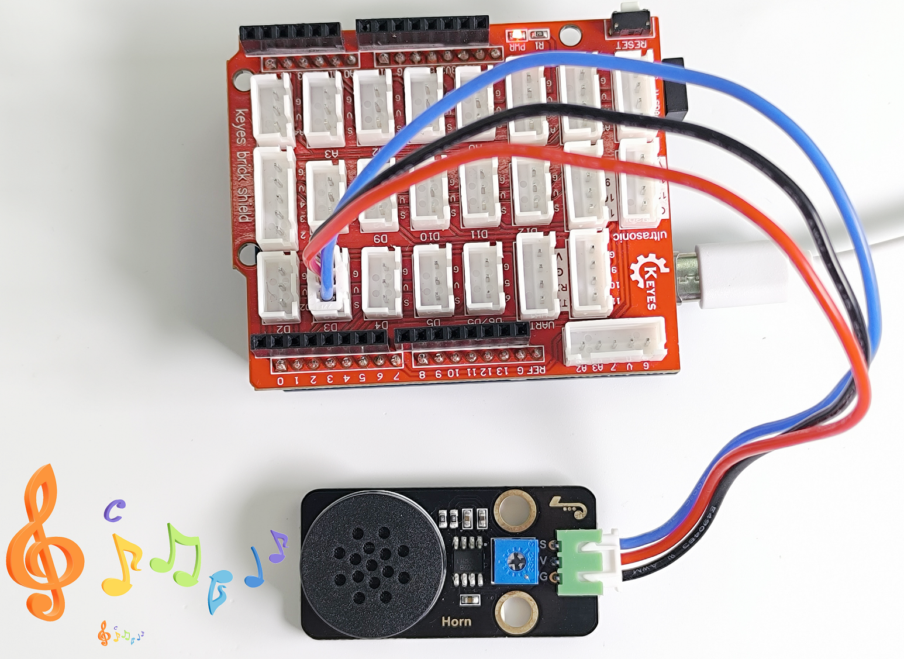

---

### 8. 代码说明

| 代码                                                      | 说明                                                         |
| --------------------------------------------------------- | ------------------------------------------------------------ |
| int tempo=114;                            | 改变这个可使歌曲变慢或变快。                                   |
| int melody[]                                              | 创建音乐旋律列表。                                           |
| int noteDurations[]                                       | 创建音调持续时间列表。                                       |
|int wholenote = (60000 * 4) / tempo; | 计算了整个音符的持续时间，单位是ms (60s/节拍)*4拍。        |
| sizeof(melody)                                     | sizeof是一个操作符（operator）。其作用是返回一个对象或类型所占的内存字节数。 |

---

## 第16课 130电机模块

### 1. 项目介绍

在这个套件中，有一个Keyes 130电机驱动模块。HR1124S是应用于直流电机方案的单通道H桥驱动器芯片。HR1124S的H桥驱动部分采用低导通电阻的PMOS和NMOS功率管。低导通电阻保证芯片低的功率损耗，使得芯片安全工作更长时间。此外HR1124S拥有低待机电流，低静态工作电流，这些性能使HR1124S易用于玩具方案。

实验中，我们可通过输出到两个信号端IN+和IN-的电压方向来控制电机的转动方向，让电机转动起来。

---

### 2. 模块参数

工作电压: DC 3.3V~5V 

最大输入电流：1A

电机驱动电压：5V

电机最大驱动电流：1A（输入DC 5V，2路电机输出）

电机最大驱动电流：0.4A（输入DC 3.3V，2路电机输出）

控制信号: 数字信号

工作温度：-10°C ~ +50°C

尺寸：32mm x 23.8mm x 24.5mm

接口：2.54mm间距，4pin防反接口

---

### 3. 模块原理图

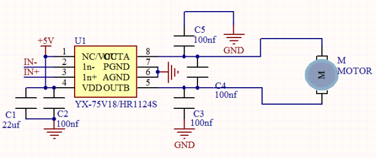

HR1124S芯片的作用是助于驱动电机。而电机所需电流较大，无法用三极管驱动更无法直接用IO口驱动。让电机转动起来的方法很简单，给电机两端添加电压即可。不同电压方向电机转向也不相同，额度电压内，电压越大，电机转动得越快；反之电压越低，电机转动得越慢，甚至无法转动。所以我们可以用PWM口来控制电机的转速，这一课我们先学习用高低电平来控制电机。


---

### 4. 实验组件

|  |  |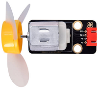 |
| ------------------------ | ------------------------ | ---------------------------- |
|UNO R4 WiFi/Minima主板(二选一)|Keyes 传感器扩展板 x1     | Keyes 130电机模块 x1     |
|        |    |     |
| 4P线(反向) x1 | USB线 x1   | 电源适配器  x1         |

<span style="color: rgb(255, 76, 65);">**注意：电机与风扇叶是分开装的，需要组合到一起。**</span>

### 5. 模块接线图

<span style="color: rgb(0, 209, 0);">**注意：请勿用手握住风扇叶，请将风扇叶对着空旷的地方，以免受伤。**</span>

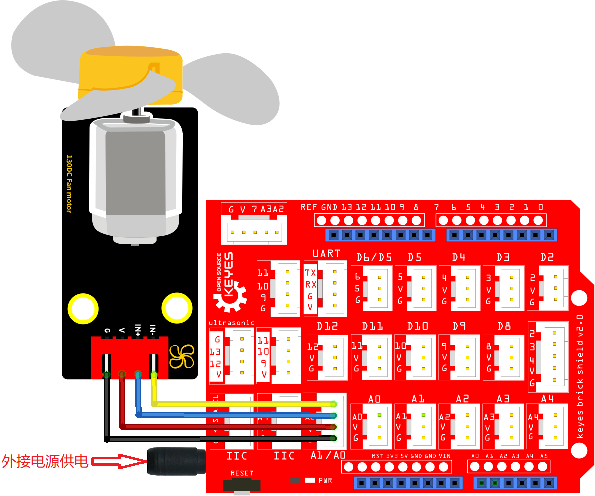

---

### 6. 实验代码

本项目中使用的代码保存在文件夹“<u>**项目代码**</u>”中，我们可以在此路径下打开代码文件''**Motor.ino**"。

**注意：为了避免上传代码不成功，请上传代码前不要连接模块。代码上传成功后，拔下USB线断电，按照接线图正确接好模块后外接电源供电，上电后，观察实验结果。**

```c++
/*
 * 名称   : 130DC Fan motor
 * 功能   : 电机顺、逆旋转
 * 作者   : http://www.keyes-robot.com/ 
*/
//定义电机的两个引脚接口，分别为A0和A1
int INA = A0;   //INA对应IN+
int INB = A1;  //INB对应IN-
void setup() {
  //将电机引脚设置为输出
  pinMode(INA, OUTPUT);
  pinMode(INB, OUTPUT);
}

void loop() {
  //逆时针方向转
  digitalWrite(INA, HIGH);
  digitalWrite(INB, LOW);
  delay(2000);
  //停止
  digitalWrite(INA, LOW);
  digitalWrite(INB, LOW);
  delay(1000);
  //顺时针方向转
  digitalWrite(INA, LOW);
  digitalWrite(INB, HIGH);
  delay(2000);
  //停止
  digitalWrite(INA, LOW);
  digitalWrite(INB, LOW);
  delay(1000);
}
```

参照第01课或第02课的示例，根据不同的 UNO R4 主板选择不同的主板板型和串口端口。

---

### 7. 实验结果

**注意：请勿用手握住风扇叶，请将风扇叶对着空旷的地方，以免受伤。**

代码上传成功后，拔下USB线断电，按照接线图正确接好模块，将电源电源适配器连接到家庭电路给UNO R4主板供电（<span style="color: rgb(255, 76, 65);">注意：</span> 防止风扇有时侯工作不正常，另外还需要用USB线连接到计算机给UNO R4主板上电，这样保证风扇能正常工作；否则，风扇可能会工作不正常）。上电后风扇逆时针转动2秒；停止1秒；顺时针转动2秒；停止1秒；循环交替。

 

---

### 8. 代码说明

将管脚设置为A0、A1，当A0输出为低电平即INA(IN+)输入低电平，A1输出为高电平即INB(IN-)输入高电平时（输入与输出是相对的，这个实验中对于我们单片机的引脚来说，单片机输出高低电平，模块就为输入了，即从单片机输出到模块；例如按键模块则相反，是模块输出到单片机），电机顺时针旋转；当A0输出为高电平，A1输出为低电平时，电机逆时针旋转；当两个管脚都设置为低电平时，电机停止转动。

---

## 第17课 读取电位器的值

### 1. 项目介绍

在这个套件中，有一个Keyes 滑动电位器，它一个模拟传感器。前面我们学习过的传感器，都是数字传感器。例如我们前面学习的人体红外热释传感器，当传感器检测到附近有人在运动时，我们读取到高电平（5V），当未检测到附近有人在运动时，我们读取到低电平（0V），而在0~5V中间的电压值，我们数字IO口无法读取到，当然人体红外热释传感器也只能输出高低电平。而模拟传感器就可以通过我们UNO R4主板上的6个模拟口读取中间的电压值。

---

### 2. 模块参数

工作电压: DC 3.3V~5V 

工作电流: 0.55mA

工作功率: 0.00275W

输出信号: 模拟信号

工作温度：-10°C ~ +50°C

尺寸：32mm x 23.8mm x 28.4mm

接口：2.54mm间距，3pin防反接口

---

### 3. 模块原理图

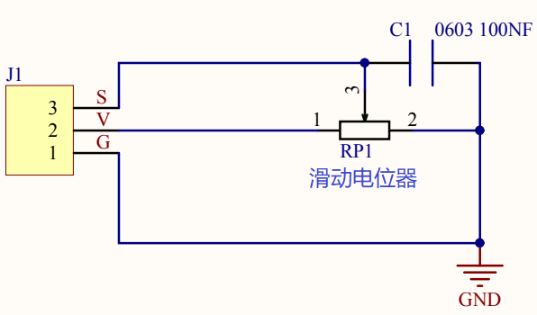

滑动电位器原理是靠电刷在电阻体上滑动，在电路中获取与输入电压形成一定关系地输出电压。Keyes 滑动电位器传感器选用了一个10K可调电阻。通过移动电位器上的滑杆，我们可以改变其电阻大小，信号端S检测到电压变化（0 ~ 5V），而这个电压变化是一个连续变化的模拟量，也就是在0~5V内可以取任意值，我们必须先对这个模拟量进行ADC采集，来测量连续的这些模拟量。A/D 是模拟量到数字量的转换，依靠的是模数转换器(Analog to Digital Converter)，简称ADC。我们的主板已经集成了ADC采集，可以直接使用。

我们的主板默认分辨率为10位，即ADC位数是10位。一个n位的ADC表示这个ADC共有2的n次方个刻度，10位的ADC，输出的是从0～1023一共1024个数字量，也就是2的10次方个数据刻度，每个刻度就是5V/1024≈0.0049V，这也叫分辨率。

ADC：ADC是一种电子集成电路，用于将模拟信号(如电压)转换为由1和0表示的数字信号。我们在主板上的ADC的范围是默认的10位（ADC的位数表示将模拟量转换成数字量后所用的二进制位数），其可存储数字量范围为：0 ~ 2^10即0 ~ 1023。假设它的参考电压是5V，也就是说把参考电压分成1024份，最小分辨率为5V/1024，模拟值的范围对应于ADC值。因此，ADC拥有的比特越多，模拟的分区就越密集，最终转换的精度也就越高。

我们的UNO R4 主板默认分辨率为10位，即ADC位数是10位。一个n位的ADC表示这个ADC共有2的n次方个刻度，10位的ADC，输出的是从0～1023一共1024个数字量，也就是2的10次方个数据刻度，每个刻度就是5V/1024≈0.0049V，这也叫分辨率。

ADC：ADC是一种电子集成电路，用于将模拟信号(如电压)转换为由1和0表示的数字信号。我们在UNO R4 主板上的ADC的范围是默认的10位（ADC的位数表示将模拟量转换成数字量后所用的二进制位数），其可存储数字量范围为：0 ~ 2^10即0 ~ 1023。假设它的参考电压是5V，也就是说把参考电压分成1024份，最小分辨率为5V/1024，模拟值的范围对应于ADC值。因此，ADC拥有的比特越多，模拟的分区就越密集，最终转换的精度也就越高。

---

### 4. 实验组件

|  |   | 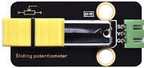  |    
| ------------------------ | ------------------------- | ---------------------------- | 
| UNO R4 WiFi/Minima主板(二选一)|  Keyes 传感器扩展板 x1 |Keyes 滑动电位器模块 x1 |    
|       |  |    |
|3P线(反向) x1 | USB线 x1  |           |

---

### 5. 模块接线图

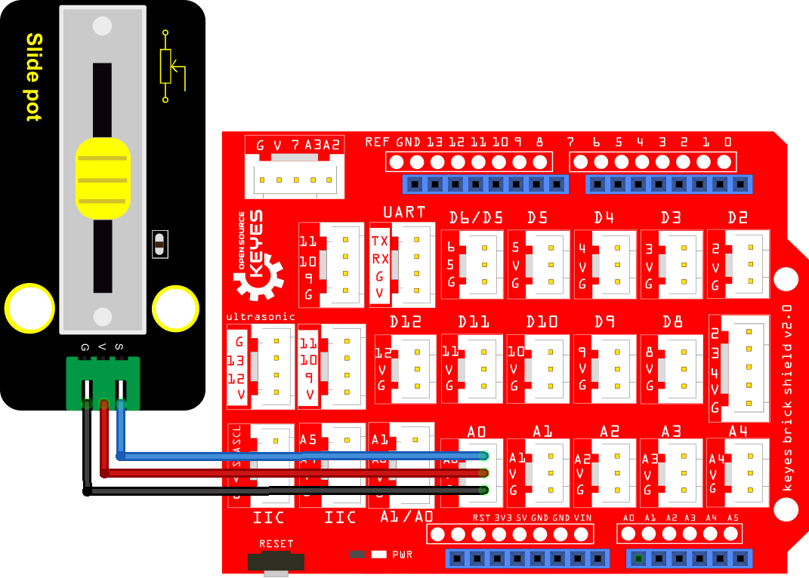

---

### 6. 实验代码

本项目中使用的代码保存在文件夹“<u>**项目代码**</u>”中，我们可以在此路径下打开代码文件''**Slide_potentiometer.ino**"。

**注意：为了避免上传代码不成功，请上传代码前不要连接模块。代码上传成功后，拔下USB线断电，按照接线图正确接好模块后再用USB线连接到计算机上电，观察实验结果。**

```c++
/*  
 * 名称   : Slide_potentiometer
 * 功能   : 读取滑动电位器的模拟值
 * 作者   : http://www.keyes-robot.com/ 
*/
int val = 0;   //设置value为0
int PIN_ANALOG_IN = A0;   //滑动电位器传感器的引脚定义为A0

void setup() {
  Serial.begin(9600);   //波特率设置为9600
  pinMode(PIN_ANALOG_IN, INPUT);    //将传感器的引脚设置为输入模式
}

void loop() {
  val = analogRead(PIN_ANALOG_IN);    //读取传感器的模拟信号
  Serial.print("slide potentiometer:  ");    //打印字符串slide potentiometer:
  Serial.println(val);    //打印且显示模拟信号
  delay(200);
}
```

参照第01课或第02课的示例，根据不同的 UNO R4 主板选择不同的主板板型和串口端口。

---

### 7. 实验结果

代码上传成功后，拔下USB线断电，按照接线图正确接好模块后再用USB线连接到计算机上电，打开串口监视器，设置波特率为 **<u>9600</u>**。

滑动电位器手柄时，串口监视器打印出此时电位器的模拟值。

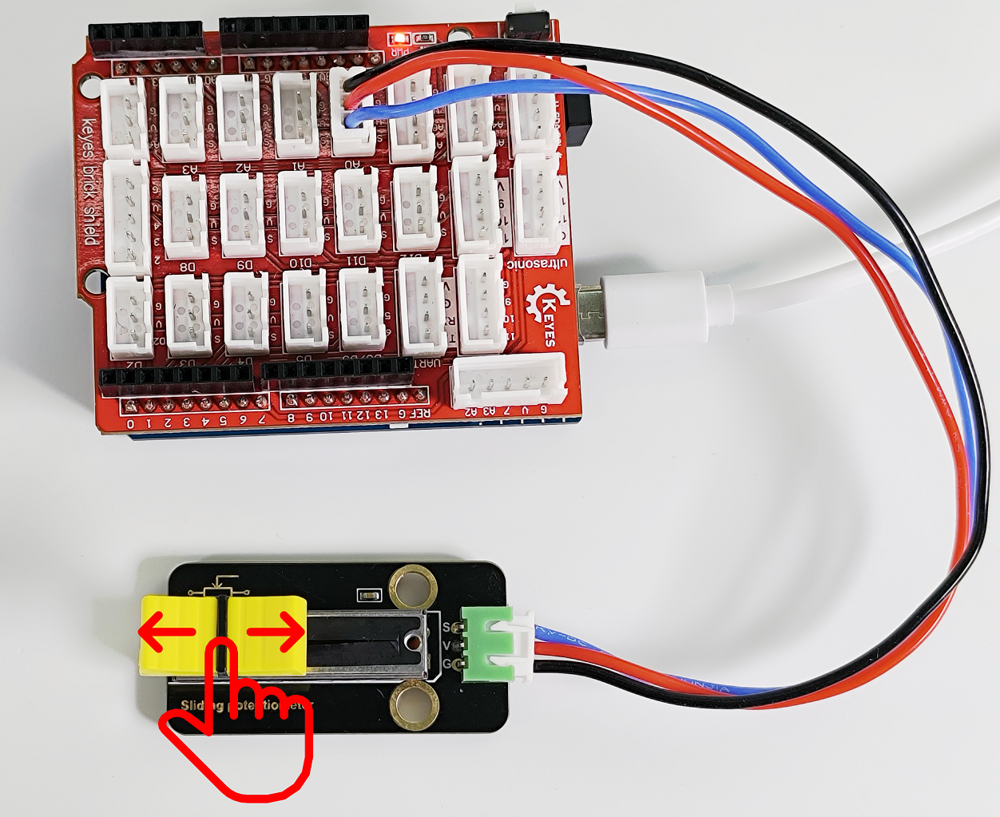

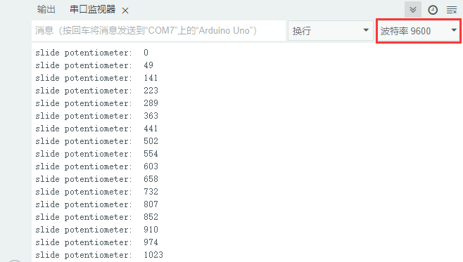

---

### 8. 代码说明

| 代码                                      | 说明                                                         |
| ----------------------------------------- | ------------------------------------------------------------ |
| pinMode(PIN_ANALOG_IN, INPUT); | 由“ int PIN_ANALOG_IN = A0; ”知道，定义滑动电位器的模拟管脚为A0，“INPUT”设置为输入模式。 |
| analogRead(PIN_ANALOG_IN)                 | 从指定的模拟引脚读取模拟值。为了兼容性，默认analogRead()分辨率为 10 位。详细了解请参考链接：https://vimsky.com/examples/usage/arduino-language-functions-analog-io-analogread-ar.html 。这个函数是从指定的模拟引脚PIN_ANALOG_IN读取滑动电位器的模拟信号，模拟信号的范围：0~1023。 |
| val = analogRead(PIN_ANALOG_IN); | 将滑动电位器的模拟信号赋值于变量val。|

---

## 第18课 水滴传感器

### 1. 项目介绍

在这个套件中，有一个Keyes 水滴传感器，它是一个模拟（数字）输入模块，也叫雨水、雨量传感器。可用于各种天气状况的监测，检测是否下雨及雨量的大小，转成模拟信号（A0）输出，并广泛应用于汽车自动刮水系统和智能天窗系统等。

---

### 2. 模块参数

工作电压: DC 3.3V~5V 

工作电流: 1.5mA

最大功率: 0.075W

输出信号: 模拟信号

工作温度：-10°C ~ +50°C

尺寸：32mm x 23.8mm x 9.3mm

接口：2.54mm间距，3pin防反接口

---

### 3. 模块原理图


Keyes 水滴传感器通过电路板上裸露的印刷平行线检测水量的大小。水量越多，就会有更多的导线被联通，随着导电的接触面积增大，雨滴感应区 2 脚输出的电压就会逐步上升。信号端 S 检测到的模拟值就越大。除了可以检测水量的大小，它还可以检测空气中的水蒸气。


---

### 4. 实验组件

|  |  | |    
| ------------------------ | ------------------------ | ---------------------------- | 
|UNO R4 WiFi/Minima主板(二选一)| Keyes 传感器扩展板 x1      |Keyes 水滴传感器 x1 |     
|       |  |   |
| 3P线(反向) x1 | USB线 x1   |          |

---

### 5. 模块接线图


---

### 6. 实验代码

本项目中使用的代码保存在文件夹“<u>**项目代码**</u>”中，我们可以在此路径下打开代码文件''**Steam_sensor.ino**"。

**注意：为了避免上传代码不成功，请上传代码前不要连接模块。代码上传成功后，拔下USB线断电，按照接线图正确接好模块后再用USB线连接到计算机上电，观察实验结果。**

```c++
/*  
 * 名称   : Steam sensor
 * 功能   : 读取水滴传感器的模拟值
 * 作者   : http://www.keyes-robot.com/ 
*/
int val = 0;   //设置value为0
int PIN_ANALOG_IN = A0;   //水滴传感器的引脚定义为A0

void setup() {
  Serial.begin(9600);   //波特率设置为9600
  pinMode(PIN_ANALOG_IN, INPUT);    //将传感器的引脚设置为输入模式
}

void loop() {
  val = analogRead(PIN_ANALOG_IN);    //读取传感器的模拟信号
  Serial.print("water volume:  ");    //打印字符串water volume:
  Serial.println(val);    //打印且显示水量的模拟信号
  delay(200);
}
```

参照第01课或第02课的示例，根据不同的 UNO R4 主板选择不同的主板板型和串口端口。

---

### 7. 实验结果

代码上传成功后，拔下USB线断电，按照接线图正确接好模块后再用USB线连接到计算机上电，打开串口监视器，设置波特率为 **<u>9600</u>**。

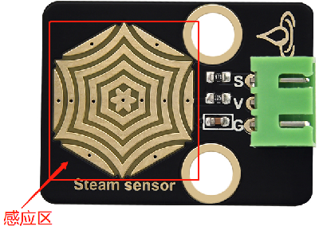

在水滴传感器的感应区滴几滴水（**小心用水，注意不要滴到感应区以外的其他任何地方，包括主板**），串口监视器打印出此时水滴传感器的模拟值。水量变化，模拟值也会发生变化。水量越多，输出的模拟越大。

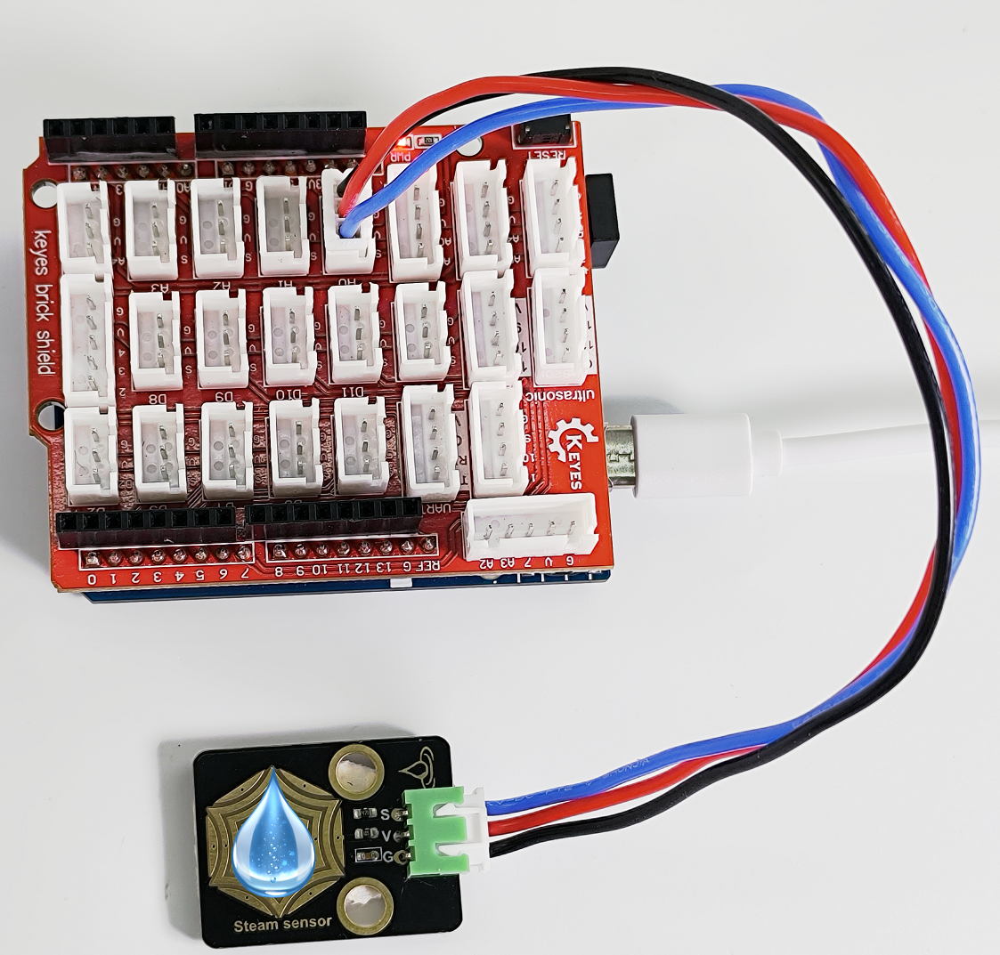


---

### 8. 代码说明

可以参照第17课的代码说明，这里就不多做介绍了。

---

## 第19课 声音传感器检测声量

### 1. 项目介绍

在这个套件中，有一个Keyes 声音传感器。实验中，我们利用这个传感器测试当前环境中的声音对应的模拟值。声音越大，模拟值越大；并在串口监视器上显示测试结果。

---

### 2. 模块参数

工作电压: DC 3.3V~5V 

工作电流: 15mA

最大功率: 0.075W

输出信号: 模拟信号

工作温度：-10°C ~ +50°C

尺寸：32mm x 23.8mm x 10.3mm

接口：2.54mm间距，3pin防反接口

---

### 3. 模块原理图


Keyes 声音传感器主要由一个高感度麦克风元件和LM386音频功率放大器芯片组成。高感度麦克风元件用于检测外界的声音。利用LM386音频功率放大器芯片设计对高感度麦克风检测到的声音进行放大的电路，最大倍数为200倍。使用时我们可以通过旋转传感器上电位器，调节声音的放大倍数。顺时针调节电位器到尽头，放大倍数最大。

---

### 4. 实验组件

|  |  | | 
| ------------------------ | ------------------------ | ---------------------------- |
|UNO R4 WiFi/Minima主板(二选一)|  Keyes 传感器扩展板 x1      |Keyes 声音传感器 x1     |
|       |  |   | 
| 3P线(反向) x1 | USB线 x1             |一字螺丝刀 x1             |

---

### 5. 模块接线图

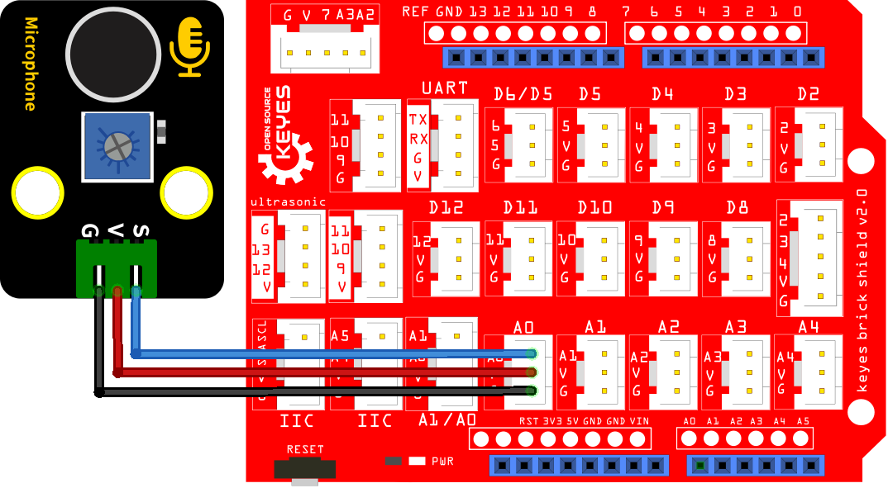

---

### 6. 实验代码

本项目中使用的代码保存在文件夹“<u>**项目代码**</u>”中，我们可以在此路径下打开代码文件''**MicroPhone.ino**"。

**注意：为了避免上传代码不成功，请上传代码前不要连接模块。代码上传成功后，拔下USB线断电，按照接线图正确接好模块后再用USB线连接到计算机上电，观察实验结果。**

```c++
/*  
 * 名称   : MicroPhone
 * 功能   : 读取声音传感器的模拟值
 * 作者   : http://www.keyes-robot.com/ 
*/
int val = 0;   //设置value为0
int PIN_ANALOG_IN = A0;   //声音传感器的引脚定义为A0

void setup() {
  Serial.begin(9600);   //波特率设置为9600
  pinMode(PIN_ANALOG_IN, INPUT);    //将传感器的引脚设置为输入模式
}

void loop() {
  val = analogRead(PIN_ANALOG_IN);    //读取传感器的模拟信号
  Serial.print("sound volume:  ");    //打印字符串sound volume:
  Serial.println(val);    //打印且显示声音强度的模拟信号
  delay(200);
}
```

参照第01课或第02课的示例，根据不同的 UNO R4 主板选择不同的主板板型和串口端口。

---

### 7. 实验结果

代码上传成功后，拔下USB线断电，按照接线图正确接好模块后再用USB线连接到计算机上电，打开串口监视器，设置波特率为 **<u>9600</u>**。

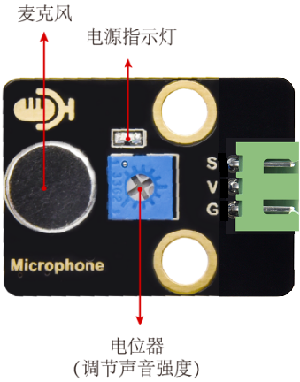

串口监视器打印出声音传感器接收到的声音对应的模拟值。对准MIC头大声说话，可以看到接收到的声音对应的模拟值变大。（**注意：如果声音变化对应的模拟值没有变化并且一直都是数字0，需要用一字螺丝刀顺时针旋转电位器来调节。**）

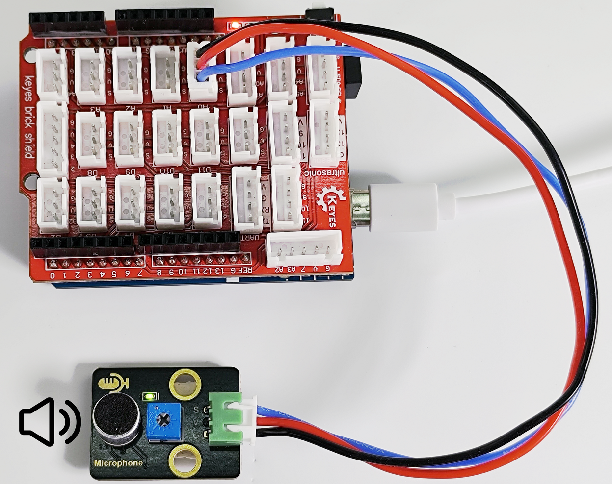

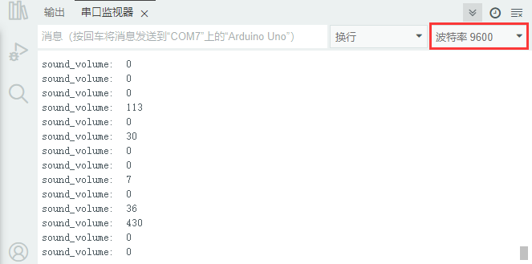

---

### 8. 代码说明

可以参照第17课的代码说明，这里就不多做介绍了。 

---

## 第20课 光敏电阻传感器

### 1. 项目介绍

在这个套件中，有一个Keyes 光敏电阻传感器，这是一个常用的光敏电阻传感器，它主要由一个光敏电阻元件组成。光敏电阻元件的阻值随着光照强度的变化而变化，此传感器就是利用光敏电阻元件这一特性，设计电路将阻值变化转换为电压变化。光敏电阻传感器可以模拟人对环境光线的强度的判断，方便做出与人友好互动的应用。

---

### 2. 模块参数

工作电压: DC 3.3V~5V 

工作电流: 0.2mA

最大功率: 0.001W

输出信号: 模拟信号

工作温度：-10°C ~ +50°C

尺寸：32 x 23.8 x 7.4 mm

接口：2.54 mm间距，3pin防反接口

---

### 3. 模块原理图

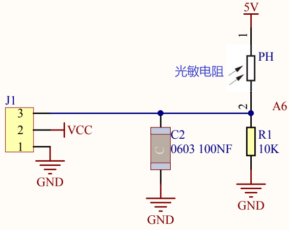

当没有光照射时，电阻大小为0.2 MΩ，光敏电阻的信号端（2脚）检测的电压接近0。随着光照强度增大，光线传感器的电阻值越来越小，所以信号端能检测到的电压越来越大。

---

### 4. 实验组件

|  |   | |    
| ------------------------ | ------------------------ | ---------------------------- |
| UNO R4 WiFi/Minima主板(二选一)| Keyes 传感器扩展板 x1  |Keyes 光敏电阻传感器 x1  |     
|       |  |    |
|3P线(反向) x1 | USB线 x1  |           |

---

### 5. 模块接线图


---

### 6. 实验代码

本项目中使用的代码保存在文件夹“<u>**项目代码**</u>”中，我们可以在此路径下打开代码文件''**Photoresistor.ino**"。

**注意：为了避免上传代码不成功，请上传代码前不要连接模块。代码上传成功后，拔下USB线断电，按照接线图正确接好模块后再用USB线连接到计算机上电，观察实验结果。**

```c++
/*  
 * 名称   : Photoresistor
 * 功能   : 读取光敏传感器的模拟值
 * 作者   : http://www.keyes-robot.com/ 
*/
int val = 0;   //设置value为0
int PIN_ANALOG_IN = A0;   //光敏传感器的引脚定义为A0

void setup() {
  Serial.begin(9600);   //波特率设置为9600
  pinMode(PIN_ANALOG_IN, INPUT);    //将传感器的引脚设置为输入模式
}

void loop() {
  val = analogRead(PIN_ANALOG_IN);    //读取传感器的模拟信号
  Serial.print("light_intensity:  ");    //打印字符串light_intensity:
  Serial.println(val);    //打印且显示光线强度的模拟信号
  delay(200);
}
```

参照第01课或第02课的示例，根据不同的 UNO R4 主板选择不同的主板板型和串口端口。

---

### 7. 实验结果

代码上传成功后，拔下USB线断电，按照接线图正确接好模块后再用USB线连接到计算机上电，打开串口监视器，设置波特率为 **<u>9600</u>**。

串口监视器打印出光敏传感器的模拟值。光照越强，可以看到模拟值越大。

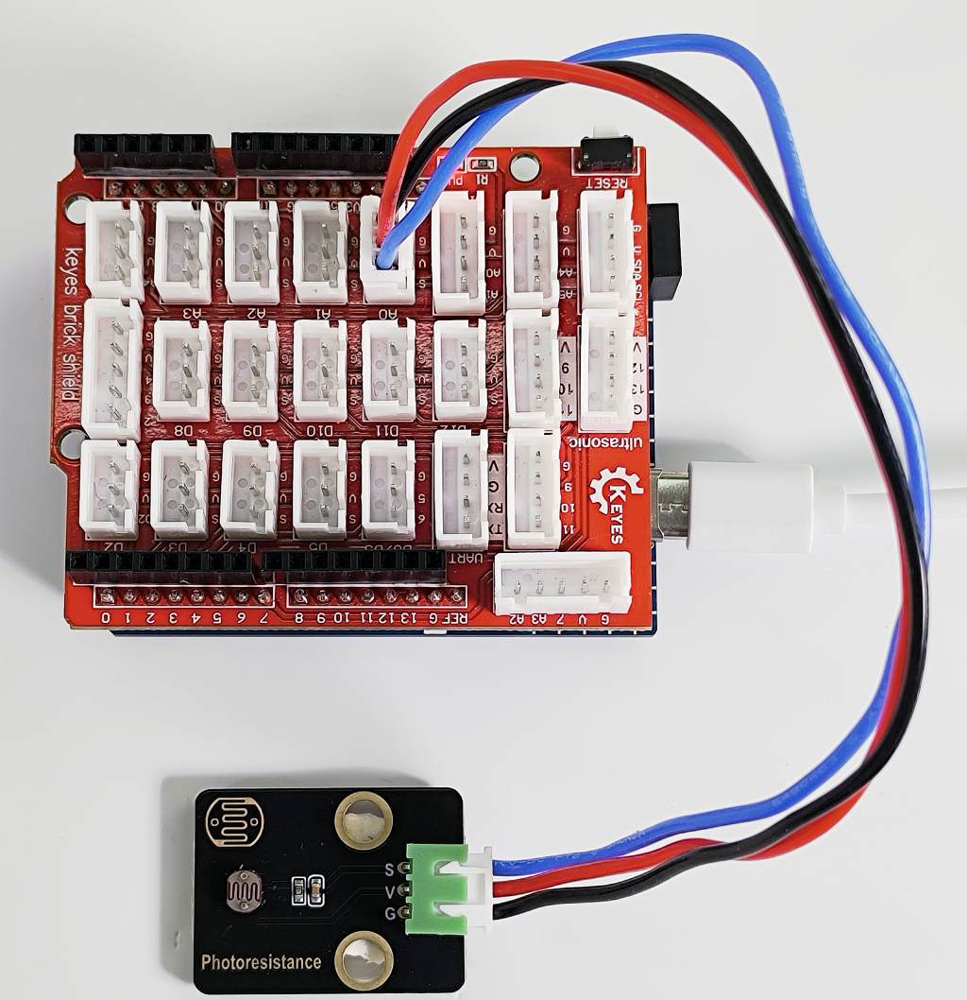


---

### 8. 代码说明

可以参照第17课的代码说明，这里就不多做介绍了。

---

## 第21课 模拟温度传感器

### 1. 项目介绍

在这个套件中，有一个Keyes NTC-MF52AT模拟温度传感器，它的原理与光敏电阻传感器类似，只是感应的器件不同。将传感器信号端接到UNO R4主板的模拟口，可以读出对应的模拟值，电压值和温度值。我们可以利用模拟值，输出电压值，通过特定公式，计算出当前环境的温度。

---

### 2. 模块参数

工作电压: DC 3.3V~5V 

工作电流: 20mA

最大功率: 0.1W

输出信号: 模拟信号

工作温度：-10°C ~ +50°C

尺寸：32mm x 23.8mm x 7.4mm

接口：2.54mm间距，3pin防反接口

---

### 3. 模块原理图


Keyes NTC-MF52AT模拟温度传感器主要由NTC-MF52AT热敏电阻元件组成。NTC-MF52AT热敏电阻元件能够感知周边环境温度的变化，随着温度的升高，热敏电阻的阻值降低，4.7K电阻两端的电压上升，从而引起信号端S的电压变化。

**NTC 热敏电阻温度计算公式：Rt = R * EXP( B * (1/T1-1/T2) ) 。**

其中，T1和T2指的是K度，即开尔文温度。K度=273.15(绝对温度)+摄氏度。

Rt 是热敏电阻在周围温度为T1（当前温度）时的电阻值。

R是热敏电阻在周围温度为T2常温（常温取25℃）时的标称阻值。参考规格书可知我们用的NTC-MF52AT模拟温度传感器在 25℃ 下热敏电阻的零功率电阻值为10KΩ ± 5%（即R=10K），T2=(273.15+25) 。

B值是热敏电阻的重要参数，为材料常数，在25℃下测得。参考规格书可知B值为 3950±1%。

EXP() 是e^()，e的n次方。

通过转换可以得到温度T1与电阻Rt的关系：T1=1 / (ln(Rt/R) /B+1/T2) ，这里可以将ln换算成log，即T1=1/ ( log(Rt/R)/B + 1/T2 ) 。

那么我们唯一需要知道的就是Rt的值。回到上面的原理图，设热敏电阻两端电压为VRt，固定的 R1电阻两端的电压为VR，由电阻分压知识VR/VRt = R1/Rt可以知道：Rt = R1 *(5.0-VR)/VR 。而我们实际得到的VR是转换后的模拟值，需要转换成电压值，即VR = AnalogValue / 1023 * 5.0。

**注意**：计算出来的温度是开尔文温度，因此需要减去K值，对应的摄氏温度 t = T1 - 273.15，同时加上0.5的误差矫正。

---

### 4. 实验组件

|  |     |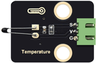|    
| ------------------------ | --------------------------- | ---------------------------- |
| UNO R4 WiFi/Minima主板(二选一)| Keyes 传感器扩展板 x1 |Keyes NTC-MF52AT模拟温度传感器 x1 |   
|        |  |     |
| 3P线(反向) x1 | USB线 x1   |          |

---

### 5. 模块接线图

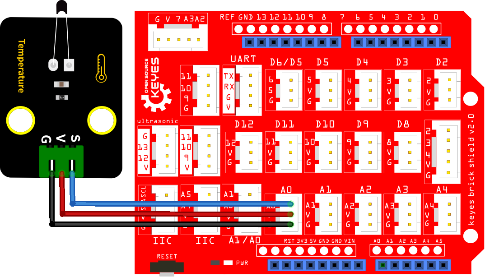

---

### 6. 实验代码

本项目中使用的代码保存在文件夹“<u>**项目代码**</u>”中，我们可以在此路径下打开代码文件''**Temperature_sensor.ino**"。

**注意：为了避免上传代码不成功，请上传代码前不要连接模块。代码上传成功后，拔下USB线断电，按照接线图正确接好模块后再用USB线连接到计算机上电，观察实验结果。**

```c++
/*  
 * 名称   : Temperature sensor
 * 功能   : 用热敏电阻传感器制作温度计
 * 作者   : http://www.keyes-robot.com/ 
*/
#define PIN_ANALOG_IN   A0

float Rt=0;      //NTC 热敏电阻
float R=10000;   //具有固定电阻值的10K电阻
float T2=273.15+25; //转换成开尔文温度
float B=3950;    //B值是热敏电阻的一个重要参数
float K=273.15;  //开氏度 (K°)
float VR=0;

void setup() {
  Serial.begin(9600);
}

void loop() {
  int AnalogValue = analogRead(PIN_ANALOG_IN);    //读A0引脚的模拟值
  VR = (float)(AnalogValue / 1023.0 * 5.0);  //转换成电压值
  Rt = (5.0 - VR) / VR * 4700;    //计算NTC热敏电阻
  float temp = 1/(1/T2+log(Rt/R)/B)-K+0.5;//计算温度
  Serial.print("Analog value:");
  Serial.print(AnalogValue);
  Serial.print("  |  Voltage:");
  Serial.print(VR);
  Serial.print("V");
  Serial.print("  |  Temperature:");
  Serial.print(temp);
  Serial.println("℃");
  delay(1000);
}
```

参照第01课或第02课的示例，根据不同的 UNO R4 主板选择不同的主板板型和串口端口。

---

### 7. 实验结果

代码上传成功后，拔下USB线断电，按照接线图正确接好模块后再用USB线连接到计算机上电，打开串口监视器，设置波特率为 **<u>9600</u>**。

串口监视器打印出热敏传感器当前所处环境下的模拟值、电压值和温度值。

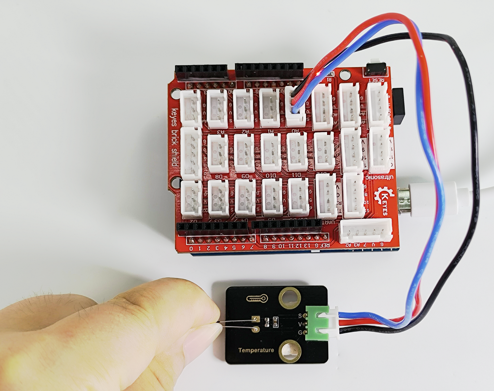

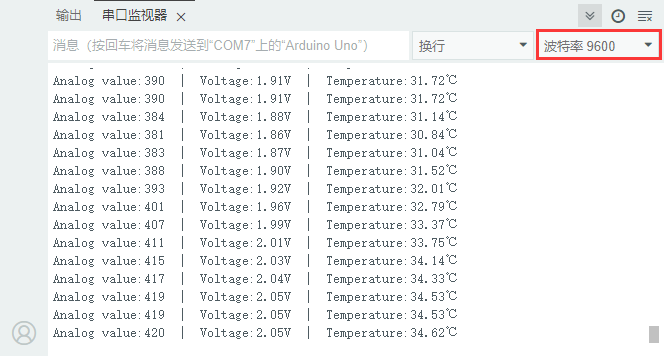

---

### 8. 代码说明

| 代码                                    | 说明                                                         |
| --------------------------------------- | ------------------------------------------------------------ |
| VR = (float)(AnalogValue / 1023 * 5.0)   | 将R1电阻两端转换后的模拟值转换成电压值，数据类型为单精度浮点型。 |
| Rt = (5.0 - VR) / VR * 4700             | 计算热敏电阻在当前温度下的电阻值。                           |
| float temp = 1/(1/T2+log(Rt/R)/B)-K+0.5 | 计算当前环境的温度，数据类型为单精度浮点型。                 |


---

## 第22课 薄膜压力传感器

### 1. 项目介绍

在这个套件中，有一个Keyes 薄膜压力传感器，薄膜压力传感器是基于新型纳米压敏材料辅以舒适杨式模量的超薄薄膜衬底一次性贴片而成，兼具防水和压敏双重功能。

通过采集模块上S端模拟信号，判断压力大小。模拟值越小，压力越大；并在串口监视器上显示测试结果。

---

### 2. 模块参数

工作电压: DC 3.3V~5V

工作电流: 0.5mA

最大功率: 0.0025W

量程: 0~10KG

响应点: 150g

重复性: ＜±9.7%（60%负载）

一致性: ±10%

耐久性: ＞100万次

初始电阻: 大于10MΩ(无负载)

响应时间: ＜1ms

恢复时间: ＜15ms

输出信号: 模拟信号

工作温度：-10°C ~ +50°C

尺寸：32mm x 23.8mm x 7.4mm

接口：2.54mm间距，3pin防反接口

---

### 3. 模块原理图


当传感器感知到外界压力时，传感器的电阻值发生变化。Keyes 薄膜压力传感器使用LM321运算放大器芯片将传感器感知到的压力变化的压力信号转换成相应变化强度的电信号输出。这样就可以通过检测电压信号变化得知压力变化情况。

---

### 4. 实验组件

|  |  | |      
| ------------------------ | ------------------------ | ---------------------------- | 
|UNO R4 WiFi/Minima主板(二选一) | Keyes 传感器扩展板 x1  |Keyes 薄膜压力传感器 x1  | 
|       |  |    |    
|3P线(反向) x1 | USB线 x1  |           |

---

### 5. 模块接线图

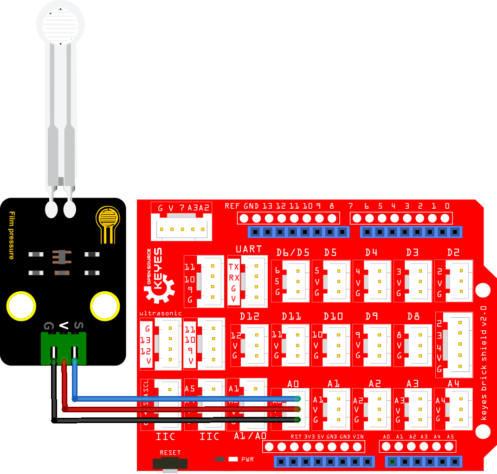

---

### 6. 实验代码

本项目中使用的代码保存在文件夹“<u>**项目代码**</u>”中，我们可以在此路径下打开代码文件''**Film_pressure_sensor.ino**"。

**注意：为了避免上传代码不成功，请上传代码前不要连接模块。代码上传成功后，拔下USB线断电，按照接线图正确接好模块后再用USB线连接到计算机上电，观察实验结果。**

```c++
/*  
 * 名称   : Film pressure sensor
 * 功能   : 读取薄膜压力传感器的模拟值
 * 作者   : http://www.keyes-robot.com/ 
*/
int val = 0;   //设置value为0
int PIN_ANALOG_IN = A0;   //薄膜压力传感器的引脚定义为A0

void setup() {
  Serial.begin(9600);   //波特率设置为9600
  pinMode(PIN_ANALOG_IN, INPUT);    //将传感器的引脚设置为输入模式
}

void loop() {
  val = analogRead(PIN_ANALOG_IN);    //读取传感器的模拟信号
  Serial.print("pressure value:  ");    //打印字符串pressure value:
  Serial.println(val);    //打印且显示压力大小的模拟信号
  delay(200);
}
```

参照第01课或第02课的示例，根据不同的 UNO R4 主板选择不同的主板板型和串口端口。

---

### 7. 实验结果

代码上传成功后，拔下USB线断电，按照接线图正确接好模块后再用USB线连接到计算机上电，打开串口监视器，设置波特率为 **<u>9600</u>**。为了使实验数据最精准，请将薄膜压力传感器尽量平放。

串口监视器打印出薄膜压力传感器的模拟值。用手按压薄膜时，随着力量的增大，可以看到模拟值逐渐变小。


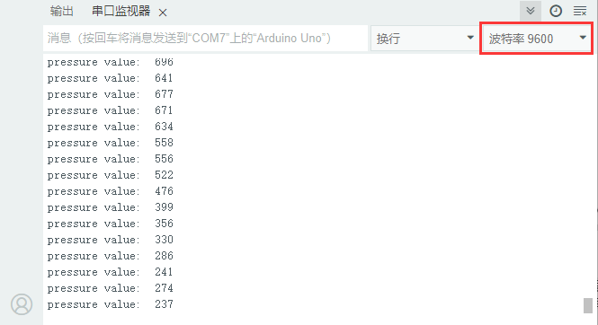

---

### 8. 代码说明

可以参照第17课的代码说明，这里就不多做介绍了。


---

## 第23课 火焰传感器

### 1. 项目介绍

在这个套件中，有一个Keyes 火焰传感器，它对火焰光谱特别灵敏，且灵敏度可调。性能稳定，是救火机器人的必备部件。火焰传感器上有一个远红外火焰探头，起着非常重要的作用，它可以用作机器人的眼睛来寻找火源或足球。利用它可以制作灭火机器人、足球机器人等。

该传感器有两个信号输出端，分别可输出数字信号与模拟信号。实验中，我们分别读取模块传感器数字信号与模拟信号，将测试结果在串口监视器上显示。

---

### 2. 模块参数

工作电压: DC 3.3V~5V

工作电流: 1.2mA

最大功率: 0.006W

输出信号：模拟信号和数字信号

工作温度：-10°C ~ +50°C

尺寸：32mm x 23.8mm x 9.2mm

接口：2.54mm间距，4pin防反接口

---

### 3. 模块原理图


红外火焰传感器能够探测到波长在700纳米～1000纳米范围内的红外光，探测角度为60，其中红外光波长在880纳米附近时，其灵敏度达到最大。从电路原理图我们可以看到，上电后红色LED2先点亮，红色LED1处于熄灭状态，检测到火焰时，数字信号端D0输出低电平，红色LED1将点亮。红外火焰探头将外界红外光的强弱变化转化为电流的变化，通过A/D转换器反映为0～255范围内数值的变化。外界红外光越强，数值越小；红外光越弱，数值越大。

---

### 4. 实验组件

|  |  |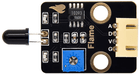 | 
| ------------------------ | ------------------------ | ---------------------------- |
| UNO R4 WiFi/Minima主板(二选一)| Keyes 传感器扩展板 x1      | Keyes 火焰传感器 x1     | 
|  |  |  |
| 4P线(反向) x1 | USB线 x1    |一字螺丝刀 x1  |

---

### 5. 模块接线图

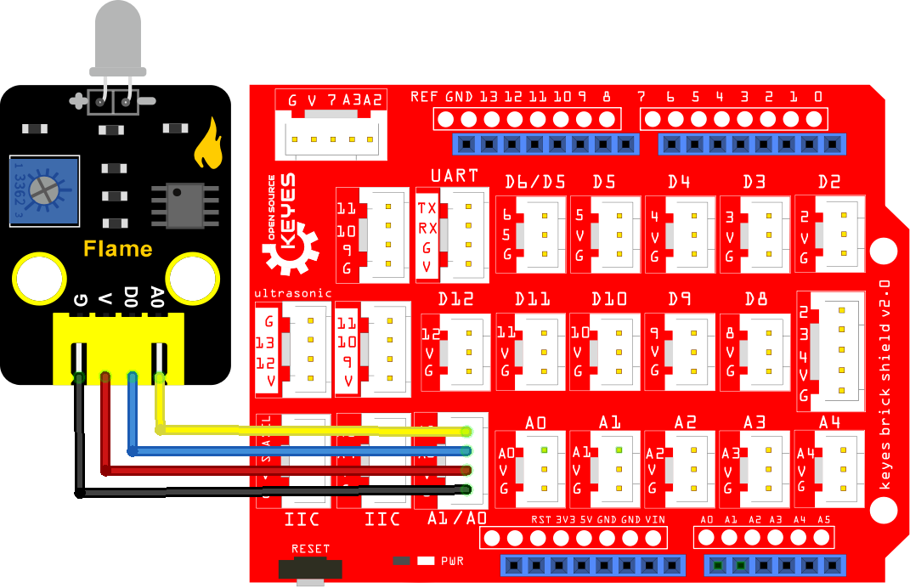

---

### 6. 实验代码

本项目中使用的代码保存在文件夹“<u>**项目代码**</u>”中，我们可以在此路径下打开代码文件''**Flame_sensor.ino**"。

**注意：为了避免上传代码不成功，请上传代码前不要连接模块。代码上传成功后，拔下USB线断电，按照接线图正确接好模块后再用USB线连接到计算机上电，观察实验结果。**

```c++
 /*  
 * 名称   : Flame sensor
 * 功能   : 读取火焰传感器的模拟值和数字信号值
 * 作者   : http://www.keyes-robot.com/ 
*/
int val1 = 0;   //设置value1为0
int val2 = 0;   //设置value2为0
int PIN_ANALOG_IN = A1;   //火焰传感器的模拟引脚定义为A1
int PIN_DIGITAL_IN = A0;   //火焰传感器的数字引脚定义为A0

void setup() {
  Serial.begin(9600);   //波特率设置为9600
  pinMode(PIN_ANALOG_IN, INPUT);    //将传感器的模拟引脚设置为输入模式
  pinMode(PIN_DIGITAL_IN, INPUT);    //将传感器的数字引脚设置为输入模式
}

void loop() {
  val1 = analogRead(PIN_ANALOG_IN);    //读取传感器的模拟信号
  val2 = digitalRead(PIN_DIGITAL_IN);    //读取传感器的数字信号
  Serial.print("D0:  ");    //打印字符串D0:
  Serial.print(val2);    //打印且显示val2数值
  if (val2 == 0) {    //检测到火焰，输出低电平
    Serial.print("  On fire!");
    Serial.print("  A0:  ");
    Serial.println(val1);
    delay(100);
  }
  else {    //未检测到火焰，输出高电平
    Serial.println("  All going well");
    delay(100);
  }
}
```

参照第01课或第02课的示例，根据不同的 UNO R4 主板选择不同的主板板型和串口端口。

---

### 7. 实验结果

代码上传成功后，拔下USB线断电，按照接线图正确接好模块后再用USB线连接到计算机上电。此时火焰传感器上的红色LED2点亮。用一字螺丝刀旋转火焰传感器上的电位器，微调使传感器上的红色LED1灯介于亮与不亮之间的**不亮**状态。

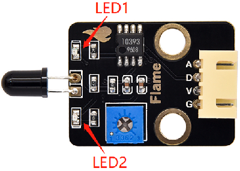

打开串口监视器，设置波特率为 **<u>9600</u>**。串口监视器打印出火焰传感器的D0值“1”和字符串“All going well”。当传感器检测到火焰时，红色LED1点亮，在串口监视器中可以看到D0值由“1”变为“0”，字符串“All going well”变为“on fire!”，还打印出A0值，同时传感器检测到的火焰越大，A0值反而越小。

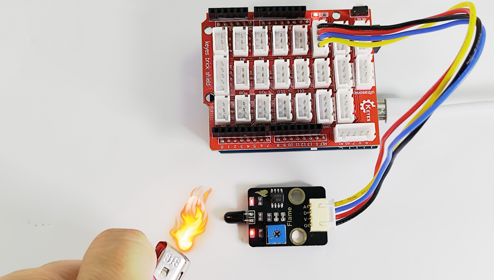

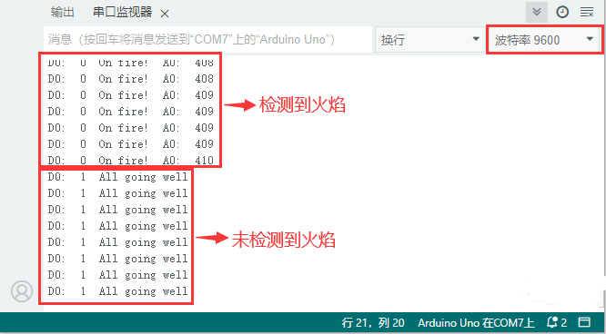

---

### 8. 代码说明

可以参照第17课的代码说明，这里就不多做介绍了。

---

## 第24课 摇杆模块

### 1. 项目介绍

你看过游戏手柄吗？游戏手柄上有按键，还有摇杆。摇杆是什么工作原理呢？在我们这个套件中，就有一个Keyes 摇杆模块，它的主要元件是PS2手柄摇杆。控制时，我们需要将模块的X端口和Y端口连接至单片机的模拟口。B端口连接至单片机数字口，V端口接至单片机电源输出端（3.3-5V），GND接单片机GND。通过读取两个模拟值和一个数字口的高低电平情况，可以判断模块上摇杆的工作状态。

---

### 2. 模块参数

工作电压: DC 3.3V~5V 

工作电流: 12mA

最大功率: 0.06W

输出信号: 信号端X、Y模拟电压输出(模拟信号)，信号端B是数字电平输出(数字信号) 

工作温度：-10°C ~ +50°C

尺寸：47.6mm x 23.8mm x 34.5mm

接口：2.54mm间距，5pin防反接口

---

### 3. 模块原理图


其实它的原理非常简单，内部相当于两个可调电位器（左右和上下）和一个按键。按键没有按下时被R1下拉为低电平，按下时接通VCC即为高电平，与我们前面学习过的按键模块的电平值是相反的。摇动摇杆时内部的电位器就会根据摇杆的摇动调节，从而输出不同的电压，可以读取到模拟值。

---

### 4. 实验组件

|  |  | |     
| ------------------------ | ------------------------ | ---------------------------- |
| UNO R4 WiFi/Minima主板(二选一) |Keyes 传感器扩展板 x1        | Keyes 摇杆模块 x1 |       
|       |  |    |
| 5P线(反向) x1 | USB线 x1  |           |

---

### 5. 模块接线图

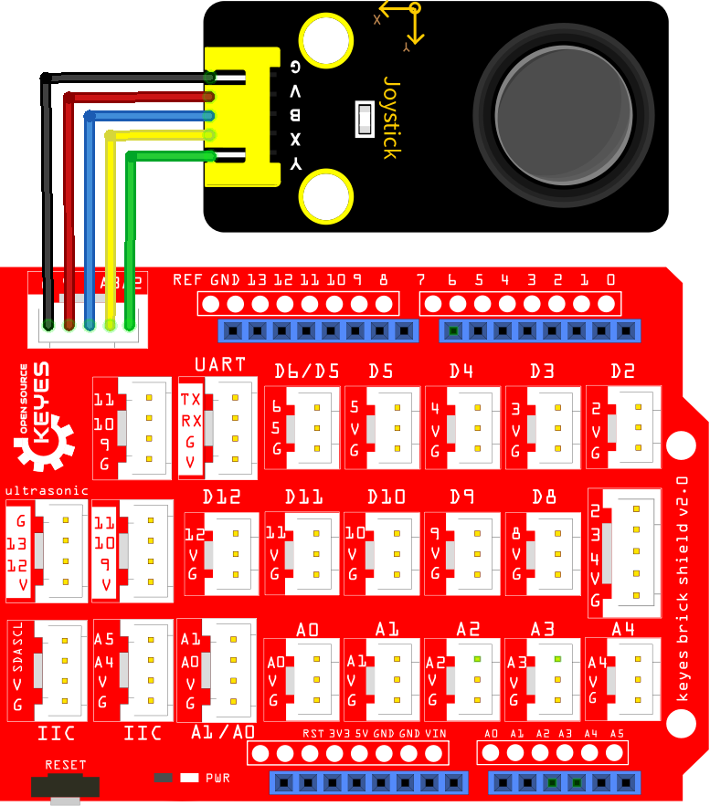

---

### 6. 实验代码

本项目中使用的代码保存在文件夹“<u>**项目代码**</u>”中，我们可以在此路径下打开代码文件''**Joystick.ino**"。

**注意：为了避免上传代码不成功，请上传代码前不要连接模块。代码上传成功后，拔下USB线断电，按照接线图正确接好模块后再用USB线连接到计算机上电，观察实验结果。**

```c++
/*  
 * 名称   : Joystick
 * 功能   : 从摇杆读取数据
 * 作者   : http://www.keyes-robot.com/ 
*/
int VRx = A3;  //定义X轴引脚
int VRy = A2;  //定义Y轴引脚
int SW = 7;    //定义Z轴引脚
int xPosition = 0;  //设置变量xPosition初始值为0
int yPosition = 0;  //设置变量yPosition初始值为0
int SW_state = 0;  //设置变量SW_state初始值为0

void setup() {
Serial.begin(9600); 
pinMode(VRx, INPUT);  //X轴引脚为输入模式
pinMode(VRy, INPUT);  //Y轴引脚为输入模式
pinMode(SW, INPUT_PULLUP);   //Z轴引脚为输入上拉模式
}

// 在loop()中，使用analogRead()读取X轴和Y轴的值
//并使用digitalRead()读取Z轴的值，然后显示它们。
void loop() {
  xPosition = analogRead(VRx); 
  yPosition = analogRead(VRy);
  SW_state = digitalRead(SW);
  Serial.print("X: ");
  Serial.print(xPosition);
  Serial.print(" | Y: ");
  Serial.print(yPosition);
  Serial.print(" | Button: ");
  Serial.println(SW_state);
  delay(100);
}
```

参照第01课或第02课的示例，根据不同的 UNO R4 主板选择不同的主板板型和串口端口。

---

### 7. 实验结果

代码上传成功后，拔下USB线断电，按照接线图正确接好模块后再用USB线连接到计算机上电，打开串口监视器，设置波特率为 **<u>9600</u>**。

串口监视器窗口将打印出当前摇杆X轴和Y轴对应的模拟值以及Z轴对应的数字值，移动摇杆或按下它将改变串口监视器中的模拟值和数字值。当按下摇杆时，Z值为1；未按下摇杆时，Z值为0。X值从左到右由0增长到1023。Y值从下到上由0增长到1023。

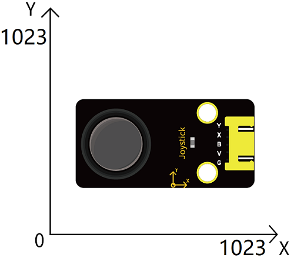

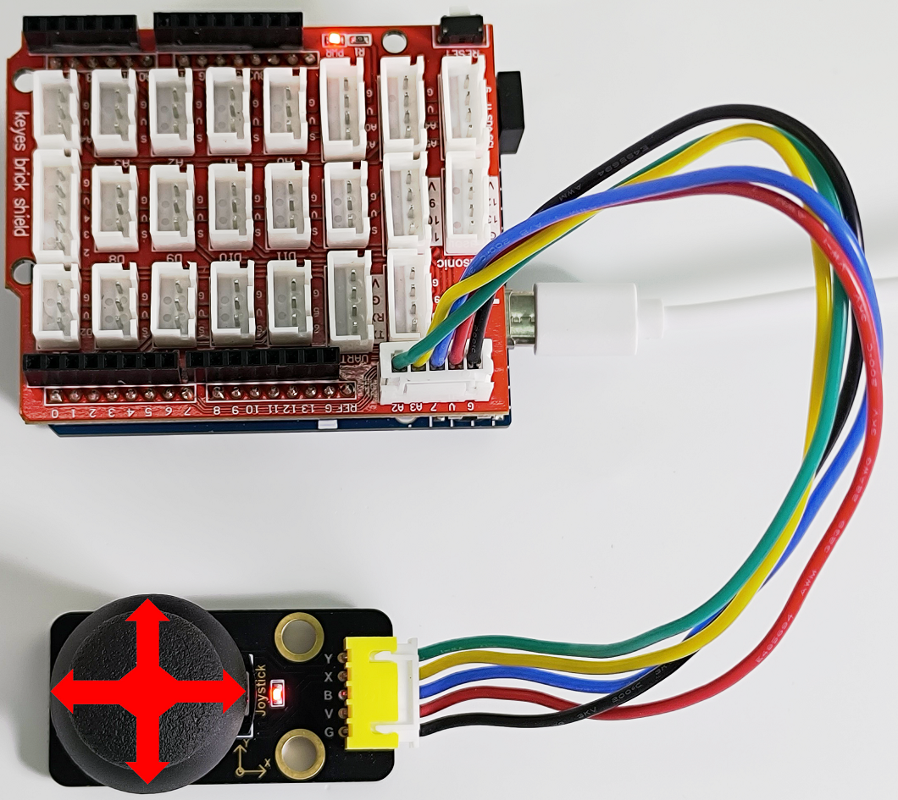

在X轴上移动摇杆，使数据从小到大。


在Y轴上移动摇杆，使数据从小到大。


按下摇杆。


---

### 8. 代码说明

| 代码                              | 说明                       |
| --------------------------------- | -------------------------- |
|pinMode(SW, INPUT_PULLUP) | 将引脚设置为输入上拉模式。 |

---


## 第25课 旋转编码器模块计数

### 1. 项目介绍

在这个套件中，有一个Keyes 旋转编码器模块，也叫开关编码器、旋转编码器。此款编码器有20脉冲20定位点、15脉冲30定位点两种。编码器主要用于汽车电子、多媒体音响、仪器仪表、家用电器、智能家居、计算机周边、医疗器械等领域。主要用于频率调节、亮度调节、温度调节、音量调节的参数控制等。

---

### 2. 模块参数

工作电压: DC 3.3V~5V 

工作电流: 2mA

最大功率: 0.01W

控制信号: 数字信号

工作温度：-10°C ~ +50°C

尺寸：32mm x 23.8mm x 30.6mm

接口：2.54mm间距，5pin防反接口

---

### 3. 模块原理图


增量式编码器是将位移转换成周期性的电信号，再把这个电信号转变成计数脉冲，用脉冲的个数表明位移的巨细。Keyes 旋转编码器模块采用的是20脉冲旋转编码器元件，它可以通过旋转计数正方向和反方向转动过程中输出脉冲的次数，这种转动计数是没有限制的，复位到初始状态，即从0开始计数。

旋转编码器提供两种交互方式：

- **按钮**   单击旋钮以按下按钮。按下时，按钮将 SW 引脚与 GND 引脚连接，也就是SW引脚的电平为低电平。

- **旋转**   每次旋转旋钮时，会在 DT 和 CLK 引脚上产生一个 LOW 信号。
  

    - 顺时针旋转会导致 CLK 引脚首先变低，然后 DT 引脚也变低。
    
    - 逆时针旋转会导致 DT 引脚先变低，然后 CLK 引脚变低。
    
    两个引脚将在几毫秒内返回高电平。如下图所示：
    
    


---

### 4. 实验组件

|  |   |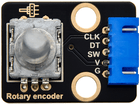 |     
| ------------------------ | ------------------------ | ---------------------------- |
|UNO R4 WiFi/Minima主板(二选一)| Keyes 传感器扩展板 x1  |Keyes 旋转编码器模块 x1  |     
|       |  |     |
|5P线(反向) x1 | USB线 x1  |           |

---

### 5. 模块接线图

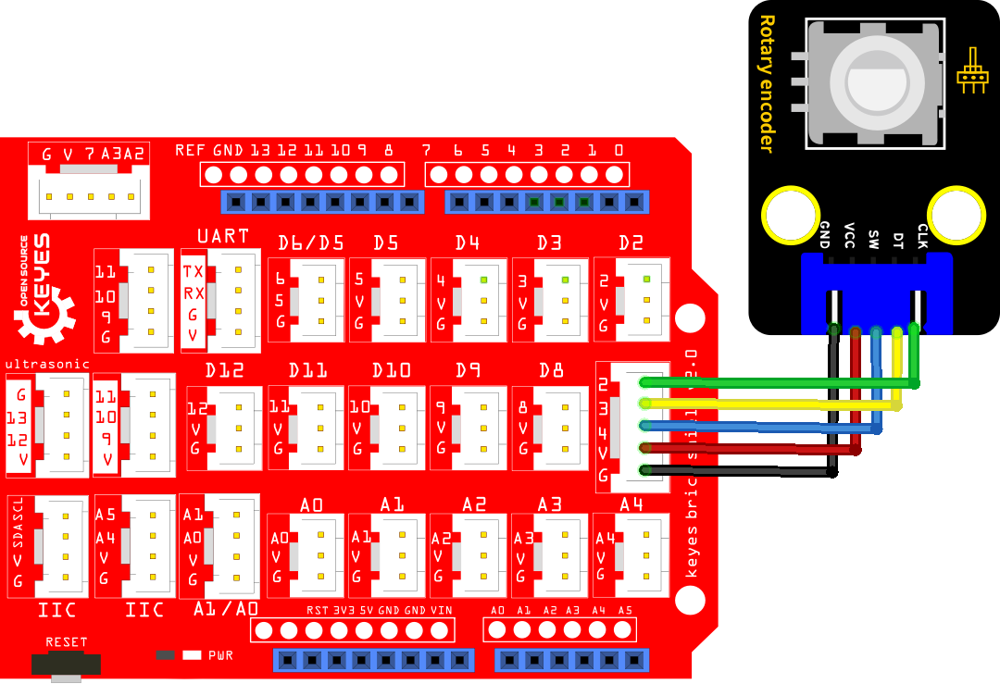

---

### 6. 实验代码

本项目中使用的代码保存在文件夹“<u>**项目代码**</u>”中，我们可以在此路径下打开代码文件''**Encoder.ino**"。

**注意：为了避免上传代码不成功，请上传代码前不要连接模块。代码上传成功后，拔下USB线断电，按照接线图正确接好模块后再用USB线连接到计算机上电，观察实验结果。**

```c++
/*  
 * 名称   : Encoder
 * 功能   : 旋转编码器模块计数
 * 作者   : http://www.keyes-robot.com/ 
*/
int Encoder_CLK  = 2;  //定义旋转编码器的CLK引脚为D2
int Encoder_DT  = 3;   //定义旋转编码器的DT引脚为D3
int Encoder_Switch = 4;  //定义旋转编码器的SW引脚为D4 
 
int Encoder_Count;  //定义变量Encoder_Count
 
void setup() {
  Serial.begin(9600);   //设置波特率
  pinMode (Encoder_CLK, INPUT);   //设置旋转编码器的CLK引脚为输入模式
  pinMode (Encoder_DT, INPUT);    //设置旋转编码器的DT引脚为输入模式
  pinMode (Encoder_Switch, INPUT);  //设置旋转编码器的SW引脚为输入模式
}
 
int lastClk = HIGH;  //定义lastClk初始为HIGH

void loop() {
  int newClk = digitalRead(Encoder_CLK);  //读取编码器的Encoder_CLK值赋给newClk
  if (newClk != lastClk) {
    // 在CLK引脚上有一个变化
    lastClk = newClk;
    int dtValue = digitalRead(Encoder_DT);  //读取编码器的Encoder_DT值赋给dtValue
    if (newClk == LOW && dtValue == HIGH) {
      Encoder_Count ++;
      Serial.println(Encoder_Count);
    }
    if (newClk == LOW && dtValue == LOW) {
      Encoder_Count--;
      Serial.println(Encoder_Count);
    }
  }

  if (digitalRead(Encoder_Switch) == 0)
  {
    delay(5);
    if (digitalRead(Encoder_Switch) == 0) {
      Serial.println("Switch pressed");
      while (digitalRead(Encoder_Switch) == 0);
    }
  }
}
```

参照第01课或第02课的示例，根据不同的 UNO R4 主板选择不同的主板板型和串口端口。

---

### 7. 实验结果

代码上传成功后，拔下USB线断电，按照接线图正确接好模块后再用USB线连接到计算机上电，打开串口监视器，设置波特率为 **<u>9600</u>**。

顺时针旋转编码器，串口监视器打印出来的数据 **<u>增大</u>**；逆时针旋转编码器，串口监视器打印出来的数据 **<u>减小</u>**；按下编码器中间按键，串口监视器打印 “**<u>Switch pressed</u>**”。

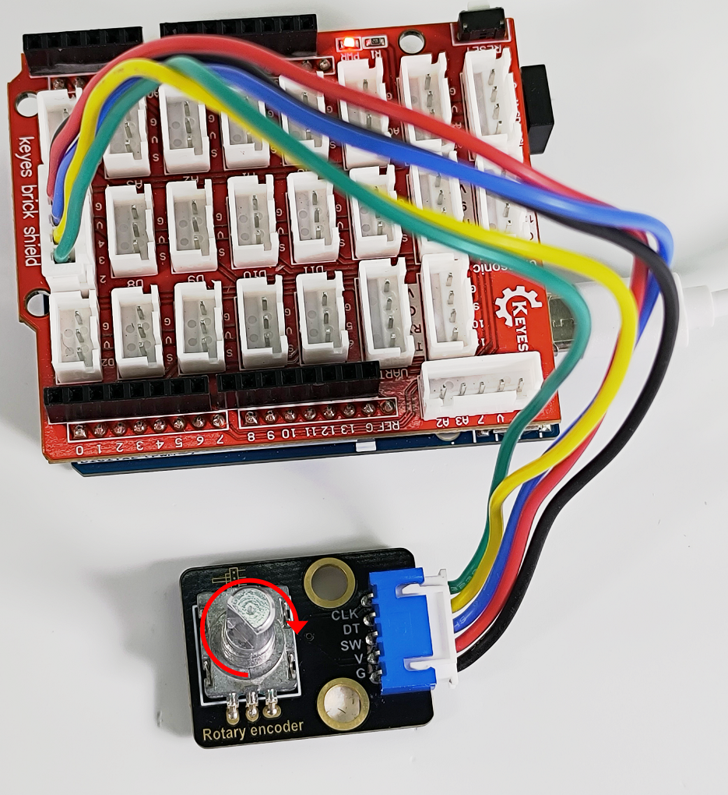

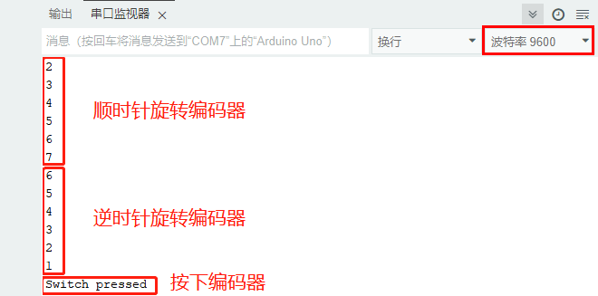

---

### 8. 代码说明

| 代码                                  | 说明                                                         |
| ------------------------------------- | ------------------------------------------------------------ |
| if (newClk == LOW && dtValue == HIGH) | 如果CLK引脚为低的同时DT引脚为高，也就是CLK引脚先变低，然后DT引脚再变低。顺时针旋转旋钮。 |
| if (newClk == LOW && dtValue == LOW)  | 如果CLK引脚为低的同时DT引脚也为低，也就是DT引脚先变低，然后CLK引脚再变低。逆时针旋转旋钮。 |
| digitalRead(Encoder_Switch) == 0      | 按下旋钮。                                                   |

---

## 第26课 舵机的控制原理

### 1. 项目介绍


舵机是一种位置伺服的驱动器，主要是由外壳、电路板、无核心马达、齿轮与位置检测器所构成。舵机有很多规格，但所有的舵机都有外接三根线。由于舵机品牌不同，颜色也会有所差异，我们实验用到的这款舵机分别用棕、红、橙三种颜色进行区分，棕色为接地线，红色为电源正极，橙色为信号线。

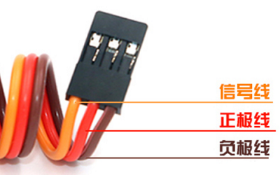

舵机分为360度舵机、180度舵机和90度舵机，我们实验用到的这款舵机为90度舵机，但是它转动的角度范围最大接近180度，所以我们也可把它当做180度舵机使用，控制原理都是一样的。

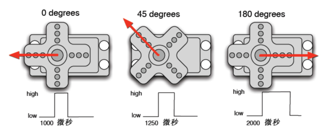

---

### 2. 模块参数

工作电压: DC 3.3V~5V 

工作温度：-10°C ~ +50°C

尺寸：32.25mm x 12.25mm x 30.42mm

接口：2.54mm间距，3pin接口

---

### 3. 模块原理图

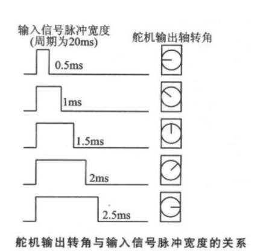

舵机的控制信号是周期为20ms （50Hz）的PWM（脉冲宽度调制）信号。

舵机的转动的角度是通过调节PWM信号的占空比来实现的，一般在 0.5ms ~ 2.5ms 的范围内去控制，总间隔为 2ms，相对应舵盘的位置为0度 ~ 180度，呈线性变化。当脉冲宽度为 5ms 时，舵机旋转至中间角度，大于 5ms 时舵机旋转角度增大，小于 5ms 时舵机旋转角度减小。

也就是说，舵机的控制需要单片机产生一个周期为20ms的脉冲信号，以0.5ms到2.5ms的高电平来控制舵机转动的角度。具体脉冲参数下图所示：


注意，由于舵机品牌不同，对于同一信号，不同品牌的舵机旋转的角度也会有所不同。

---

### 4. 实验组件

|  |    |   |    
| ------------------------ | ------------------- | --------------------- |
| UNO R4 WiFi/Minima主板(二选一)| Keyes 传感器扩展板 x1 |Keyes 舵机驱动模块 x1| 
|   | |  |
| 舵机 x1 | 4P线(反向) x1|USB线 x1             |

---

### 5. 实验

#### 5.1 实验①：

##### （1）实验接线图

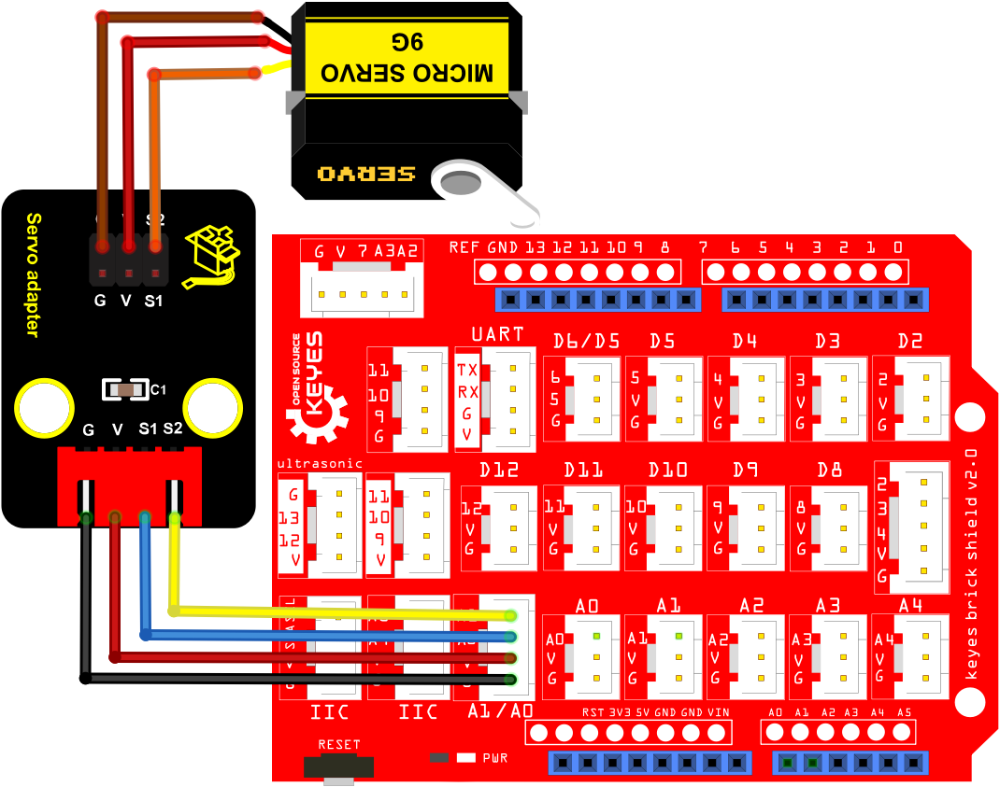

##### （2）实验代码

本项目中使用的代码保存在文件夹“<u>**项目代码**</u>”中，我们可以在此路径下打开代码文件''**servo_1.ino**"。

```c++
/*
 * 名称   : Servo_1
 * 功能   : 舵机旋转角度0 -> 90 -> 180，重复
 * 作者   : http://www.keyes-robot.com/ 
*/
#include <Servo.h>

Servo myservo;  //创建伺服对象来控制伺服电机

int servoPin = A1;  // 定义舵机引脚A1

void setup() {
  myservo.attach(servoPin);  //选择舵机引脚A1
}

void loop() {
  myservo.write(0); //旋转到0度
  delay(1000); //延迟1s
  myservo.write(90); //旋转到90度
  delay(1000); //延迟1s
  myservo.write(180); //旋转到180度
  delay(1000); //延迟1s
}
```

参照第01课或第02课的示例，根据不同的 UNO R4 主板选择不同的主板板型和串口端口。

##### （3）实验结果

正确的主板板型和串口端口设置完成后，则上传代码。若代码上传不成功，提示“**Servo.h: No such file or directory**”，请添加库文件。其添加方法请参照：[添加项目课程库文件](https://temp.keyesrobot.cn/projects/KE3083-KE3084-KE3085/en/latest/docs/%E6%95%99%E7%A8%8B/%E6%95%99%E7%A8%8B.html#id1)

再次上传代码，代码上传成功后，拔下USB线断电，按照接线图正确接好舵机，再用USB线连接到计算机上电，上电后，舵机由0度转到90度，停顿1秒；再转到180度，停顿1秒；然后回到0度，停顿1秒，循环转动。

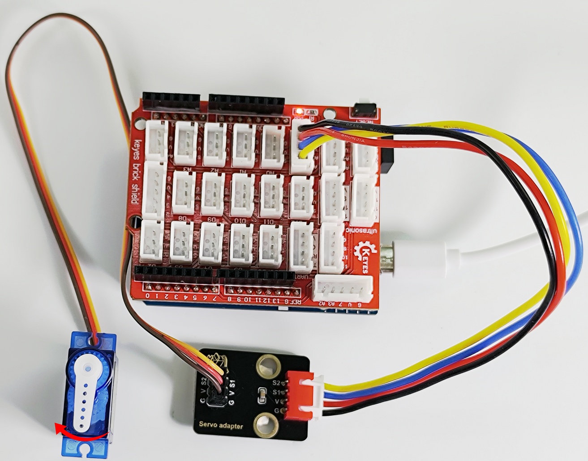


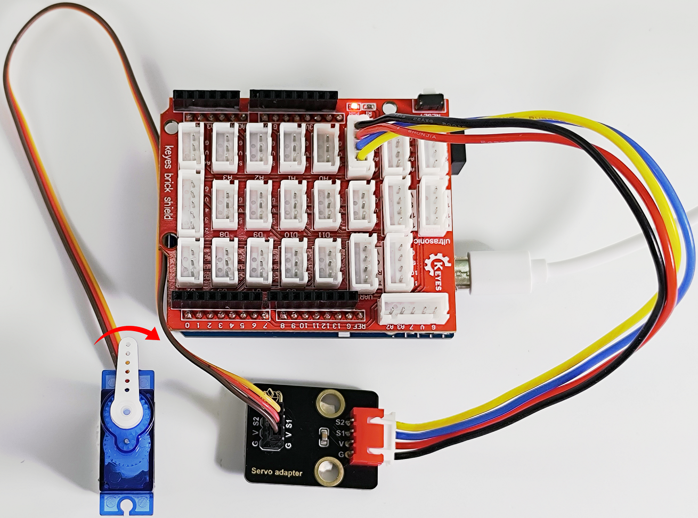

---

#### 5.2 实验②：

##### （1）实验接线图


##### （2）实验代码

本项目中使用的代码保存在文件夹“<u>**项目代码**</u>”中，我们可以在此路径下打开代码文件''**servo_2.ino**"。

```c++
/*
 * 名称   : Servo_2
 * 功能   : 控制伺服电机进行扫动
 * 作者   : http://www.keyes-robot.com/ 
*/
#include <Servo.h>

Servo myservo;  //创建舵机对象来控制舵机

int posVal = 0;    // 定义一个变量，存储舵机位置
int servoPin = A1;  // 定义舵机引脚A1

void setup() {
  myservo.attach(servoPin);  //选择舵机引脚A1
}

void loop() {
  
  for (posVal = 0; posVal <= 180; posVal += 1) { // 将servoPin上的伺服附加到伺服对象上
    // 以1度为步
    myservo.write(posVal);       // 告诉伺服电机到变量“pos”的位置
    delay(15);                   // 等待15ms让伺服电机到达位置
  }
  for (posVal = 180; posVal >= 0; posVal -= 1) { // 从180°到0°
    myservo.write(posVal);       // 告诉伺服电机到变量“pos”的位置
    delay(15);                   // 等待15ms让伺服电机到达位置
  }
}
```

##### （3）实验结果

（<span style="color: rgb(255, 169, 0);">特别提醒：如果已经添加过库文件“**Servo.h**”，就不需要重复添加；如果没有添加，请参照本课前面实验①的添加方法添加库文件“**Servo.h**”。</span>）代码上传成功后，拔下USB线断电。按照接线图正确接好舵机，再用USB线连接到计算机上电。上电后，舵机在0度 ~ 180度之间来回转动，每15ms转动一度。


---

### 6. 代码说明

| 代码                                | 说明                                                         |
| ----------------------------------- | ------------------------------------------------------------ |
|#include <Servo.h>             | Arduino专门为了UNO R4主板推出的servo库，用来操作舵机。        |
| Servo myservo                       | 创建一个舵机对象来控制舵机。                                 |
| myservo.attach(servoPin) | 设置控制舵机的引脚。                               |
| myservo.write(posVal)               | 向舵机写入一个数值，来直接控制舵机的轴，角度控制。舵机转动到posVal角度值。 |


---

## 第27课 超声波传感器的原理

### 1. 项目介绍

蝙蝠和某些海洋动物都能够利用高频率的声音进行回声定位或信息交流。它们能通过口腔或鼻腔把从喉部产生的超声波发射出去，利用折回的声波来定向，并判定附近物体的位置、大小以及是否在移动。超声波是一种频率高于20000赫兹的声波，它的方向性好，穿透能力强，易于获得较集中的声能，在水中传播距离远，可用于测距、测速、清洗、焊接、碎石、杀菌消毒等。在医学、军事、工业、农业上有很多的应用。超声波因其频率下限大于人的听觉上限而得名。科学家们将每秒钟振动的次数称为声音的频率，它的单位是赫兹(Hz)。

在这个套件中，有一个HC-SR04超声波传感器，它可以发送出一种频率很高的人类无法听到的超声波信号，这些超声波的信号碰到障碍物，就会立刻反射回来。在接收到返回的信息之后，根据发射信号和接收信号的时间差，计算出传感器和障碍物的详细距离，和蝙蝠飞行的原理一样。

---

### 2. 模块参数

超声波传感器工作电压：DC 5V 

超声波传感器工作电流：15mA

超声波传感器工作频率：40Hz

超声波传感器射程范围：2cm~4m

超声波传感器测量角度：<= 15度

超声波传感器输入触发信号：10 uS 的TTL脉冲

超声波传感器输出回响信号：输出TTL电平信号与射程成正比

工作温度：-10°C ~ +50°C

超声波传感器尺寸：45.5mm x 26.7mm x 17.6mm

超声波转接板模块尺寸：32mm x 23.8mm x 18.5mm

超声波转接板模块接口：2.54mm间距，4pin防反接口

---

### 3. 模块原理图

最常用的超声测距的方法是回声探测法。当有脉冲电压触发时（单片机给Trig引脚发送高电平），超声波发射器探头里的晶片就会振动，继而产生超声波。在超声波发射时刻的同时计数器开始计时，超声波在空气中传播，途中碰到障碍物面阻挡就立即反射回来（Echo引脚发送高电平信号给单片机），超声波接收器收到反射回的超声波就立即停止计时。

超声波是一种声波，其声速V与温度有关。一般情况下超声波在空气中的传播速度为340m/s，根据计时器记录的时间t，就可以计算出超声波探头发射点距障碍物面的距离s，即：s=340t/2 。

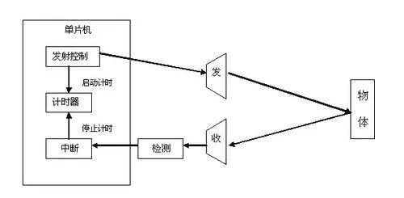

HC-SR04超声波测距模块可提供范围为2厘米至4米的非接触式距离感测功能，测距精度可达高到3mm。超声波传感器包括超声波发射器、超声波接收器与控制电路。其基本工作原理：

(1)采用IO口Trig触发测距，给至少10us的高电平信号;

(2)模块自动发送8个40khz的方波，自动检测是否有信号返回；

(3)有信号返回，通过IO口Echo输出一个高电平，高电平持续的时间就是超声波从发射到返回的时间。


---

### 4. 实验组件

|  |  | | 
| ------------------------ | ------------------------ | ---------------------------- |
|UNO R4 WiFi/Minima主板(二选一) | Keyes 传感器扩展板 x1  |Keyes 超声波转接模块 x1 |
 |        |  | 
|HC-SR04 超声波传感器 x1 | 4P线(反向) x1 | USB线 x1             |

---

### 5. 模块接线图


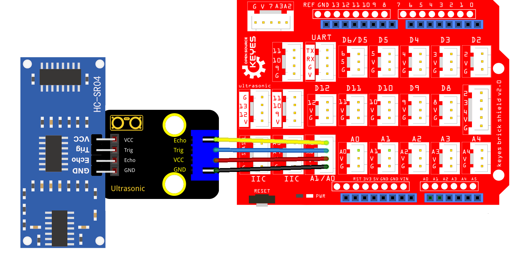

---

### 6. 实验代码

本项目中使用的代码保存在文件夹“<u>**项目代码**</u>”中，我们可以在此路径下打开代码文件''**Ultrasonic.ino**"。

**注意：为了避免上传代码不成功，请上传代码前不要连接模块。代码上传成功后，拔下USB线断电，按照接线图正确接好模块后再用USB线连接到计算机上电，观察实验结果。**

```c++
/*  
 * 名称   : Ultrasonic
 * 功能   : 使用超声波模块测量距离
 * 作者   : http://www.keyes-robot.com/ 
*/
const int TrigPin = A0; // 定义TrigPin
const int EchoPin = A1; // 定义EchoPin
int duration = 0; // 将持续时间的初始值定义为0
int distance = 0; // 将距离的初始值定义为0

void setup() {
  pinMode(TrigPin , OUTPUT); // 设置trigPin为输出模式
  pinMode(EchoPin , INPUT);  // 设置echoPin为输入模式
  Serial.begin(9600);        // 设置波特率为9600
}

void loop(){
  // 使trigPin输出高电平持续10μs触发HC_SR04
  digitalWrite(TrigPin , HIGH);
  delayMicroseconds(10);
  digitalWrite(TrigPin , LOW);
  // 等待HC-SR04回到高电平并测量这个等待时间
  duration = pulseIn(EchoPin , HIGH);
  // 根据时间计算距离
  distance = (duration/2) / 28.5 ;
  Serial.print("Distance: ");
  Serial.print(distance); //串口打印距离值
  Serial.println("cm");
  delay(100); //ping之间等待100毫秒(大约20个ping /秒)。
}
```

参照第01课或第02课的示例，根据不同的 UNO R4 主板选择不同的主板板型和串口端口。

---

### 7. 实验结果

代码上传成功后，拔下USB线断电，按照接线图正确接好模块后再用USB线连接到计算机上电，打开串口监视器，设置波特率为 **<u>9600</u>**。

放置障碍物在超声波传感器探头前感应，串口监视器窗口打印出超声波传感器与障碍物之间的距离值。

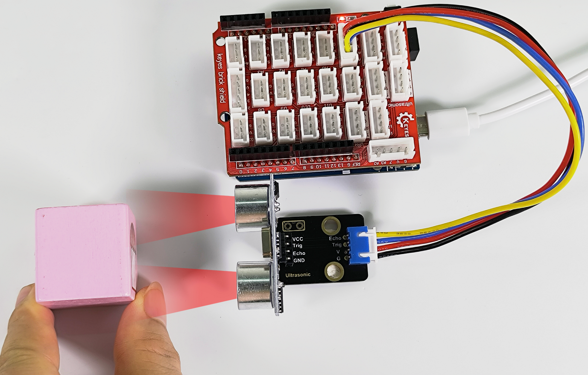

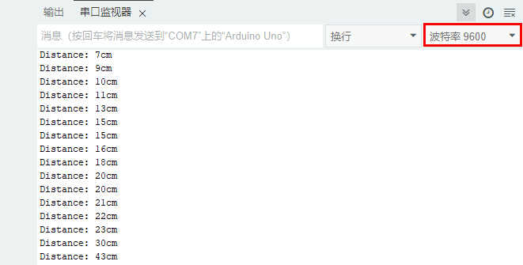

---

### 8. 代码说明

| 代码                               | 说明                                                         |
| ---------------------------------- | ------------------------------------------------------------ |
| duration = pulseIn(EchoPin , HIGH) | pulseIn是内置函数，专门用来读取脉冲时间间隔。这里读取的高电平的时间就是超声波从发射到返回的时间。 |
| distance = (duration/2) / 28.5     | 超声波数据转换算法。                                         |


---

## 第28课 红外遥控与接收

### 1. 项目介绍

红外线遥控是目前使用最广泛的一种通信和遥控手段。因红外线遥控装置具有体积小、功耗低、功能强、成本低等特点，录音机、音响设备、空凋机以及玩具等其它小型电器装置上纷纷采用红外线遥控。红外遥控的发射电路是采用红外发光二极管发出经过调制的红外光波；红外接收电路由红外接收二极管、三极管或硅光电池组成，它们将红外发射器发射的红外光转换为相应的电信号，再送到后置放大器。

Keyes 红外接收模块选择的是VS1838B红外接收传感器元件，该元件是集接收、放大、解调一体的器件，内部IC就已经完成了解调，输出的就是数字信号。它可接收标准38KHz调制的遥控器信号。

---

### 2. 模块参数

工作电压: DC 3.3V~5V 

工作电流: 1.5mA

最大功率: 0.25 W

工作温度：-10°C ~ +50°C

控制信号: 数字信号

尺寸：32 x 23.8 x 10.8 mm

接口：2.54mm间距，3pin防反接口

---

### 3. 模块原理图


红外遥控系统的主要部分为调制、发射和接收。红外遥控是以调制的方式发射数据，就是把数据和一定频率的载波进行“与”操作，这样既可以提高发射效率又可以降低电源功耗。调制载波频率一般在30khz到60khz之间，大多数使用的是38kHz，占空比1/3的方波。红外接收的信号端加上了4.7K的上拉电阻R3，工作时，首先等待检测低电平，接收到信号后，信号端立即由高电平转为低电平。

---

### 4. 实验组件

|  | |  |
| ------------------------ | ------------------------ | -------------------------------- |
| UNO R4 WiFi/Minima主板(二选一)| Keyes 传感器扩展板 x1    |Keyes 红外接收模块 x1  | 
| |        |  |
| Keyes 遥控器 x1                  | 3P线(反向) x1 | USB线 x1             |

---

### 5. 模块接线图


---

### 6. 实验代码

本项目中使用的代码保存在文件夹“<u>**项目代码**</u>”中，我们可以在此路径下打开代码文件''**IR_Receiver.ino**"。

**注意：为了避免上传代码不成功，请上传代码前不要连接模块。代码上传成功后，拔下USB线断电，按照接线图正确接好模块后再用USB线连接到计算机上电，观察实验结果。**

```c++
/*  
 * 名称   : IR Receiver
 * 功能   : 解码红外线遥控器，通过串口打印出来
 * 作者   : http://www.keyes-robot.com/ 
*/
#include <IRremote.hpp>

#define IR_RECEIVE_PIN   3   // 定义红外接收模块引脚
IRrecv irrecv(IR_RECEIVE_PIN);     // 创建一个用于接收类的类对象
decode_results results;     // 创建一个解码结果类对象

void setup() {
  Serial.begin(9600);       // 初始化串口，波特率设置为9600
  IrReceiver.begin(IR_RECEIVE_PIN, ENABLE_LED_FEEDBACK);  // 启动接收器
}

void loop() {
  if (IrReceiver.decode()) {
      Serial.println(IrReceiver.decodedIRData.decodedRawData, HEX);  // 打印原始数据
      IrReceiver.printIRResultShort(&Serial); // 在一行中打印接收到的完整数据
      IrReceiver.printIRSendUsage(&Serial);  // 打印发送这些数据所需的语句
      IrReceiver.resume(); // 启用接收下一个值
  }
  delay(100);
}
```

参照第01课或第02课的示例，根据不同的 UNO R4 主板选择不同的主板板型和串口端口。

---

### 7. 实验结果

正确的主板板型和串口端口设置完成后，则上传代码。若代码上传不成功，提示“**IRremote.hpp: No such file or directory**”，请添加库文件。其添加方法请参照：[添加项目课程库文件](https://temp.keyesrobot.cn/projects/KE3083-KE3084-KE3085/en/latest/docs/%E6%95%99%E7%A8%8B/%E6%95%99%E7%A8%8B.html#id1)

再次上传代码，代码上传成功后，拔下USB线断电，按照接线图正确接好模块后再用USB线连接到计算机上电，打开串口监视器，设置波特率为 **<u>9600</u>**。

找到红外遥控器，拔出绝缘片。对准红外接收模块的红外接收传感器的接收头，按下遥控器任意按键，接收到信号后，串口监视器窗口打印出当前接收到的按键值，同时，红外接收传感器上的LED会闪烁。


Keyes 遥控器上每一个按键都对应着一个按键值，如下图所示。


---

### 8. 代码说明

| 代码                                  | 说明                               |
| ------------------------------------- | ---------------------------------- |
| irrecv.enableIRIn();                  | 初始化红外遥控。                   |
| irrecv.decode(&results)               | 等待解码。                         |
| serialPrintUint64(results.value, HEX) | 打印出解码结果。                   |
| irrecv.resume();                      | 恢复，等待接收下一个红外遥控信号。 |


---

## 第29课 DS18B20温度传感器检测温度

### 1. 项目介绍

在这个套件中，有一个Keyes DS18B20温度传感器，DS18B20 是美国DALLAS公司的一款温度传感器，单片机可以通过 1-Wire 协议与 DS18B20 进行通信，最终将温度读出。测试结果为℃,范围为-55℃到+125℃。

---

### 2. 模块参数

工作电压: DC 3.3V~5V 

工作电流: 0.15mA

最大功率: 0.00075W

测量精度：±0.4℃（-55℃至+125℃范围内）

输出信号: 数字信号

工作温度：-10°C ~ +50°C

尺寸：32mm x 23.8mm x 9.35mm

接口：2.54mm间距，3pin防反接口

---

### 3. 模块原理图

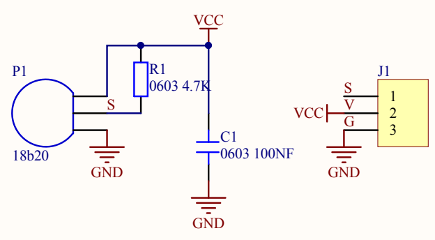

1-Wire 总线的硬件接口很简单，只需要把 DS18B20 的数据引脚和单片机的一个 IO 口接上就可以了。硬件简单，随之而来的，就是软件时序的复杂。1-Wire总线的时序比较复杂，很多同学在这里独立看时序图都看不明白，我们在库里面已经把复杂的时序操作封装好了，直接使用库函数就可以。我们来看一下 DS18B20 的硬件原理图，如图所示。
DS18B20 通过编程，可以实现最高 12 位的温度存储值，在寄存器中，以补码的格式存储，如下图所示。

---

### 4. 实验组件

|  |  | |    
| ------------------------ | ------------------------ | ---------------------------- | 
| UNO R4 WiFi/Minima主板(二选一)|Keyes 传感器扩展板 x1     |Keyes DS18B20温度传感器 x1 |    
|       |  |    |
| 3P线(反向) x1 | USB线 x1 |            |

---

### 5. 模块接线图

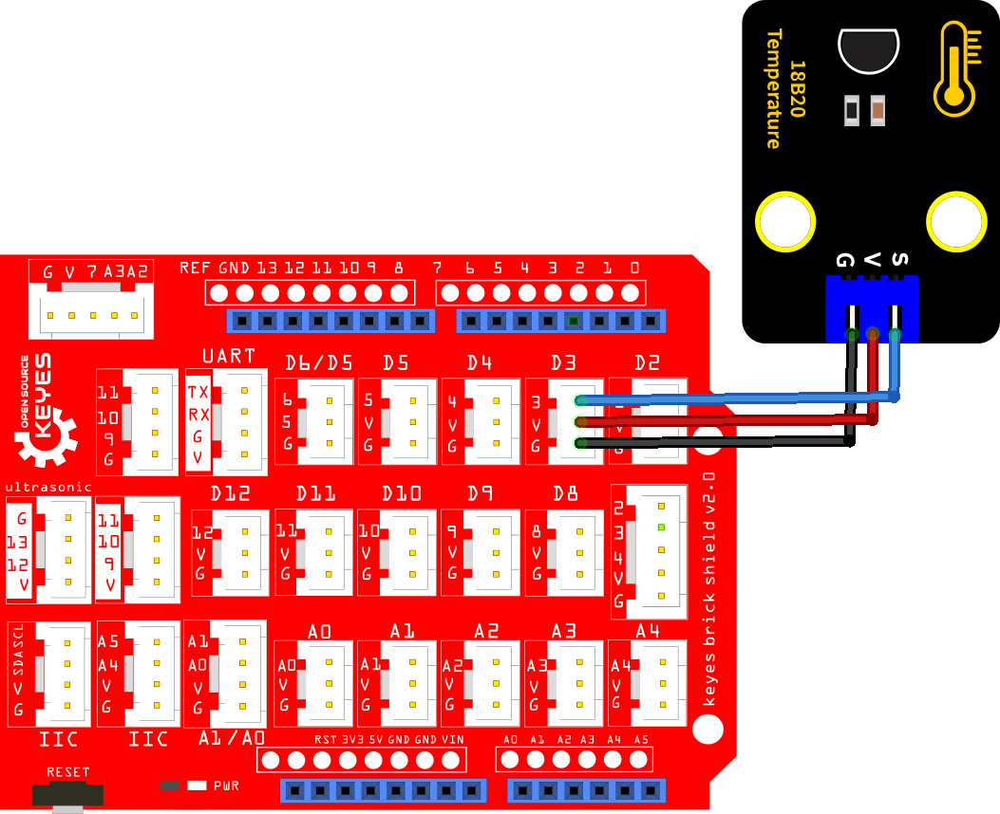

---

### 6. 实验代码

本项目中使用的代码保存在文件夹“<u>**项目代码**</u>”中，我们可以在此路径下打开代码文件''**DS18B20.ino**"。

**注意：为了避免上传代码不成功，请上传代码前不要连接模块。代码上传成功后，拔下USB线断电，按照接线图正确接好模块后再用USB线连接到计算机上电，观察实验结果。**

```c++
/*  
 * 名称   : ds18b20
 * 功能   : 读取DS18B20的温度
 * 作者   : http://www.keyes-robot.com/ 
*/
#include <DS18B20.h>

//DS18B20引脚为D3
DS18B20 ds18b20(3);

void setup() {
  Serial.begin(9600);
}

void loop() {
  double temp = ds18b20.GetTemp();  //读取温度
  temp *= 0.0625;  //转换精度为0.0625/LSB
  Serial.print("Temperature: ");
  Serial.print(temp);
  Serial.println("°C");
  delay(1000);
}
```

参照第01课或第02课的示例，根据不同的 UNO R4 主板选择不同的主板板型和串口端口。

---

### 7. 实验结果

正确的主板板型和串口端口设置完成后，则上传代码。若代码上传不成功，提示“**DS18B20.h: No such file or directory**”，请添加库文件。其添加方法请参照：[添加项目课程库文件](https://temp.keyesrobot.cn/projects/KE3083-KE3084-KE3085/en/latest/docs/%E6%95%99%E7%A8%8B/%E6%95%99%E7%A8%8B.html#id1)

再次上传代码，代码上传成功后，拔下USB线断电，按照接线图正确接好模块后再用USB线连接到计算机上电，打开串口监视器，设置波特率为 **<u>9600</u>**。

串口监视器打印出当前环境的温度值。

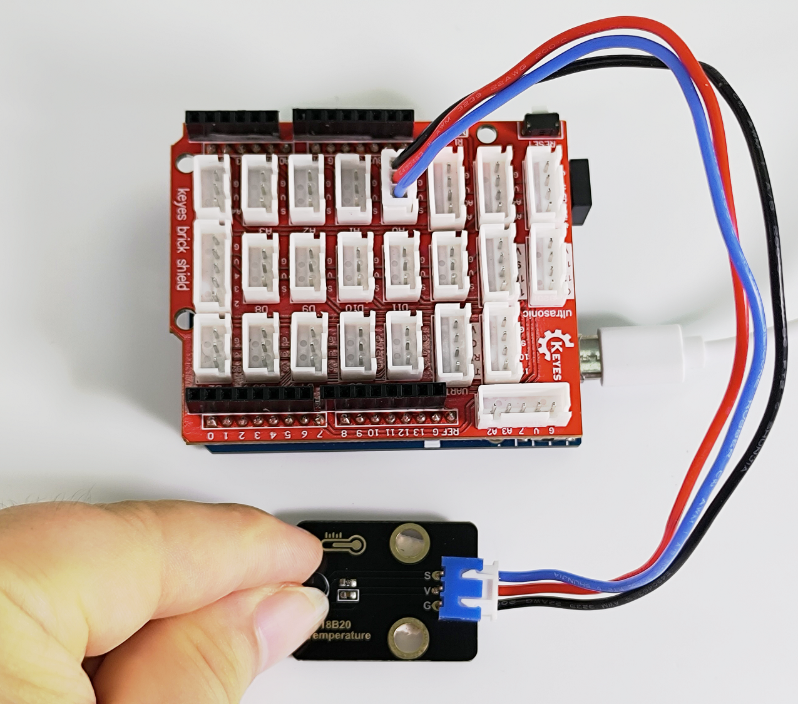

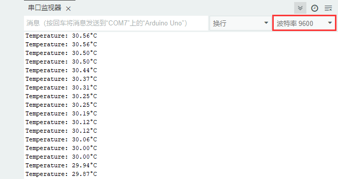

---

### 8. 代码说明

| 代码                                    | 说明                                                   |
| --------------------------------------- | ------------------------------------------------------ |
| DS18B20 ds18b20(3);                    | 获取温度的管脚设置为D3，获取温度的单位为℃。        |
| double temp = ds18b20.GetTemp();        | 设置一个double小数变量，为temp，将所测结果赋值给temp。 |
| float temp = 1/(1/T2+log(Rt/R)/B)-K+0.5 | 计算当前环境的温度，数据类型为单精度浮点型。           |


---

## 第30课 XHT11温湿度传感器检测温湿度

### 1. 项目介绍

在这个套件中，有一个Keyes XHT11温湿度传感器。XHT11作为一款低价的入门级温湿度传感器，它主要由一个电阻式感湿元件和一个NTC测温元件组成。XHT11为4针单排引脚封装，采用单线制串行接口，只需加适当的上拉电阻，信号传输距离可达20米以上，Keyes XHT11温湿度传感器具有超快响应、抗干扰能力强、性价比极高等优点。

---

### 2. 模块参数

工作电压: DC 3.3V~5V 

工作电流: 2.1mA

最大功率: 0.015W

温度范围: -25 ~ +60°C (± 2℃)

湿度范围: 5 ~ 95%RH（25C°左右精度为±5%RH）

输出信号: 数字双向单总线

工作温度: -25°C ~ +60°C

尺寸：32mm x 23.8mm x 9.7mm

接口：2.54mm间距，3pin防反接口

---

### 3. 模块原理图


单片机与 XHT11之间的通讯和同步,采用单总线数据格式,一次通讯时间4ms左右,数据分小数部分和整数部分,具体格式在下面说明,当前小数部分用于以后扩展,现读出为零，操作流程：一次完整的数据传输为40bit，高位先出。

**数据格式：** 8bit湿度整数数据+8bit湿度小数数据+8bi温度整数数据+8bit温度小数数据+8bit校验和。

**8位校验和：** 8bit湿度整数数据+8bit湿度小数数据+8bi温度整数数据+8bit温度小数数据"相加所得结果的末8位。

---

### 4. 实验组件

|  |    |   |      
| ------------------------ | -------------------------- | ---------------------------- |
| UNO R4 WiFi/Minima主板(二选一)|  Keyes 传感器扩展板 x1 |Keyes XHT11温湿度传感器 x1 |    
|       |  |     |
| 3P线(反向) x1 | USB线 x1 |            |

---

### 5. 模块接线图

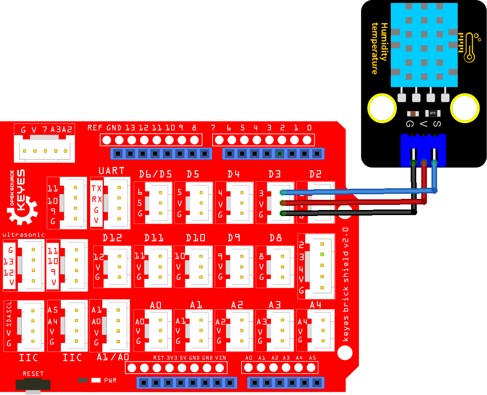

---

### 6. 实验代码

本项目中使用的代码保存在文件夹“<u>**项目代码**</u>”中，我们可以在此路径下打开代码文件''**XHT11.ino**"。

**注意：为了避免上传代码不成功，请上传代码前不要连接模块。代码上传成功后，拔下USB线断电，按照接线图正确接好模块后再用USB线连接到计算机上电，观察实验结果。**

```c++
/*  
 * 名称   : xht11
 * 功能   : 读取XHT11的温度和湿度值
 * 作者   : http://www.keyes-robot.com/ 
*/
#include "xht11.h"

xht11 xht(3); //定义XHT11的引脚为D3

unsigned char dht[4] = {0, 0, 0, 0};// 只接收数据的前32位，不接收奇偶校验位
void setup() {
  Serial.begin(9600);//启动串口监视器，设置波特率为9600
}

void loop() {
  if (xht.receive(dht)) { //正确检查时返回true
    Serial.print("RH:");
    Serial.print(dht[0]); //湿度的积分部分DHT[1]为小数部分系列。打印(“%”);
    Serial.print("  Temp:");
    Serial.print(dht[2]); //温度的积分部分DHT[3]为小数部分
    Serial.println("°C");
  } else {    //Read error
    Serial.println("sensor error");
  }
  delay(1000);  //等待设备读取需要1000ms
}
```

参照第01课或第02课的示例，根据不同的 UNO R4 主板选择不同的主板板型和串口端口。

---

### 7. 实验结果

正确的主板板型和串口端口设置完成后，则上传代码。若代码上传不成功，提示“**xht11.h: No such file or directory**”，请添加库文件。其添加方法请参照：[添加项目课程库文件](https://temp.keyesrobot.cn/projects/KE3083-KE3084-KE3085/en/latest/docs/%E6%95%99%E7%A8%8B/%E6%95%99%E7%A8%8B.html#id1)

再次上传代码，代码上传成功后，拔下USB线断电，按照接线图正确接好模块后再用USB线连接到计算机上电，打开串口监视器，设置波特率为 **<u>9600</u>**。

串口监视器打印出XHT11温湿度传感器检测到当前环境的温湿度值。


---

### 8. 代码说明

| 代码                                | 说明                                         |
| ----------------------------------- | -------------------------------------------- |
| unsigned char dht[4] = {0, 0, 0, 0} | 将读取到的温湿度数据存放到dht[4]这个数组当中 |


---

## 第31课 DS1307时钟模块

### 1. 项目介绍

这个模块主要用到的芯片是美国DALLAS公司推出的I2C总线接口实时时钟芯片DS1307，它可独立于CPU工作，不受CPU主晶振及其电容的影响；计时准确，月累积误差一般小于10秒。此芯片还具有主电源掉电情况下的时钟保护电路，DS1307的时钟靠后备电池维持工作，拒绝CPU对其读出和写入访问。同时还具有备用电源自动切换控制电路，因而可在主电源掉电和其它一些恶劣环境场合中保证系统时钟的定时准确性。DS1307具有产生秒、分、时、日、月、年等功能，且具有闰年自动调整功能。同时，DS1307芯片内部还集成有一定容量、具有掉电保护特性的静态RAM，可用于保存一些关键数据。实验中，我们测试出传感器检测的实时时间，并且在串口监视器上显示测试数据。

---

### 2. 模块参数

工作电压：DC 3.3V~5V

工作电流：1.5mA

最大功率：0.0075W

中断类型: 全天时间

存储器容量: 56bytes

存储器类型: RAM

接口类型: Serial, I2C

时钟频率: 32.768kHz

类型: RTC

时钟：时间精确到2100年（具有闰年补偿）

通讯方式：I2C通讯

工作温度：-10°C ~ +50°C

尺寸：47.6mm x 23.8mm x 9.3mm

接口：2.54mm间距，4pin防反接口

---

### 3. 模块原理图


DS1307串行实时时钟(RTC)是一个低功耗、全二进制编码的十进制(BCD)时钟/日历加上56字节的NV SRAM。地址和数据通过一个I2C，双向总线串行传输。时钟/日历提供秒、分钟、小时、天、日期、月和年的信息。月底日期会根据少于31天的月份进行自动调整，包括对闰年的修正。时钟工作在24小时或12小时的格式，与AM/PM指示器。DS1307有一个内置的电源感应电路，可以检测电源故障并自动切换到备用电源。当部件从备用电源开始进行操作时，将继续进行计时操作。

主要引脚定义如下： 

| DS1307引脚 | 定义                 |
| ---------- | -------------------- |
| X1、X2     | 32.768kHz 晶振接入端 |
| VBAT       | +3V 电池电压输入     |
| VCC        | 电源电压             |
| SQW        | 方波驱动器           |
| SCL        | 串行时钟             |
| SDA        | 串行数据             |

---

### 4. 实验组件

|  |       |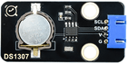|      
| ------------------------ | ----------------------------- | ---------------------------- |
|UNO R4 WiFi/Minima主板(二选一) | Keyes 传感器扩展板 x1 |Keyes DS1307时钟传感器模块 x1 |    
|        |  |     |
|4P线(反向) x1 | USB线 x1 |            |

---

### 5. 模块接线图

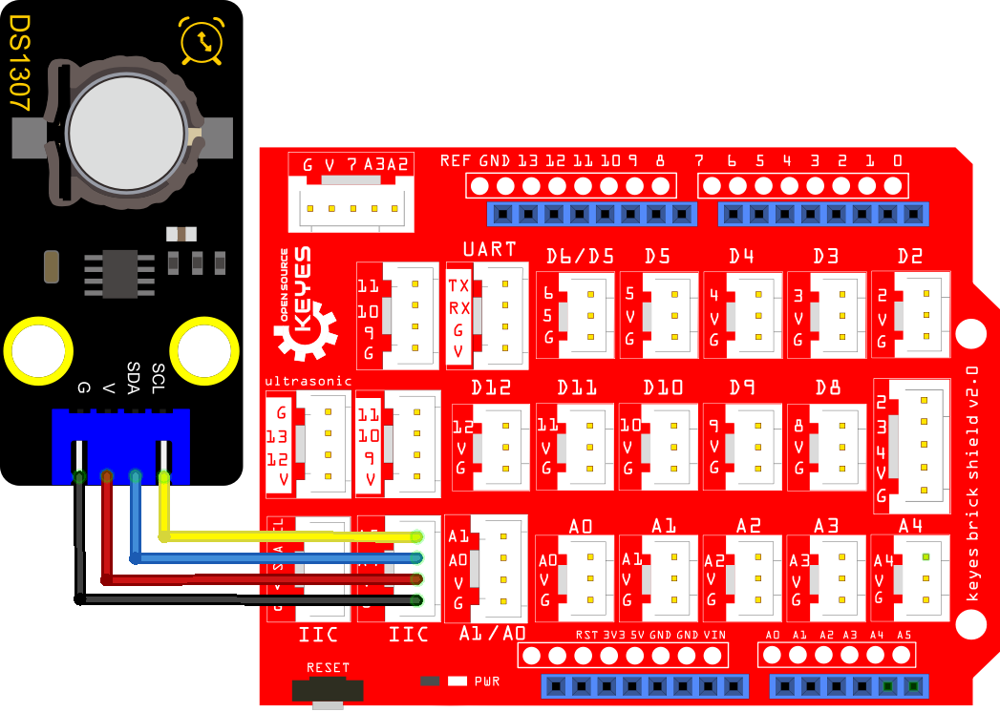

---

### 6. 实验代码

本项目中使用的代码保存在文件夹“<u>**项目代码**</u>”中，我们可以在此路径下打开代码文件''**DS1307.ino**"。

**注意：为了避免上传代码不成功，请上传代码前不要连接模块。代码上传成功后，拔下USB线断电，按照接线图正确接好模块后再用USB线连接到计算机上电，观察实验结果。**

```c++
/*  
 * 名称   : DS1307 Real Time Clock
 * 功能   : 读取DS1307时钟模块的年/月/日/时/分/秒/周
 * 作者   : http://www.keyes-robot.com/ 
*/
#include <Wire.h>
#include "RtcDS1307.h"  //DS1307时钟模块库
RtcDS1307<TwoWire> Rtc(Wire); //I2C接口:SDA引脚接A4, SCL引脚接A5

void setup(){
  Serial.begin(57600);//波特率设置为57600
  Wire.begin();        // 初始化I2C
  Rtc.Begin();
  Rtc.SetIsRunning(true);
  Rtc.SetDateTime(RtcDateTime(__DATE__, __TIME__));  
}

void loop(){
  // 打印年/月/日/小时/分/ 秒/周
  Serial.print(Rtc.GetDateTime().Year());
  Serial.print("/");
  Serial.print(Rtc.GetDateTime().Month());
  Serial.print("/");
  Serial.print(Rtc.GetDateTime().Day());
  Serial.print("    ");
  Serial.print(Rtc.GetDateTime().Hour());
  Serial.print(":");
  Serial.print(Rtc.GetDateTime().Minute());
  Serial.print(":");
  Serial.print(Rtc.GetDateTime().Second());
  Serial.print("    ");
  Serial.println(Rtc.GetDateTime().DayOfWeek());
  delay(1000);//延迟1秒
}
```

参照第01课或第02课的示例，根据不同的 UNO R4 主板选择不同的主板板型和串口端口。

---

### 7. 实验结果

正确的主板板型和串口端口设置完成后，则上传代码。若代码上传不成功，提示“**RtcDS1307.h: No such file or directory**”，请添加库文件。其添加方法请参照：[添加项目课程库文件](https://temp.keyesrobot.cn/projects/KE3083-KE3084-KE3085/en/latest/docs/%E6%95%99%E7%A8%8B/%E6%95%99%E7%A8%8B.html#id1)

再次上传代码，代码上传成功后，拔下USB线断电。先在模块上安装电池，然后按照接线图正确接好模块后再用USB线连接到计算机上电，打开串口监视器，设置波特率为 **<u>57600</u>**。串口监视器打印出年、月、日、时、分、秒、周，并每秒刷新一次，显示如下图。

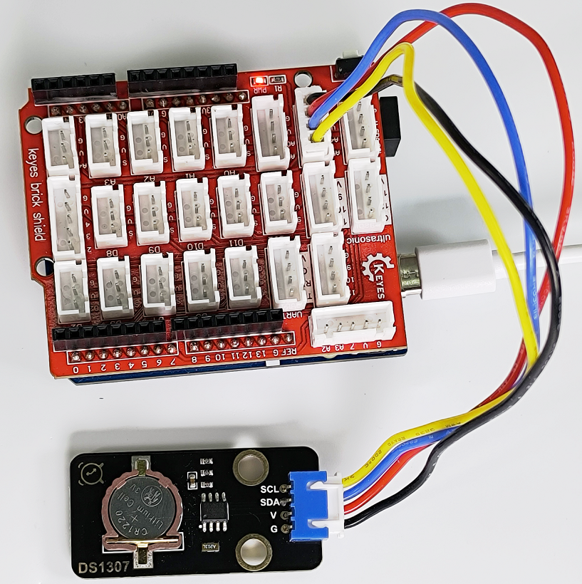

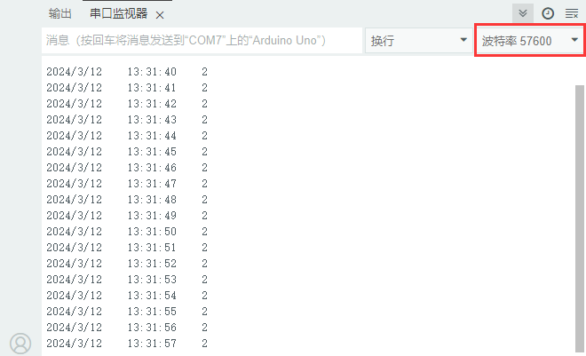

---

### 8. 代码说明

| 代码                          | 说明                       |
| ----------------------------- | -------------------------- |
| Rtc.Begin()                   | 启动DS1307实时时钟。       |
| Rtc.GetDateTime()             | 获取当前系统的时间和日期。 |
| Rtc.SetDateTime()             | 设置时间。                 |
| Rtc.GetDateTime().Year()      | 返回年份。                 |
| Rtc.GetDateTime().Month()     | 返回月份。                 |
| Rtc.GetDateTime().Day()       | 返回日期。                 |
| Rtc.GetDateTime().Hour()      | 返回小时。                 |
| Rtc.GetDateTime().Minute()    | 返回分钟。                 |
| Rtc.GetDateTime().Second()    | 返回秒数。                 |
| Rtc.GetDateTime().DayOfWeek() | 返回星期。                 |


---

## 第32课 ADXL345加速度传感器

### 1. 项目介绍

在这个套件中，有一个Keyes ADXL345加速度传感器模块，它主要由 ADXL345BCCZ 芯片组成。ADXL345BCCZ 是一款小而薄的低功耗3轴加速度计芯片，分辨率高（13位），测量范围达±16g，既能测量运动或冲击导致的动态加速度，也能测量静止加速度，例如重力加速度，使得器件可作为倾斜传感器使用。实验中，我们测试出传感器X、Y、Z轴的加速度数值，并且我们在串口监视器上显示测试数据。

---

### 2. 模块参数

工作电压：DC 3.3V~5V

测量范围：±16 g

工作温度：-10°C ~ +50°C

通讯方式：IIC/SPI 通信协议

尺寸：47.6mm x 23.8mm x 9.3mm

接口：2.54mm间距，4pin防反接口

---

### 3. 模块原理图


ADXL345是一款完整的3轴加速度测量系统，可选择的测量范围有±2g，±4g，±8g或±16g。它数字输出数据为16位二进制补码格式，可通过SPI（3线或4线）或I2C数字接口访问。该传感器可以在倾斜检测应用中测量静态重力加速度，还可以测量运动或冲击导致的动态加速度。其高分辨率(3.9mg/LSB)，能够测量不到1.0°的倾斜角度变化，非常适合移动设备应用。

---

### 4. 实验组件

|  |          |  |       
| ------------------------ | -------------------------------- | ---------------------------- |
| UNO R4 WiFi/Minima主板(二选一)| Keyes 传感器扩展板 x1 |Keyes ADXL345加速度传感器模块 x1 |    
|        |  |     |
|4P线(反向) x1 | USB线 x1|             |

---

### 5. 模块接线图

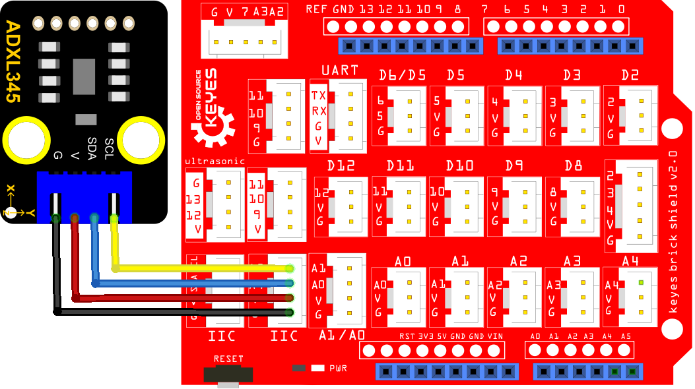

---

### 6. 实验代码

本项目中使用的代码保存在文件夹“<u>**项目代码**</u>”中，我们可以在此路径下打开代码文件''**adxl345.ino**"。

**注意：为了避免上传代码不成功，请上传代码前不要连接模块。代码上传成功后，拔下USB线断电，按照接线图正确接好模块后再用USB线连接到计算机上电，观察实验结果。**

```c++
/*  
 * 名称   : ADXL345
 * 功能   : 读取ADXL345的X/Y/Z值
 * 作者   : http://www.keyes-robot.com/ 
*/
#include "adxl345_io.h"
adxl345 adxl345(A4, A5); //I2C接口:SDA引脚接A4, SCL引脚接A5

float out_X, out_Y, out_Z;

void setup() {
  Serial.begin(57600);//启动串口监视器，波特率设置为57600
  adxl345.Init();
}

void loop() {
  adxl345.readXYZ(&out_X, &out_Y, &out_Z);
  Serial.print(out_X);
  Serial.print("g   ");
  Serial.print(out_Y);
  Serial.print("g   ");
  Serial.print(out_Z);
  Serial.println("g");
  delay(100);
}
```

参照第01课或第02课的示例，根据不同的 UNO R4 主板选择不同的主板板型和串口端口。

---

### 7. 实验结果

正确的主板板型和串口端口设置完成后，则上传代码。若代码上传不成功，提示“**adxl345_io.h: No such file or directory**”，请添加库文件。其添加方法请参照：[添加项目课程库文件](https://temp.keyesrobot.cn/projects/KE3083-KE3084-KE3085/en/latest/docs/%E6%95%99%E7%A8%8B/%E6%95%99%E7%A8%8B.html#id1)

再次上传代码，代码上传成功后，拔下USB线断电，然后按照接线图正确接好模块后再用USB线连接到计算机上电，打开串口监视器，设置波特率为 **<u>57600</u>**。

串口监视器打印出三轴加速度对应的值，单位为g。

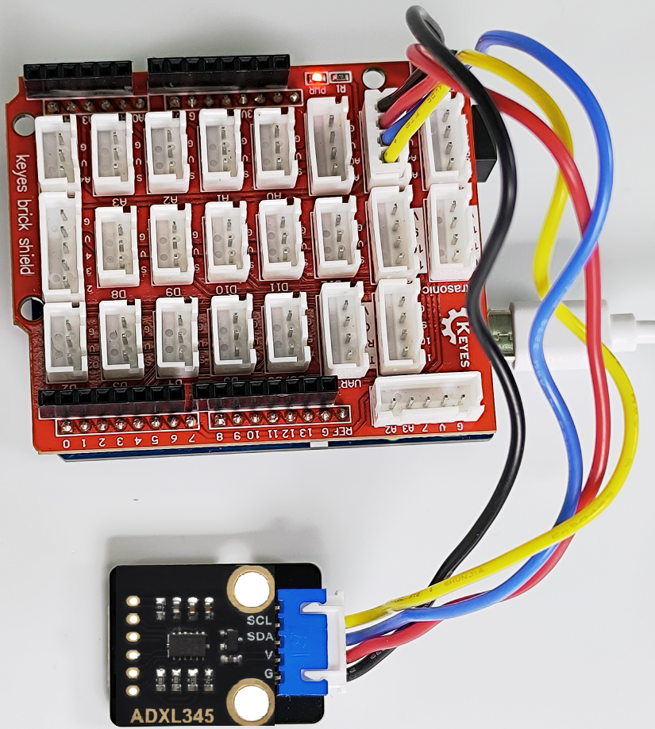

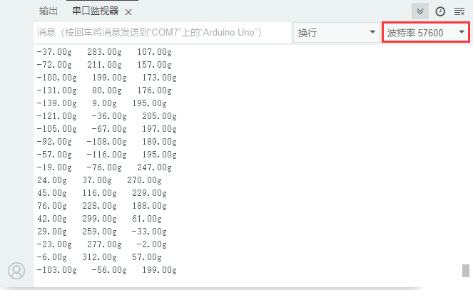

---

### 8. 代码说明

| 代码                                     | 说明                                                   |
| ---------------------------------------- | ------------------------------------------------------ |
| float out_X, out_Y, out_Z                | 设置3个小数变量，将所测结果赋值给out_X、out_Y、out_Z。 |
| adxl345.Init();                          | 初始化ADXX345加速度传感器。                            |
| adxl345.readXYZ(&out_X, &out_Y, &out_Z); | 获取X轴的加速度值返回给变量out_X,out_Y,out_Z。         |


---

## 第33课 TM1650四位数码管模块

### 1. 项目介绍

Keyes TM1650四位数码管模块选用的 0.36 英寸红色共阴4位数码管的驱动芯片是TM1650。TM1650是一种带键盘扫描接口的LED驱动控制专用电路的芯片。内部集成有MCU输入输出控制数字接口、数据锁存器、LED 驱动、键盘扫描等电路。TM1650性能稳定、质量可靠、抗干扰能力强，可适用于24小时长期连续工作的应用场合。TM1650采用两线串行传输协议通讯（注意：该数据传输协议不是标准的I2C协议）。该芯片只需要通过两个引脚与MCU通讯就可以完成数码管的驱动，可以节省MCU引脚资源。

实验中使用Keyes TM1650四位数码管模块时，我们只需要2根信号线即可使单片机控制4位数码管，大大节约了控制板IO口资源。

---

### 2. 模块参数

工作电压: DC 3.3V~5V 

工作电流: 42mA

最大功率: 0.21W

数码管显示颜色: 红色

LED极性: 共阴

通讯方式：2线高速串行接口（CLK,DAT）

工作温 ：-10°C ~ +50°C

尺寸：47.6mm x 23.8mm x 10.6mm

接口：2.54mm间距，4pin防反接口

---

### 3. 模块原理图


TM1650与MCU之间的通讯采用2线高速串行接口（CLK,DAT），这两个连线分别是数据线DAT和同步时钟线CLK。其中DAT为双向数据传输线，TM1650既用该线从MCU接收数据，也用该线向MCU发送数据。

实验中我们使用封装好的库函数。如果大家有兴趣也可以接着往下学习了解 3.1 TM1650通讯时序格式和 3.2 指令集说明，然后再去了解底层的库函数是如何实现的。

#### 3.1 TM1650通讯时序格式

TM1650采用下图1 中2线串行传输协议通讯：


（1）开始信号（START）/结束信号(STOP)

开始信号：保持 CLK 为“1”电平，DAT 从“1”跳“0”，认为是开始信号，如上图1的 A 段；

结束信号：保持 CLK 为“1”电平，DAT 从“0”跳“1”，认为是结束信号，如上图1的 E 段；

（2）ACK 信号

如果本次通讯正常，芯片在串行通讯的第 8 个时钟下降沿后，TM1650 主动把 DAT 拉低，直到 CLK 检测到上升沿，DAT 释放为输入状态（对芯片而言）,如上图1的 D 段。

（3）写“1”和写“0”

写“1”：保持 DAT 为“1”电平，CLK 从“0”跳到“1”,再从“1”跳到“0”，则认为是写入“1” ，如上图 1的 B 段。

写“0”：保持 DAT 为“0”电平，CLK 从“0”跳到“1”,再从“1”跳到“0”，则认为是写入“0” ，如上图 1的 C 段。

（4）一个字节（8 位）数据传输格式

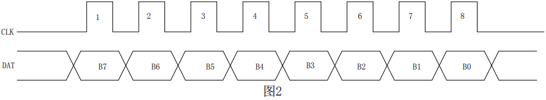

一个字节数据的传输格式如图上 2，数据发送时 MSB 在前，LSB 在后，即高位先进。微处理器的数据通过 2 线 串行接口和 TM1650 通信，当 CLK 是高电平时，DAT 上的信号必须保持不变；只有 CLK 上的时钟信号为低电平时， DAT 上的信号才能改变。数据输入的开始条件是 CLK 为高电平时，DAT 由高变低；结束条件是 CLK 为高时，DAT 由低电平变为高电平。 

（5）写显示操作


ADDRESS：显示地址（68H、6AH、6CH、6EH）； 

DATA：显示数据。

（6）完整操作时序

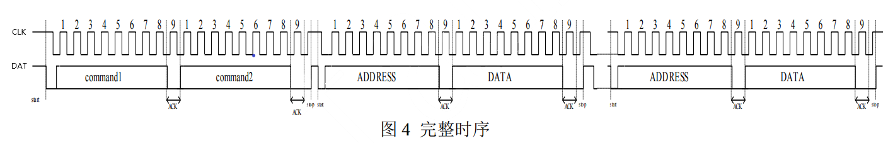

command1：系统命令 48H； 

command2：系统参数设置；

ADDRESS：显示地址（68H、6AH、6CH、6EH）；

DATA：显示数据。

备注：

1.设置系统参数和写入显存数据是两个独立的过程，它们之间的顺序不影响实际应用； 

2.每次输入系统命令（48H）和系统参数设置命令都会改变系统参数，请特别注意待机指令操作。

#### 3.2 指令集说明

（1）数据命令设置 


<span style="color: rgb(255, 76, 65);">注意：</span>使用的指令是 16 进制 H，输入数据和读取数据都是从高位开始。

所以在代码中我们数据命令设置为 0x48，使用TM1650点亮数码管的功能，而不使用按键扫描的功能。

（2）显示命令设置


<span style="color: rgb(255, 76, 65);">
注意：</span>在发送上述系统显示命令前需要先输入系统命令48H,如48H+11H=1级亮度开屏显示。

B[7:0]：这里实际是一个字节数据，只是不同位部分代表不同功能。

B[6:4]：设置数码管亮度。注意：000 最亮。

B[3]：设置是否显示小数点。

B[0]：设置数码管的开屏、关屏。

（3）显存地址


如果要显示小数点，则必须先需要将段模式设置为 8 段输出。


---

### 4. 实验组件

|  |       |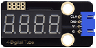|      
| ------------------------ | ----------------------------- | ---------------------------- |
|UNO R4 WiFi/Minima主板(二选一)| Keyes 传感器扩展板 x1 |Keyes TM1650四位数码管模块 x1| 
|        |  |     |
| 4P线(反向) x1 | USB线 x1|             |

---

### 5. 模块接线图


---

### 6. 实验代码

本项目中使用的代码保存在文件夹“<u>**项目代码**</u>”中，我们可以在此路径下打开代码文件''**Four_digital_tube.ino**"。

**注意：为了避免上传代码不成功，请上传代码前不要连接模块。代码上传成功后，拔下USB线断电，按照接线图正确接好模块后再用USB线连接到计算机上电，观察实验结果。**

```c++
/*  
 * 名称   : TM1650 Four digital tube
 * 功能   : TM1650四数码管显示0-9999
 * 作者   : http://www.keyes-robot.com/ 
*/
#include "TM1650.h"
#define CLK A5    //TM1650的引脚定义，可以更改为其他端口      
#define DIO A4
TM1650 DigitalTube(CLK,DIO);

void setup(){
  DigitalTube.setBrightness();  //设置亮度，0- 7，默认值:2
  DigitalTube.displayOnOFF();   //显示打开或关闭，0=显示关闭，1=显示打开，默认值:1
  for(char b=1;b<5;b++){
    DigitalTube.clearBit(b);    //清晰显示位
  }
  // DigitalTube.displayDot(1,true); //Bit0显示点，在displayBit()之前使用
  DigitalTube.displayBit(1,0);    //DigitalTube.display(bit,number); bit=0~3，number=0~9
}

void loop(){
  for(int num=0; num<10000; num++){
    displayFloatNum(num);
    delay(1000);
  }
}

void displayFloatNum(float num){
  if(num > 9999)
    return;
  int dat = num*10;
   //DigitalTube.displayDot(2,true); //Bit0显示点，在displayBit()之前使用
  if(dat/10000 != 0){
    DigitalTube.displayBit(1, dat%100000/10000);  
    DigitalTube.displayBit(2, dat%10000/1000);
    DigitalTube.displayBit(3, dat%1000/100);
    DigitalTube.displayBit(4, dat%100/10);
    return;
  }
  if(dat%10000/1000 != 0){
    DigitalTube.clearBit(1); 
    DigitalTube.displayBit(2, dat%10000/1000); 
    DigitalTube.displayBit(3, dat%1000/100);
    DigitalTube.displayBit(4, dat%100/10);
    return;
  }
  if(dat%1000/100 != 0){
  DigitalTube.clearBit(1); 
  DigitalTube.clearBit(2);
  DigitalTube.displayBit(3, dat%1000/100);
  DigitalTube.displayBit(4, dat%100/10);  
  return;
}
  DigitalTube.clearBit(1); 
  DigitalTube.clearBit(2);
  DigitalTube.clearBit(3);
  DigitalTube.displayBit(4, dat%100/10);
}
```

参照第01课或第02课的示例，根据不同的 UNO R4 主板选择不同的主板板型和串口端口。

---

### 7. 实验结果

正确的主板板型和串口端口设置完成后，则上传代码。若代码上传不成功，提示“**TM1650.h: No such file or directory**”，请添加库文件。其添加方法请参照：[添加项目课程库文件](https://temp.keyesrobot.cn/projects/KE3083-KE3084-KE3085/en/latest/docs/%E6%95%99%E7%A8%8B/%E6%95%99%E7%A8%8B.html#id1)

再次上传代码，代码上传成功后，拔下USB线断电。按照接线图正确接好模块后再用USB线连接到计算机上电。4位数码管显示数字，从0开始，每1000毫秒加1，直至加到9999后又从0开始循环。


---

### 8. 代码说明

| 代码                        | 说明                                                |
| --------------------------- | --------------------------------------------------- |
| DigitalTube.setBrightness() | 设置亮度，0- 7，默认值:2 。                         |
| DigitalTube.displayOnOFF()  | 显示打开或关闭，0=显示关闭，1=显示打开，默认值:1 。 |
| DigitalTube.clearBit(b)     | 清除位显示。                                        |


---

## 第34课 HT16K33_8X8点阵模块

### 1. 项目介绍

点阵，多个LED组成的阵列，他们的集合称为“阵”，其中单个单元称为“点”。8X8点阵共由64个发光二极管组成，且每个发光二极管是放置在行线和列线的交叉点上。

第二课我们学习了一个IO口控制一个led，这节课我们来学习用更少的IO口控制更多的led。

---

### 2. 模块参数

工作电压: DC 3.3V~5V 

工作电流: 190mA

最大功率: 0.95W

通讯方式：I2C通讯

I2C通信地址：0X70

点阵屏显示颜色：蓝色

工作温度：-10°C ~ +50°C

尺寸：32mm x 23.8mm x 9.3mm

接口：2.54mm间距，4pin防反接口

---

### 3. 模块原理图

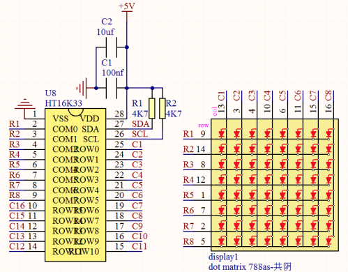

如原理图所示，如果想要点亮第一行第一列的LED灯，只需要将C1置高电平、R1置低电平就可以了。如果我们想让第一行led全部点亮，只需要将R1置为低电平，C1~C8全部置为高电平就可以了。原理非常简单，但是这样设置的话我们总共需要用到16个IO口，非常浪费单片机资源。为了节省IO口不浪费单片机资源，我们特别设计了这个HT16K33_8X8点阵模块，利用HT16K33芯片驱动1个8*8点阵，只需要利用单片机的I2C通信端口就能控制点阵的64个发光二极管。

我们这款Keyes HT16K33_8X8点阵模块已经固定了通信地址，地址为0x70。

---

### 4. 实验组件

|  |      |  |     
| ------------------------ | ---------------------------- | ---------------------------- |
| UNO R4 WiFi/Minima主板(二选一)| Keyes 传感器扩展板 x1 |Keyes HT16K33_8X8点阵模块 x1 | 
|        |  |     |
|4P线(反向) x1 | USB线 x1 |            |

---

### 5. 取模工具的使用说明：

点阵和驱动的原理都已经介绍完了，那点阵上显示的内容是怎么来的呢，有没有比较简便的方法？这里给大家介绍一款点阵取模工具，这块工具使用的是在线版，链接：[http://dotmatrixtool.com/#](http://dotmatrixtool.com/)

现在就一起看看怎么使用吧。

①打开链接如下图：

 

②我们的点阵是8*8的，所以调整高度为8，宽度为8，如下图：

 

③在**Byte order** 这里选择 **Row major** 这个模式

 

④将图案生成16进制的数据

如下图，按鼠标左键选中，右键取消，画好自己想要的图案，点击**Generate**，就会生成我们所需要的十六进制的数据了。

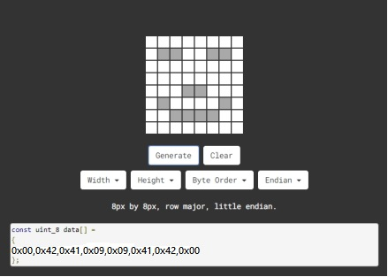 

这个生成的十六进制的代码（0x00,0x42,0x41,0x09,0x09,0x41,0x42,0x00）就是我们需要显示的内容，我们先保存好，等一下需要放到程序里面。

---

### 6. 模块接线图

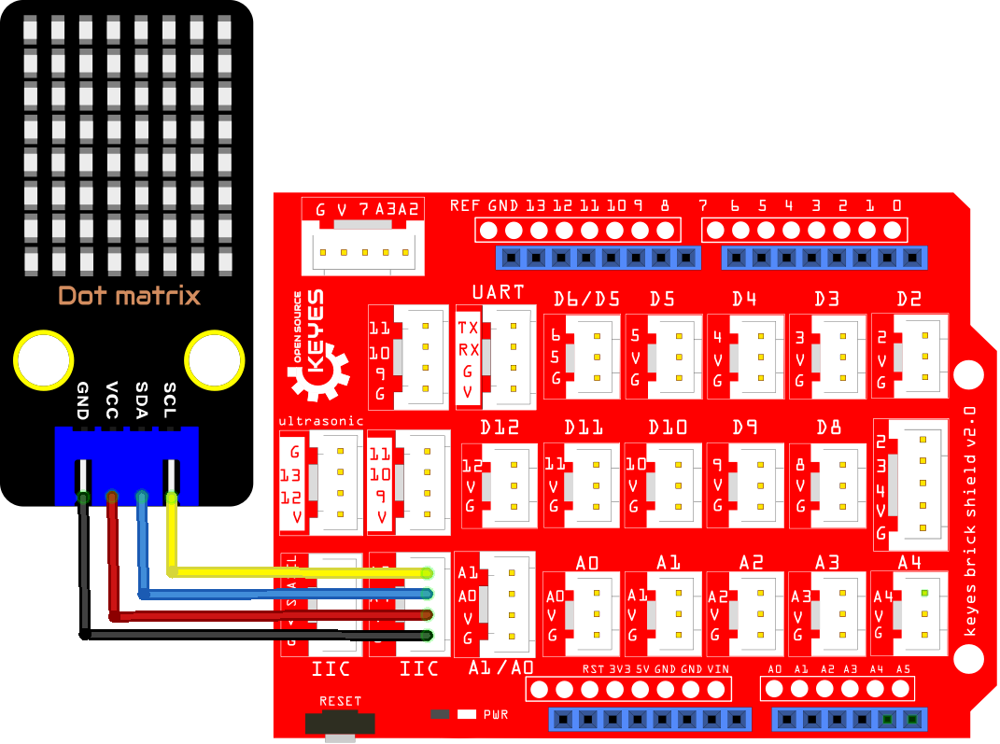

---

### 7. 实验代码

本项目中使用的代码保存在文件夹“<u>**项目代码**</u>”中，我们可以在此路径下打开代码文件''**HT16K33_88_dot_matrix.ino**"。

**注意：为了避免上传代码不成功，请上传代码前不要连接模块。代码上传成功后，拔下USB线断电，按照接线图正确接好模块后再用USB线连接到计算机上电，观察实验结果。**

```c++
 /*
 * 名称   : 8×8 Dot-matrix Display
 * 功能   : 8x8 LED点阵显示“笑脸”图案
 * 作者   : http://www.keyes-robot.com/ 
*/
#include <Matrix.h>  //HT16K33 8*8点阵模块库

Matrix myMatrix(A4,A5);  //I2C接口:SDA引脚接A4, SCL引脚接A5
uint8_t LedArray1[8]={0x00,0x42,0x41,0x09,0x09,0x41,0x42,0x00};
uint8_t  LEDArray[8];

void setup(){
  myMatrix.begin(0x70);  //初始化矩阵
}

void loop(){
  myMatrix.clear();
  for(int i=0; i<8; i++)
  {
    LEDArray[i]=LedArray1[i];
    for(int j=7; j>=0; j--)
    {
      if((LEDArray[i]&0x01)>0)
      myMatrix.drawPixel(j, i,1);
      LEDArray[i] = LEDArray[i]>>1;
    }
  }
  myMatrix.writeDisplay();
}
```

参照第01课或第02课的示例，根据不同的 UNO R4 主板选择不同的主板板型和串口端口。

---

### 8. 实验结果

正确的主板板型和串口端口设置完成后，则上传代码。若代码上传不成功，提示“**Matrix.h: No such file or directory**”，请添加库文件。其添加方法请参照：[添加项目课程库文件](https://temp.keyesrobot.cn/projects/KE3083-KE3084-KE3085/en/latest/docs/%E6%95%99%E7%A8%8B/%E6%95%99%E7%A8%8B.html#id1)

再次上传代码，代码上传成功后，拔下USB线断电。按照接线图正确接好模块后再用USB线连接到计算机上电。HT16K33_8X8点阵模块显示“笑脸”图案。


若代码上传成功后点阵屏不显示“笑脸”图案，尝试按一下RESET键。


---

### 9. 代码说明

点阵上的图案是由一个字节数据类型的数组构成的，我们用下面的表格表示。其中1表示亮，0表示灭，我们可以看到是一个“笑脸”图案。


一列一列来看，可以知道点亮“笑脸”图案的矩阵代码为{0x00,0x42,0x41,0x09,0x09,0x41,0x42,0x00}。

---

## 第35课 LCD_128X32_DOT模块

### 1. 项目介绍

在这个套件中，有一个Keyes LCD_128X32_DOT模块，它是一个像素为128*32的液晶屏模块，驱动芯片为 ST7567A。此模块使用IIC通信方式，我们提供了包含所有英文字母和常用符号的库，可以直接调用，还能设置让英文字母和符号显示不同文字大小。

---

### 2. 模块参数

工作电压：DC 5V

工作电流：100 mA

分辨率：128 X 32

最大功率：0.5W

通讯方式：IIC/SPI 通信协议

亮度、对比度可通过程序指令控制

工作温度：0°C ~ +40°C

尺寸：47.6mm x 23.8mm x 9.3mm

接口：2.54mm间距，4pin防反接口

---

### 3. 模块原理图

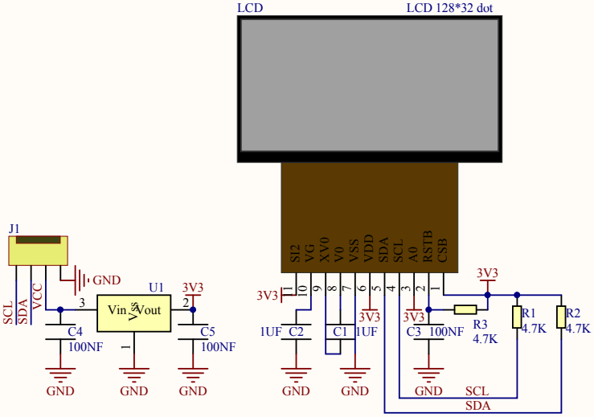

该模块使用IIC通讯原理，底层函数已经封装在库里面，直接调用库函数就可以。如果感兴趣的话可以自行了解底层驱动。

---

### 4. 实验组件

|  |     |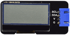 |   
| ------------------------ | --------------------------- | ---------------------------- |
| UNO R4 WiFi/Minima主板(二选一)|Keyes 传感器扩展板 x1 | Keyes LCD_128X32_DOT模块 x1 |   
|        |  |     |
| 4P线(反向) x1 | USB线 x1 |            |

---

### 5. 模块接线图

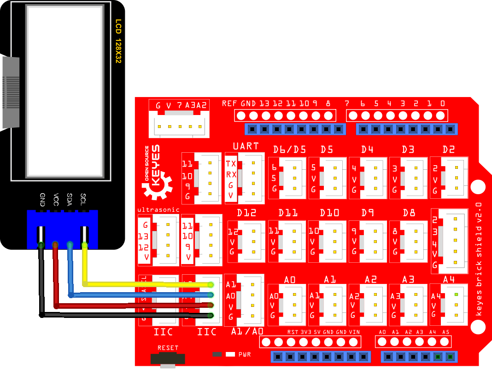

---

### 6. 实验代码

本项目中使用的代码保存在文件夹“<u>**项目代码**</u>”中，我们可以在此路径下打开代码文件''**lcd128_32.ino**"。

**注意：为了避免上传代码不成功，请上传代码前不要连接模块。代码上传成功后，拔下USB线断电，按照接线图正确接好模块后再用USB线连接到计算机上电，观察实验结果。**

```c++
/*  
 * 名称   : lcd128*32
 * 功能   : LCD128*32 显示字符串
 * 作者   : http://www.keyes-robot.com/ 
*/
#include <lcd.h>

lcd Lcd;  //LCD128*32屏的I2C接口:SDA引脚接A4, SCL引脚接A5

void setup() {
  Lcd.Init();  //lcd初始化
  Lcd.Clear();  //lcd清屏
}

void loop() {
  Lcd.Cursor(0, 7); //设置显示的位置
  Lcd.Display("KEYES"); //设置视图显示
  Lcd.Cursor(1, 0);
  Lcd.Display("ABCDEFGHIJKLMNOPQR");
  Lcd.Cursor(2, 0);
  Lcd.Display("123456789+-*/<>=$@");
  Lcd.Cursor(3, 0);
  Lcd.Display("%^&(){}:;'|?,.~\\[]");
}
```

参照第01课或第02课的示例，根据不同的 UNO R4 主板选择不同的主板板型和串口端口。

---

### 7. 实验结果

正确的主板板型和串口端口设置完成后，则上传代码。若代码上传不成功，提示“**lcd.h: No such file or directory**”，请添加库文件。其添加方法请参照：[添加项目课程库文件](https://temp.keyesrobot.cn/projects/KE3083-KE3084-KE3085/en/latest/docs/%E6%95%99%E7%A8%8B/%E6%95%99%E7%A8%8B.html#id1)

再次上传代码，代码上传成功后，拔下USB线断电。按照接线图正确接好模块后再用USB线连接到计算机上电，模块显示屏第一行显示“**KEYES**”、第二行显示“**ABCDEFGHIJKLMNOPQR**”、第三行显示“**123456789+-*/<>=$@**”、第四行显示“**%^&(){}:;'|?,.~\\[]**”。

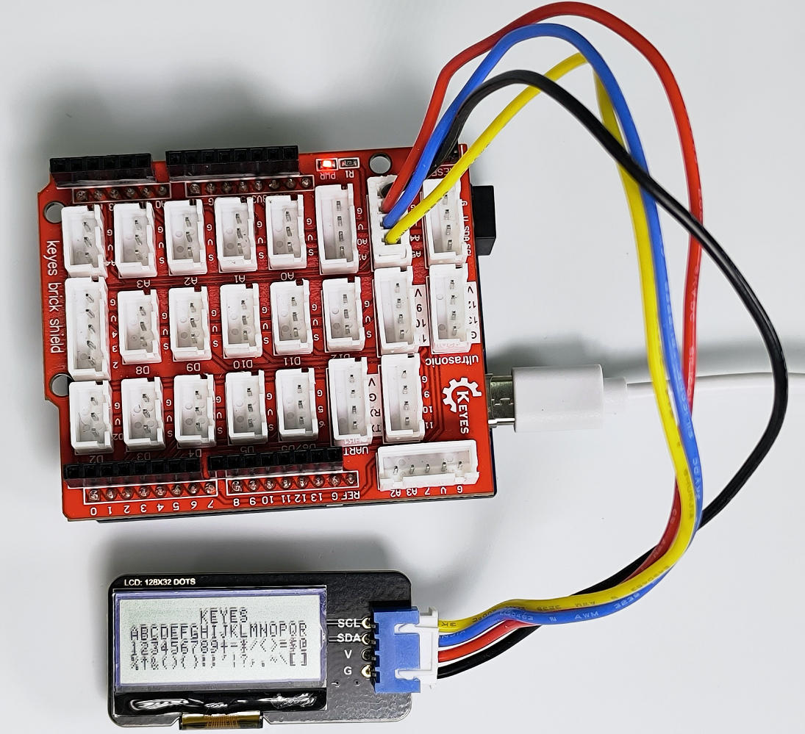

---

### 8. 代码说明

| 代码              | 说明           |
| ----------------- | -------------- |
| Lcd.Init()        | 初始化显示屏。 |
| Lcd.Clear()       | 清除显示。     |
| Lcd.Cursor(  ,  ) | 设置显示位置。 |
| Lcd.Display("  ") | 设置显示字符。 |


---

## 第36课 RFID刷卡模块

### 1. 项目介绍

在这个套件中，有一个Keyes RFID刷卡模块。RFIDRFID-RC522射频模块采用Philips MFRC522原装芯片设计读卡电路，使用方便，成本低廉，适用于设备开发、读卡器开发等高级应用的用户，也适用于需要进行射频卡终端设计/生产的用户。本模块可直接装入各种读卡器模具,通过IIC接口简单的2条线就可以直接与用户任何CPU主板或单片机相连接通信。
实验中用刷卡模块读取到的数据是4个16进制数，我们把这四个16进制数串以字符串的形式打印出来。例如本实验中读取到的IC卡的数据为：0xED、0xF7、0x94、0x5A，在串口监视器显示出信息字符串就是ED F7 94 5A；读取钥匙扣的数据为：0x4C、0x09、0x6B、0x6E，在串口监视器打印出来的信息字符串就是4C 09 6B 6E。有时候看到的不是两位数，是因为前面有个0省略了，如0a它显示的就是a。不同的IC卡和钥匙扣，其数据是不一样的。

---

### 2. 模块参数

工作电压: DC 3.3V~5V

工作电流: 13~100mA /DC 5V 

空闲电流: 10~13mA /DC 5V

休眠电流: < 80uA

峰值电流: < 100mA

工作频率: 13.56MHz

最大功率: 0.5W

支持的卡类型：mifare1 S50、mifare1 S70、mifare UltraLight、mifare Pro、mifare Desfire

数据传输速率：最大10Mbit/s

工作温度：-10°C ~ +50°C

尺寸：47.6mm x 23.8mm x 9.3mm

接口：2.54mm间距，4pin防反接口

---

### 3. 模块原理图

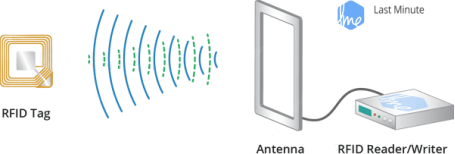

RFID（Radio Frequency Identification）：无线射频识别，读卡器由频射模块及高平磁场组成。Tag应答器为待感应设备，此设备不包含电池。他只包含微型集成电路芯片及存储数据的介质以及接收和发送信号的天线。读取tag中的数据，首先要放到读卡器的读取范围内。读卡器会产生一个磁场，因为磁能生电由楞次定律，RFID Tag就会供电，从而激活设备。


---

### 4. 实验组件

|  |  |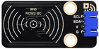        |
| ------------------------ | ------------------------ | ---------------------------- |
|UNO R4 WiFi/Minima主板(二选一)| Keyes 传感器扩展板 x1    |Keyes RFID刷卡模块 x1    |
| |     |     |
| 4P线(反向) x1 | USB线 x1                | IC 磁卡/钥匙扣 x1               | 

---

### 5. 模块接线图

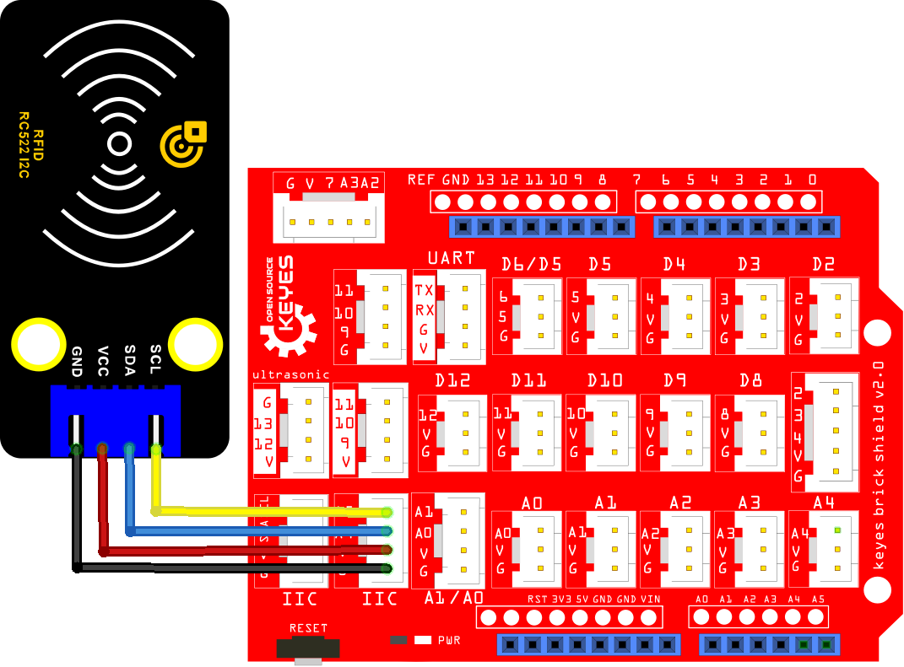

---

### 6. 实验代码

本项目中使用的代码保存在文件夹“<u>**项目代码**</u>”中，我们可以在此路径下打开代码文件''**RFID.ino**"。

**注意：为了避免上传代码不成功，请上传代码前不要连接模块。代码上传成功后，拔下USB线断电，按照接线图正确接好模块后再用USB线连接到计算机上电，观察实验结果。**

```c++
/*  
 * 名称   : RFID
 * 功能   : RFID读取器UID
 * 作者   : http://www.keyes-robot.com/ 
*/
#include "MFRC522_I2C_SOFT.h"

// 0x28是SDA上的i2c地址。如果不匹配，请用i2cscanner检查您的地址.
MFRC522 mfrc522(0x28, A4, A5);   // 创建MFRC522实例.

void setup() {
  Serial.begin(115200);           // 初始化与PC的串行通信
  mfrc522.PCD_Init();             // 初始化 MFRC522
  ShowReaderDetails();            // 显示详细的PCD - MFRC522读卡器细节
  Serial.println(F("Scan PICC to see UID, type, and data blocks..."));
}

void loop() {
  // 寻找新的卡片，如果有的话选择一张
  if ( ! mfrc522.PICC_IsNewCardPresent() || ! mfrc522.PICC_ReadCardSerial() ) {
    delay(50);
    return;
  }
  
  // 选择一张门卡，UID和SAK分别为mfrc522.uid  
  // 保存UID
  Serial.print(F("Card UID:"));
  for (byte i = 0; i < mfrc522.uid.size; i++) {
    Serial.print(mfrc522.uid.uidByte[i] < 0x10 ? " 0" : " ");
    Serial.print(mfrc522.uid.uidByte[i], HEX);
  } 
  Serial.println();
}

void ShowReaderDetails() {
  // 获得MFRC522软件
  byte v = mfrc522.PCD_ReadRegister(mfrc522.VersionReg);
  Serial.print(F("MFRC522 Software Version: 0x"));
  Serial.print(v, HEX);
  if (v == 0x91)
    Serial.print(F(" = v1.0"));
  else if (v == 0x92)
    Serial.print(F(" = v2.0"));
  else
    Serial.print(F(" (unknown)"));
  Serial.println("");
  // 返回0x00或0xFF时，可能是通信信号传输失败
  if ((v == 0x00) || (v == 0xFF)) {
    Serial.println(F("WARNING: Communication failure, is the MFRC522 properly connected?"));
  }
}
```

参照第01课或第02课的示例，根据不同的 UNO R4 主板选择不同的主板板型和串口端口。

---

### 7. 实验结果

正确的主板板型和串口端口设置完成后，则上传代码。若代码上传不成功，提示“**MFRC522_I2C_SOFT.h: No such file or directory**”，请添加库文件。其添加方法请参照：[添加项目课程库文件](https://temp.keyesrobot.cn/projects/KE3083-KE3084-KE3085/en/latest/docs/%E6%95%99%E7%A8%8B/%E6%95%99%E7%A8%8B.html#id1)

再次上传代码，代码上传成功后，拔下USB线断电。按照接线图正确接好模块后再用USB线连接到计算机上电，打开串口监视器，设置波特率为 **<u>115200</u>**。用IC卡和钥匙扣靠近RFID模块，串口监视器打印出RFID刷卡模块读取到的数据信息。

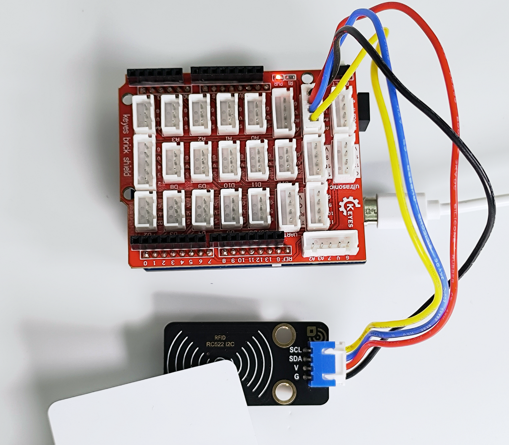

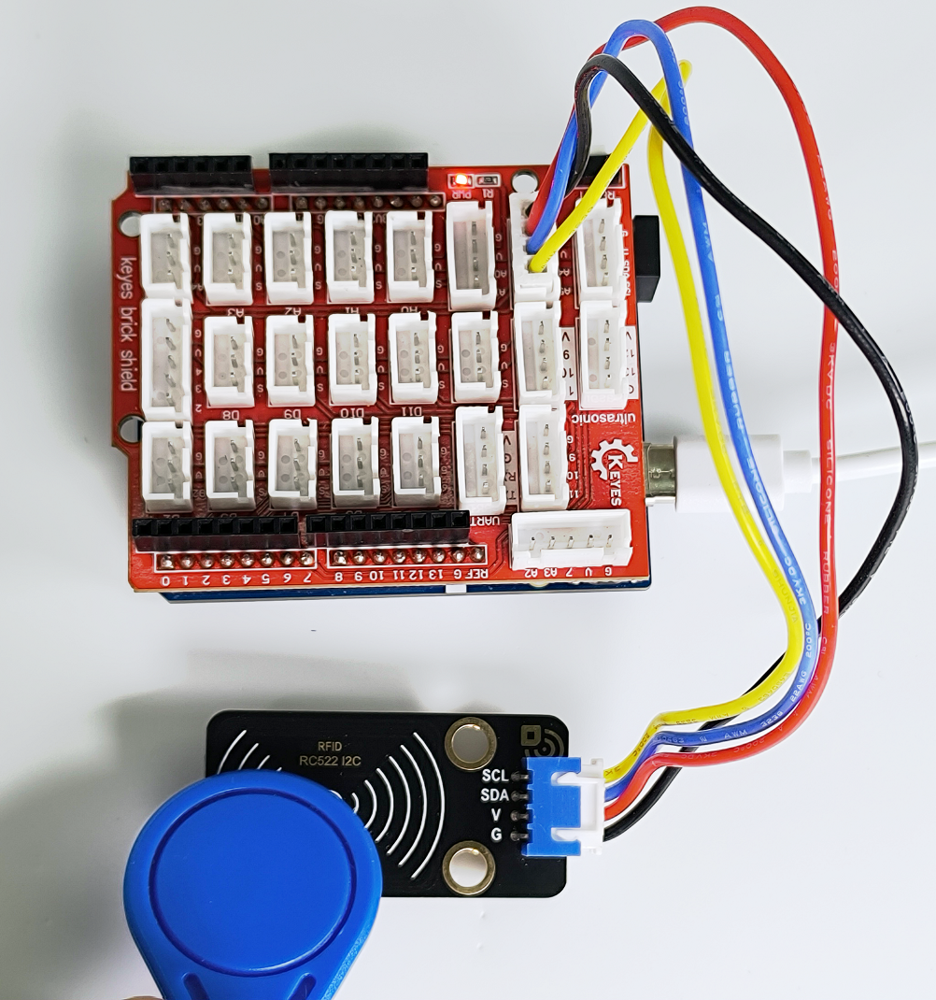

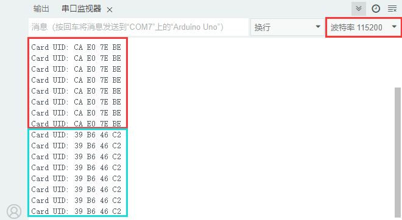

**注意：不同的IC卡和钥匙扣，其数据是不一样的。**<span style="background:#ff0;color:#000">请记录下你的IC卡和钥匙扣的UID码，后面的课程第49课会用到。</span>

若代码上传成功后串口监视器不打印数据信息，尝试按一下RESET键。


---

### 8. 代码说明

| 代码                                      | 说明                                 |
| ----------------------------------------- | ------------------------------------ |
| Wire.begin()                              | 进行IIC初始化。                      |
| mfrc522.PCD_Init()                        | MFRC522初始化。                      |
| Serial.print(mfrc522.uid.uidByte[i], HEX) | 将读取到16进制格式的值转为的字符串。 |

---

## 第37课 BMP388气压传感器

### 1. 项目介绍

在这个套件中，有一个Keyes BMP388气压传感器。它是一款新型高性能气压MEMS传感器，非常适用于消费电子无人机、可穿戴设备、智能家居和其他应用中的高度跟踪。BMP388气压传感器是可以检测温度和气压的传感器，是专为移动应用设计的绝对气压传感器。广泛应用于温度检测、大气压强检测、海拔高度检测、室内导航(楼层检测、电梯检测)、户外导航、休闲和运动的应用程序等

<span style="color: rgb(255, 76, 65);">注意：</span>由于传感器对环境条件非常敏感，请勿用手指触摸。

---

### 2. 模块参数

工作电压: DC 3.3V~5V

工作电流：30uA

最大功率：0.000015W

气压测量范围: 300hPa~1100hPa (elevation +9000~-500m)

气压测量误差: ±1hPa (±1m)

气压测量精度: 0.18Pa

温度测量范围: 0℃~ 65℃

温度测量误差 ±0.5℃，maximum ±1℃

温度测量精度: 0.1℃

通讯方式: I2C通信

尺寸 ：31.6mm x 23.8mm x 9.3mm

接口：IIC接口和2.54mm间距，5pin防反接口 (INT引脚可不接)

---

### 3. 模块原理图

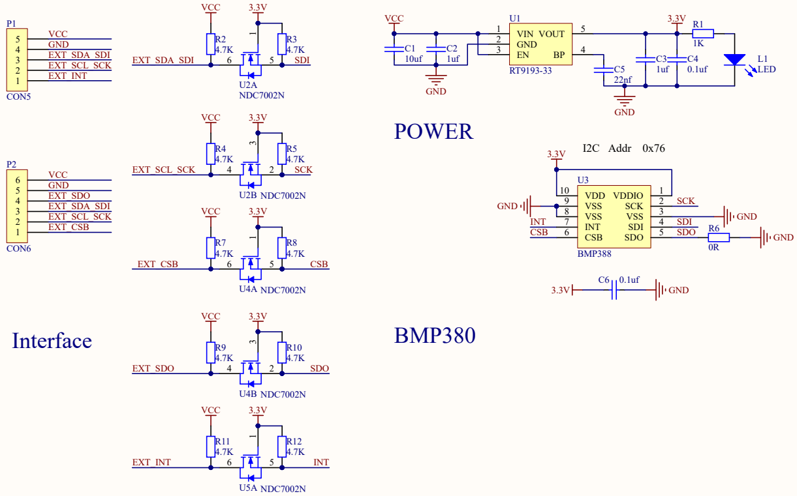

BMP180气压传感器的工作原理是基于压电效应和微机械结构（MEMS）。

BMP180内部包含一个微机械结构（MEMS）传感器（压阻传感器）、一个高精度模拟-数字转换芯片（ADC）和一个带E2PROM和串行I2C接口的控制单元。在传感器内部，有一个薄膜弹性体受到外界压力的作用而产生形变，这种形变会导致传感器内部气体压力变化。当外部气压发生变化时，传感器内的气压也随之改变，压力变化引起薄膜弹性体的位移量发生微小改变，微机械结构传感器将这个微小的形变转换成输出电信号。然后，经过PLL电路、ADC等处理电路进行放大和转换，最终通过I2C接口向外输出数字信号，提供给上层系统进行数据处理和分析。

此外，BMP180还包含了一个温度传感器，可以测量传感器本身的温度，并利用温度补偿技术来消除温度对气压测量带来的误差，从而提高测量精度和稳定性。在其带有的E2PROM里存储了176位单独校准数据，用于补偿传感器的偏移等其他参数。

---

### 4. 实验组件

|  |  | 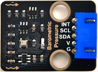 | 
| ------------------------ | ------------------------ | ---------------------------- |
|UNO R4 WiFi/Minima主板(二选一)| Keyes 传感器扩展板 x1    |Keyes BMP388气压传感器 x1 |   
|       |     |    |
| 4P转5P线(反向) x1 |USB线 x1 |               |


---

### 5. 模块接线图

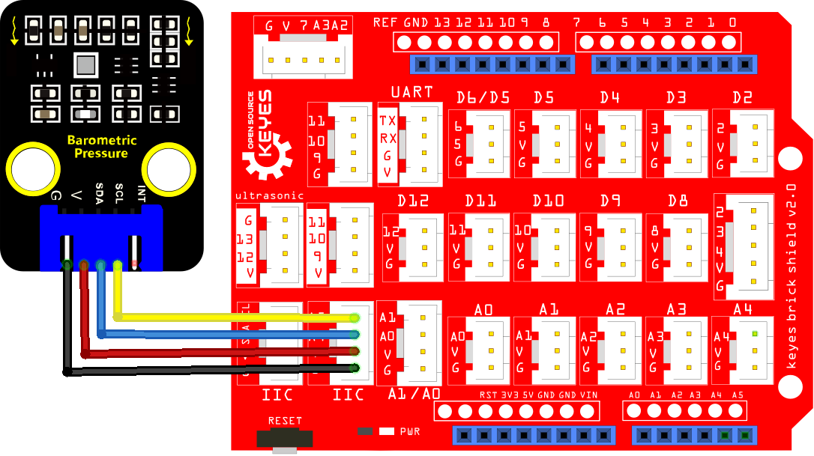

---

### 6. 实验代码

本项目中使用的代码保存在文件夹“<u>**项目代码**</u>”中，我们可以在此路径下打开代码文件''**bmp388_barometric_pressure.ino**"。

**注意：为了避免上传代码不成功，请上传代码前不要连接模块。代码上传成功后，拔下USB线断电，按照接线图正确接好模块后再用USB线连接到计算机上电，观察实验结果。**

```c++
/*  
 * 名称   : bmp388 barometric pressure
 * 功能   : 读取bmp388气压传感器检测的值
 * 作者   : http://www.keyes-robot.com/ 
*/
#include "Waveshare_BMP388.h"

void setup() {  //把你的设置代码放在这里，只运行一次:
  bool bRet;
  PRESS_EN_SENSOR_TYPY enPressureType;
  Serial.begin(115200);
  pressSensorInit( &enPressureType );
  if(PRESS_EN_SENSOR_TYPY_BMP388 == enPressureType){
    Serial.println("Pressure sersor is BMP388");
  }
  else{
    Serial.println("Pressure sersor NULL");
  }
  Serial.println("/-------------------------------------------------------------/");
  delay(1000);
}

void loop() {  // 把主代码放在这里，反复运行:
  int32_t s32PressureVal = 0, s32TemperatureVal = 0, s32AltitudeVal = 0;
  pressSensorDataGet(&s32TemperatureVal, &s32PressureVal, &s32AltitudeVal);
  Serial.print("Pressure : "); 
  Serial.print((float)s32PressureVal / 100);
  Serial.print(" Pa"); 
  Serial.print("   Altitude : "); 
  Serial.print((float)s32AltitudeVal / 100);
  Serial.print(" m");
  Serial.print("   Temperature : "); 
  Serial.print((float)s32TemperatureVal / 100);
  Serial.print(" ℃");
  Serial.println();
  delay(50);  
}
```

参照第01课或第02课的示例，根据不同的 UNO R4 主板选择不同的主板板型和串口端口。

---

### 7. 实验结果

正确的主板板型和串口端口设置完成后，则上传代码。若代码上传不成功，提示“**Waveshare_BMP388.h: No such file or directory**”，请添加库文件。其添加方法请参照：[添加项目课程库文件](https://temp.keyesrobot.cn/projects/KE3083-KE3084-KE3085/en/latest/docs/%E6%95%99%E7%A8%8B/%E6%95%99%E7%A8%8B.html#id1)

再次上传代码，代码上传成功后，拔下USB线断电。按照接线图正确接好模块后再用USB线连接到计算机上电，打开串口监视器，设置波特率为 **<u>115200</u>**，串口监视器显示大气压、海拔和温度。

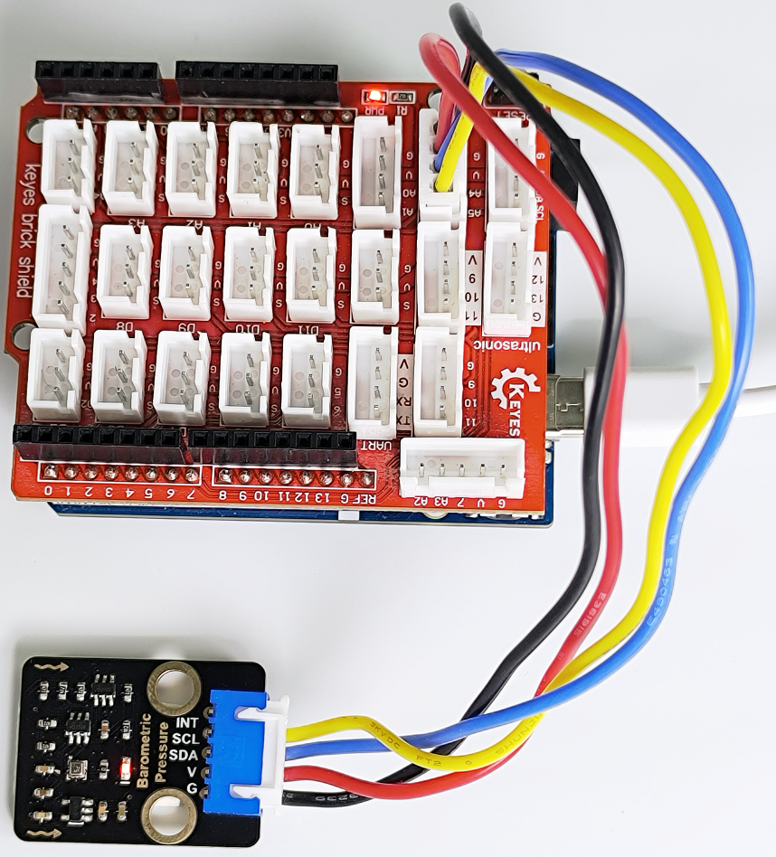

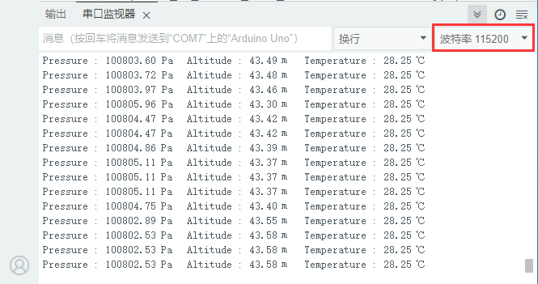

若代码上传成功后串口监视器不打印数据信息，尝试按一下RESET键。


---

### 8. 代码说明

| 代码                                      | 说明                                 |
| ----------------------------------------- | ------------------------------------ |
|int32_t s32PressureVal = 0, s32TemperatureVal = 0, s32AltitudeVal = 0;| 设置初始值.|
|pressSensorDataGet(&s32TemperatureVal, &s32PressureVal, &s32AltitudeVal); | 检测并读取温度值，海拔高度值，大气压强值   |


---

## 第38课 TCS34725颜色传感器

### 1. 项目介绍

在这个套件中，有一个Keyes TCS34725 颜色传感器，TCS34725是一款低成本，高性价比的RGB全彩颜色识别传感器，传感器通过光学感应来识别物体的表面颜色。支持红、绿、蓝(RGB)三基色，支持明光感应，可以输出对应的具体数值，帮助您还原颜色本真。广泛的应用于RGBLED背光控制、固态照明、健康产品、工业过程控制和医疗诊断设备等。

---

### 2. 模块参数

工作电压：DC 3.3V~5V

工作电流：0.5mA

最大功率：0.0025W

检测距离：3-10mm

时钟频率：0-400KHZ

I2C地址：0x29

通讯方式：I2C通信

尺寸：31.6mm x 23.8mm x 9.3mm

接口：IIC接口和2.54mm间距，5pin防反接口 (LED引脚可不接)

---

### 3. 模块原理图

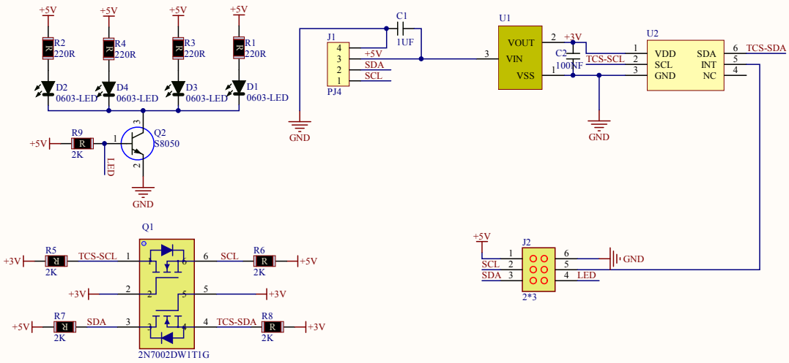

TCS34725颜色传感器的工作原理主要基于光学感应和数字信号处理。它通过四个硅光电二极管分别测量光的红色、蓝色、绿色成分以及整个光线的亮度，并将这些信息转换成数字信号输出。具体来说，传感器通过照明LED发光，照射到被测物体后，返回光经过滤镜和光学系统，被四个硅光电二极管接收。这些二极管将接收到的光信号转换成电信号，然后通过数字信号处理电路将这些电信号转换成RGB（红、绿、蓝）三基色的强度数值。

TCS34725传感器能够输出RGB三色的数值，以还原周围的颜色。这些数值是通过将R、G、B三个通道的亮度除以一个参考通道（通常为C通道）的亮度得到的比值，然后将这些比值乘以255得到确定数值，即色彩数据格式为255:255:255。通过这种方式，传感器能够识别和测量周围物体的表面颜色。

此外，传感器的管脚定义包括工作电压、检测距离、工作温度和通信接口等参数，支持I2C通信，最高频率可达400kHz。传感器的工作电流大约为65uA。在软件接口方面，可以使用Python的库来创建颜色传感器的驱动对象，并获取环境颜色的RGB值，这些值是通过传感器内部的算法处理得到的。

---

### 4. 实验组件

|  |  |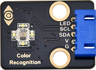 |    
| ------------------------ | ------------------------ | ---------------------------- |
| UNO R4 WiFi/Minima主板(二选一)| Keyes 传感器扩展板 x1    |Keyes TCS34725颜色传感器 x1|    
|       |    |    |
| 4P转5P线(反向) x1 |USB线 x1  |              |

---

### 5. 模块接线图

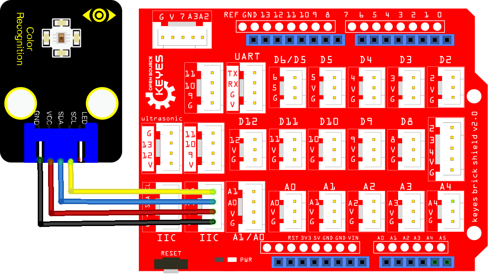

---

### 6. 实验代码

本项目中使用的代码保存在文件夹“<u>**项目代码**</u>”中，我们可以在此路径下打开代码文件''**TCS34725_Color_Recognition.ino**"。

**注意：为了避免上传代码不成功，请上传代码前不要连接模块。代码上传成功后，拔下USB线断电，按照接线图正确接好模块后再用USB线连接到计算机上电，观察实验结果。**

```c++
/*  
 * 名称   : TCS34725 Color Recognition
 * 功能   : 读取TCS34725颜色传感器检测的颜色值
 * 作者   : http://www.keyes-robot.com/ 
*/
#include "Adafruit_TCS34725.h"
/* Adafruit TCS34725 breakout库的示例代码 */

/* Connect SCL    to analog 5 (A5)
   Connect SDA    to analog 4 (A4)
   Connect  V     to DC 5V(V)
   Connect GROUND to common ground */
   
/* 使用默认值初始化 (int time = 2.4ms, gain = 1x) */
// Adafruit_TCS34725 tcs = Adafruit_TCS34725();

/* 用特定的int时间和增益值初始化 */
Adafruit_TCS34725 tcs = Adafruit_TCS34725(TCS34725_INTEGRATIONTIME_700MS, TCS34725_GAIN_1X);

void setup(void) {
  Serial.begin(9600); 
  if (tcs.begin()) {
    Serial.println("Found sensor");
  } else {
    Serial.println("No TCS34725 found ... check your connections");
    while (1);
  } 
  // 现在准备阅读了!
}

void loop(void) {
  uint16_t r, g, b, c, colorTemp, lux; 
  tcs.getRawData(&r, &g, &b, &c);
  colorTemp = tcs.calculateColorTemperature(r, g, b);
  lux = tcs.calculateLux(r, g, b);
  
  Serial.print("Color Temp: "); Serial.print(colorTemp, DEC); Serial.print(" K - ");
  Serial.print("Lux: "); Serial.print(lux, DEC); Serial.print(" - ");
  Serial.print("R: "); Serial.print(r, DEC); Serial.print(" ");
  Serial.print("G: "); Serial.print(g, DEC); Serial.print(" ");
  Serial.print("B: "); Serial.print(b, DEC); Serial.print(" ");
  Serial.print("C: "); Serial.print(c, DEC); Serial.print(" ");
  Serial.println(" ");
} 
```

参照第01课或第02课的示例，根据不同的 UNO R4 主板选择不同的主板板型和串口端口。

---

### 7. 实验结果

正确的主板板型和串口端口设置完成后，则上传代码。若代码上传不成功，提示“**Adafruit_TCS34725.h: No such file or directory**”，请添加库文件。其添加方法请参照：[添加项目课程库文件](https://temp.keyesrobot.cn/projects/KE3083-KE3084-KE3085/en/latest/docs/%E6%95%99%E7%A8%8B/%E6%95%99%E7%A8%8B.html#id1)

再次上传代码，代码上传成功后，拔下USB线断电。按照接线图正确接好模块后再用USB线连接到计算机上电，打开串口监视器，设置波特率为 **<u>9600</u>**，串口监视器显示检测的物体颜色（白色）的数据，如下图。也可以换其他的颜色物体来检测。

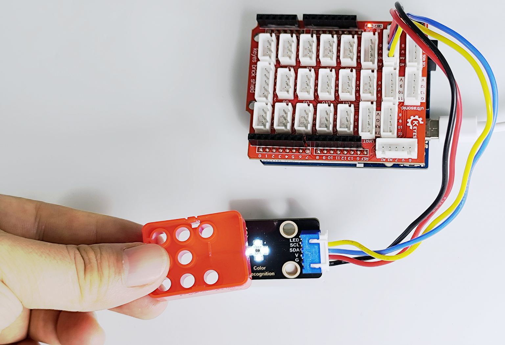

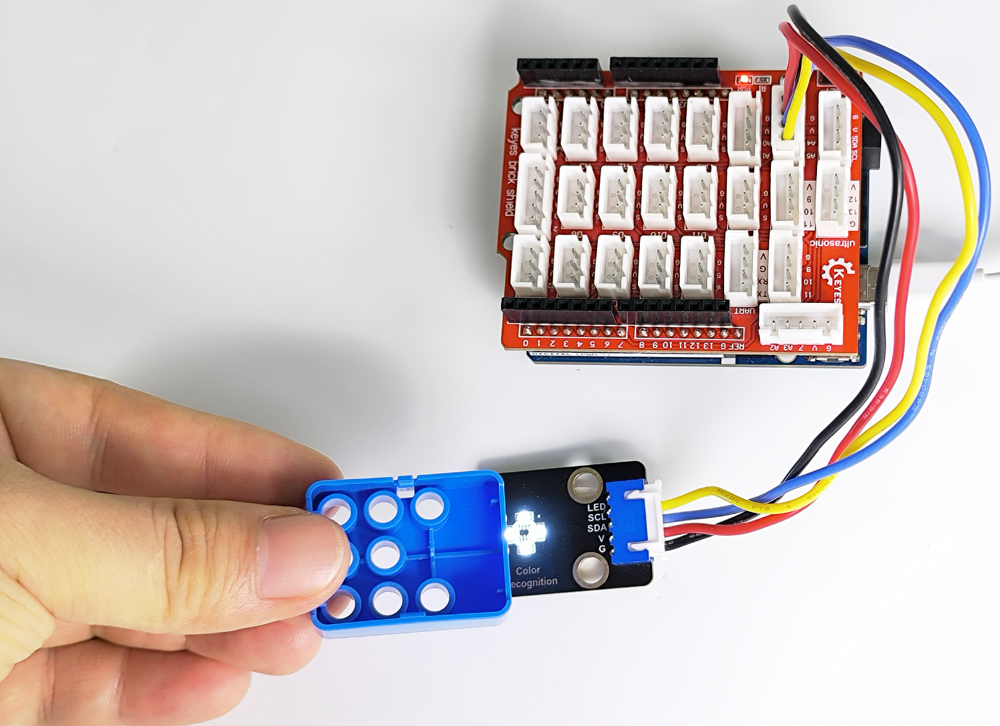

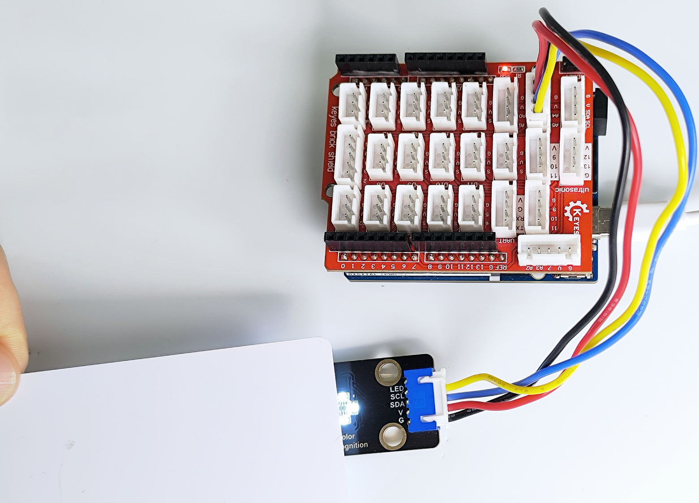

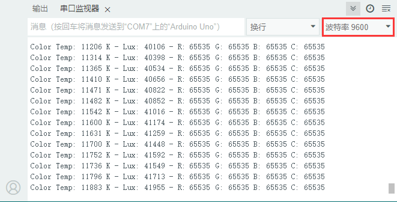

若代码上传成功后串口监视器不打印数据信息，尝试按一下RESET键。


---

### 8. 代码说明

| 代码                                      | 说明                                 |
| ----------------------------------------- | ------------------------------------ |
|Adafruit_TCS34725 tcs = Adafruit_TCS34725(TCS34725_INTEGRATIONTIME_700MS, TCS34725_GAIN_1X);|用特定的int时间和增益值初始化|

---

# 5. 传感器/模块组合项目课程

前面课程中，我们单独测试了传感器/模块的功能，功能比较单一。在此，我们可以将多个传感器/模块搭配使用，组合出各种各样的功能。传感器/模块种类比较多，我们只是选择几款比较经典的组合实验。你们也可以根据自己的想法，自己设置代码，组合出你想要的特别的功能。

---

## 第39课 按键控制RGB灯

### 1. 项目介绍

从前面的实验课程中我们学习了自锁按键模块，按下自锁按键时，单片机读取到低电平；再次按自锁按键（按起自锁按键）时，读取到高电平。在这一实验课程中，我们将自锁按键模块和RGB模块组合模拟小台灯，实现按下自锁按键时，RGB模块上的RGB LED点亮；再次按下自锁按键（按起自锁按键）时，RGB模块上的RGB LED不亮。

---

### 2. 实验组件

|  | || |
| ------------------------ | ------------------------ | ------------------------ | ------------------------ | 
| UNO R4 WiFi/Minima主板(二选一)| Keyes 传感器扩展板 x1    |Keyes 自锁按键模块 x1    |4P线(反向) x1 | 
|  |        |  |     |
| Keyes RGB模块 x1     | 3P线(反向) x1 | USB线  x1    |         |     

---

### 3. 实验接线图

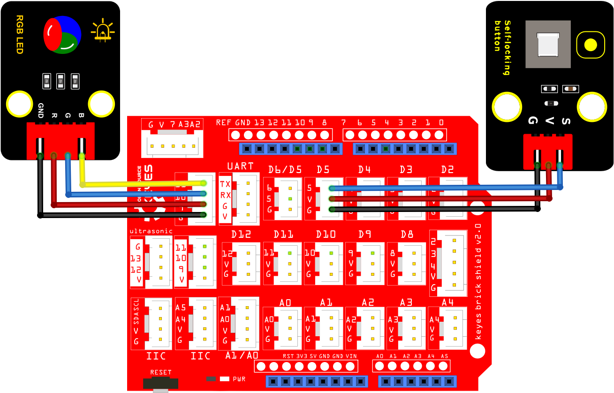

---

### 4. 实验代码

本项目中使用的代码保存在文件夹“<u>**项目代码**</u>”中，我们可以在此路径下打开代码文件''**Button_control_rgb.ino**"。

**注意：为了避免上传代码不成功，请上传代码前不要连接模块。代码上传成功后，拔下USB线断电，按照接线图正确接好模块后再用USB线连接到计算机上电，观察实验结果。**

```c++
/* 
 * 名称   : Button_control_rgb
 * 功能   : 模拟一个小台灯
 * 作者   : http://www.keyes-robot.com/ 
*/
#define PIN_BUTTON  5  //将自锁按键的引脚连接到D5
int val = 0;            //用于存储键值

int redpin = 9;    // 定义红色LED引脚D9
int greenpin = 10; // 定义绿色LED引脚D10
int bluepin = 11;  // 定义蓝色LED引脚D11

void setup() {
  Serial.begin(9600);//启动串口监视器，设置波特率为9600
  pinMode(PIN_BUTTON, INPUT);  //设置自锁按键的引脚为输入模式
  pinMode(redpin, OUTPUT);   //设置红色LED引脚为输出模式
  pinMode(greenpin, OUTPUT); //设置绿色LED引脚为输出模式
  pinMode(bluepin, OUTPUT);  //设置蓝色LED引脚为输出模式
}

// 循环函数会一直运行下去
void loop() {
  val = digitalRead(PIN_BUTTON);  //读取自锁按键的值并将其赋值给变量val
  Serial.println(val);          //打印变量val的值
  if (val == 0) {             //按下自锁按键时读取到低电平，RGB亮白灯
    analogWrite(redpin, 255);  //给PWM口(D9)写入一个255的模拟值
    analogWrite(greenpin, 255);
    analogWrite(bluepin, 255);
  }
  else {   //按起自锁按键时读取到高电平，RGB不亮
    analogWrite(redpin, 0);  //给PWM口(D9)写入一个0的模拟值
    analogWrite(greenpin, 0);
    analogWrite(bluepin, 0);
  } 
}
```

参照第01课或第02课的示例，根据不同的 UNO R4 主板选择不同的主板板型和串口端口。

---

### 5. 实验结果

代码上传成功后，拔下USB线断电，按照接线图正确接好模块后再用USB线连接到计算机上电，按下自锁按键，RGB模块上的RGB LED亮白灯，再次按下自锁按键(自锁按键按起)，RGB模块上的RGB LED不亮。循环进行。

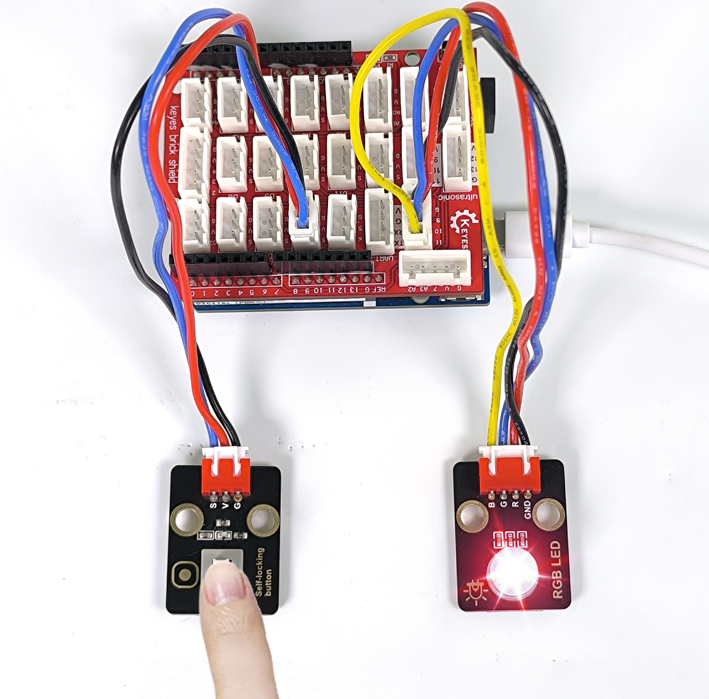

---

### 6. 代码说明

| 代码                                   | 说明                                                         |
| -------------------------------------- | ------------------------------------------------------------ |
| val = digitalRead(PIN_BUTTON) | 读取自锁按键的值并将其赋值给变量val|
| if( ){ } else{ }       | 这是判断语句，如果（ ）里的表达式为真，则执行 if { }块内的代码。如果（ ）里表达式为假 ，则执行 else { }块内的代码。 |
|analogWrite(redpin, val);  | val的值为0~255，RGB亮对应的颜色灯，当val=0时，未点亮|

---

## 第40课 障碍物报警实验

### 1. 项目介绍

在前面实验课程中中，我们使用一个输入模块控制另一个输出模块。在这一实验中，我们还是用一个模块控制另一个模块。

生活中，我们可以利用一个检测传感器控制一个有源蜂鸣器响起，做声光报警设备，如检测倾斜（倾斜模块）等等。这一实验课程中我们将避障传感器和有源蜂鸣器模块组合实验，实现避障传感器检测到障碍物时有源蜂鸣器响起的效果。

---

### 2. 实验组件

|  |  |  |  | 
| ------------------------ | ------------------------ | ------------------------ | ---------------------------- | 
|UNO R4 WiFi/Minima主板(二选一)| Keyes 传感器扩展板 x1      |Keyes 避障传感器 x1      | Keyes 有源蜂鸣器模块 x1  |
|       |  | | |
| 3P线(反向) x2 | USB线 x1             | 一字螺丝刀 x1         |    |

---

### 3. 实验接线图

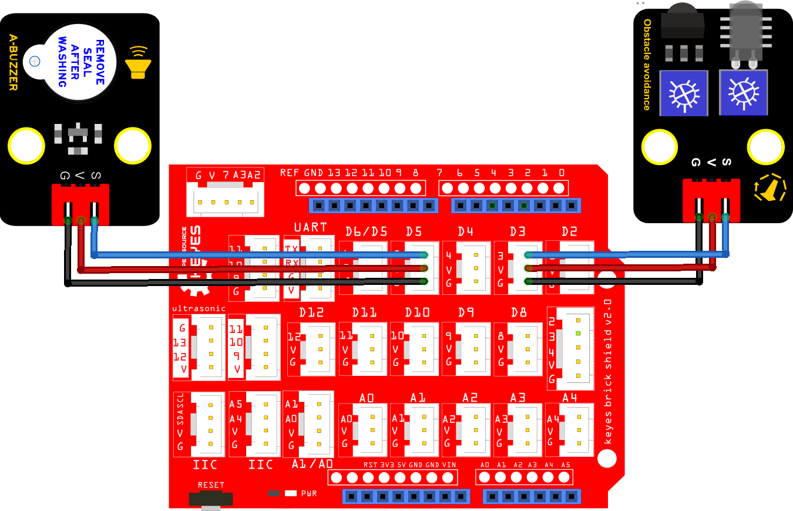

---

### 4. 实验代码

本项目中使用的代码保存在文件夹“<u>**项目代码**</u>”中，我们可以在此路径下打开代码文件''**Avoiding_alarm.ino**"。

**注意：为了避免上传代码不成功，请上传代码前不要连接模块。代码上传成功后，拔下USB线断电，按照接线图正确接好模块后再用USB线连接到计算机上电，观察实验结果。**

```c++
/*  
 * 名称   : Avoiding alarm
 * 功能   : 避障传感器控制蜂鸣器
 * 作者   : http://www.keyes-robot.com/ 
*/
int item = 0;

void setup() {
  Serial.begin(9600);//启动串口监视器，设置波特率为9600
  pinMode(3, INPUT);  //避障传感器连接D3，设置为输入模式
  pinMode(5, OUTPUT); //将蜂鸣器连接到D5上并设置为输出模式
}

void loop() {
  item = digitalRead(3); //读取避障传感器输出的电平值
  Serial.println(item);  //打印变量item的值
  if (item == 0) {//检测到障碍物
    digitalWrite(5, HIGH);//蜂鸣器响起
  } else { //未检测到障碍物
    digitalWrite(5, LOW); //蜂鸣器关闭
  }
  delay(100);//延迟100ms
}
```

参照第01课或第02课的示例，根据不同的 UNO R4 主板选择不同的主板板型和串口端口。

---

### 5. 实验结果

代码上传成功后，拔下USB线断电，按照接线图正确接好模块后再用USB线连接到计算机上电。当避障传感器检测到障碍物时，避障传感器上SLED灯亮起，同时有源蜂鸣器发出声响；当避障传感器检测不到障碍物时，有源蜂鸣器停止发出声响。

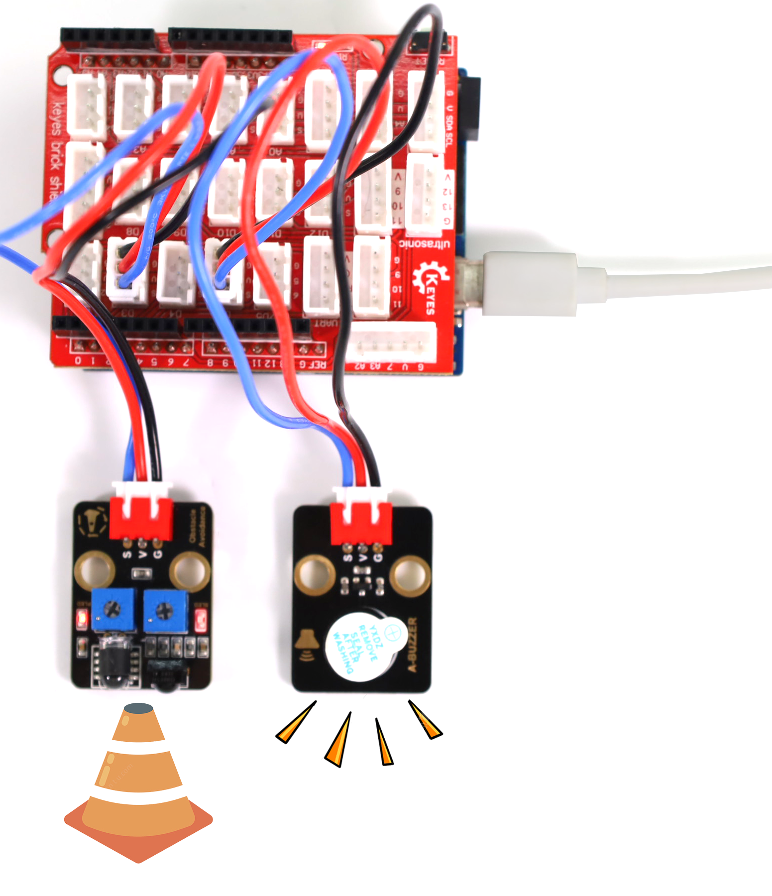

---

### 6. 代码说明

| 代码                   | 说明                     |
| ---------------------- | ------------------------ |
| item == 0              | 避障传感器检测到障碍物。 |
| digitalWrite(5, HIGH) | 有源蜂鸣器发出声响。     |
| digitalWrite(5, LOW)  | 有源蜂鸣器停止发出声响。 |


---

## 第41课 入侵检测报警器

### 1. 项目介绍

上一课实验中我们学习了使用避障传感器检测障碍物进行报警提醒。在这一实验课程中我们将人体红外热释传感器、RGB模块和有源蜂鸣器模块组合实验，实现人体红外热释传感器检测到附近有人经过时，有源蜂鸣器响起，RGB模块上的RGB LED随机显示不同颜色光的效果。

---

### 2. 实验组件

|  |      |     |  |
| ------------------------ | ---------------------------- | ------------------------ |------------------------ |
| UNO R4 WiFi/Minima主板(二选一) | Keyes 传感器扩展板 x1  |Keyes 人体红外热释传感器 x1  | Keyes 有源蜂鸣器模块 x1  |
| |   | ||  
|Keyes RGB模块 x1|3P线(反向) x2 | 4P线(反向) x1|USB线  x1   |  

---

### 3. 模块接线图

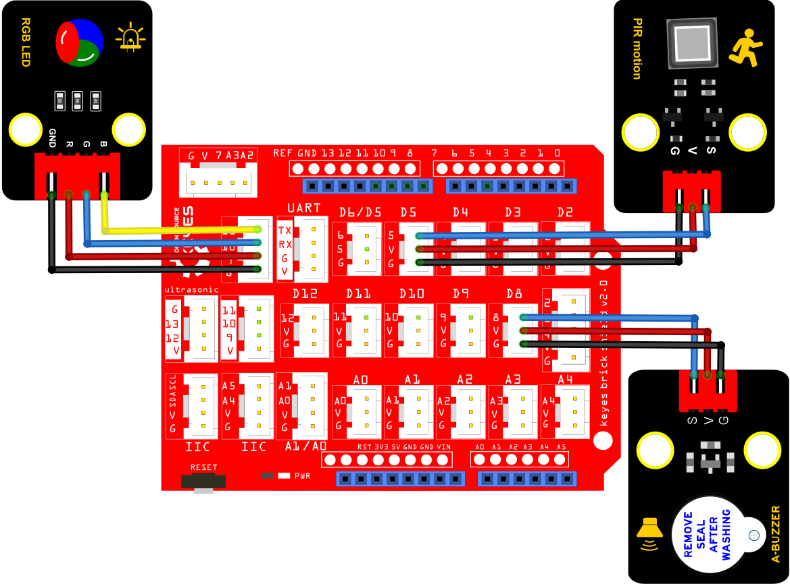

---

### 4. 实验代码

本项目中使用的代码保存在文件夹“<u>**项目代码**</u>”中，我们可以在此路径下打开代码文件''**PIR_alarm.ino**"。

**注意：为了避免上传代码不成功，请上传代码前不要连接模块。代码上传成功后，拔下USB线断电，按照接线图正确接好模块后再用USB线连接到计算机上电，观察实验结果。**

```c++
/*  
 * 名称   : PIR alarm
 * 功能   : PIR控制蜂鸣器和SK6812 RGB模块
 * 作者   : http://www.keyes-robot.com/ 
*/
#define PIR_PIN  5     //PIR运动传感器控制引脚为D5
#define BUZZER_PIN  8  //定义有源蜂鸣器控制引脚为D8
int item = 0;

int redpin = 9;    // 定义红色LED引脚D9
int greenpin = 10; // 定义绿色LED引脚D10
int bluepin = 11;  // 定义蓝色LED引脚D11
int val;

void setup() {
  Serial.begin(9600);//启动串口监视器，设置波特率为9600
  pinMode(PIR_PIN, INPUT);  //设置PIR运动传感器的引脚为输入模式
  pinMode(BUZZER_PIN, OUTPUT); //设置有源蜂鸣器的引脚为输出模式
  pinMode(redpin, OUTPUT);   //设置红色LED引脚为输出模式
  pinMode(greenpin, OUTPUT); //设置绿色LED引脚为输出模式
  pinMode(bluepin, OUTPUT);  //设置蓝色LED引脚为输出模式
}

void loop() {
  item = digitalRead(PIR_PIN);//读取红外热释传感器输出的数字信号
  Serial.println(item);          //打印变量item的值
  if (item == 1) {  //运动检测
    digitalWrite(BUZZER_PIN, HIGH); //打开蜂鸣器
    for(val = 0; val < 255; val++){  //val的值不断由0增加到255
      analogWrite(bluepin, val);  //给PWM口(D11)写入一个0 ~ 255的模拟值
      analogWrite(greenpin, 255-val);
      analogWrite(redpin, 128-val);
      delay(3); 
      }
    for(val = 255; val > 0; val--){  //val的值不断由255减少到0
      analogWrite(bluepin, val);
      analogWrite(greenpin, 255-val);
      analogWrite(redpin, 128-val);
      delay(3); 
      }
  } else {  //没有检测到任何信号或数据
    digitalWrite(BUZZER_PIN, LOW); //关掉蜂鸣器
    analogWrite(bluepin, 0);
    analogWrite(greenpin, 0);
    analogWrite(redpin, 0);
  }
}
```

参照第01课或第02课的示例，根据不同的 UNO R4 主板选择不同的主板板型和串口端口。

---

### 5. 实验结果

代码上传成功后，拔下USB线断电，按照接线图正确接好模块后再用USB线连接到计算机上电。当人体红外热释传感器检测到附近有人经过时，人体红外热释传感器上的红灯灭，有源蜂鸣器发出警报，RGB模块上的RGB LED随机显示不同颜色光的效果。

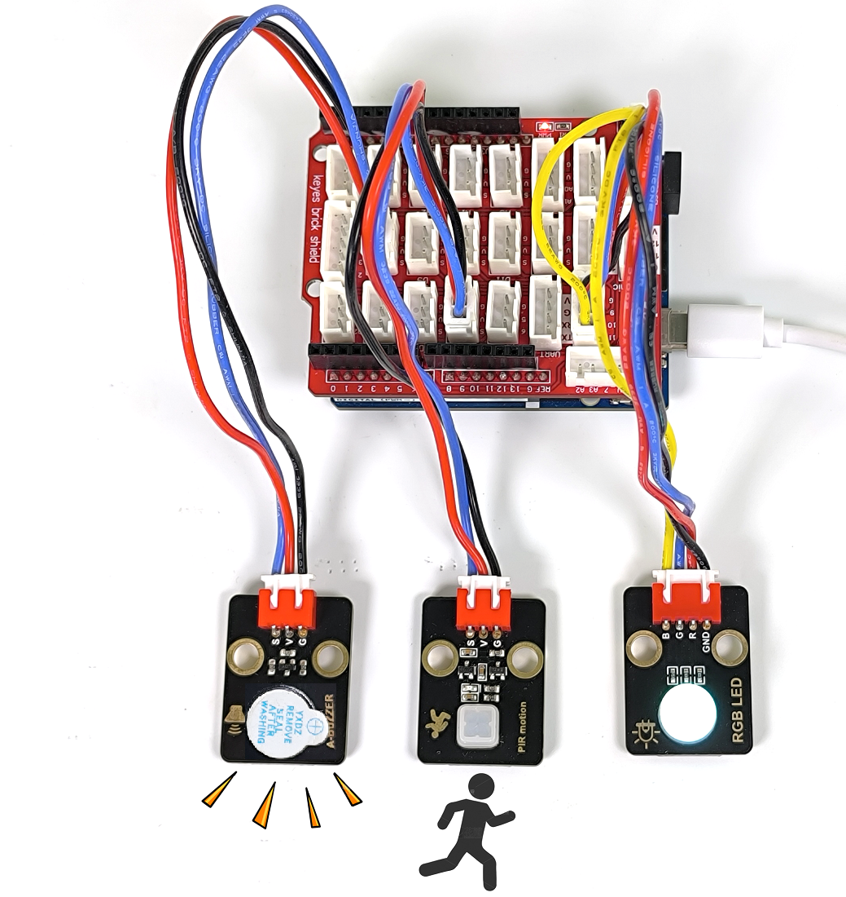

---

### 6. 代码说明

| 代码                   | 说明                                     |
| ---------------------- | ---------------------------------------- |
| item = digitalRead(PIR_PIN) | 人体红外热释传感器读取数字电平信号输出。 |
| item == 1              | 运动检测，检测到有人经过。               |
| digitalWrite(BUZZER_PIN, HIGH) | 有源蜂鸣器响起发出警报。                 |
| fill_solid(leds, NUM_LEDS, CRGB::Red)| SK6812RGB模块4个LED灯珠亮红灯 |


---

## 第42课 模拟灭火机器人

### 1. 项目介绍

你知道灭火机器人吗？根据国家犯罪记录局（NCRB）的估计，从2010年至2014年，印度发生的火灾事故已造成超过120万死亡。即使为火灾事故采取了许多预防措施，但这些自然/人为灾难却还是时有发生。发生火灾时，为了营救人员和灭火，非常需要消防员等人力资源。随着技术的进步、机器人技术的发展，未来很有可能使用机器人代替消防员灭火。这将提高灭火的效率，也能保障消防员的生命安全。

在这个项目中，我们将学习如何使用UNO R4主板构建一个非常简单的机器人。用火焰传感器检测火焰，并启动130电机吹灭火源。

---

### 2. 实验组件

|  |  |  |  |
| ------------------------ | ------------------------ | ------------------------ | ------------------------ |
|UNO R4 WiFi/Minima主板(二选一)| Keyes 传感器扩展板 x1     |Keyes 130电机模块 x1     | Keyes 火焰传感器 x1      | 
|           |        |     |       |
|4P线(反向) x2 | USB线 x1                | 电源适配器  x1         | 一字螺丝刀 x1  |

---

### 3. 模块接线图

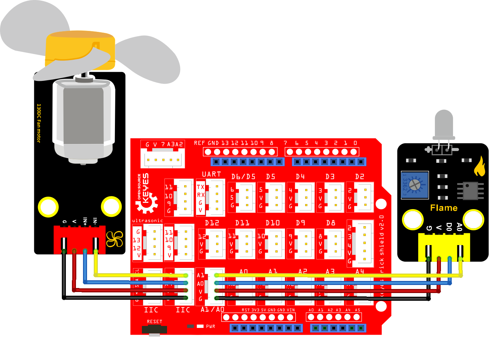

---

### 4. 实验代码

本项目中使用的代码保存在文件夹“<u>**项目代码**</u>”中，我们可以在此路径下打开代码文件''**Fire-fighting_robot.ino**"。

**注意：为了避免上传代码不成功，请上传代码前不要连接模块。代码上传成功后，拔下USB线断电，按照接线图正确接好模块后外接电源供电，上电后，观察实验结果。**

<span style="color: rgb(255, 76, 65);">注意：代码中的模拟值的阈值300可以根据实际情况设置。</span>

```c++
/*  
 * 名称   : Fire-fighting robot
 * 功能   : 火焰传感器控制130风扇模块
 * 作者   : http://www.keyes-robot.com/ 
*/
int item = 0;

void setup() {
  Serial.begin(9600);
  pinMode(A4, OUTPUT); //INA对应IN+，将A4设置为输出模式
  pinMode(A5, OUTPUT);//INB对应IN-，将A5置为输出模式
}

void loop() {
  item = analogRead(A1);//将火焰传感器连接到A1上，将模拟值读取到item
  Serial.print(item); //串口显示模拟值
  if (item < 300) {//300以下  
    Serial.print("   "); 
    Serial.println("Put out a fire");
    delay(100);
    digitalWrite(A4, LOW);//打开电风扇
    digitalWrite(A5, HIGH);
    
  } else {//否则，关闭风扇
    Serial.print("   "); 
    Serial.println("No flame detected");
    delay(100);
    digitalWrite(A4, LOW);
    digitalWrite(A5, LOW);
    
  } 
}
```

参照第01课或第02课的示例，根据不同的 UNO R4 主板选择不同的主板板型和串口端口。

---

### 5. 实验结果

由于风扇在转动时，所需的电流比其他传感器要大，会引起电路中电压电流波动，特别是风扇进行正反转时，电压电流波动过大，导致UNO R4 WiFi主板的电压电流过低，会导致复位。

代码上传成功后，拔下USB线断电，按照接线图正确接好模块，将电源电源适配器连接到家庭电路给UNO R4主板供电（<span style="color: rgb(255, 76, 65);">注意：</span> 防止风扇有时侯工作不正常，另外还需要用USB线连接到计算机给UNO R4主板上电，这样保证风扇能正常工作；否则，风扇可能会工作不正常）。上电后，打开串口监视器，设置波特率为 **<u>9600</u>**。

串口监视器上打印出火焰的模拟值值，当模拟值值低于300时打开风扇灭火，串口监视器打印出“**Put out a fire**”；当模拟值高于300时关闭风扇，串口监视器打印出“**No flame detected**”。

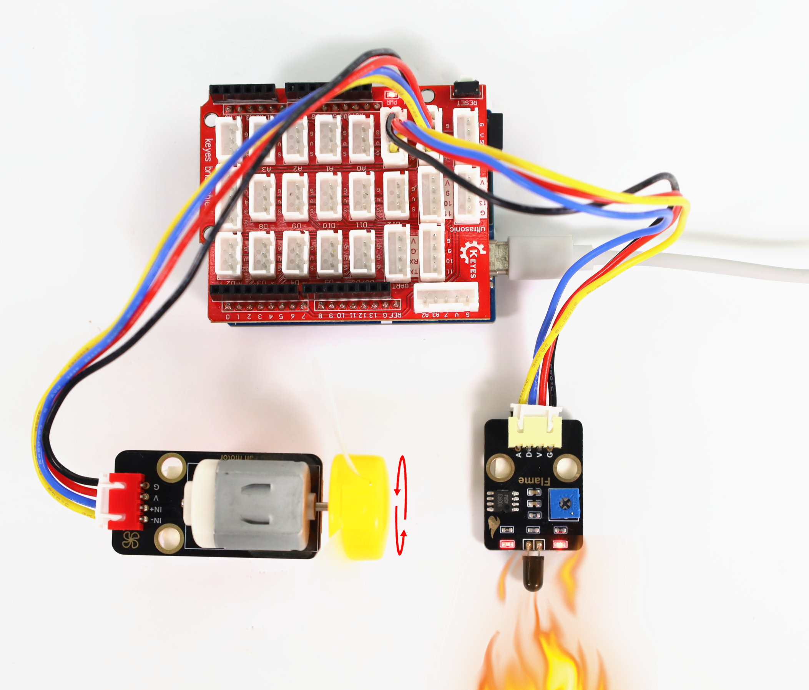

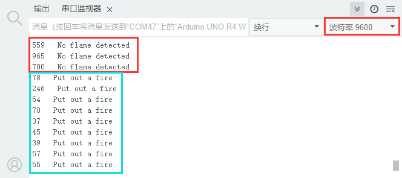

---

### 6. 代码说明

在代码中我们设置了阈值为300（item < 300），阈值可以根据实际情况更改。当火焰传感器检测到模拟值低于这个阈值时，风扇将自动开启；否则关闭。风扇的驱动方式请查看上面的第16课。

---

## 第43课 旋转编码器控制RGB

### 1. 项目介绍

在第25课的实验中我们学习了使用旋转编码器计数。在这一实验课程中我们将旋转编码器模块和RGB模块组合实验，通过旋转编码器计数的结果，控制RGB模块上的RGB LED显示不同的颜色。

---

### 2. 实验组件

|      |       |     |  |
| ---------------------------- | ---------------------------- | ------------------------ |------------------------ |
|UNO R4 WiFi/Minima主板(二选一)| Keyes 传感器扩展板 x1      |Keyes 旋转编码器模块 x1      | Keyes RGB模块 x1     |
|        |        |     |  |
| 5P线(反向) x1| 4P线(反向) x1 | USB线  x1                |   |

---

### 3. 模块接线图

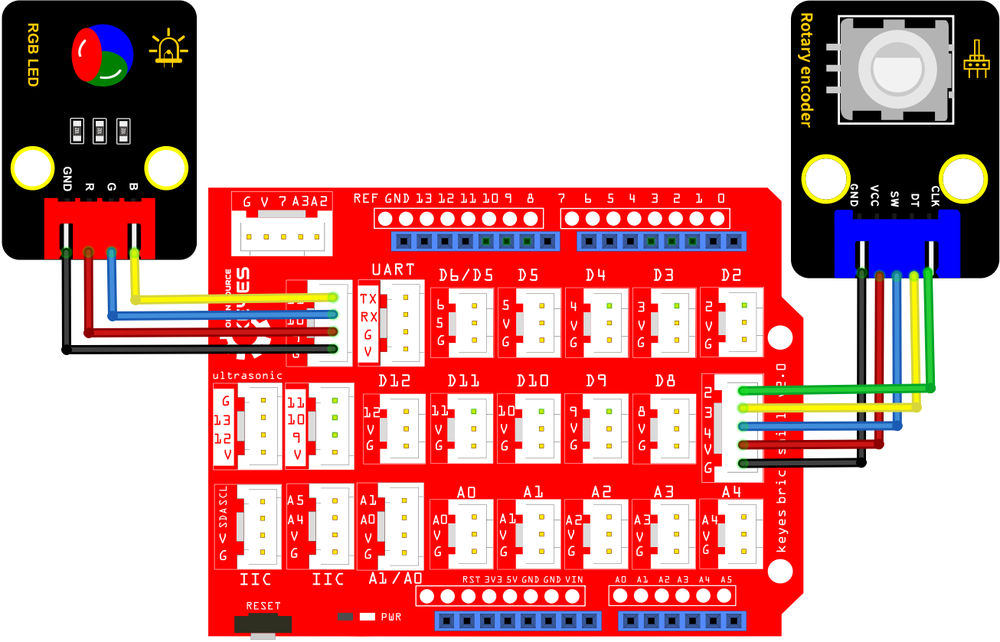

---

### 4. 实验代码

本项目中使用的代码保存在文件夹“<u>**项目代码**</u>”中，我们可以在此路径下打开代码文件''**Encoder_control_RGB.ino**"。

**注意：为了避免上传代码不成功，请上传代码前不要连接模块。代码上传成功后，拔下USB线断电，按照接线图正确接好模块后再用USB线连接到计算机上电，观察实验结果。**

```c++
/*  
 * 名称   : Encoder control RGB
 * 功能   : 旋转编码器控制RGB来呈现不同的效果
 * 作者   : http://www.keyes-robot.com/ 
*/
//旋转编码器的接口
int Encoder_CLK  = 2;
int Encoder_DT  = 3;
int Encoder_Switch = 4;
//定义RGB模块的接口引脚
int redpin = 9;    
int greenpin = 10; 
int bluepin = 11;  

int Previous_Output;
int Encoder_Count;
int val;

void setup() {
  Serial.begin(9600);

  //引脚模式声明
  pinMode (Encoder_DT, INPUT);  //设置DT引脚为输入模式
  pinMode (Encoder_CLK, INPUT);  //设置CLK引脚为输入模式
  pinMode (Encoder_Switch, INPUT);  //设置Switch为输入模式
  pinMode(redpin, OUTPUT);   //设置红色LED引脚为输出模式
  pinMode(greenpin, OUTPUT); //设置绿色LED引脚为输出模式
  pinMode(bluepin, OUTPUT);  //设置蓝色LED引脚为输出模式
  Previous_Output = digitalRead(Encoder_DT); //读取输出DT的初始值
}

void loop() {
  if (digitalRead(Encoder_DT) != Previous_Output)
  {
    if (digitalRead(Encoder_CLK) != Previous_Output)
    {
      Encoder_Count ++;
      Serial.print(Encoder_Count);
      Serial.print("  ");
      val = Encoder_Count % 3;
      Serial.println(val);
    }
    else
    {
      Encoder_Count--;
      Serial.print(Encoder_Count);
      Serial.print("  ");
      val = Encoder_Count % 3;
      Serial.println(val);
    }
  }

  Previous_Output = digitalRead(Encoder_DT);

  if (digitalRead(Encoder_Switch) == 0)
  {
    delay(5);
    if (digitalRead(Encoder_Switch) == 0) {
      Serial.println("Switch pressed");
      while (digitalRead(Encoder_Switch) == 0);
    }
  }
  if (val == 0) {
    //红色灯
    analogWrite(bluepin, 0);
    analogWrite(greenpin, 0);
    analogWrite(redpin, 255);
  } else if (val == 1) {
    //绿色灯
    analogWrite(bluepin, 0);
    analogWrite(greenpin, 255);
    analogWrite(redpin, 0);
  } else {
    //蓝色灯
    analogWrite(bluepin, 255);
    analogWrite(greenpin, 0);
    analogWrite(redpin, 0);
  }
}
```

参照第01课或第02课的示例，根据不同的 UNO R4 主板选择不同的主板板型和串口端口。

---

### 5. 实验结果

代码上传成功后，拔下USB线断电，按照接线图正确接好模块后再用USB线连接到计算机上电。打开串口监视器，设置波特率为 **<u>9600</u>**。

任意方向旋转编码器，串口监视器打印出对应余数；RGB模块上的RGB LED显示余数对应的颜色：余数0显示红色、余数1显示绿色、余数2显示蓝色。按下旋转编码器，RGB模块上的RGB LED保持当前颜色不变。

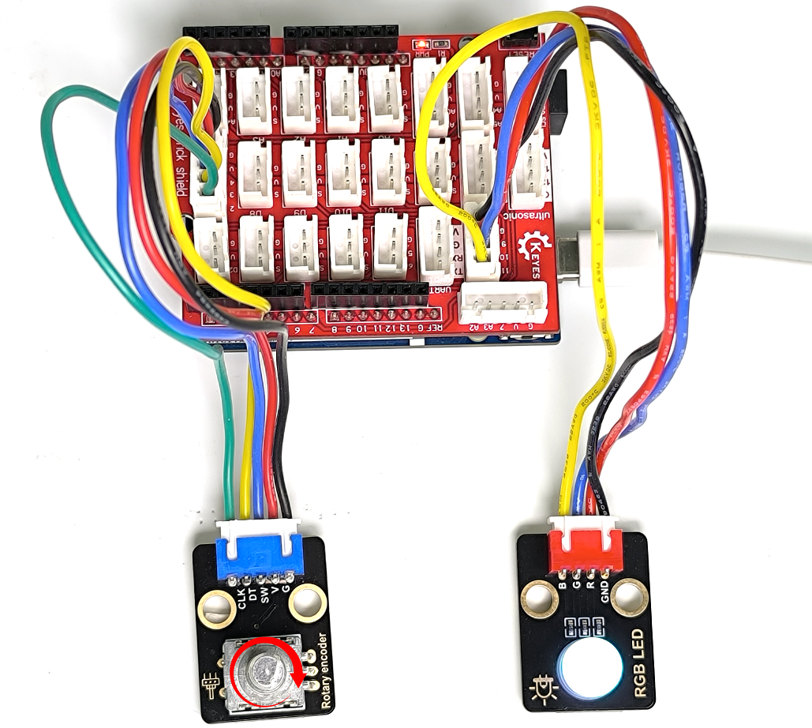

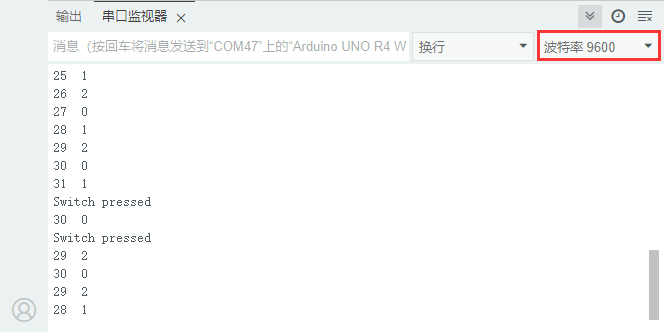

---

### 6. 代码说明

| 代码                                 | 说明                                                         |
| ------------------------------------ | ------------------------------------------------------------ |
| ous_Output = digitalRead(Encoder_DT) | 读取输出DT的初始值。                                         |
| val = Encoder_Count % 3               | %是模除运算符。代码中模除的结果是旋转编码器计数的值与3相除的余数。 |


---

## 第44课 模拟智能窗户

### 1. 项目介绍

生活中能看到各种各样的智能产品，例如智能窗帘、智能窗户、智能电视、智能灯光等等。这一课我们来学习做一个智能窗帘，利用水滴水蒸气传感器模块检测雨水，然后通过设置舵机的角度来达到关窗和开窗的效果。

当然，这只是我们模拟的一个场景，主要用于加深我们的印象，达到对模块学以致用的效果。现实生活中，智能窗户并不是使用舵机来开关的。

---

### 2. 实验组件

|  |  | | |
| ------------------------ | ------------------------ | -------------------- | ---------------------------- |  
|UNO R4 WiFi/Minima主板(二选一)| Keyes 传感器扩展板 x1      |Keyes 水滴传感器 x1 | Keyes 舵机驱动模块 x1       | 
| | |             |  |
| 舵机 x1  | 3P线(反向) x1 | 4P线(反向) x1 |USB线 x1      | 

---

### 3. 模块接线图

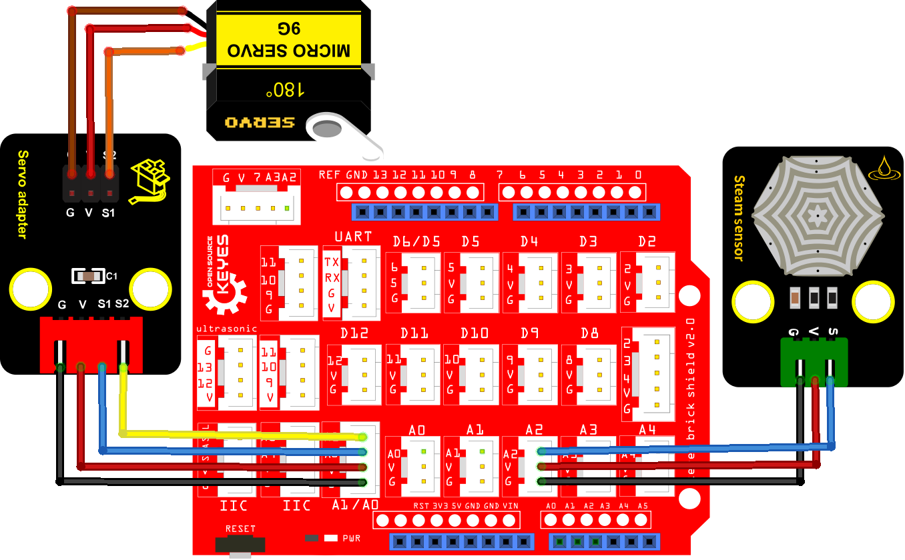

---

### 4. 实验代码

本项目中使用的代码保存在文件夹“<u>**项目代码**</u>”中，我们可以在此路径下打开代码文件''**Smart_window.ino**"。

**注意：为了避免上传代码不成功，请上传代码前不要连接模块。代码上传成功后，拔下USB线断电，按照接线图正确接好模块后再用USB线连接到计算机上电，观察实验结果。**

<span style="color: rgb(255, 76, 65);">注意：代码中的模拟值的阈值400可以根据实际情况设置。</span>

```c++
/*  
 * 名称   : smart window
 * 功能   : 水滴传感器控制舵机转动
 * 作者   : http://www.keyes-robot.com/ 
*/
#include <Servo.h> //导入舵机库文件

#define PIN_ADC  A2    //定义水滴传感器的引脚A2

int adcVal = 0;         //保存液滴传感器输出的ADC值的变量
int servoPin = A1;      // 定义舵机引脚A1
Servo myservo;          //定义舵机类的实例

void setup(){
  Serial.begin(9600);
  pinMode(PIN_ADC, INPUT);   //设置水滴传感器的引脚为输入模式
  myservo.attach(servoPin);  //选择舵机引脚A1
  myservo.write(180); //打开窗户
  delay(500); //延迟500毫秒
}

void loop(){
  adcVal = analogRead(PIN_ADC); //水滴传感器连接到模拟端口A2
  Serial.println(adcVal);
  if (adcVal > 400) { //模拟值大于400
    myservo.write(0);  //关上窗户
    delay(500); //给舵机转向的时间
  } else { // 没有下雨
    myservo.write(180); //打开窗户
    delay(500); //延迟500毫秒
  }
}
```

参照第01课或第02课的示例，根据不同的 UNO R4 主板选择不同的主板板型和串口端口。

---

### 5. 实验结果

（<span style="color: rgb(255, 169, 0);">特别提醒：如果已经添加过库文件“**Servo.h**”，就不需要重复添加。</span>）若代码上传不成功，提示“**Servo.h: No such file or directory**”，请添加库文件。先点击“**<u>项目</u>**”，选择“**<u>导入库</u>**”，最后选择“**<u>添加.ZIP库...</u>**”。

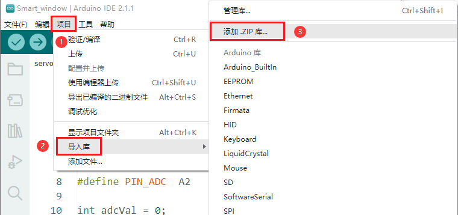

根据库文件的路径打开库文件夹，选中库文件夹中 .zip格式的“**Servo.zip**”库压缩包，然后单击“**打开**”，库文件成功加入。

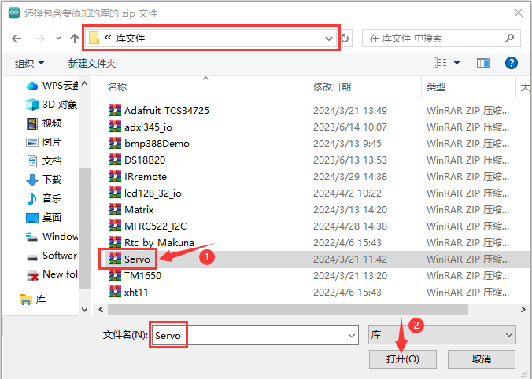

代码上传成功后，拔下USB线断电，按照接线图正确接好模块后再用USB线连接到计算机上电。当水滴传感器检测到一定水量，舵机转动达到关窗的效果。否则舵机转动到另一个角度，达到开窗的效果。

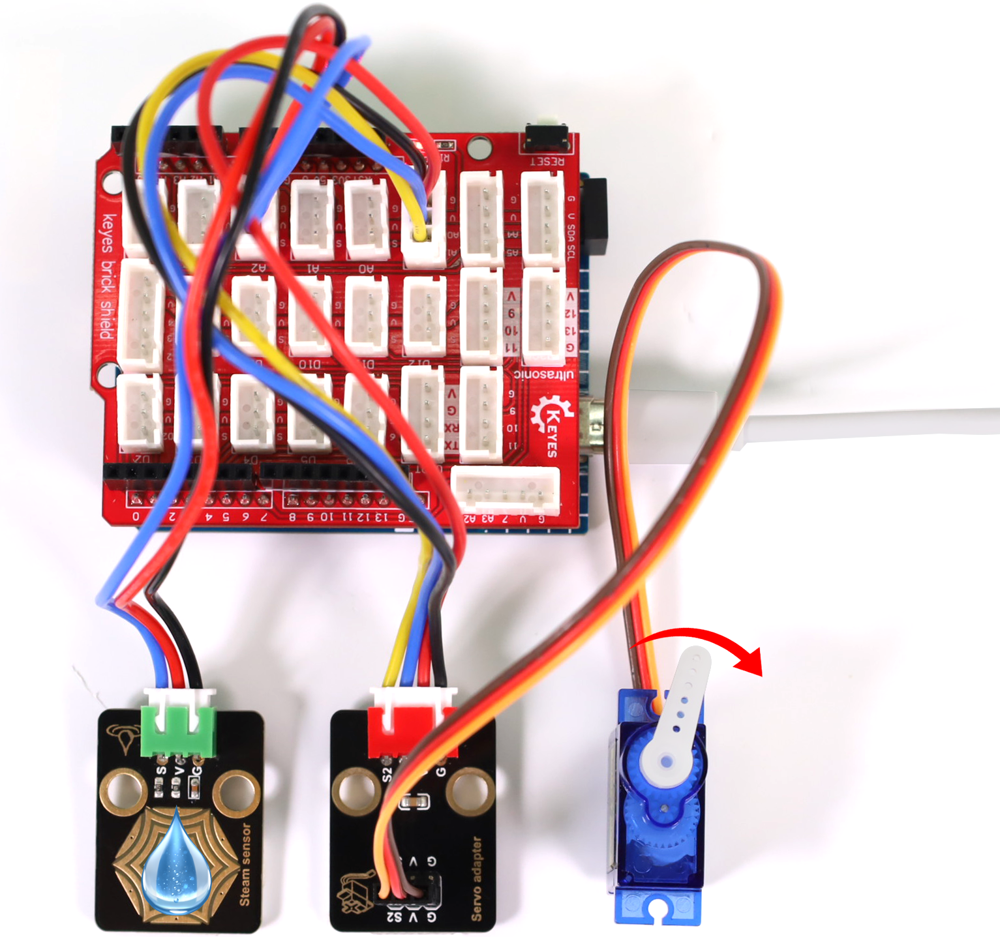

---

### 6. 代码说明

可以参照第17课和第26课的代码说明，这里就不多做介绍了。


---

## 第45课 声控灯

### 1. 项目介绍

如今智能家居发展迅速，你使用过智能家居当中的智能声控灯吗？当我们跺跺脚或者拍拍手时，智能声控灯自动亮起；当没有声音时，智能声控灯处于熄灭状态。智能声控灯上安装有声音探测传感器，这些传感器将外界声音的大小，转换成对应数值。智能声控灯设置一个临界点，当声音转换后对应的数值超过该临界点时，灯光亮起一段时间。 

在这一实验课程中，我们将声音传感器和RGB模块组合实验，学习制作一个最简单的智能声控灯。

---

### 2. 实验组件

|  |  | | |
| ------------------------ | ------------------------ | ------------------------ |------------------------ |
|UNO R4 WiFi/Minima主板(二选一)| Keyes 传感器扩展板 x1      |Keyes 声音传感器 x1     |一字螺丝刀 x1|
  |  |  |  |  
| Keyes RGB模块 x1     | 3P线(反向) x1 |4P线(反向) x1 | USB线 x1   |  

---

### 3. 模块接线图

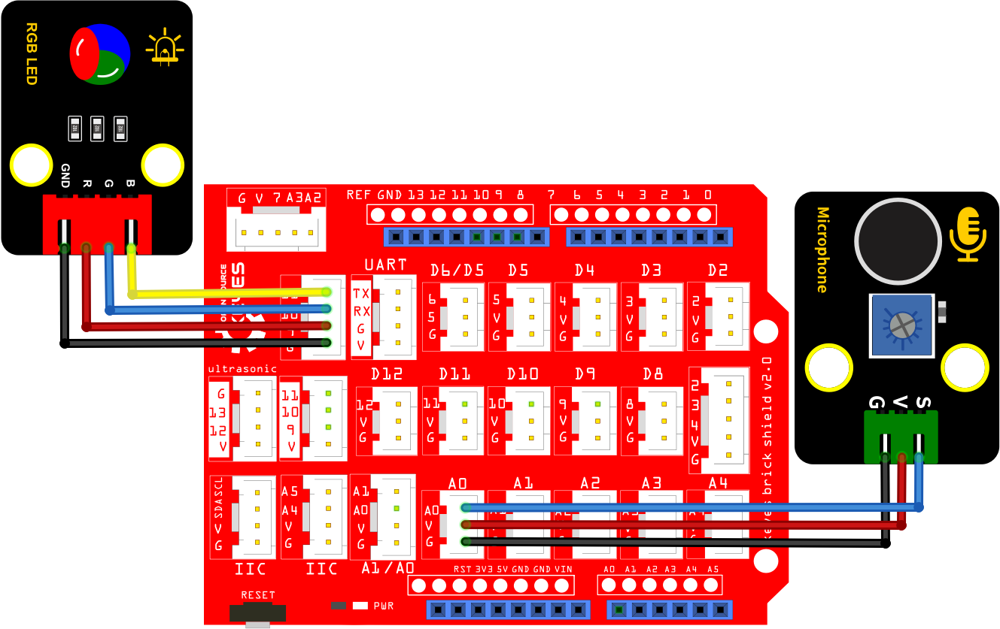

---

### 4. 实验代码

本项目中使用的代码保存在文件夹“<u>**项目代码**</u>”中，我们可以在此路径下打开代码文件''**sound-controlled_lights.ino**"。

**注意：为了避免上传代码不成功，请上传代码前不要连接模块。代码上传成功后，拔下USB线断电，按照接线图正确接好模块后再用USB线连接到计算机上电，观察实验结果。**

<span style="color: rgb(255, 76, 65);">注意：代码中的模拟值的阈值150可以根据实际情况设置。</span>

```c++
/*  
 * 名称   : sound-controlled lights
 * 功能   : 声音传感器控制RGB模块上的RGB LED亮灭
 * 作者   : http://www.keyes-robot.com/ 
*/
int microPin = A0;  //定义声音传感器的控制引脚为A0
int redpin = 9;    // 定义红色LED引脚D9
int greenpin = 10; // 定义绿色LED引脚D10
int bluepin = 11;  // 定义蓝色LED引脚D11

void setup() {
  Serial.begin(9600); //波特率设置为9600
  pinMode(microPin, INPUT);  //设置声音传感器的引脚为输入模式
  pinMode(redpin, OUTPUT);   //设置红色LED引脚为输出模式
  pinMode(greenpin, OUTPUT); //设置绿色LED引脚为输出模式
  pinMode(bluepin, OUTPUT);  //设置蓝色LED引脚为输出模式
}

void loop() {
  int val = analogRead(microPin); //读取模拟值
  Serial.print(val); // 串口打印
  if(val > 150){ //超过阈值
    analogWrite(redpin, 255);  //给PWM口(D9)写入一个255的模拟值
    analogWrite(greenpin, 255);
    analogWrite(bluepin, 255);
    Serial.println(" led on"); 
    delay(5000);
  }else{ //否则
    analogWrite(redpin, 0);  //给PWM口(D9)写入一个0的模拟值
    analogWrite(greenpin, 0);
    analogWrite(bluepin, 0);
    Serial.println(" led off");
  }
  delay(100);
}
```

参照第01课或第02课的示例，根据不同的 UNO R4 主板选择不同的主板板型和串口端口。

---

### 5. 实验结果

代码上传成功后，拔下USB线断电，按照接线图正确接好模块后再用USB线连接到计算机上电，打开串口监视器，设置波特率为 **<u>9600</u>**。


串口监视器打印出声音传感器接收到的声音对应的模拟值。对准MIC头大声说话，接收到的声音增大时模拟值也增大，当模拟值大于150时，RGB模块上的RGB LED亮起5秒，然后熄灭。（**注意：如果声音变化对应的模拟值没有变化并且一直都是数字0，需要用一字螺丝刀顺时针旋转电位器来调节。**）


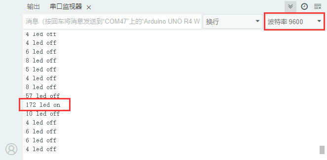

---

### 6. 代码说明

| 代码                           | 说明               |
| ------------------------------ | ------------------ |
| int val = analogRead(microPin) | 读取模拟值。       |
| Serial.print(val)              | 串口打印出模拟值。 |


---

## 第46课 火焰报警

### 1. 项目介绍

生活中，火灾的危害是相当大的。这一课我们来学习制作一个火灾报警系统，它虽然简单，但却是非常具有意义的。原理很简单，利用火焰传感器检测，检测的结果控制一个有源蜂鸣器响起。

---

### 2. 实验组件

|      |      |     |  |
| ---------------------------- | ---------------------------- | ------------------------ |------------------------ |
|UNO R4 WiFi/Minima主板(二选一)| Keyes 传感器扩展板 x1      |Keyes 有源蜂鸣器模块 x1      | Keyes 火焰传感器 x1      |
|        |        |     |  |
| 3P线(反向) x1 | 4P线(反向) x1 | USB线  x1  | 一字螺丝刀*1  |

---

### 3. 模块接线图

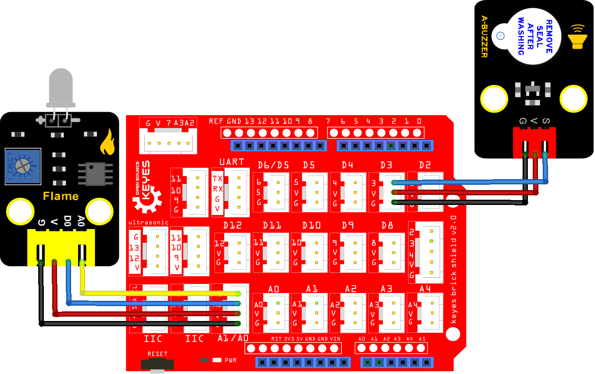

---

### 4. 实验代码

本项目中使用的代码保存在文件夹“<u>**项目代码**</u>”中，我们可以在此路径下打开代码文件''**Flame_alarm.ino**"。

**注意：为了避免上传代码不成功，请上传代码前不要连接模块。代码上传成功后，拔下USB线断电，按照接线图正确接好模块后再用USB线连接到计算机上电，观察实验结果。**

<span style="color: rgb(255, 76, 65);">注意：代码中的模拟值的阈值600可以根据实际情况设置。</span>

```c++
/*  
 * 名称   : Flame Alarm
 * 功能   : 通过火焰传感器控制蜂鸣器
 * 作者   : http://www.keyes-robot.com/ 
*/
int item = 0;  //定义变量item初始值为0

void setup() {
  Serial.begin(9600);
  pinMode(A1, INPUT);  //火焰传感器数字引脚连接到A1
  pinMode(3, OUTPUT);  //蜂鸣器引脚连接D3
}

void loop() {
  item = analogRead(A1);  //读取火焰传感器的模拟信号并输出
  Serial.println(item);   //换行打印模拟信号
  if (item < 600) {  //火焰探测
    digitalWrite(3, HIGH);  //打开蜂鸣器
  } else {  //否则，请关闭蜂鸣器
    digitalWrite(3, LOW);
  }
  delay(100);  //延迟100毫秒
}
```

参照第01课或第02课的示例，根据不同的 UNO R4 主板选择不同的主板板型和串口端口。

---

### 5. 实验结果

代码上传成功后，拔下USB线断电，按照接线图正确接好模块后再用USB线连接到计算机上电。此时火焰传感器上的红色LED2点亮。用一字螺丝刀旋转火焰传感器上的电位器，微调使传感器上红色LED1灯介于亮与不亮之间的**不亮**状态。


当火焰传感器检测到火焰时，有源蜂鸣器响起，否则有源蜂鸣器不响。

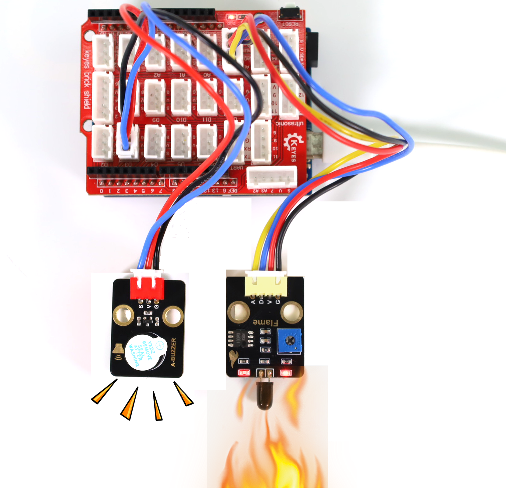

---

### 6. 代码说明

可以参照第17课和第42课的代码说明，这里就不多做介绍了。

---


## 第47课 红外遥控灯

### 1. 项目介绍

在前面实验中，我们学会了RGB模块上的RGB LED亮不同颜色灯、也学会了使用红外接收模块，并将接收到的遥控器对应的键值打印出来。在这一实验课程中，我们将红外接收模块和RGB模块组合实验，实现用红外遥控器控制RGB模块上的RGB LED的亮灭以及控制RGB模块上的RGB LED显示不同颜色灯。

在这一实验课程中我们使用“①”、“②”、“③”、“④”、“⑤”、“⑥”、“⑦”、“⑧”、“⑨”等九个按键来控制RGB模块上的RGB LED分别亮红色灯、绿色灯、蓝色灯、橙色灯、黄色灯、紫色灯、金色灯、粉红色灯、品红色灯。如果想要使用“OK”键来控制RGB模块上的RGB LED亮和灭的两种情况该如何实现呢？这一实验课程我们将学习使用一个新的基本数据类型 —— boolean，来实现同一个按键控制LED亮灭的效果。

**boolean 数据类型**，变量存储为 8 位（1 个字节）的数值形式，**只能是 True 或是 False**。boolean 变量的值显示为 True 或 False（在使用 Print 的时候），或者 #TRUE# 或 #FALSE#（在使用 Write # 的时候）。使用关键字True 与 False 可将 boolean 变量赋值为这两个状态中的一个。

设置代码，按下 “OK” 键且满足某一条件，点亮模块上的RGB LED；按下“OK”键且满足另一条件，熄灭模块上的RGB LED。这个条件我们用 boolean 来实现是最简单方便的，因为 boolean 只有 True 或是 False 两种状态。我们只需要设置按下“OK”键的同时 flag 为 true，即可点亮RGB模块上的RGB LED；同理，按下“OK”键的同时 flag 为 false，熄灭RGB模块上的RGB LED。

---

### 2. 实验组件

|          |      |     |  |
| -------------------------------- | ---------------------------- | ------------------------ |------------------------ |
|UNO R4 WiFi/Minima主板(二选一)| Keyes 传感器扩展板 x1        |Keyes 红外接收模块 x1        | Keyes RGB模块 x1     |
|  |  |      |     |  
| Keyes 遥控器 x1                  | 3P线(反向) x1|  4P线(反向) x1  | USB线  x1 |  

---

### 3. 模块接线图

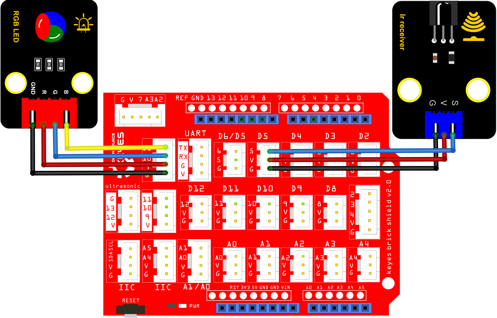

---

### 4. 实验代码

本项目中使用的代码保存在文件夹“<u>**项目代码**</u>”中，我们可以在此路径下打开代码文件''**IR_control_LED.ino**"。

**注意：为了避免上传代码不成功，请上传代码前不要连接模块。代码上传成功后，拔下USB线断电，按照接线图正确接好模块后再用USB线连接到计算机上电，观察实验结果。**

```c++
/*  
 * 名称   : IR Control LED
 * 功能   : 红外遥控RGB模块上的RGB LED亮不同颜色灯
 * 作者   : http://www.keyes-robot.com/ 
*/
#include <Arduino.h>
#include <IRremote.hpp>

#define IR_RECEIVE_PIN  5   // 定义红外接收模块引脚D5
IRrecv irrecv(IR_RECEIVE_PIN);     // 创建一个用于接收类的类对象
decode_results results;     // 创建一个解码结果类对象

int redpin = 9;    // 定义红色LED引脚D9
int greenpin = 10; // 定义绿色LED引脚D10
int bluepin = 11;  // 定义蓝色LED引脚D11

boolean flag = true;  //LED标志钻头

void setup() {
  Serial.begin(9600);
  IrReceiver.begin(IR_RECEIVE_PIN, ENABLE_LED_FEEDBACK);  // 启动接收器
  pinMode(redpin, OUTPUT);   //设置红色LED引脚为输出模式
  pinMode(greenpin, OUTPUT); //设置绿色LED引脚为输出模式
  pinMode(bluepin, OUTPUT);  //设置蓝色LED引脚为输出模式
}

void loop() {
  if (IrReceiver.decode()) {
      Serial.print(IrReceiver.decodedIRData.decodedRawData, HEX);  // 打印原始数据
      // IrReceiver.printIRResultShort(&Serial); // 在一行中打印接收到的完整数据
      // IrReceiver.printIRSendUsage(&Serial);  // 打印发送这些数据所需的语句
      handleControl(IrReceiver.decodedIRData.decodedRawData);      // 处理来自远程控制的命令
      IrReceiver.resume(); // 启用接收下一个值
  }
}

void handleControl(unsigned long value){
  if (value == 0xBF40FF00 && flag == true){ // 接收数字“OK” 
    analogWrite(redpin, 255);
    analogWrite(greenpin, 255);
    analogWrite(bluepin, 255);
    Serial.println("  led on");
    flag = false;
  } 
  else if (value == 0xBF40FF00 && flag == false){ // 接收数字“OK”
    analogWrite(redpin, 0);
    analogWrite(greenpin, 0);
    analogWrite(bluepin, 0);
    Serial.println("  led off"); 
    flag = true;
  }
  else if(value == 0xE916FF00){
    analogWrite(redpin, 255);
    analogWrite(greenpin, 0);
    analogWrite(bluepin, 0);
    Serial.println("  red led");

  } 
  else if(value == 0xE619FF00){
    analogWrite(redpin, 0);
    analogWrite(greenpin, 255);
    analogWrite(bluepin, 0);
    Serial.println("  green led");
  } 
  else if(value == 0xF20DFF00){
    analogWrite(redpin, 0);
    analogWrite(greenpin, 0);
    analogWrite(bluepin, 255);
    Serial.println("  blue led");
  }
  else if(value == 0xF30CFF00){
    analogWrite(redpin, 255);
    analogWrite(greenpin, 165);
    analogWrite(bluepin, 0);
    Serial.println("  orange led");
  }
  else if(value == 0xE718FF00){
    analogWrite(redpin, 255);
    analogWrite(greenpin, 255);
    analogWrite(bluepin, 0);
    Serial.println("  yellow led");
  }
  else if(value == 0xA15EFF00){
    analogWrite(redpin, 128);
    analogWrite(greenpin, 0);
    analogWrite(bluepin, 128);
    Serial.println("  purple led");
  }
  else if(value == 0xF708FF00){
    analogWrite(redpin, 255);
    analogWrite(greenpin, 215);
    analogWrite(bluepin, 0);
    Serial.println("  gold led");
  }
  else if(value == 0xE31CFF00){
    analogWrite(redpin, 255);
    analogWrite(greenpin, 192);
    analogWrite(bluepin, 203);
    Serial.println("  pink led");
  }
  else if(value == 0xA55AFF00){
    analogWrite(redpin, 255);
    analogWrite(greenpin, 0);
    analogWrite(bluepin, 255);
    Serial.println("  magenta led");
  }
}
```

参照第01课或第02课的示例，根据不同的 UNO R4 主板选择不同的主板板型和串口端口。

---

### 5. 实验结果

代码上传成功后，拔下USB线断电，按照接线图正确接好模块后再用USB线连接到计算机上电，打开串口监视器，设置波特率为 **<u>9600</u>**。

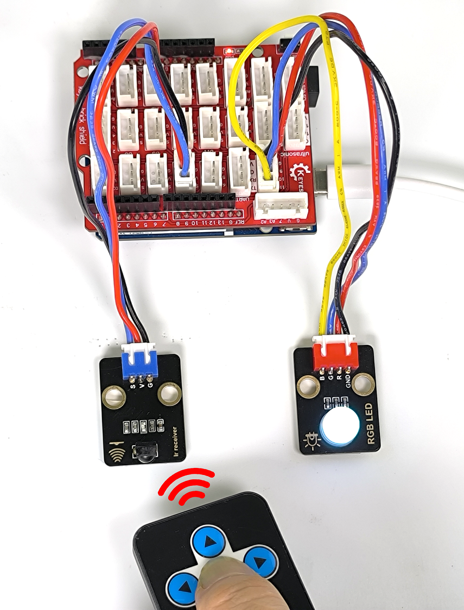

找到红外遥控器，拔出绝缘片，对准红外接收模块的红外接收传感器的接收头。第一次按下红外遥控器上的 “**<u>OK</u>**” 键，RGB模块上的RGB LED被点亮，实现开灯的效果。串口监视器打印出按下的按键值和RGB模块上的RGB LED亮灯情况：“**<u>BF40FF00  led on</u>**” 。

再次按下红外遥控器上的 “**<u>OK</u>**” 键，RGB模块上的RGB LED熄灭，实现关灯的效果。串口监视器打印出按下的按键值和RGB模块上的RGB LED亮灯情况：“**<u>BF40FF00  led off</u>**” 。

按下红外遥控器上的 “**①**” 键，RGB模块上的RGB LED亮红色灯。串口监视器打印出按下的按键值和RGB模块上的RGB LED亮灯情况：“**<u>E916FF00  red led</u>**” 。

按下红外遥控器上的 “**②**” 键，RGB模块上的RGB LED亮绿色灯。串口监视器打印出按下的按键值和RGB模块上的RGB LED亮灯情况：“**<u>E619FF00  green led</u>**” 。

按下红外遥控器上的 “**③**” 键，RGB模块上的RGB LED亮蓝色灯。串口监视器打印出按下的按键值和RGB模块上的RGB LED亮灯情况：“**<u>F20DFF00  blue led</u>**” 。

按下红外遥控器上的 “**④**” 键，RGB模块上的RGB LED亮橙色灯。串口监视器打印出按下的按键值和RGB模块上的RGB LED亮灯情况：“**<u>F30CFF00  orange led</u>**” 。

按下红外遥控器上的 “**⑤**” 键，RGB模块上的RGB LED亮黄色灯。串口监视器打印出按下的按键值和RGB模块上的RGB LED亮灯情况：“**<u>E718FF00  yellow led</u>**” 。

按下红外遥控器上的 “**⑥**” 键，RGB模块上的RGB LED亮紫色灯。串口监视器打印出按下的按键值和RGB模块上的RGB LED亮灯情况：“**<u>A15EFF00  purple led</u>**” 。

按下红外遥控器上的 “**⑦**” 键，RGB模块上的RGB LED亮金色灯。串口监视器打印出按下的按键值和RGB模块上的RGB LED亮灯情况：“**<u>F708FF00  gold led</u>**” 。

按下红外遥控器上的 “**⑧**” 键，RGB模块上的RGB LED亮粉红色灯。串口监视器打印出按下的按键值和RGB模块上的RGB LED亮灯情况：“**<u>E31CFF00  pink led</u>**” 。

按下红外遥控器上的 “**⑨**” 键，RGB模块上的RGB LED亮品红色灯。串口监视器打印出按下的按键值和RGB模块上的RGB LED亮灯情况：“**<u>A55AFF00  magenta led</u>**” 。

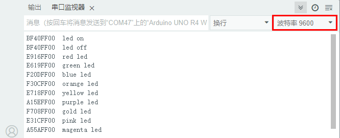

---

### 6. 代码说明

| 代码                | 说明                                                         |
| ------------------- | ------------------------------------------------------------ |
| boolean flag = true | 设置一个变量 flag 为 boolean 数据类型，数值为 true。         |
| flag = false        | boolean 数据类型的 flag 赋值为 false ，以便再次按下再次按下 “OK”键时满足熄灭RGB模块上的RGB LED的条件。 |


---


## 第48课 温湿度仪表 

### 1. 项目介绍：

在冬季时，空气中的湿度很低，就是空气很干燥，再加上寒冷，人体的皮肤就容易过于干燥而裂，所以需要使用加湿器给家里的空气增加湿度，但是怎么知道空气过于干燥了呢？那就需要检测空气湿度的设备，前面我们已经学习过了XHT11温湿度传感器的工作原理。在这一课我们将结合XHT11温湿度传感器和LCD 128X32 DOT模块来制作一个温湿度仪表，XHT11温湿度传感器检测到环境中的温度和湿度显示在LCD 128X32 DOT模块上。

---

### 2. 实验组件

|  |      |     |   |
| ------------------------ | ---------------------------- | ----------------------------- |----------------------------- |
|UNO R4 WiFi/Minima主板(二选一)| Keyes 传感器扩展板 x1         |  Keyes XHT11温湿度传感器模块 x1|Keyes LCD 128X32 DOT模块 x1 |
|     |           |    |  |
|4P线(反向) x1 |3P线(反向) x1  |USB线  x1       |         |

---

### 3. 模块接线图

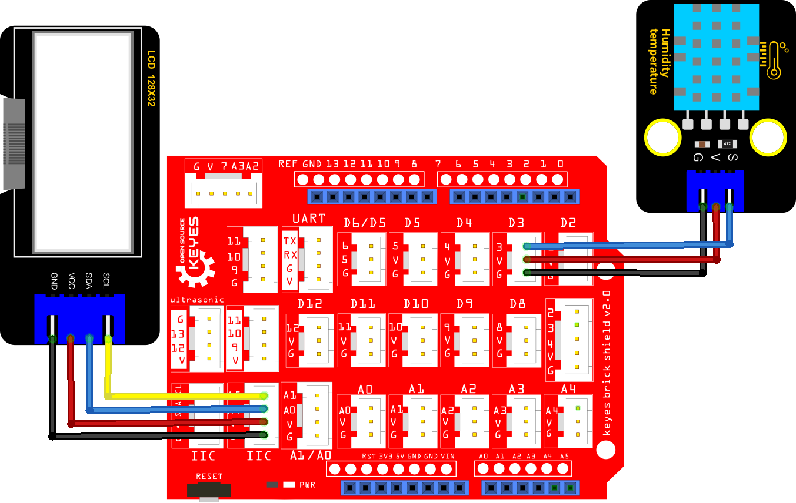

---

### 4. 实验代码

本项目中使用的代码保存在文件夹“<u>**项目代码**</u>”中，我们可以在此路径下打开代码文件''**Temperature-humidity_meter.ino**"。

**注意：为了避免上传代码不成功，请上传代码前不要连接模块。代码上传成功后，拔下USB线断电，按照接线图正确接好模块后再用USB线连接到计算机上电，观察实验结果。**

```c++
/*  
 * 名称   : Temperature-humidity meter
 * 功能   : LCD128*32屏显示温度和湿度
 * 作者   : http://www.keyes-robot.com/ 
*/
#include "xht11.h"
#include <lcd.h>

xht11 xht(3); //定义XHT11的引脚为D3
unsigned char dht[4] = {0, 0, 0, 0};// 只接收数据的前32位，不接收奇偶校验位

lcd Lcd;  //LCD128*32屏的I2C接口:SDA引脚接A4, SCL引脚接A5

void setup(){
  Lcd.Init();  //lcd初始化
  Lcd.Clear();  //lcd清屏
}
char string[10];

//LCD128*32屏显示温度值和湿度值
void loop(){
  if (xht.receive(dht)) { //正确检查时返回true
    }
  Lcd.Cursor(0,0); //设置显示的位置
  Lcd.Display("Temper:"); //显示字符串Temper:
  Lcd.Cursor(0,8);
  Lcd.Display_Num(dht[2]); //显示温度值
  Lcd.Cursor(0,11);
  Lcd.Display("C");
  Lcd.Cursor(2,0); 
  Lcd.Display("humid:");
  Lcd.Cursor(2,8);
  Lcd.Display_Num(dht[0]);
  Lcd.Cursor(2,11);
  Lcd.Display("%");
  delay(200);
}
```

参照第01课或第02课的示例，根据不同的 UNO R4 主板选择不同的主板板型和串口端口。

---

### 5. 实验结果

代码上传成功后，拔下USB线断电，按照接线图正确接好模块后再用USB线连接到计算机上电，上传成功后可以在LCD 128*32 DOT模块显示屏上看到XHT11温湿度传感器检测到环境中的温度值和湿度值。

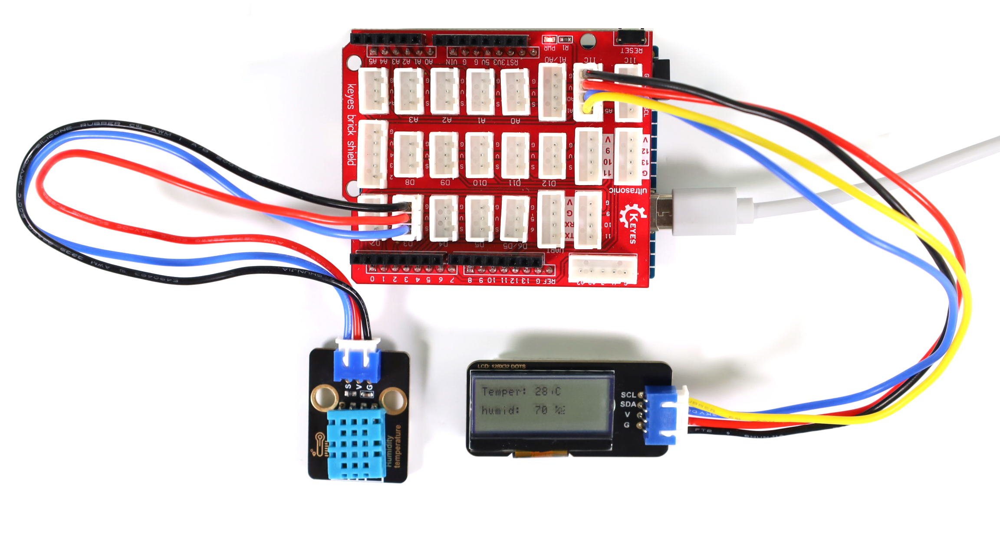

---

### 6. 代码说明

可以参照第30课和第35课的代码说明，这里就不多做介绍了。

---

## 第49课 智能门禁系统

### 1. 项目介绍

生活中，很多门禁系统都是使用射频模块进行开锁的，既方便又安全。这一课，学习利用RFID522刷卡模块和舵机设置一个智能门禁系统。

原理很简单，使用RFID522刷卡模块感应，使用IC卡或者钥匙卡来开锁，舵机的作用即门禁锁。

---

### 2. 实验组件

|  |  | ||
| ------------------------ | ------------------------ | ---------------------------- | ------------------------ | 
|UNO R4 WiFi/Minima主板(二选一)| Keyes 传感器扩展板 x1    |Keyes RFID刷卡模块 x1    |Keyes 舵机驱动模块 x1  |
|         |     |        |  | 
|舵机 x1      |  IC卡/钥匙扣 x1                    | 4P线(反向) x2 |USB线  x1             | 

---

### 3. 模块接线图

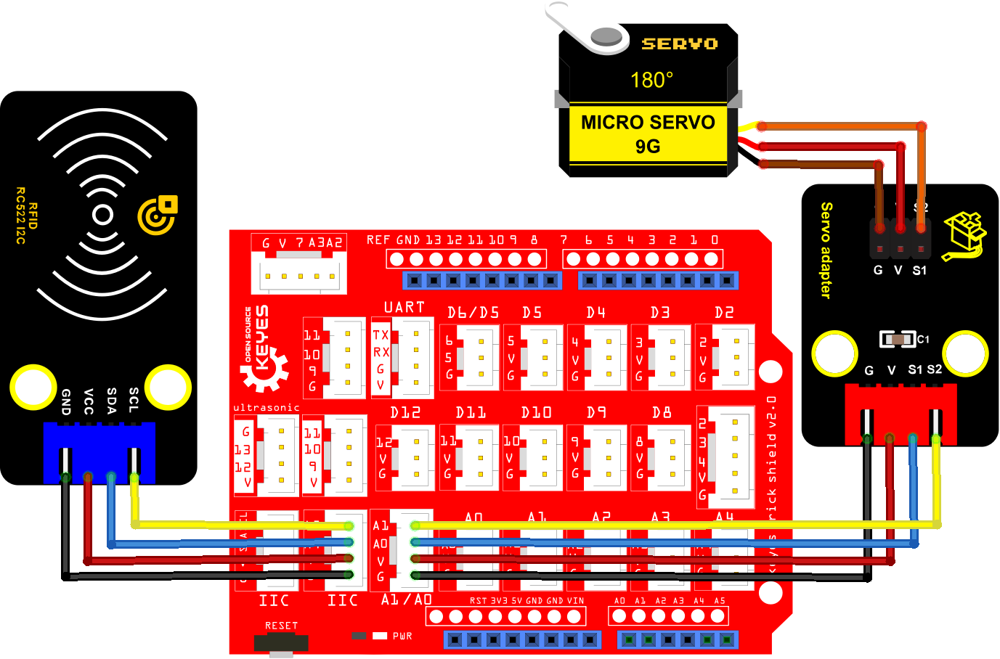

---

### 4. 实验代码

本项目中使用的代码保存在文件夹“<u>**项目代码**</u>”中，我们可以在此路径下打开代码文件''**Intelligent_access_control.ino**"。

**<span style="background:#ff0;color:#000">特别注意：对于不同的IC卡和钥匙扣，其读取的IC卡和钥匙扣的UID码值可能都不一样。在代码运行前，需要将你自己的IC卡和钥匙扣的UID码值替换程序代码中的UID码（UID码在第44课完成实验可以得知），替换位置如下图所示。</span>**

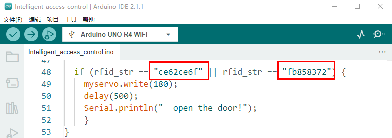

```c++
/* 
 * 名称   : Intelligent_access_control
 * 功能   : RFID控制舵机模拟开门
 * 作者   : http://www.keyes-robot.com/ 
*/
#include "MFRC522_I2C_SOFT.h"
//IIC引脚默认为A4和A5
// 0x28是SDA上的i2c地址。如果不匹配，请用i2cscanner检查您的地址.
MFRC522 mfrc522(0x28, A4, A5);   // 创建MFRC522实例.

#include <Servo.h>
Servo myservo;  // 创建舵机对象来控制舵机
int servoPin = A1; // 定义舵机引脚A1

String rfid_str = "";

void setup() {
  Serial.begin(115200);
  mfrc522.PCD_Init();
  ShowReaderDetails();           // 显示PCD - MFRC522读卡机
  Serial.println(F("Scan PICC to see UID, type, and data blocks..."));
  
  myservo.attach(servoPin);  //选择舵机引脚A1
  myservo.write(0); 
  delay(500);
}

void loop() {
   if ( ! mfrc522.PICC_IsNewCardPresent() || ! mfrc522.PICC_ReadCardSerial() ) {
    delay(50);
    return;
  }
  
  //选择一张门卡，UID和SAK分别为mfrc522.uid。
  
  // 保存UID
  rfid_str = "";  //字符串清空
  Serial.print(F("Card UID:"));
  for (byte i = 0; i < mfrc522.uid.size; i++) {
    rfid_str = rfid_str + String(mfrc522.uid.uidByte[i], HEX);  //转化字符串到实数
    //Serial.print(mfrc522.uid.uidByte[i] < 0x10 ? " 0" : " ");
    //Serial.print(mfrc522.uid.uidByte[i], HEX);
  } 
  Serial.println(rfid_str);
  
  if (rfid_str == "ce62ce6f" || rfid_str == "fb858372") {
    myservo.write(180);
    delay(500);
    Serial.println("  open the door!");
    }
}

void ShowReaderDetails() {
  // 获得MFRC522软件
  byte v = mfrc522.PCD_ReadRegister(mfrc522.VersionReg);
  Serial.print(F("MFRC522 Software Version: 0x"));
  Serial.print(v, HEX);
  if (v == 0x91)
    Serial.print(F(" = v1.0"));
  else if (v == 0x92)
    Serial.print(F(" = v2.0"));
  else
    Serial.print(F(" (unknown)"));
  Serial.println("");
  // 当返回0x00或0xFF时，可能无法传输通信信号
  if ((v == 0x00) || (v == 0xFF)) {
    Serial.println(F("WARNING: Communication failure, is the MFRC522 properly connected?"));
  }
}
```

参照第01课或第02课的示例，根据不同的 UNO R4 主板选择不同的主板板型和串口端口。

---

### 5. 实验结果

代码上传成功后，拔下USB线断电，按照接线图正确接好模块后再用USB线连接到计算机上电。上传成功后打开串口监视器，波特率设置为 **<u>115200</u>**。使用正确的IC卡或者钥匙扣刷卡时，串口监视器打印出卡的UID码并提示 “**open the door!**”，同时舵机转动到相应的角度模拟开门的效果。


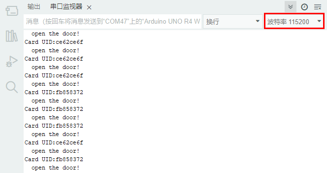

---

### 6. 代码说明

在前面的课程中，使用RFID刷卡模块已经测试出来了IC卡和钥匙扣的UID码。这一课利用对应的UID码信息来控制舵机转动对应的角度，模拟开门的效果。

---

## 第50课 模拟温度散热装置

### 1. 项目介绍

生活中，我们的电脑或者电路板芯片等器件会由于工作时间过长或者功耗过大的问题而发热严重，所以我们常常需要一个散热装置。

在前面的课程我们学习了如何使用温度传感器和电机模块，这一课我们学习把它们结合起来做成一个智能散热装置。当检测到环境温度高于某一个值时的时候，电机开启，从而达到降低环境温度、散热效果。再把此刻的温度值显示在四位数码管中。

---

### 2. 实验组件

|  |      |     |
| ------------------------ | ---------------------------- | ----------------------------- |
|UNO R4 WiFi/Minima主板(二选一)| Keyes 传感器扩展板 x1         |  Keyes 130电机模块 x1|
|    |  |          |
|Keyes TM1650四位数码管模块 x1 | Keyes NTC-MF52AT模拟温度传感器 x1 | 3P线(反向) x1|
|     |     |         | 
| 4P线(反向) x2 |USB线 x1                | 电源适配器  x1             |

---

### 3. 模块接线图

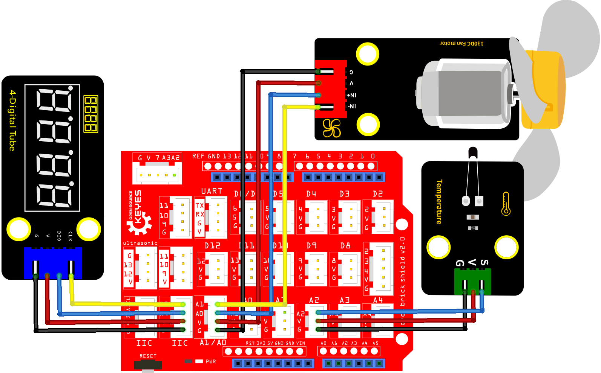

---

### 4. 实验代码

本项目中使用的代码保存在文件夹“<u>**项目代码**</u>”中，我们可以在此路径下打开代码文件''**heat_abstractor.ino**"。

**注意：为了避免上传代码不成功，请上传代码前不要连接模块。代码上传成功后，拔下USB线断电，按照接线图正确接好模块后再用USB线连接到计算机上电，观察实验结果。**

<span style="color: rgb(255, 76, 65);">注意：代码中的温度阈值30可以根据实际情况设置。</span>

```c++
/*  
 * 名称   : heat abstractor
 * 功能   : 热敏传感器控制四位数管和电机模拟散热装置
 * 作者   : http://www.keyes-robot.com/ 
*/
#include "TM1650.h" //导入TM1650库文件

//两个端口分别为A4和A5, 可以更改为其他端口
#define DIO A4
#define CLK A5
TM1650 DigitalTube(CLK,DIO);

#define PIN_ANALOG_IN  A2  //热敏传感器的引脚为A2

float Rt=0;      //NTC 热敏电阻
float R=10000;   //具有固定电阻值的10K电阻
float T2=273.15+25; //转换成开尔文温度
float B=3950;    //B值是热敏电阻的一个重要参数
float K=273.15;  //开氏度 (K°)
float VR=0;

void setup() {
  pinMode(PIN_ANALOG_IN, INPUT);
  DigitalTube.setBrightness();  //设置亮度，0- 7，默认值:2
  DigitalTube.displayOnOFF();   //显示打开或关闭，0=显示关闭，1=显示打开，默认值:1
  for(char b=1;b<5;b++){
    DigitalTube.clearBit(b);    //DigitalTube.clearBit(0~3);清晰位显示
  }

  DigitalTube.displayBit(1,0);  //DigitalTube.Display(bit,number); bit=0---3  number=0---9
  //电机连接到A0和A1
  pinMode(A0, OUTPUT);
  pinMode(A1, OUTPUT);
}

void loop() {
  int AnalogValue = analogRead(PIN_ANALOG_IN);  //读A2引脚的模拟值
  VR = (float)(AnalogValue / 1023.0 * 5.0);  //转换成电压值
  Rt = (5.0 - VR) / VR * 4700;    //计算NTC热敏电阻
  float temper = 1/(1/T2+log(Rt/R)/B)-K+0.5;//计算温度
  displayFloatNum(temper);//4位数码管显示温度值
  if (temper > 30) { //当温度超过30℃时，打开风扇
    digitalWrite(A0, LOW);
    digitalWrite(A1, HIGH);
  } else { //否则，请关闭风扇
    digitalWrite(A0, LOW);
    digitalWrite(A1, LOW);
  }
  delay(100);
}

void displayFloatNum(float temper){
  if(temper > 9999)
    return;
  int dat = temper*10;
   //DigitalTube.displayDot(2,true); //Bit0显示点  在displayBit()之前使用。
  if(dat/10000 != 0){
    DigitalTube.displayBit(0, dat%100000/10000);  
    DigitalTube.displayBit(1, dat%10000/1000);
    DigitalTube.displayBit(2, dat%1000/100);
    DigitalTube.displayBit(3, dat%100/10);
    return;
  }
  if(dat%10000/1000 != 0){
    DigitalTube.clearBit(0); 
    DigitalTube.displayBit(1, dat%10000/1000); 
    DigitalTube.displayBit(2, dat%1000/100);
    DigitalTube.displayBit(3, dat%100/10);
    return;
  }
  if(dat%1000/100 != 0){
  DigitalTube.clearBit(0); 
  DigitalTube.clearBit(1);
  DigitalTube.displayBit(2, dat%1000/100);
  DigitalTube.displayBit(3, dat%100/10);  
  return;
}
  DigitalTube.clearBit(0); 
  DigitalTube.clearBit(1);
  DigitalTube.clearBit(2);
  DigitalTube.displayBit(3, dat%100/10);
}
```

参照第01课或第02课的示例，根据不同的 UNO R4 主板选择不同的主板板型和串口端口。

---

### 5. 实验结果

代码上传成功后，拔下USB线断电，按照接线图正确接好模块后，将电源电源适配器连接到家庭电路给UNO R4主板供电（<span style="color: rgb(255, 76, 65);">注意：</span> 防止风扇有时侯工作不正常，另外还需要用USB线连接到计算机给UNO R4主板上电，这样保证风扇能正常工作；否则，风扇可能会工作不正常）。上电后，可以在四位数码管模块上看到当前温度值，当温度超过代码中设定的30°C时，风扇转动，散热。

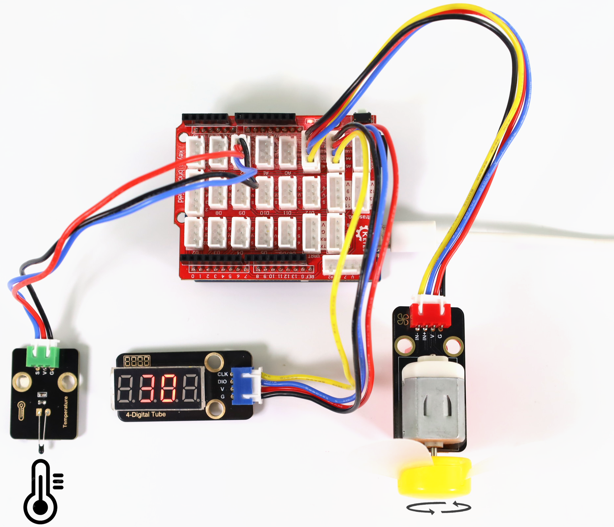

---

### 6. 代码说明

变量的设置与存储检测值，与前面我们学习的一样，也是通过设置一个温度的阈值（阈值30可以根据实际情况重新更改），超过这个阈值进行控制电机转动，四位数码管显示温度值。


---


## 第56课 超声波雷达

### 1. 项目介绍

蝙蝠飞行与获取猎物是通过回声定位的。回声定位：某些动物能通过口腔或鼻腔把从喉部产生的超声波发射出去，利用折回的声音来定向，这种空间定向的方法称为回声定位。科学家们从蝙蝠身上得到的启示发明了雷达，即雷达的天线相当于蝙蝠的嘴,而天线发出的无线电波就相当于蝙蝠的超声波,雷达接收电波的荧光屏就相当于蝙蝠的耳朵。

这一课我们就来学习制作一个简易雷达。将HC-SR04 超声波传感器、8002b功放喇叭模块、RGB模块和TM1650四位数码管模块组合实验，利用距离大小控制功放喇叭模块响起对应频率的声音、RGB LED亮起对应颜色，然后把这个距离显示在四位数码管上。这样就搭建好了一个简易的超声波雷达系统。

---

### 2. 实验组件

|      |  | | |
| ---------------------------- | ---------------------------- | ----------------------------- |----------------------------- |
|UNO R4 WiFi/Minima主板(二选一)| Keyes 传感器扩展板 x1      |HC-SR04 超声波传感器 x1      | Keyes 超声波转接模块 x1       |
|      |     |       |        | 
| Keyes 8002b功放喇叭模块 x1  | Keyes RGB模块 x1         | Keyes TM1650四位数码管模块 x1 |3P线(反向) x1|
|       |  |    |     |
|4P线(反向) x3 | USB线  x1  | 一字螺丝刀*1          |        |


---

### 3. 模块接线图

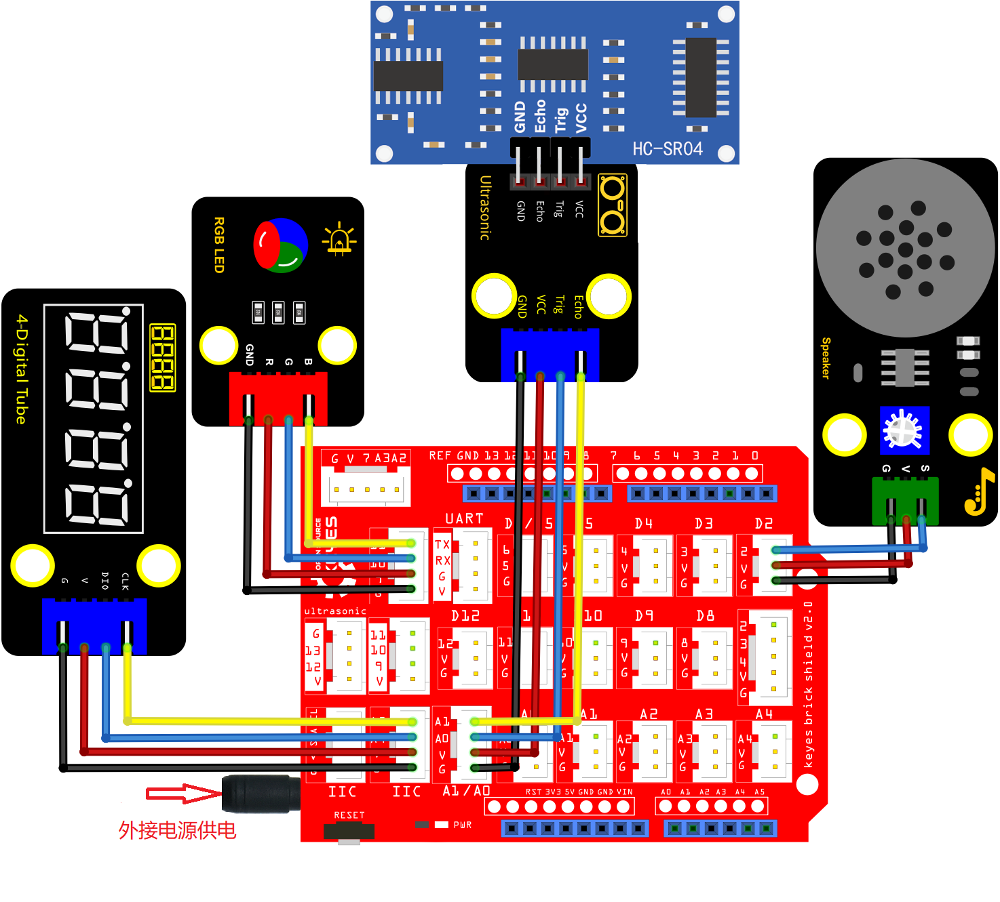

---

### 4. 实验代码

本项目中使用的代码保存在文件夹“<u>**项目代码**</u>”中，我们可以在此路径下打开代码文件''**Ultrasonic_radar.ino**"。

**注意：为了避免上传代码不成功，请上传代码前不要连接模块。代码上传成功后，拔下USB线断电，按照接线图正确接好模块后再用USB线连接到计算机上电，观察实验结果。**

<span style="color: rgb(255, 76, 65);">注意：代码中的距离阈值可以根据实际情况设置。</span>

```c++
/*  
 * 名称   : Ultrasonic radar
 * 功能   : 超声波控制四位数管，蜂鸣器和RGB灯模拟超声波雷达
 * 作者   : http://www.keyes-robot.com/ 
*/
#include "TM1650.h" //导入TM1650库文件

//四位数码管的接口为A4和A5
#define DIO A4
#define CLK A5
TM1650 DigitalTube(CLK,DIO);

#define BUZZER_PIN  2    //定义喇叭引脚为D2

int redpin = 9;    // 定义红色LED引脚D9
int greenpin = 10; // 定义绿色LED引脚D10
int bluepin = 11;  // 定义蓝色LED引脚D11

int TrigPin = A0; //设置Trig引脚为A0
int EchoPin = A1; //设置Echo引脚为A1
int distance;     //超声波测量距离

float checkdistance() { //得到的距离
  // 事先给一个短的低电平，以确保一个干净的高脉冲;
  digitalWrite(TrigPin, LOW);
  delayMicroseconds(2);
  // 传感器由10微秒或更长时间的高脉冲触发
  digitalWrite(TrigPin, HIGH);
  delayMicroseconds(10);
  digitalWrite(TrigPin, LOW);
  // 从传感器读取信号:一个高电平脉冲
  // 它的持续时间是从发送ping命令到从对象接收回显的时间(以微秒为单位)
  float distance = pulseIn(EchoPin, HIGH) / 58.00;  //转换成距离
  delay(300);
  return distance;
}

void setup() {
  pinMode(BUZZER_PIN, OUTPUT);  // 设置蜂鸣器为输出模式
  
  DigitalTube.setBrightness();  //设置亮度，0- 7，默认值:2
  DigitalTube.displayOnOFF();   //显示打开或关闭，0=显示关闭，1=显示打开，默认值:1
  for(char b=1;b<5;b++){
    DigitalTube.clearBit(b);    //DigitalTube.clearBit(0 to 3); 清空位显示
  }
  
  DigitalTube.displayBit(1,0);  //DigitalTube.Display(bit,number); bit= 0 - 3，number= 0 - 9
  pinMode(TrigPin, OUTPUT);     //设置Trig引脚作为输出
  pinMode(EchoPin, INPUT);      //设置Echo引脚作为输入
 
  pinMode(redpin, OUTPUT);   //设置红色LED引脚为输出模式
  pinMode(greenpin, OUTPUT); //设置绿色LED引脚为输出模式
  pinMode(bluepin, OUTPUT);  //设置蓝色LED引脚为输出模式
}

void loop() {
  distance = checkdistance();//超声波测距
  displayFloatNum(distance); //数码管显示距离
    if (distance <= 10) {   
      analogWrite(redpin, 255);  //RGB LED 亮红色灯
      analogWrite(greenpin, 0);
      analogWrite(bluepin, 0);
      tone(BUZZER_PIN, 262); //DO播放1000ms
      delay(1000);

  } else if (distance > 10 && distance <= 20) {
      analogWrite(redpin, 0);     //RGB LED 亮绿色灯
      analogWrite(greenpin, 255);
      analogWrite(bluepin, 0);
      tone(BUZZER_PIN, 349); //Fa播放500ms
      delay(500);

  } else {
      analogWrite(redpin, 0);    //RGB LED 亮蓝色灯
      analogWrite(greenpin, 0);
      analogWrite(bluepin, 255);
      tone(BUZZER_PIN, 494); //Si播放125ms
      delay(125);
   }
}

void displayFloatNum(float distance){
  if(distance > 9999)
    return;
  int dat = distance*10;
   //DigitalTube.displayDot(2,true); //Bit0 显示点。在displayBit()之前使用。
  if(dat/10000 != 0){
    DigitalTube.displayBit(0, dat%100000/10000);  
    DigitalTube.displayBit(1, dat%10000/1000);
    DigitalTube.displayBit(2, dat%1000/100);
    DigitalTube.displayBit(3, dat%100/10);
    return;
  }
  if(dat%10000/1000 != 0){
    DigitalTube.clearBit(0); 
    DigitalTube.displayBit(1, dat%10000/1000); 
    DigitalTube.displayBit(2, dat%1000/100);
    DigitalTube.displayBit(3, dat%100/10);
    return;
  }
  if(dat%1000/100 != 0){
  DigitalTube.clearBit(0); 
  DigitalTube.clearBit(1);
  DigitalTube.displayBit(2, dat%1000/100);
  DigitalTube.displayBit(3, dat%100/10);  
  return;
}
  DigitalTube.clearBit(0); 
  DigitalTube.clearBit(1);
  DigitalTube.clearBit(2);
  DigitalTube.displayBit(3, dat%100/10);
}
```

参照第01课或第02课的示例，根据不同的 UNO R4 主板选择不同的主板板型和串口端口。

---

### 5. 实验结果

代码上传成功后，拔下USB线断电，按照接线图正确接好模块后再用USB线连接到计算机上电。

当超声波传感器检测到障碍物距离范围在10cm 以内时，RGB模块上的RGB LED亮红色，并将检测到障碍物的距离显示在四位数码管上。同时8002b功放喇叭模块发出DO音，起到提示的作用。

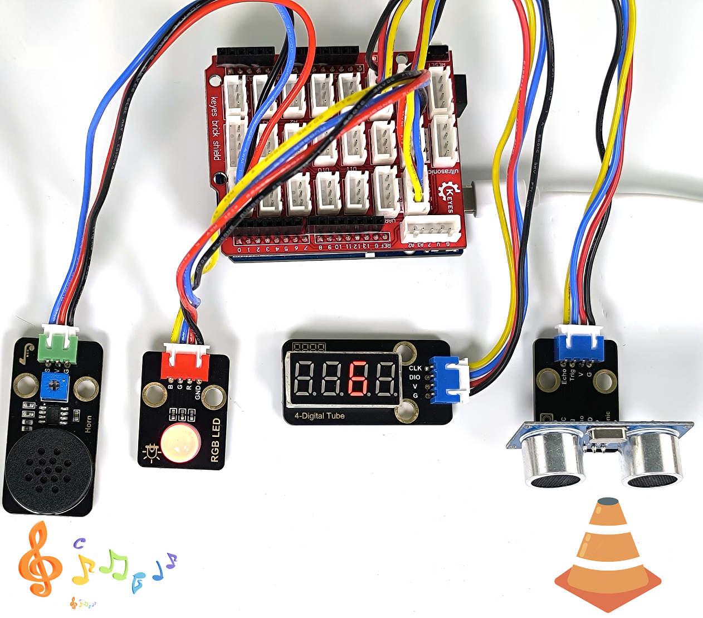

当超声波传感器检测到障碍物距离范围在10cm ~ 20cm 以内时，RGB模块上的RGB LED亮绿色，并将检测到障碍物的距离显示在四位数码管上。同时8002b功放喇叭模块发出Fa音，起到提示的作用

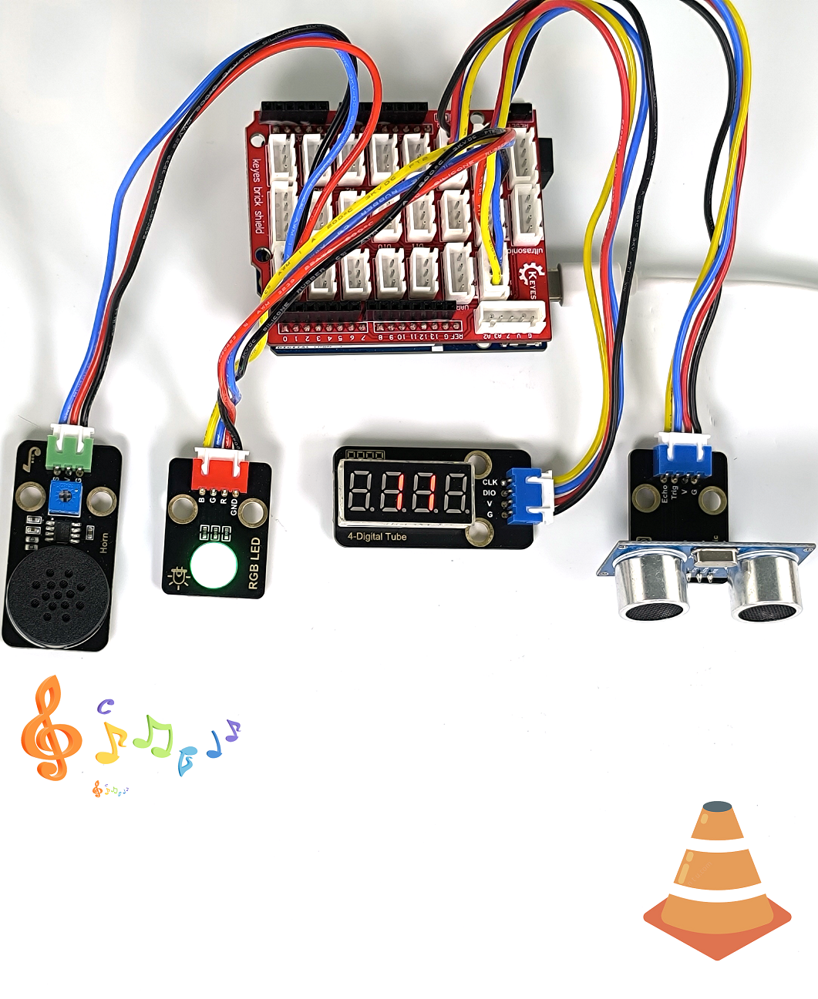

当超声波传感器检测到障碍物距离范围在20cm 以外时，RGB模块上的RGB LED亮蓝色，并将检测到障碍物的距离显示在四位数码管上。同时8002b功放喇叭模块发出Si音，起到提示的作用

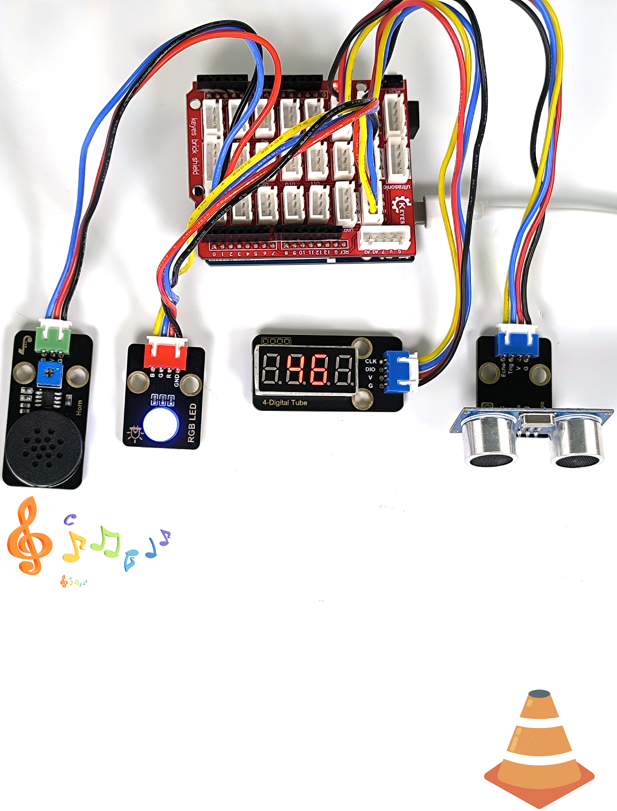

---

### 6. 代码说明

| 代码                                             | 说明                                           |
| ------------------------------------------------ | ---------------------------------------------- |
| digitalWrite(TrigPin, LOW); delayMicroseconds(2) | 事先给一个短的低电平，以确保一个干净的高脉冲。 |

---

## 第52课 综合实验

### 1. 项目介绍

我们已经学习了所有的模块和传感器的使用方法，也学习了将它们搭配在一起组合实验。在这一实验课程中我们将搭配更多的模块和传感器组合在一起。参考前面实验编程的方法，利用按键模块，实现每按一次按键，功能就变换一次的效果。

实验多种多样，大家可以发挥想象力，搭配模块和传感器做出更多具有意义的实验。

---

### 2. 实验组件

|      |    |      |      |
| ---------------------------- | ------------------------ | ---------------------------- | ---------------------------- |
| UNO R4 WiFi/Minima主板(二选一)| Keyes 避障传感器 x1  | Keyes 电容触摸传感器 x1        | Keyes 滑动电位器模块 x1      |
|      |  |  |      |
| Keyes 传感器扩展板 x1          | Keyes 摇杆模块 x1        | HC-SR04 超声波传感器 x1      | Keyes 超声波转接模块 x1      |
|      |     |        |        |
| Keyes RGB模块 x1         | Keyes XHT11温湿度传感器 x1     | 3P线(反向) x4 | 4P线(反向) x2|
|   |    |     |     |
| 5P线(反向)x1 |    USB 线 *1     | 一字螺丝刀*1         |            |

---

### 3. 模块接线图

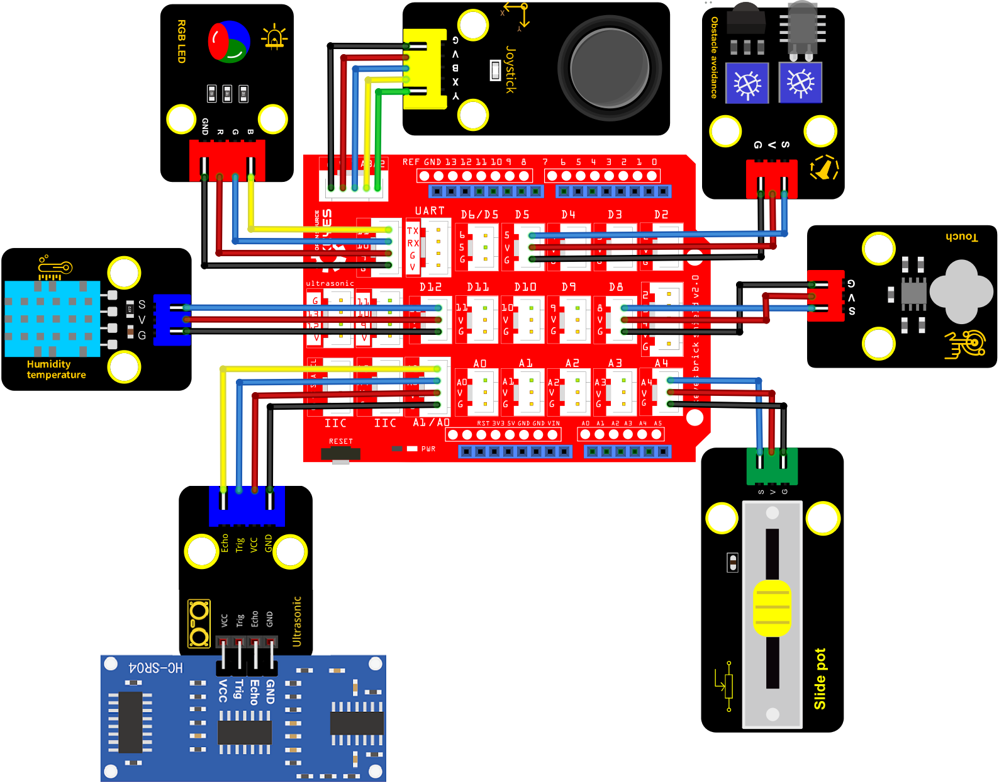

---

### 4. 实验代码

本项目中使用的代码保存在文件夹“<u>**项目代码**</u>”中，我们可以在此路径下打开代码文件''**Comprehensive_experiment.ino**"。

**注意：为了避免上传代码不成功，请上传代码前不要连接模块。代码上传成功后，拔下USB线断电，按照接线图正确接好模块后再用USB线连接到计算机上电，观察实验结果。**

```c++
/*
 * 名称   : Comprehensive experiment
 * 功能   : 多个传感器/模块协同工作
 * 作者   : http://www.keyes-robot.com/ 
*/
#include "xht11.h"

int redpin = 9;    // 定义红色LED引脚D9
int greenpin = 10; // 定义绿色LED引脚D10
int bluepin = 11;  // 定义蓝色LED引脚D11
int val;

//摇杆模块接口
int xyzPins[] = {A3, A2, 7};   //x, y, z

//滑动电位器模块引脚连接到端口A4
int resPin = A4;

//避障传感器引脚连接到IO端口D5
int Avoid = 5;

//超声波传感器的接口
int Trig = A0;
int Echo = A1;

//电容触摸传感器的端口为D8
int Touch = 8;

int PushCounter = 0;//存储键被按下的次数
int yushu = 0;

xht11 xht(12); //定义XHT11的引脚为D12
unsigned char dht[4] = {0, 0, 0, 0};//只接收数据的前32位，不接收奇偶校验位

bool ir_flag = 1;
float out_X, out_Y, out_Z;

void counter() {
  delay(10);
  ir_flag = 0;
  if (!digitalRead(Touch)) {
    PushCounter++;
  }
}

void setup() {
  Serial.begin(9600);//波特率设置为9600
  pinMode(xyzPins[0], INPUT); //x axis. 
  pinMode(xyzPins[1], INPUT); //y axis. 
  pinMode(xyzPins[2], INPUT_PULLUP);   //Z轴是一个按钮
  pinMode(Touch, INPUT);//电容触摸模块
  attachInterrupt(digitalPinToInterrupt(Touch), counter, FALLING);  //外部中断0，下降沿触发
  pinMode(Avoid, INPUT);//避障传感器
  pinMode(resPin, INPUT);//滑动电位器
  pinMode(Trig, OUTPUT);//超声波传感器
  pinMode(Echo, INPUT);
  pinMode(redpin, OUTPUT);   //设置红色LED引脚为输出模式
  pinMode(greenpin, OUTPUT); //设置绿色LED引脚为输出模式
  pinMode(bluepin, OUTPUT);  //设置蓝色LED引脚为输出模式 
  delay(1000);
}

void loop() {
  yushu = PushCounter % 6;
  if (yushu == 0) {  //余数为0
    yushu_0();  //rgb显示
} else if (yushu == 1) {  //余数是1
    yushu_1();  //避障传感器检测障碍物
} else if (yushu == 2) {  //余数是2
    yushu_2();  //显示摇杆值
} else if (yushu == 3) {  //余数是3
   yushu_3();  //显示滑动电位器的模拟值
} else if (yushu == 4) {  //余数是4
   yushu_4();  //显示XHT11温湿度传感器的温湿度值
} else if (yushu == 5) {  //余数是5
   yushu_5();  //显示超声波检测到的距离
  } 
}

//RGB模块上的RGB LED随机显示不同颜色的灯
void yushu_0() {
  for(val = 0; val < 255; val++){  //val的值不断由0增加到255
    analogWrite(bluepin, val);  //给PWM口(D11)写入一个0 ~ 255的模拟值
    analogWrite(greenpin, 255-val);
    analogWrite(redpin, 128-val);
    delay(3); 
    }
  for(val = 255; val > 0; val--){  //val的值不断由255减少到0
    analogWrite(bluepin, val);
    analogWrite(greenpin, 255-val);
    analogWrite(redpin, 128-val);
    delay(3); 
    }
}

//读避障传感器的数字信号
void yushu_1() {
  int val = digitalRead(Avoid);//读取避障传感器的数字电平输出
  Serial.print(val);//串口打印值
  if (val == 0) {//障碍物检测
    Serial.println("   There are obstacles");
  }
  else {//未发现障碍物
    Serial.println("   All going well");
  }
  delay(100);
}

//读摇杆模块的值
void yushu_2() {
  int xVal = analogRead(xyzPins[0]);
  int yVal = analogRead(xyzPins[1]);
  int zVal = digitalRead(xyzPins[2]);
  Serial.println("X,Y,Z: " + String(xVal) + ", " +  String(yVal) + ", " + String(zVal));
  delay(500);
}

//读滑动电位器的模拟值
void yushu_3() {
  int adcVal = analogRead(resPin); 
  Serial.println(adcVal);
  delay(100);
}

//读XHT11温湿度传感器的温湿度
void yushu_4() {
  if (xht.receive(dht)) {  //检查正确时返回true
    Serial.print("RH:");
    Serial.print(dht[0]);  //湿度的积分部分，DHT[1]是分数部分
    Serial.print("%  ");
    Serial.print("Temp:");
    Serial.print(dht[2]);  //温度的积分部分，DHT[3]是分数部分
    Serial.println("C");
  } else {   //读取错误
    Serial.println("sensor error");
  }
  delay(200);
}

//超声波传感器测距
void yushu_5() {
  float distance = checkdistance();
  Serial.print("distance:");
  Serial.print(distance);
  Serial.println("cm");
  delay(100);
}

float checkdistance() {
  digitalWrite(Trig, LOW);
  delayMicroseconds(2);
  digitalWrite(Trig, HIGH);
  delayMicroseconds(10);
  digitalWrite(Trig, LOW);
  float distance = pulseIn(Echo, HIGH) / 58.00;
  delay(10);
  return distance;
}
```

参照第01课或第02课的示例，根据不同的 UNO R4 主板选择不同的主板板型和串口端口。

---

### 5. 实验结果

代码上传成功后，拔下USB线断电，按照接线图正确接好模块后再用USB线连接到计算机上电，打开串口监视器，设置波特率为 **<u>9600</u>**。

（1）初始时手没有按触摸传感器上的感应区，按下次数为 0 ，余数为 0 ，RGB模块上的RGB LED随机显示不同颜色灯的效果。

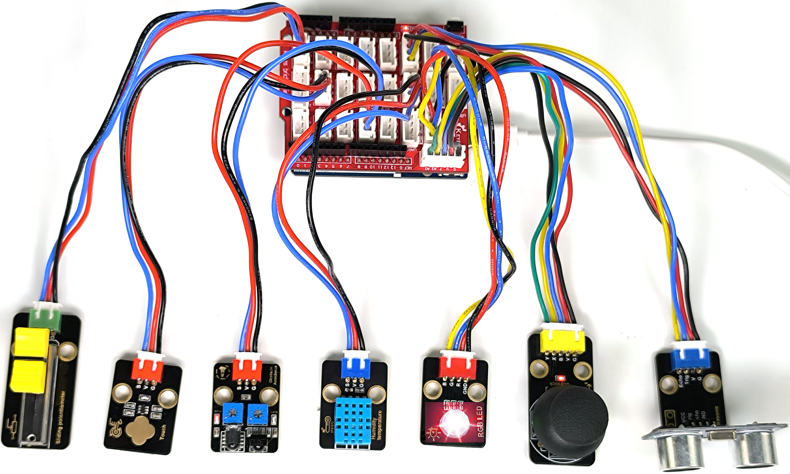

（2）按一下触摸传感器上的感应区（时间稍长以便能检测到按键按下），SK6812 RGB模块上的4个LED灯珠停止闪烁。此时按下次数为 1 ，余数为 1 ，实验实现避障传感器检测障碍物并读取高低电平的功能。

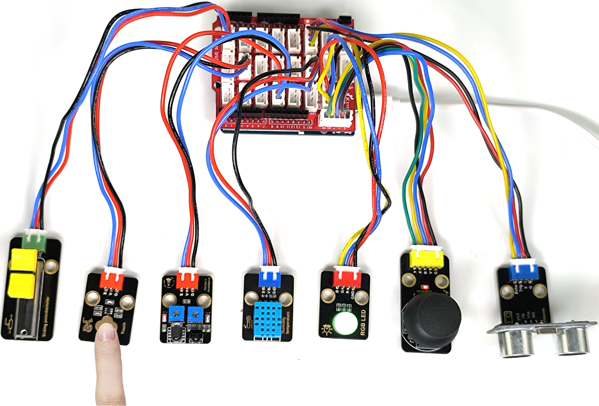

当传感器没有检测到障碍物时，val为 **<u>1</u>**，串口监视器打印出 “**<u>1  All going well</u>**” ，传感器上的SLED灯 **<u>不亮</u>**；
当传感器检测到障碍物时，val为 **<u>0</u>**，串口监视器打印出 “**<u>0  There are obstacles</u>**” ，传感器上的SLED灯 **<u>亮</u>**。

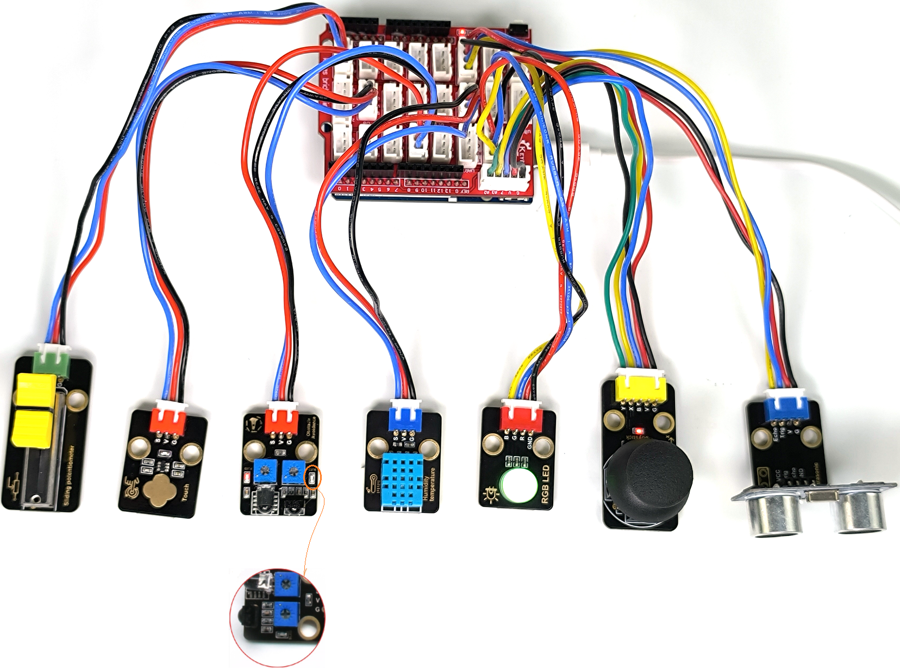

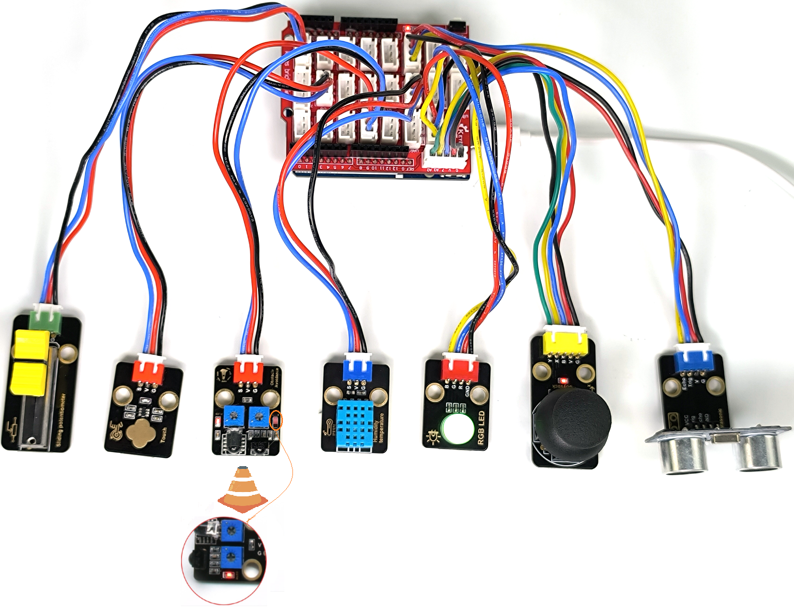

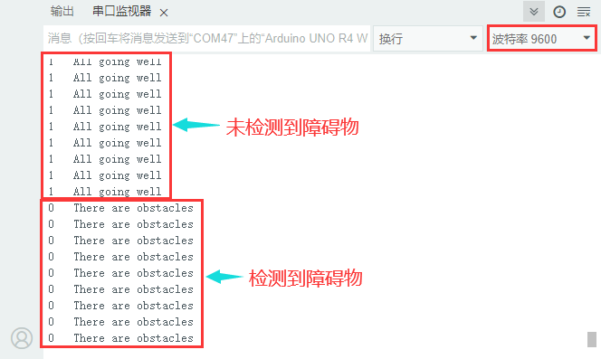

**注意：如果在打开串口监视器之前<u>按一下触摸传感器上的感应区</u>，次数变为1。再打开串口监视器时程序会复位，次数会变为0，需要再次按一下触摸传感器上的感应区重新设置次数为1。**

（3）再按一下触摸传感器上的感应区，按下次数为 2 ，余数为 2 。实验实现读取当前摇杆模块X轴和Y轴对应的模拟值以及Z轴（B接口）对应的数字值的功能。串口监视器打印出当前摇杆模块X轴、Y轴和Z轴对应的值。


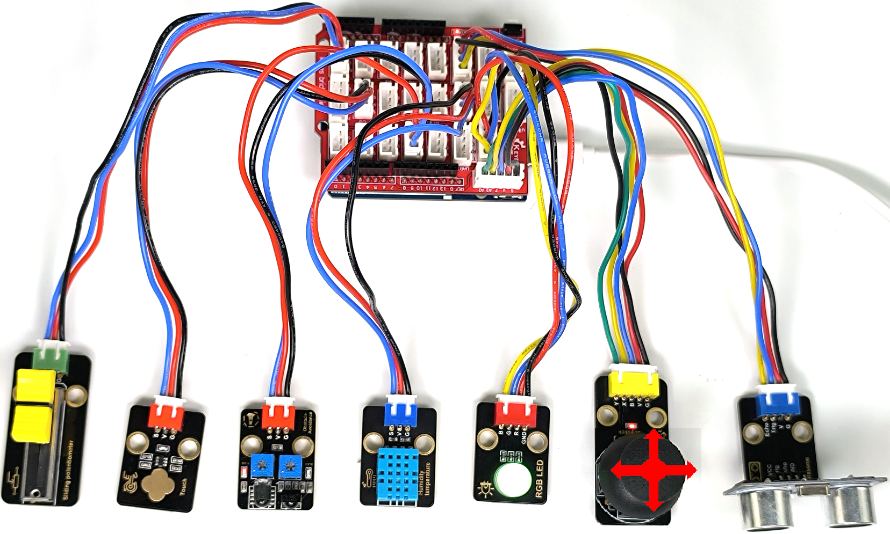

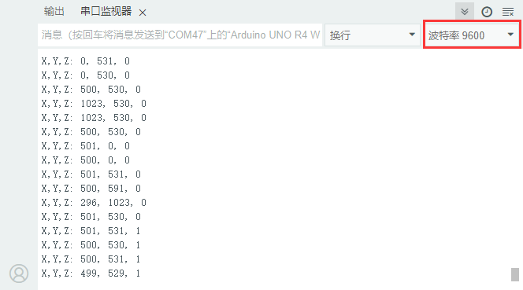

（4）再按一下触摸传感器上的感应区，按下次数为 3 ，余数为 3 。实验实现读取滑动电位器模块的模拟值，当移动滑动电位器模块上的滑杆时，串口监视器打印出当前输出的模拟值。


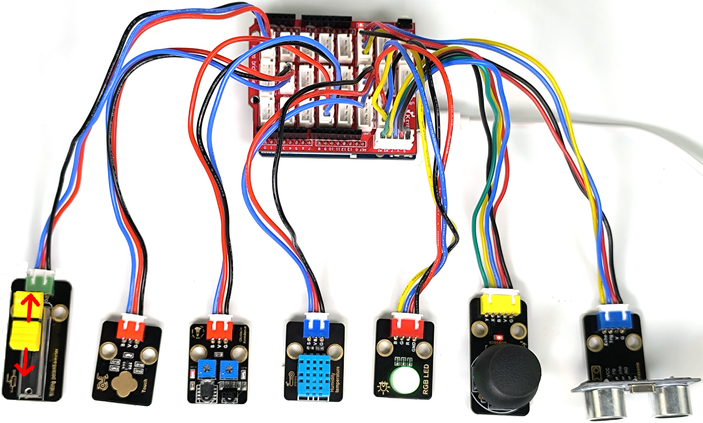


（5）再按一下触摸传感器上的感应区，按下次数为 4 ，余数为 4 。实验实现的功能是XHT11温湿度传感器检测环境中的温度和湿度，在串口监视器显示检测到当前环境中的温度和湿度值。


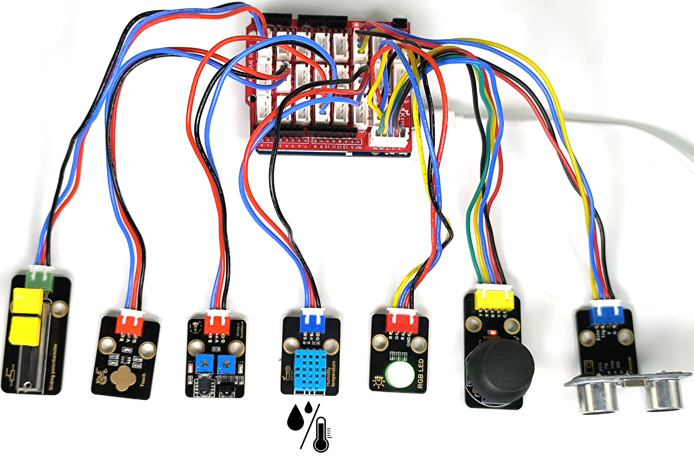

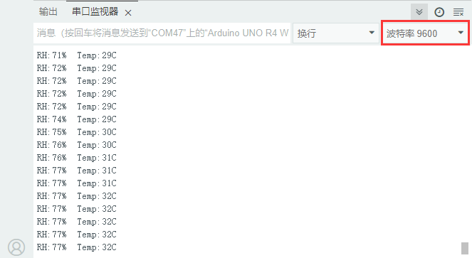

（6）再按一下触摸传感器上的感应区，按下按键次数为 5 ，余数为 5 。实验实现的功能是利用超声波传感器模块检测距离并在串口打印出来，串口监视器显示图如下。


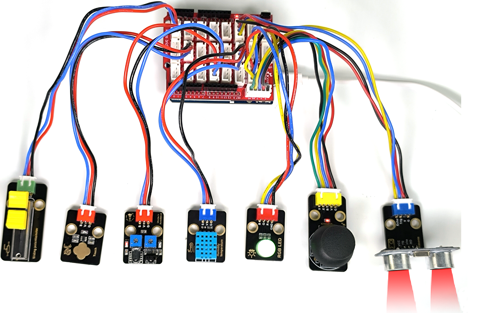


（7）再按一下触摸传感器上的感应区，按下次数为 6 ，余数为 0 。实现初始时RGB模块上的RGB LED随机显示不同颜色灯的效果。不断地按下触摸传感器上的感应区，余数循环变化，实验功能也循环变化。

---

### 6. 代码说明:

可以参照前面的项目实验的代码说明，这里就不多做介绍了。

---

<span style="color: rgb(255, 76, 65); font-size: 28px;">**特别注意：以下两个关于WiFi的项目课程只是用于UNO R4 WiFi主板**</span>

---

## 第53课 读取WiFi的IP

### 1. 项目介绍

UNO R4 WiFi主板上内置ESP32模块，ESP32用于赋予开发板Wi-Fi®功能。Wi-Fi®模块的比特率高达150 Mbps。ESP32模块内置了迹线天线，这意味着你不需要外部天线就可以使用UNO R4 WiFi主板的WiFi连接功能。要使用UNO R4 WiFi的Wi-Fi®功能，请使用内置于UNO R4 Core的WiFiS3库。

在本项目中，我们通过UNO R4 WiFi主板连接WiFi，并读取对应WiFi的IP地址。

---

### 2. 实验组件

| 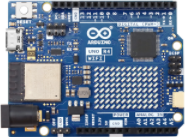 |  |
| ------------------------ | --------------------- |
| UNO R4 WiFi主板 x1  | USB线  x1             |

---

### 3. 模块接线图


---

### 4. 实验代码

本项目中使用的代码保存在文件夹“<u>**项目代码**</u>”中，我们可以在此路径下打开代码文件''**WiFi_IP.ino**"。

路由器的SSID是无线网的无线名称。SSID是 ServiceSetldentifier 的缩写，意思是：服务集标识。SSID技术可以将一个无线局域网分为几个需要不同身份验证的子网络，每一个子网络都需要独立的身份验证，只有通过身份验证的用户才可以进入相应的子网络，防止未被授权的用户进入本网络。所以在代码运行之前，需要配置 WiFi 名称和密码，将其修改为你自己使用的 WiFi 名称和密码，如下图所示。

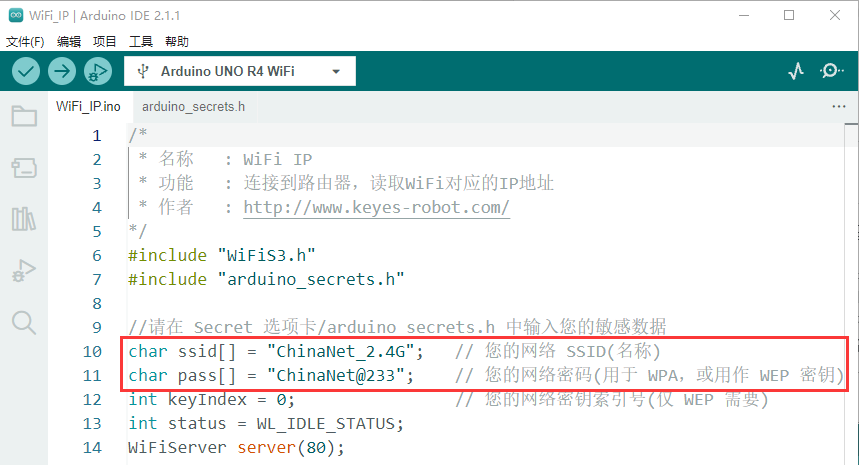

```c++
/*
 * 名称   : WiFi IP
 * 功能   : 连接到路由器，读取WiFi对应的IP地址
 * 作者   : http://www.keyes-robot.com/ 
*/
#include "WiFiS3.h"
#include "arduino_secrets.h"

//请在 Secret 选项卡/arduino_secrets.h 中输入您的敏感数据
char ssid[] = "ChinaNet_2.4G";   // 您的网络 SSID(名称)
char pass[] = "ChinaNet@233";    // 您的网络密码(用于 WPA，或用作 WEP 密钥)
int keyIndex = 0;                // 您的网络密钥索引号(仅 WEP 需要)
int status = WL_IDLE_STATUS;
WiFiServer server(80);

void setup() {
  Serial.begin(9600);  // 初始化串口9600

  // 检查 WiFi 模块:
  if (WiFi.status() == WL_NO_MODULE) {
    Serial.println("Communication with WiFi module failed!");
    // 不继续
    while (true);
  }

  String fv = WiFi.firmwareVersion();
  if (fv < WIFI_FIRMWARE_LATEST_VERSION) {
    Serial.println("Please upgrade the firmware");
  }

  // 尝试连接WiFi网络:
  while (status != WL_CONNECTED) {
    Serial.print("Attempting to connect to Network named: ");
    Serial.println(ssid);                   // 打印网络名称(SSID)

    // 连接到WPA/WPA2网络，如果使用open或WEP网络，请更改此行:
    status = WiFi.begin(ssid, pass);
    // 等待10秒连接:
    delay(10000);
  }
  server.begin();                           // 在端口80上启动web服务器
  printWifiStatus();                        // 你现在已经连接上了，所以打印出状态
}

void loop() {
  WiFiClient client = server.available();   // 实时监听即将到来的客户端

  if (client) {                             // 如果你监听到客户端的话,
    Serial.println("new client");           // 在串口上打印一条消息
    String currentLine = "";                // 创建一个字符串来保存从客户端传入的数据
    while (client.connected()) {            // 在客户端连接时循环
      if (client.available()) {             // 如果有字节需要从客户端读取,
        char c = client.read();             // 读取一个字节，然后
        Serial.write(c);                    // 打印到串行监视器上
        if (c == '\n') {                    // 如果字节是换行符

          // 如果当前行为空，则一行中有两个换行符.
          // 这是客户端HTTP请求的结束，因此发送一个响应:
          if (currentLine.length() == 0) {
            // HTTP首部总是以响应代码开始 (e.g. HTTP/1.1 200 OK)
            // 以及一个内容类型，以便客户端知道将要发生什么，然后是一个空行:
            client.println("HTTP/1.1 200 OK");
            client.println("Content-type:text/html");
            client.println();
            
            // HTTP响应以另一个空行结束:
            client.println();
            // 跳出while循环:
            break;
          } else {    // 如果有换行符，清除currentLine:
            currentLine = "";
          }
        } else if (c != '\r') {  // 如果你有除回车字符以外的其他字符,
          currentLine += c;      // 并且将其添加到currentLine的末尾
        }
      }     
    }
    // 断开连接:
    client.stop();
    Serial.println("client disconnected");
  }
}

void printWifiStatus() {
  // 打印你所连接的网络的SSID:
  Serial.print("SSID: ");
  Serial.println(WiFi.SSID());

  // 打印主控板接收到的IP地址:
  IPAddress ip = WiFi.localIP();
  Serial.print("IP Address: ");
  Serial.println(ip);

  // 打印接收到的信号强度:
  long rssi = WiFi.RSSI();
  Serial.print("signal strength (RSSI):");
  Serial.print(rssi);
  Serial.println(" dBm");
}
```

参照第01课或第02课的示例，根据 UNO R4 WiFi主板选择对应的Arduino UNO R4 WiFi板型和串口端口。

---

### 5. 实验结果

代码上传成功后，打开串口监视器，设置波特率为 **<u>9600</u>**。

开始连接，串口监视器打印出“**<u>Attempting to connect to Network named: ChinaNet_2.4G</u>**” 提示正在连接到路由器的SSID，当UNO R4 WiFi主板上的ESP32模块成功连接到路由器的 SSID 时，串行监视器将打印出 WiFi 分配给ESP32模块的 **<u>IP地址</u>**。

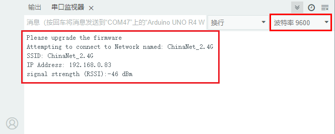

**注意：如果打开串口监视器且设置好波特率，串口监视器窗口还是没有显示任何信息，可以尝试按下UNO R4 WiFi主板上的RESET按键。**


---

### 6. 代码说明

| 代码                                     | 说明                                                         |
| ---------------------------------------- | ------------------------------------------------------------ |
| WiFi.begin(ssid, pass)| 连接初始化连接。ssid为 WiFi 名称，pass为连接 WiFi 所用的密码。 |
| WiFi.status()                            | 调用完成后，wifi并不会立即就连接上。此接口函数的作用就是检查wifi是否已经连接上。当返回值为WL_CONNECTED时表示已经连接上。该函数还有其它返回值，表示wifi连接失败等情况。 |
| WiFi.localIP()   | 显示本机WiFi的ip。  |
|WiFi.RSSI()|显示本机WiFi的强度。|
|server.available()|实时监听即将到来的客户端|

---

## 第54课 WiFi网页控制

### 1. 项目介绍

在前面的实验中，我们已经了解了UNO R4 WiFi主板上ESP32模块的WiFi功能，也读取了对应WiFi的IP地址。在本课程实验中，我们将利用ESP32模块的WiFi功能通过网页来控制多个传感器/模块工作，实现WiFi网页控制传感器模块的效果。

---

### 2. 实验组件

|   |  | |         |
| ------------------------- | --------------------- | ---------------------------- | ------------------------------ |
| UNO R4 WiFi主板 x1| Keyes 传感器扩展板 x1  |Keyes 130电机模块 x1  | Keyes 有源蜂鸣器模块 x1    |
|           |          | |      | 
|  Keyes 8002b功放喇叭模块 x1     |Keyes RGB模块 x1     |Keyes 舵机驱动模块 x1   | 舵机 x1   |
|            |             |        | | 
| 3P线(反向) x3 |  4P线(反向) x2   |USB线  x1 | 电源适配器  x1    |
|              |    |   |     |
|智能手机/平板电脑 **(自备)** x1 | 一字螺丝刀*1   |  |     |

---

### 3. 模块接线图

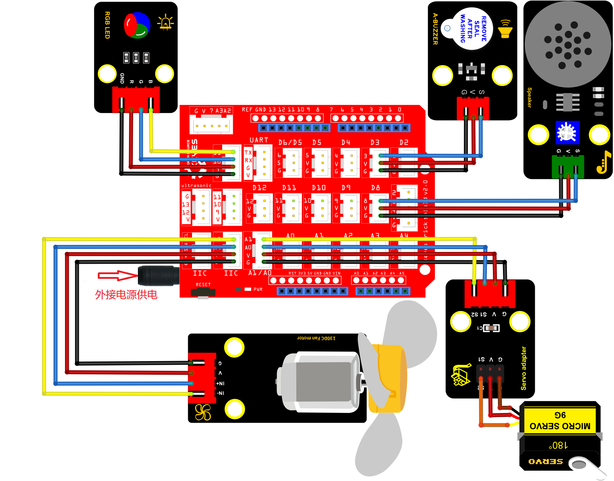

---

### 4. 实验代码

本项目中使用的代码保存在文件夹“<u>**项目代码**</u>”中，我们可以在此路径下打开代码文件''**WiFi_Web_Page_Control.ino**"。

在代码运行之前，需要配置 WiFi 名称和密码，将其修改为你自己使用的WiFi 名称和密码，如下图所示。

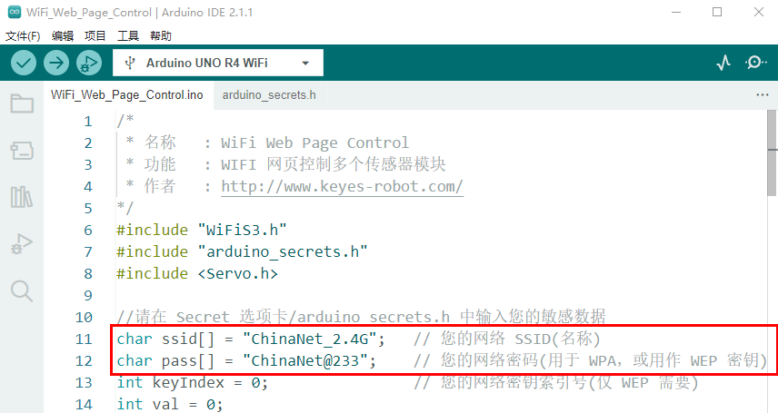

```c++
/*
 * 名称   : WiFi Web Page Control  
 * 功能   : WIFI 网页控制多个传感器模块
 * 作者   : http://www.keyes-robot.com/ 
*/
#include "WiFiS3.h"
#include "arduino_secrets.h" 
#include <Servo.h>

//请在 Secret 选项卡/arduino_secrets.h 中输入您的敏感数据
char ssid[] = "ChinaNet_2.4G";   // 您的网络 SSID(名称)
char pass[] = "ChinaNet@233";    // 您的网络密码(用于 WPA，或用作 WEP 密钥)
int keyIndex = 0;                // 您的网络密钥索引号(仅 WEP 需要)
int val = 0;

int redpin = 9;    // 定义红色LED引脚D9
int greenpin = 10; // 定义绿色LED引脚D10
int bluepin = 11;  // 定义蓝色LED引脚D11

int Active_Buzzer = 3;   //定义有源蜂鸣器引脚为D3
int Passive_Buzzer = 8;   //定义8002b功放喇叭模块引脚为D8
int INA = A4;  //定义电机模块的IN+(INA)引脚为A4
int INB = A5;  //定义电机模块的IN-(INB)引脚为A5
int servoPin = A1;  // 定义舵机引脚A1
Servo myservo;  //创建舵机对象来控制舵机

int status = WL_IDLE_STATUS;
WiFiServer server(80);

void setup() {
  Serial.begin(9600);      // 初始化串口9600
  pinMode(redpin, OUTPUT);   //设置红色LED引脚为输出模式
  pinMode(greenpin, OUTPUT); //设置绿色LED引脚为输出模式
  pinMode(bluepin, OUTPUT);  //设置蓝色LED引脚为输出模式
  pinMode(INA, OUTPUT);      // 设置电机模块的IN+(INA)引脚为输出模式
  pinMode(INB, OUTPUT);      // 设置电机模块的IN-(INB)引脚为输出模式
  pinMode(Active_Buzzer, OUTPUT);      // 设置有源蜂鸣器引脚为输出模式
  pinMode(Passive_Buzzer, OUTPUT);      // 设置8002b功放喇叭模块引脚为输出模式
  myservo.attach(servoPin);  //选择舵机引脚A1
  myservo.write(0); //旋转到0度
  delay(1000); //延迟1s

  // 检查 WiFi 模块:
  if (WiFi.status() == WL_NO_MODULE) {
    Serial.println("Communication with WiFi module failed!");
    // 不继续
    while (true);
  }

  String fv = WiFi.firmwareVersion();
  if (fv < WIFI_FIRMWARE_LATEST_VERSION) {
    Serial.println("Please upgrade the firmware");
  }

  // 尝试连接WiFi网络:
  while (status != WL_CONNECTED) {
    Serial.print("Attempting to connect to Network named: ");
    Serial.println(ssid);                   // 打印网络名称(SSID)

    // 连接到WPA/WPA2网络，如果使用open或WEP网络，请更改此行:
    status = WiFi.begin(ssid, pass);
    // 等待10秒连接:
    delay(10000);
  }
  server.begin();                           // 在端口80上启动web服务器
  printWifiStatus();                        // 你现在已经连接上了，所以打印出状态
}


void loop() {
  WiFiClient client = server.available();   // 实时监听即将到来的客户端

  if (client) {                             // 如果你监听到客户端的话,
    Serial.println("new client");           // 在串口上打印一条消息
    String currentLine = "";                // 创建一个字符串来保存从客户端传入的数据
    while (client.connected()) {            // 在客户端连接时循环
      if (client.available()) {             // 如果有字节需要从客户端读取,
        char c = client.read();             // 读取一个字节，然后
        Serial.write(c);                    // 打印到串行监视器上
        if (c == '\n') {                    // 如果字节是换行符

          // 如果当前行为空，则一行中有两个换行符.
          // 这是客户端HTTP请求的结束，因此发送一个响应:
          if (currentLine.length() == 0) {
            // HTTP首部总是以响应代码开始 (e.g. HTTP/1.1 200 OK)
            // 以及一个内容类型，以便客户端知道将要发生什么，然后是一个空行:
            client.println("HTTP/1.1 200 OK");
            client.println("Content-type:text/html");
            client.println();

            // HTTP响应的内容跟在首部之后:
            client.print("<p style=\"font-size:7vw;\">Click <a href=\"/A\">here</a> turn on RGB<br></p>");
            client.print("<p style=\"font-size:7vw;\">Click <a href=\"/B\">here</a> turn off RGB<br></p>");
            client.print("<p style=\"font-size:7vw;\">Click <a href=\"/C\">here</a> turn on fan<br></p>");
            client.print("<p style=\"font-size:7vw;\">Click <a href=\"/D\">here</a> turn off fan<br></p>");
            client.print("<p style=\"font-size:7vw;\">Click <a href=\"/E\">here</a> play music<br></p>");
            client.print("<p style=\"font-size:7vw;\">Click <a href=\"/F\">here</a> turn on buzzer<br></p>");
            client.print("<p style=\"font-size:7vw;\">Click <a href=\"/G\">here</a> turn off buzzer<br></p>");
            client.print("<p style=\"font-size:7vw;\">Click <a href=\"/H\">here</a> <br>servo turn to 180</p>");
            client.print("<p style=\"font-size:7vw;\">Click <a href=\"/I\">here</a> <br>servo turn to 0</p>");
           
            // HTTP响应以另一个空行结束:
            client.println();
            // 跳出while循环:
            break;
          } else {    // 如果有换行符，清除currentLine:
            currentLine = "";
          }
        } else if (c != '\r') {  // 如果你有除回车字符以外的其他字符,
          currentLine += c;      // 并且将其添加到currentLine的末尾
        }

        // 检查客户端请求是否存在 "GET /A"or"GET /B"or"GET /C"or"GET /D"or"GET /E"or"GET /F"or"GET /G"or"GET /H"or"GET /I":
        if (currentLine.endsWith("GET /A")) {    // GET /A 打开RGB LED
          rgb_led();       
        }
        if (currentLine.endsWith("GET /B")) {    // GET /B 关闭RGB LED
          analogWrite(bluepin, 0);
          analogWrite(greenpin, 0);
          analogWrite(redpin, 0);
        }
        if (currentLine.endsWith("GET /C")) {  // GET /C 电机模块转动
          digitalWrite(INA, LOW);                
          analogWrite(INB, 100);
        }
        if (currentLine.endsWith("GET /D")) {  // GET /D 电机模块不转
          digitalWrite(INA, LOW);               
          analogWrite(INB, 0);
        }
        if (currentLine.endsWith("GET /E")) {  // GET /E 8002b功放喇叭模块演奏音乐
          music();                               
        }
        if (currentLine.endsWith("GET /F")) {  // GET /F 有源蜂鸣器鸣叫
          digitalWrite(Active_Buzzer, HIGH);            
        }
        if (currentLine.endsWith("GET /G")) {  // GET /G 有源蜂鸣器不响
          digitalWrite(Active_Buzzer, LOW);             
        }
        if (currentLine.endsWith("GET /H")) {  // GET /H 舵机转到180°
          myservo.write(180); //旋转到180度
          delay(1000); //延迟1s
        }
        if (currentLine.endsWith("GET /I")) {  // GET /I 舵机转到0°
          myservo.write(0); //旋转到0度
          delay(1000); //延迟1s
        }
      } 
    }
    // 断开连接:
    client.stop();
    Serial.println("client disconnected");
  }
}

void printWifiStatus() {
  // 打印你所连接的网络的SSID:
  Serial.print("SSID: ");
  Serial.println(WiFi.SSID());

  // 打印主控板接收到的IP地址:
  IPAddress ip = WiFi.localIP();
  Serial.print("IP Address: ");
  Serial.println(ip);

  // 打印接收到的信号强度:
  long rssi = WiFi.RSSI();
  Serial.print("signal strength (RSSI):");
  Serial.print(rssi);
  Serial.println(" dBm");
  
  // 在浏览器中打开http://[ip]:
  Serial.print("To see this page in action, open a browser to http://");
  Serial.println(ip);
}

void music() {
  #define NOTE_B0  31
  #define NOTE_C1  33
  #define NOTE_CS1 35
  #define NOTE_D1  37
  #define NOTE_DS1 39
  #define NOTE_E1  41
  #define NOTE_F1  44
  #define NOTE_FS1 46
  #define NOTE_G1  49
  #define NOTE_GS1 52
  #define NOTE_A1  55
  #define NOTE_AS1 58
  #define NOTE_B1  62
  #define NOTE_C2  65
  #define NOTE_CS2 69
  #define NOTE_D2  73
  #define NOTE_DS2 78
  #define NOTE_E2  82
  #define NOTE_F2  87
  #define NOTE_FS2 93
  #define NOTE_G2  98
  #define NOTE_GS2 104
  #define NOTE_A2  110
  #define NOTE_AS2 117
  #define NOTE_B2  123
  #define NOTE_C3  131
  #define NOTE_CS3 139
  #define NOTE_D3  147
  #define NOTE_DS3 156
  #define NOTE_E3  165
  #define NOTE_F3  175
  #define NOTE_FS3 185
  #define NOTE_G3  196
  #define NOTE_GS3 208
  #define NOTE_A3  220
  #define NOTE_AS3 233
  #define NOTE_B3  247
  #define NOTE_C4  262
  #define NOTE_CS4 277
  #define NOTE_D4  294
  #define NOTE_DS4 311
  #define NOTE_E4  330
  #define NOTE_F4  349
  #define NOTE_FS4 370
  #define NOTE_G4  392
  #define NOTE_GS4 415
  #define NOTE_A4  440
  #define NOTE_AS4 466
  #define NOTE_B4  494
  #define NOTE_C5  523
  #define NOTE_CS5 554
  #define NOTE_D5  587
  #define NOTE_DS5 622
  #define NOTE_E5  659
  #define NOTE_F5  698
  #define NOTE_FS5 740
  #define NOTE_G5  784
  #define NOTE_GS5 831
  #define NOTE_A5  880
  #define NOTE_AS5 932
  #define NOTE_B5  988
  #define NOTE_C6  1047
  #define NOTE_CS6 1109
  #define NOTE_D6  1175
  #define NOTE_DS6 1245
  #define NOTE_E6  1319
  #define NOTE_F6  1397
  #define NOTE_FS6 1480
  #define NOTE_G6  1568
  #define NOTE_GS6 1661
  #define NOTE_A6  1760
  #define NOTE_AS6 1865
  #define NOTE_B6  1976
  #define NOTE_C7  2093
  #define NOTE_CS7 2217
  #define NOTE_D7  2349
  #define NOTE_DS7 2489
  #define NOTE_E7  2637
  #define NOTE_F7  2794
  #define NOTE_FS7 2960
  #define NOTE_G7  3136
  #define NOTE_GS7 3322
  #define NOTE_A7  3520
  #define NOTE_AS7 3729
  #define NOTE_B7  3951
  #define NOTE_C8  4186
  #define NOTE_CS8 4435
  #define NOTE_D8  4699
  #define NOTE_DS8 4978
  #define REST 0

  int tempo=114; // 改变这个可使歌曲变慢或变快
  // 乐曲的音符后面跟着持续时间.
  // A 4表示四分音符，8表示十八分音符，16表示十六分音符，以此类推
  // !!负数用来表示带点的注释
  // 所以-4意味着一个带点的四分音符，也就是说，四分之一加上十八分之一
  int melody[] = {
    NOTE_E4,4,  NOTE_E4,4,  NOTE_F4,4,  NOTE_G4,4,//1
    NOTE_G4,4,  NOTE_F4,4,  NOTE_E4,4,  NOTE_D4,4,
    NOTE_C4,4,  NOTE_C4,4,  NOTE_D4,4,  NOTE_E4,4,
    NOTE_E4,-4, NOTE_D4,8,  NOTE_D4,2,
    NOTE_E4,4,  NOTE_E4,4,  NOTE_F4,4,  NOTE_G4,4,//4
    NOTE_G4,4,  NOTE_F4,4,  NOTE_E4,4,  NOTE_D4,4,
    NOTE_C4,4,  NOTE_C4,4,  NOTE_D4,4,  NOTE_E4,4,
    NOTE_D4,-4,  NOTE_C4,8,  NOTE_C4,2,
    NOTE_D4,4,  NOTE_D4,4,  NOTE_E4,4,  NOTE_C4,4,//8
    NOTE_D4,4,  NOTE_E4,8,  NOTE_F4,8,  NOTE_E4,4, NOTE_C4,4,
    NOTE_D4,4,  NOTE_E4,8,  NOTE_F4,8,  NOTE_E4,4, NOTE_D4,4,
    NOTE_C4,4,  NOTE_D4,4,  NOTE_G3,2,
    NOTE_E4,4,  NOTE_E4,4,  NOTE_F4,4,  NOTE_G4,4,//12
    NOTE_G4,4,  NOTE_F4,4,  NOTE_E4,4,  NOTE_D4,4,
    NOTE_C4,4,  NOTE_C4,4,  NOTE_D4,4,  NOTE_E4,4,
    NOTE_D4,-4,  NOTE_C4,8,  NOTE_C4,2
  };
  // 给出字节数的类型，每个int值由两个字节(16位)组成
  // 每个音符有两个值(音高和持续时间)，所以每个音符有四个字节
  int notes=sizeof(melody)/sizeof(melody[0])/2; 
  // 这计算了整个音符的持续时间，单位是ms (60s/节拍)*4拍
  int wholenote = (60000 * 4) / tempo;
  int divider = 0, noteDuration = 0;

  // 重复旋律的音符
  // 记住，数组是音符数的两倍(音符+持续时间)
  for (int thisNote = 0; thisNote < notes * 2; thisNote = thisNote + 2) {
    // 计算每个音的持续时间
    divider = melody[thisNote + 1];
    if (divider > 0) {
    noteDuration = (wholenote) / divider; // 常规提示，继续
    } else if (divider < 0) {
      // 虚线注释的持续时间为负
       noteDuration = (wholenote) / abs(divider);
       noteDuration *= 1.5; // 给打点音符增加一半的持续时间
    }
    // 只在90%的时间里演奏这个音符，留下10%作为暂停
    tone(Passive_Buzzer, melody[thisNote], noteDuration*0.9);
  // 等待特定的时间后再演奏下一个音符.
    delay(noteDuration);
     noTone(Passive_Buzzer);  // 下一个音节前停止波形产生前的下一个说明.
  }
}

void rgb_led(){ 
  for(val = 0; val < 255; val++){  //val的值不断由0增加到255
    analogWrite(bluepin, val);  //给PWM口(D11)写入一个0 ~ 255的模拟值
    analogWrite(greenpin, 255-val);
    analogWrite(redpin, 128-val);
    delay(3); 
    }
  for(val = 255; val > 0; val--){  //val的值不断由255减少到0
    analogWrite(bluepin, val);
    analogWrite(greenpin, 255-val);
    analogWrite(redpin, 128-val);
    delay(3); 
    }
}
```

参照第01课或第02课的示例，根据 UNO R4 WiFi主板选择对应的Arduino UNO R4 WiFi板型和串口端口。

---

### 5. 实验结果

代码上传成功后，按照接线图正确接好传感器模块，将电源电源适配器连接到家庭电路给UNO R4主板供电（<span style="color: rgb(255, 76, 65);">注意：</span> 防止风扇有时侯工作不正常，另外还需要用USB线连接到计算机给UNO R4 WiFi主板上电，这样保证风扇能正常工作；否则，风扇可能会工作不正常）。打开串口监视器，设置波特率为 **<u>9600</u>**，串口监视器窗口显示IP信息如下图所示。


**注意：如果打开串口监视器且设置好波特率，串口监视器窗口还是没有显示任何信息，可以尝试按下UNO R4 WiFi主板或传感器扩展板上的RESET按键。**


接着打开手机浏览器，在下图所示的浏览器搜索框里输入上面步骤检测到的WIFI的IP地址（192.168.0.83），接着点击“**访问**”。（<span style="color: rgb(255, 76, 65);">**特别注意：代码中的WiFi名称和密码与手机(或电脑)连入的网络(或WiFi)的名称和密码要是同一个。并且电脑和手机要在同一个的网络(或WiFi)下。**</span>）


几秒种后进入WiFi网页，说明UNO R4 WiFi主板上的ESP32模块成功连接上了WiFi。

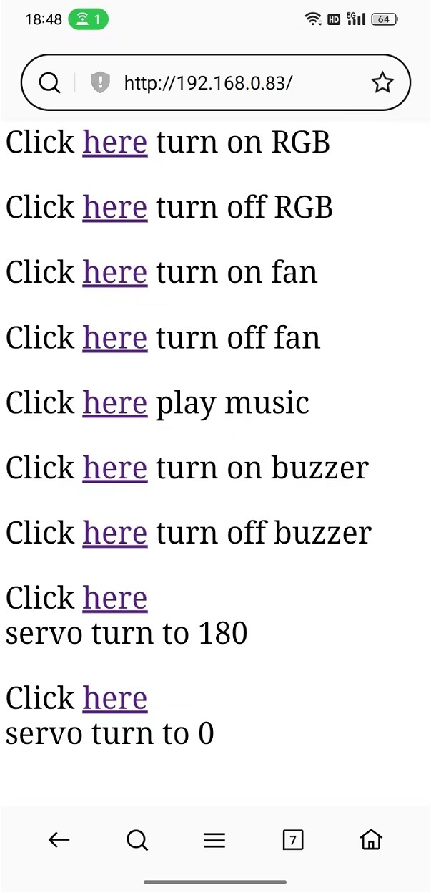

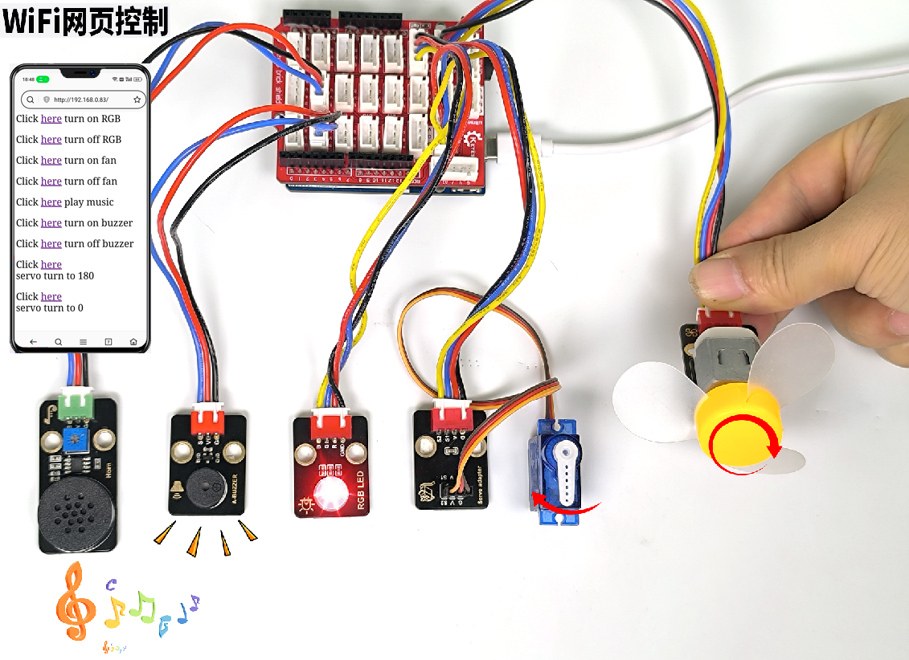

| 按钮                  | 点击     | 效果                                                         |
| --------------------- | -------- | ------------------------------------------------------------ |
|  | 点击here | 打开RGB模块，RGB显示各种颜色灯。 |
|  | 点击here | 关闭RGB模块，RGB熄灭。 |
|  | 点击here | 打开电机模块，风扇转动。 |
|  | 点击here | 关闭电机模块关闭，风扇不转。     |
|  | 点击here |打开8002b功放喇叭模块，播放一首动听的音乐。 |
|  | 点击here | 打开有源蜂鸣器，发出鸣叫声。 |
|  | 点击here | 关闭有源蜂鸣器，不发声。 |
|  | 点击here | 舵机旋转到180°处位置。 |
|  | 点击here | 舵机旋转到0°处位置。|

---

### 6. 代码说明:

可以参照前面的项目实验的代码说明，这里就不多做介绍了。

---

# 6. 常见问题解答

### 问：UNO R4 主板烧录程序出错

答：请检查UNO R4 主板的型号是否选对。

请检查USB串口端口号是否选对。

### 问：烧录了代码，传感器/模块不工作或串口监视器窗口不能显示正确的信息？

答：请确认代码中的引脚和实际接线是否一致，如有错误，请正确按照代码中的引脚进行接线即可。

### 问：舵机为什么工作不正常？

答：可能电压不够，最好外接电源供电。

### 问：超声波传感器检测时，为什么检测距离不准？

答：应从超声波传感器的发射头处开始测量，此模块非高精度超声波距离检测模块，会有误差。

### 问：风扇（电机）工作不正常，主板很容易被烧坏？
 
答：由于风扇在转动时，所需的电流比其他传感器要大，会引起电路中电压电流波动，特别是风扇进行正反转时，电压电流波动过大，导致UNO R4 主板的电压电流过低，会导致复位。需要将电源电源适配器连接到家庭电路给UNO R4主板供电，同时最好还需要用USB线连接到计算机给UNO R4主板上电，这样保证风扇能正常工作。

### 问：喇叭模块的音调与实际音调不准？

答：普通喇叭模拟的音调，达不到专业音调的要求，如需非常准确音调，需要更专业的无源蜂鸣器。

### 问：人体红外热释电传感器误报？

答：人体红外热释电传感器避免误报警要求如下：

探测范围内避开被风吹而引起飘动的物体，如：窗帘、衣物、花草等。

探测范围内避免强光照射干扰，如：阳光照射、汽车灯光照射、射灯照射及照明等光源。

### 问：水滴传感器防水吗？

答：检测区是可以接触水的，但检测水时，请注意水量不要过多。

### 问：温湿度传感器防水吗？

答：温湿度传感器检测的是空气中的温度和湿度，不防水，请勿将模块放入水中。

### 问：WiFi一直连接不上？

答：请将UNO R4 WiFi主板移动到路由器周边，按下主板上的复位键重启UNO R4 WiFi主板，耐心等待连接即可。若还是一直连接不上，请查看WiFi名称和密码是否填写正确。

### 问：网页端远程操作其他传感器时，反应很慢？

答：路由器网络传输变慢的原因：

- 多人连接，路由器CPU资源不足，重启路由器，重新连接网络。
- 路由器系统使用时间过长，重启路由器。
- 无线干扰，无线信号不稳定时，请勿穿墙使用。

路由器相关知识，请自行**google**搜索。

---

